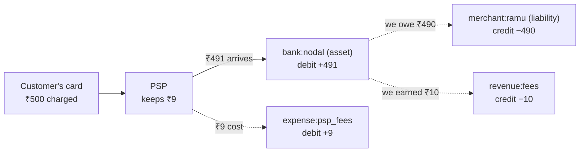

# Under the Hood: How Do Payment Systems Make It Impossible to Lose or Create Money by Accident? (double-entry ledgers)

## 1. The hook

Your wallet app says **₹570**. A support agent asks "why ₹570 and not ₹590?" and the app has to answer line by line: top-up ₹1,000, paid Bala ₹250, ride hold ₹200, ₹20 of it released. Meanwhile the finance team asks a scarier question about **billions** of rows: "did any rupee appear from nowhere or vanish this month?"

A well-built payment system answers the second question with **one query**, and the answer must be exactly `0`:

```sql
SELECT sum(amount) FROM entries;   -- 0, always
```

The trick is 700 years older than computers: **double-entry bookkeeping**. Every rupee that moves is written down **twice**, once where it left and once where it arrived, so the books always balance and a bug shows up as a non-zero sum.

💡 **Ledger:** the book (here, a table) of every money movement, in order. **Entry:** one line in it: "account X, amount Y". **Balance:** what an account holds right now, which in a ledger is just the sum of its entries.

---

## 2. Life before it

### The balance column
The first version of almost every wallet looks like this:

```sql
UPDATE wallets SET balance = balance - 25000 WHERE user_id = 'asha';
UPDATE wallets SET balance = balance + 25000 WHERE user_id = 'bala';
```

What goes wrong, in production:

- **Crash between the two lines** (or the two lines run in two different services): Asha lost ₹250, Bala never got it. Money **vanished**, and no row records that it ever existed.
- **Lost updates:** code that reads the balance into Java, subtracts, and writes it back. Two payments read ₹1,000 at the same time, each writes back ₹1,000 − ₹250 = ₹750. Asha paid ₹500 and was charged ₹250. Money was **created** ([optimistic vs pessimistic locking](../LLD/concepts/optimistic-vs-pessimistic-locking.md)).
- **No explanation:** the row says ₹570. Why? Nobody knows. Auditors, support and the regulator all need the history.
- **Silent corruption:** a bug writes a wrong number and nothing notices, because a single number can't be checked against anything.

💡 **Audit trail:** a permanent record of who changed what and when, which finance teams and regulators require.

### Merchants hit the same problem 700 years ago
Medieval Italian merchants trading across cities had partners, loans and goods on ships, and needed to know whether their books were right. The oldest surviving complete double-entry records are the **Farolfi company ledger (1299–1300)**, a Florentine firm, and the **treasurers' accounts of the Republic of Genoa (1340)**. **Luca Pacioli**, a Franciscan friar and mathematician, didn't invent the method, but his *Summa de arithmetica* (Venice, **1494**) contained a 27-page treatise on it, the first **printed** description, which spread it across Europe. (Benedetto Cotrugli wrote one in 1458, but it wasn't printed until 1573.)

---

## 3. The clever idea

**Never store a balance as the truth. Store movements. Every movement is a transaction of two or more entries whose amounts sum to zero; balances are derived by summing; entries are append-only; a mistake is fixed by adding a new, reversing transaction.**

Money can then only **move** between accounts, never appear or disappear, and a single `SUM` checks the whole system. It's a checksum on every write, the way a TCP checksum (a small number sent with each network packet) lets the receiver detect corruption.

The existing [ledgers & event sourcing](../LLD/concepts/ledgers-and-event-sourcing.md) page covers the software pattern (append-only entries, rebuilding state by replaying them, snapshots). This page goes into the **accounting mechanics** and how to enforce them in a database.

💡 **Ledger transaction vs database transaction:** a *ledger* transaction is one business event's set of entries (a payment, a refund). A *database* transaction is `BEGIN ... COMMIT`, where everything succeeds or nothing does. The rule: one ledger transaction is always written inside one database transaction.

---

## 4. Step by step

### Accounts have types, and your wallet is a liability
Every account is one of five types. The rule that always holds is **Assets = Liabilities + Equity** (with revenue and expenses flowing into equity over time).

| Type | Means | Example in a payments company |
|---|---|---|
| **Asset** | what we have | money in our bank account (the "nodal" or settlement account) |
| **Liability** | what we owe others | **every customer's wallet balance**, money owed to merchants |
| **Equity** | owners' stake | founders' capital |
| **Revenue** | what we earned | our 2% platform fee |
| **Expense** | what we spent | the fee the card network / PSP charged us |

The mind-flip for engineers: **your ₹570 wallet balance is not the company's money.** It's a debt the company owes you, so on its books it's a **liability**, matched by real cash sitting in its bank account (an asset).

💡 **Nodal / escrow account:** a bank account where a payments company must keep customers' money separate from its own. **PSP (payment service provider):** the company that connects a merchant to card networks and banks, and charges a fee for it ([payment gateways & PSPs](../HLD/technologies/payment-gateways-and-psps.md)).

### Debit and credit are left and right, not minus and plus
"Debit" and "credit" just mean the left and right column of an account. Whether a debit *increases* the balance depends on the account type:

| Type | Debit (left) | Credit (right) | "Normal" side |
|---|---|---|---|
| Asset, Expense | increases | decreases | debit |
| Liability, Equity, Revenue | decreases | increases | credit |

This is why your bank "credits" your account when you get paid: to the **bank**, your account is a liability, and credits increase liabilities.

In code, most teams use **one signed column**: `+` = debit, `−` = credit. Then "debits = credits" becomes "**sum = 0**", and the display layer flips the sign for credit-normal accounts.

### A transfer: Asha pays Bala ₹250
Amounts are in **paise** (integer hundredths of a rupee), never floating point ([splitting money & rounding](../LLD/concepts/splitting-money-and-rounding.md)).

| Account | Type | Amount | Reads as |
|---|---|---|---|
| wallet:asha | liability | +25,000 (debit) | we owe Asha ₹250 less |
| wallet:bala | liability | −25,000 (credit) | we owe Bala ₹250 more |
| **sum** | | **0** | |

No cash moved at our bank; only who we owe changed.

### A card payment with fees: four legs
A customer pays Ramu's shop ₹500 by card through us. The PSP keeps ₹9 (1.8%), we keep a ₹10 (2%) fee, Ramu is owed the rest.



| Account | Amount (paise) | Why |
|---|---|---|
| bank:nodal | +49,100 | cash that actually landed: 50,000 − 900 |
| expense:psp_fees | +900 | the PSP's cut is our cost |
| merchant:ramu | −49,000 | we now owe Ramu 50,000 − 1,000 |
| revenue:fees | −1,000 | our fee |
| **sum** | **0** | 49,100 + 900 − 49,000 − 1,000 |

One business event, **one ledger transaction, four entries**, all committed together or not at all. If someone forgets the PSP fee, the sum is −900 and the transaction is rejected.

### The invariants

| Invariant | Enforced by |
|---|---|
| Each ledger transaction's entries sum to 0 | a check at **commit** time (a deferred trigger in Postgres, §7) |
| The sum of **all** entries is 0 | follows from the above; checked by a nightly job anyway |
| Entries are never updated or deleted | revoke `UPDATE/DELETE`, or a trigger that raises |
| Cached balance = sum of that account's entries | updated in the **same DB transaction** as the entries; a nightly job compares |
| A business event is posted at most once | a **unique idempotency key** on the ledger transaction |
| Wallets don't go below zero | lock the row, check, then insert, inside one transaction |

💡 **Trigger:** a function the database runs automatically on every insert, update or delete. **Deferred constraint:** a rule the database checks at `COMMIT` instead of after each statement, so you can insert leg 1 (unbalanced for a moment) and then leg 2. **Idempotency key:** a unique id the client sends with a request so a retry is recognised as the same request ([idempotency](../HLD/concepts/idempotency-and-delivery-semantics.md)).

### Cached balances, done safely
Summing millions of entries on every "show balance" is too slow, so keep a `balance` column on the account, but **only ever change it in the same database transaction that inserts the entries**. Then it can't drift (both commit or neither does), and it's still a cache: you can rebuild it from entries at any time.

For a transfer, **lock both account rows first, in a fixed order (by id)**: `SELECT ... WHERE id IN (2,3) ORDER BY id FOR UPDATE`. Two opposite transfers (Asha→Bala and Bala→Asha) then queue instead of deadlocking ([deadlocks & lock ordering](../LLD/concepts/deadlocks-and-lock-ordering.md)). §7 shows both cases for real.

💡 **`SELECT ... FOR UPDATE`:** read rows and lock them so other transactions that want to change them wait until you commit. **Deadlock:** two transactions each holding a lock the other needs; the database kills one.

### Holds and corrections are just more transactions
**Holds:** ride apps and hotels **reserve** money before the final amount is known. Model it as a move to a `holds:asha` account: Asha's spendable balance drops, but the money is still hers. When the ride ends at ₹180, one transaction empties the hold: ₹180 to the driver, ₹20 back to Asha. An expired hold gets a reversing transaction ([holds & reservations](../LLD/concepts/holds-reservations-and-ttl.md)).

**Corrections:** a refund or a fix is a **new transaction** with mirror-image entries (and a link to the original). The history then says "₹500 payment on the 3rd, reversed on the 5th", which is exactly what an auditor, a support agent and a bank statement need. Same idea as `git revert` vs rewriting history.

### Reconciliation: the ledger vs the outside world
Double-entry proves the books are **internally** consistent. It can't prove they match reality. So every day, the `bank:nodal` account is compared line by line with the **bank's statement**, and PSP settlements with the PSP's settlement file. A mismatch (the bank shows ₹491 we never recorded, or we recorded a payout the bank never made) lands in a review queue ([payment reconciliation](../HLD/concepts/payment-reconciliation.md)).

### At scale
- **Stripe** describes *Ledger* as an immutable log that is its system of record for money movement, modelling each producer system as a state machine of fund flows and checking data quality ("clearing", "timeliness", "completeness"), at about **5 billion events a day** (Stripe engineering blog, February 2024).
- **Square** published *Books, an immutable double-entry accounting database service* (Square developer blog, October 2019). 🟡 Only the title and subtitle ("tracking financial transactions at scale") were visible to me; details not verified.
- **Uber's LedgerStore** stores immutable ledgers as the source of truth for financial events, with about **a trillion indexes** (strongly consistent ones for things like card authorization holds), after migrating over a trillion entries from DynamoDB (Uber blog, 2024).
- **TigerBeetle** (started July 2020 inside Coil by Joran Dirk Greef, open source under Apache 2.0, company spun out ~2022) is a database built **only** for debits and credits between accounts: the double-entry rules live inside the database, and it batches up to **8,190 transfers per request**.
- 🟡 **Airbnb** is often cited for a ~2016 engineering post about tracking money through its financial reporting; I couldn't find it to verify the title, year or content.

The recurring scaling problem is the **hot account**: every payment credits `revenue:fees` and debits `bank:nodal`, so every payment queues on those two rows' locks: writes are forced to run one at a time. Fixes: split the hot account into N sub-accounts and pick one at random (sum them for reports), or post fee entries in batches every few seconds instead of per payment.

---

## 5. Where you've already used it

| You saw | The double-entry idea |
|---|---|
| Your bank statement / passbook | entries with a running balance; your account is the bank's liability, which is why salary is a "credit" |
| A refund showing as a new line instead of the payment disappearing | correction by reversal |
| "Amount on hold" on a hotel booking or fuel pump card payment | a hold account |
| Splitwise's "you owe / you are owed" always netting to zero in a group | per-transaction sum = 0 ([Splitwise](../LLD/interviews/splitwise/README.md)) |
| `git revert`, Kafka topics, the database WAL (its append-only change log) | append-only history; current state is derived |

---

## 6. Limits and trade-offs

- **Balanced is not correct.** Posting ₹250 to the wrong wallet still sums to zero. Double-entry catches *missing* or *extra* money, not *misdirected* money. You still need tests, reconciliation and a way to reverse.
- **More rows, more writes.** Every movement is 2–4+ rows plus balance updates. A system doing 10,000 payments/s with 4 legs writes 40,000 entry rows/s, ≈ 3.5 billion a day (40,000 × 86,400). Hot accounts (§4), not the SUM check, are what usually limit throughput. Plan partitioning and archiving (Uber moves old ledgers to cold storage by time range).
- **Multi-currency:** a ₹ entry and a $ entry can't cancel. Each transaction must balance **per currency**, with FX (foreign exchange) accounts in between to record conversion gains and losses.
- **Immutability vs deletion requests:** privacy laws can require deleting personal data, but financial records must be kept for years. Keep personal details out of entry rows (store an account id, not a name) so the ledger itself never needs editing.
- **Sequences have gaps.** A rolled-back transaction still consumes ids (see the missing tx ids 4 and 5 in §7). Never use an auto-increment id as "proof nothing is missing"; reconcile on business keys.
- **Across services there is no single `COMMIT`.** If wallets and fees live in different databases, the "sum to zero in one transaction" guarantee is gone, and you're into sagas and outboxes ([sagas](../HLD/concepts/sagas-and-distributed-transactions.md)). Most companies keep one ledger service with one database (or a TigerBeetle-style engine) precisely to avoid that.

---

## 7. Try it

Real output from **PostgreSQL 16.15** in a throwaway database (`CREATE DATABASE ledger_demo`, dropped afterwards). The schema:

```sql
CREATE TABLE accounts (id int PRIMARY KEY, name text UNIQUE NOT NULL,
  type text NOT NULL CHECK (type IN ('asset','liability','revenue','expense')),
  balance bigint NOT NULL DEFAULT 0);                          -- cached
CREATE TABLE ledger_tx (id bigserial PRIMARY KEY, idempotency_key text UNIQUE NOT NULL,
  description text NOT NULL, created_at timestamptz NOT NULL DEFAULT now());
CREATE TABLE entries (id bigserial PRIMARY KEY, tx_id bigint NOT NULL REFERENCES ledger_tx(id),
  account_id int NOT NULL REFERENCES accounts(id),
  amount bigint NOT NULL CHECK (amount <> 0));                 -- paise, + debit, - credit

-- Rule 1: each ledger tx sums to zero, checked at COMMIT
CREATE FUNCTION check_tx_balanced() RETURNS trigger LANGUAGE plpgsql AS $$
DECLARE s bigint;
BEGIN
  SELECT sum(amount) INTO s FROM entries WHERE tx_id = NEW.tx_id;
  IF s <> 0 THEN RAISE EXCEPTION 'ledger tx % is unbalanced: entries sum to %', NEW.tx_id, s; END IF;
  RETURN NULL;
END $$;
CREATE CONSTRAINT TRIGGER entries_balanced AFTER INSERT ON entries
  DEFERRABLE INITIALLY DEFERRED FOR EACH ROW EXECUTE FUNCTION check_tx_balanced();
-- Rule 2: a BEFORE UPDATE OR DELETE trigger that raises (append-only)
-- Rule 3: an AFTER INSERT trigger: UPDATE accounts SET balance = balance + NEW.amount
```

Accounts: `1 bank:hdfc_nodal` (asset), `2 wallet:asha`, `3 wallet:bala`, `4 merchant:ramu_chai`, `7 holds:asha` (liabilities), `5 revenue:fees`, `6 expense:psp_fees`. A transfer looks like this:

```sql
BEGIN;
SELECT id, name, balance FROM accounts WHERE id IN (3, 2) ORDER BY id FOR UPDATE;
INSERT INTO ledger_tx (idempotency_key, description) VALUES ('p2p-001', 'Asha pays Bala Rs 250');
INSERT INTO entries (tx_id, account_id, amount) VALUES
  (currval('ledger_tx_id_seq'), 2,  25000),
  (currval('ledger_tx_id_seq'), 3, -25000);
COMMIT;
```

💡 **`bigserial`:** an auto-incrementing id backed by a **sequence** (a counter object in the database). **`currval(...)`:** the id that sequence just handed out in this session. **PL/pgSQL:** Postgres's built-in language for functions and triggers. The constraint trigger fires once per inserted row, so a 4-leg transaction is checked 4 times at commit: fine for a demo; a production version would check once per ledger transaction.

The script posts: top-up ₹1,000, Asha→Bala ₹250, the 4-leg card payment, a buggy transfer, an in-place edit, a retry, a ₹200 hold captured at ₹180, and a refund of the card payment. The interesting lines:

```text
--- 4. A buggy unbalanced transfer (100 out, 90 in)
INSERT 0 2
psql:demo1.sql:35: ERROR:  ledger tx 4 is unbalanced: entries sum to 1000
--- 5. Someone tries to "fix" a row in place
psql:demo1.sql:38: ERROR:  entries are append-only: post a reversing transaction instead
--- 6. The client retries step 2 with the same idempotency key
 id
----
(0 rows)
INSERT 0 0
```

Both inserts in step 4 succeeded; the **COMMIT** was refused, and both rows vanished with it. The retry in step 6 (`ON CONFLICT (idempotency_key) DO NOTHING RETURNING id`) returned no row: the caller knows it's a duplicate and posts nothing.

```text
--- Balances: cached column vs SUM of entries
 id |        name        |   type    | cached | sum_of_entries
----+--------------------+-----------+--------+----------------
  1 | bank:hdfc_nodal    | asset     | 100000 |         100000
  2 | wallet:asha        | liability | -57000 |         -57000
  3 | wallet:bala        | liability | -25000 |         -25000
  4 | merchant:ramu_chai | liability | -18000 |         -18000
  5 | revenue:fees       | revenue   |      0 |              0
  6 | expense:psp_fees   | expense   |      0 |              0
  7 | holds:asha         | liability |      0 |              0
--- Invariant: everything sums to zero
 all_entries | entry_rows | ledger_txs
-------------+------------+------------
           0 |         17 |          6
```

Read it as the company: it holds ₹1,000 at the bank and owes ₹570 to Asha, ₹250 to Bala, ₹180 to Ramu: 570 + 250 + 180 = 1,000. Assets = liabilities. The card payment and its refund cancelled out, fees included (a real PSP often keeps its fee on refunds: that's a different transaction, still balanced). Tx ids went 1, 2, 3, 6, 7, 8: the rolled-back buggy transfer and the duplicate each burned a sequence value.

**Concurrency.** Two sessions start 0.2 s apart: A posts Asha→Bala ₹10 (entry for account 2 first), B posts Bala→Asha ₹10 (account 3 first), each sleeping 1 s between legs. **Without** the `FOR UPDATE` line:

```text
A: ERROR:  deadlock detected
   DETAIL:  Process 1658 waits for ShareLock on transaction 817; blocked by process 1663.
   Process 1663 waits for ShareLock on transaction 816; blocked by process 1658.
   CONTEXT:  while updating tuple (0,11) in relation "accounts"
   Time: 1000.891 ms
B: INSERT 0 1   Time: 793.859 ms        <- got Asha's row once A was killed
   COMMIT
```

Postgres noticed the cycle after `deadlock_timeout` (1 s by default) and killed A, which the app would have to retry. **With** `SELECT id FROM accounts WHERE id IN (2, 3) ORDER BY id FOR UPDATE` as the first statement in both:

```text
A: FOR UPDATE   Time: 1.166 ms  ...  COMMIT
B: FOR UPDATE   Time: 798.018 ms     <- simply waited for A, then ran
   ...  COMMIT
```

Both committed, and `SELECT sum(amount) FROM entries` was still `0`.

---

## 8. Where it shows up in this repo

- [Ledgers & event sourcing](../LLD/concepts/ledgers-and-event-sourcing.md): the append-only pattern and replaying to state.
- [Payment System](../HLD/interviews/payment-system/README.md): double-entry at scale, PSP fees, exactly-once money. [Payment reconciliation](../HLD/concepts/payment-reconciliation.md) and [payment gateways & PSPs](../HLD/technologies/payment-gateways-and-psps.md).
- [Digital Wallet](../LLD/interviews/digital-wallet/README.md): wallets as liabilities, idempotent transfers, holds.
- [Splitwise](../LLD/interviews/splitwise/README.md) and [splitting money & rounding](../LLD/concepts/splitting-money-and-rounding.md): every expense nets to zero, to the paisa.
- [Optimistic vs pessimistic locking](../LLD/concepts/optimistic-vs-pessimistic-locking.md) and [deadlocks & lock ordering](../LLD/concepts/deadlocks-and-lock-ordering.md): the concurrency demo above.
- [Postgres MVCC](postgres-mvcc.md): why `FOR UPDATE` is needed even though readers never block.
- [Sagas](../HLD/concepts/sagas-and-distributed-transactions.md) and [idempotency](../HLD/concepts/idempotency-and-delivery-semantics.md): when the ledger can't be one database transaction.
- [UPI under the hood](upi.md): each bank's debit and credit are entries in its own ledger.

## 9. Sources

- Luca Pacioli, *Summa de arithmetica, geometria, proportioni et proportionalita* (Venice, 1494), section *Particularis de computis et scripturis*; ICAEW library, *Earliest books on bookkeeping*; Wikipedia, *Luca Pacioli* and *Double-entry bookkeeping* (Farolfi ledger 1299–1300, Genoa 1340, Cotrugli 1458/1573).
- Ilya Ganelin, *Ledger: Stripe's system for tracking and validating money movement* (Stripe engineering blog, February 2024).
- Square, *Books, an immutable double-entry accounting database service* (Square developer blog, 16 October 2019); 🟡 contents not read.
- Kaushik Devarajaiah, *How LedgerStore Supports Trillions of Indexes at Uber* (Uber blog, April 2024); *Migrating a Trillion Entries of Uber's Ledger Data from DynamoDB to LedgerStore* (Uber blog, 2024); InfoQ coverage (May 2024).
- TigerBeetle: TechCrunch (July 2024), Changelog interview with Joran Dirk Greef, tigerbeetle.com docs (accounts, transfers, 8,190 per batch).
- PostgreSQL 16 documentation: `CREATE TRIGGER` (constraint triggers, `DEFERRABLE INITIALLY DEFERRED`), "Explicit Locking" (`FOR UPDATE`, deadlocks, `deadlock_timeout`), `INSERT ... ON CONFLICT`.
- **Note:** facts were checked through web-search result summaries (the pages themselves weren't opened), and 🟡 marks unverified items. All psql output above was produced by running the script against PostgreSQL 16.15 in this environment.

⬅️ [Under the Hood index](README.md) · 🏠 [Home](../README.md)
