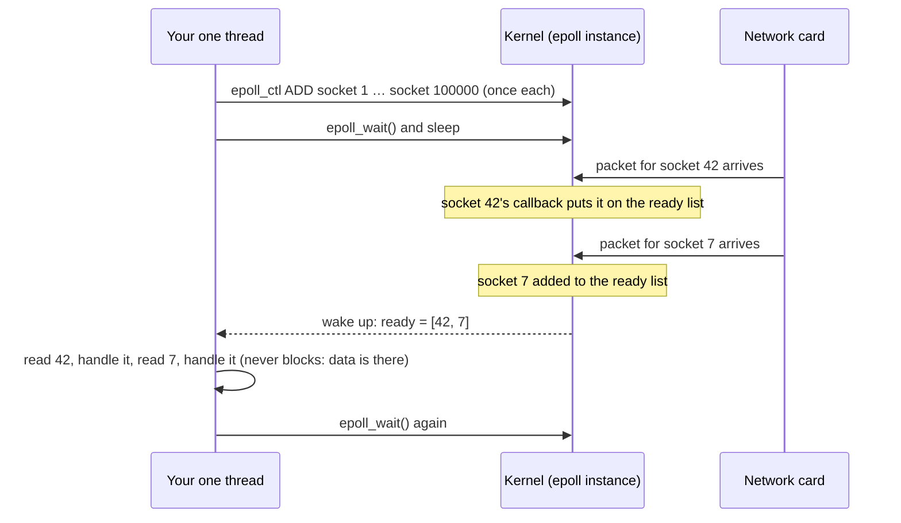

# Under the Hood: How Does One Thread Handle 100,000 Connections? (epoll)

## 1. The hook

WhatsApp ran **2 to 3 million TCP connections on a single server** ([case study](../case-studies/whatsapp-vs-telegram.md)). Nginx serves tens of thousands of clients with a handful of worker processes. Node.js does everything on **one** thread. Your Spring WebFlux or Netty service does the same trick.

But a socket read **blocks**: the thread waits until data arrives. So how can one thread serve thousands of sockets that are all mostly waiting?

The answer is a small set of operating-system calls whose job is to answer one question fast: **"which of my 100,000 sockets have something for me right now?"** On Linux that's **epoll**.

💡 **Socket:** the operating system's handle for one network connection. **File descriptor (fd):** the small integer a program uses to refer to an open socket or file. **System call (syscall):** a request from your program to the OS kernel (the core of the operating system), like "read from this socket".

---

## 2. Life before it

### Attempt 1: one thread per connection
The classic server (`ServerSocket.accept()` → `new Thread(...)` in old Java, Apache's prefork model): each connection gets a thread that blocks on `read()`.

```text
100,000 connections × ~1 MB reserved stack per platform thread ≈ 100 GB of address space
plus the scheduler juggling 100,000 threads that are almost all asleep
```

It works up to a few thousand connections, then memory and context switching (the CPU saving one thread's state and loading another's) eat the machine. In **1999 Dan Kegel** named this the **C10K problem**: how do you serve 10,000 clients at once on one machine?

### Attempt 2: `select()` and `poll()`
Ask the kernel about many sockets in one call:

```text
select(set of fds I care about)  → kernel returns which ones are ready
```

Better, one thread can wait on many sockets. But:
- **Every call passes the whole list** to the kernel, and the kernel **checks every entry**, even if only one is ready: O(n) per call.
- `select()` is limited to fds below **1024** by default (`FD_SETSIZE`). `poll()` removes the limit but keeps the O(n) scan.

```text
100,000 sockets, 1,000 wake-ups per second:
100,000 × 1,000 = 100,000,000 socket checks per second, to find maybe 10 ready sockets per wake-up
```

---

## 3. The clever idea

**Register interest once, and let the kernel keep a list of ready sockets as events happen.** Then "what's ready?" costs time proportional to the number of *ready* sockets, not the number of *watched* sockets.

Linux added **epoll** in kernel 2.5.44 (2002), stable in 2.6. FreeBSD had already added the same idea as **kqueue** (2000), which is what WhatsApp used on FreeBSD; Windows has **IOCP**.

---

## 4. Step by step

Three system calls:

| Call | Meaning | How often |
|---|---|---|
| `epoll_create1()` | Create an epoll instance (a kernel object holding an interest list and a ready list) | Once |
| `epoll_ctl(ADD, fd, events)` | "Tell me when this socket is readable/writable" | Once per connection |
| `epoll_wait(maxEvents, timeout)` | Sleep until something is ready; return **only** the ready fds | Every loop iteration |



How the kernel does it, in plain words:
1. When you add a socket, the kernel attaches a small **callback** to that socket's wait queue.
2. When a packet arrives and the socket becomes readable, the network stack wakes that wait queue, the callback runs, and it appends the socket to the epoll instance's **ready list**.
3. `epoll_wait` just hands you whatever is on the ready list. No scanning of the other 99,998 sockets.

So the cost per wake-up is **O(ready sockets)**, and registering is done once instead of every call.

Your program becomes an **event loop**:

```text
loop forever:
    ready = epoll_wait()
    for each ready socket:
        if it's the listening socket: accept new connection, epoll_ctl ADD it
        else: read what's available, process, write a reply (non-blocking)
```

💡 **Non-blocking socket:** a socket set to return immediately ("no data yet") instead of making the thread wait. The event loop only reads sockets that epoll said are ready, and never waits on any single one.

### Level-triggered vs edge-triggered
- **Level-triggered** (default): `epoll_wait` keeps reporting a socket as long as it has unread data. Forgiving: if you read only part, you'll be told again.
- **Edge-triggered** (`EPOLLET`): reported once when new data *arrives*. Fewer wake-ups, but you must read until the socket is empty, or you'll never hear about the leftover data. Nginx and Netty's native transport use edge-triggered mode carefully.

### Memory per connection
Each idle connection now costs a kernel socket structure plus buffers (a few KB, more under load) and whatever state your app keeps: **kilobytes, not a megabyte-sized thread stack**. That's how a well-tuned box holds millions of mostly idle connections, which is exactly the chat-server shape ([Chat L6 §3](../HLD/interviews/chat-system/L6-staff.md#capacity-and-limits)).

---

## 5. Where you've already used it

| You used | Which uses |
|---|---|
| **Java NIO `Selector`** (and everything on it: Netty, Spring WebFlux, Tomcat's NIO connector, Kafka's network layer) | epoll on Linux (see the demo below) |
| **Node.js** | libuv's event loop, epoll on Linux, kqueue on macOS ([event loop](../LLD/libraries/js/event-loop-and-concurrency.md)) |
| **Nginx, HAProxy, Envoy** | epoll-based event loops in a few worker processes |
| **Redis** | its own small event library on epoll; one thread serves all clients |
| **Go's runtime** | goroutines look blocking, but the runtime parks them and waits on epoll underneath |
| **Java 21 virtual threads** | same trick: blocking-style code, parked on an epoll-style poller by the JDK ([virtual threads](../LLD/concepts/virtual-threads.md)) |

---

## 6. Limits and trade-offs

- **The loop must never block.** One slow operation (a synchronous DB call, heavy JSON parsing, a big regex) inside the event loop stalls *every* connection. That's why Netty has separate worker pools and Node offloads CPU work ([worker threads](../LLD/libraries/js/worker-threads-and-libuv-pool.md)).
- **epoll tells you a socket is *ready*, you still do the I/O** with separate read/write calls: two syscalls per operation. **io_uring** (Linux 5.1, 2019) lets you submit the I/O itself to a shared ring buffer and collect completions, cutting syscalls further.
- **Regular files aren't "ready"-based:** epoll doesn't help with disk reads, which is why Node uses a thread pool for `fs` ([libuv pool](../LLD/libraries/js/worker-threads-and-libuv-pool.md)).
- **Code becomes callbacks / state machines** (or async/await, or virtual threads hiding it). The OS-level trick is simple; the programming model is the hard part.
- **Other limits appear next:** open file limits (`ulimit -n`), ephemeral ports, socket buffer memory, and the CPU for TLS. At millions of connections, these, not epoll, are what you tune.

---

## 7. Try it

**Run the demo** in [`code/OneThreadManySockets.java`](code/OneThreadManySockets.java): one server thread, 5,000 client connections, a ping to each, echoed back.

```sh
cd under-the-hood/code
java OneThreadManySockets.java
```

Real output (Java 21, Linux, 4 cores):

```text
Selector implementation: sun.nio.ch.EPollSelectorImpl
5,000 clients connected in 281 ms
5,000 pings echoed by the server in 95 ms
threads serving those connections: 1
server thread woke up 5025 times in total
```

`EPollSelectorImpl` is the JDK telling you it's epoll underneath. Try `CLIENTS = 15_000`: you may hit the open-files limit, since each connection uses two fds here (client and server side live in the same process); check `ulimit -n`.

**See it on a real process** (Linux):

```sh
ls /proc/$(pgrep -n java)/fd | wc -l          # how many fds the JVM has open
ss -s                                          # socket summary for the machine
strace -f -e trace=epoll_wait,epoll_ctl -p $(pgrep -n nginx) 2>&1 | head   # watch a real event loop
```

---

## 8. Where it shows up in this repo

- [Chat System](../HLD/interviews/chat-system/README.md): connection servers holding hundreds of thousands of WebSockets each.
- [WebSockets & SSE](../HLD/technologies/websockets-and-sse.md): long-lived connections are cheap only because of event loops.
- [API Gateway](../HLD/interviews/api-gateway/README.md): Envoy/Nginx-style proxies.
- [Thread Pool](../LLD/interviews/thread-pool/README.md): the alternative model, and why pools stay bounded.
- [WhatsApp vs Telegram](../case-studies/whatsapp-vs-telegram.md): 2M+ connections per FreeBSD server (kqueue).

## 9. Sources

- Dan Kegel, *The C10K problem* (1999), the page that named the problem.
- Linux man pages `epoll(7)`, `epoll_ctl(2)`, `epoll_wait(2)`: interest list, ready list, level vs edge triggering.
- Jonathan Lemon, *Kqueue: A generic and scalable event notification facility* (USENIX 2001), FreeBSD's version.
- Jens Axboe, *Efficient IO with io_uring* (2019).
- The demo's output was produced by running the code in this folder.

⬅️ [Under the Hood index](README.md) · 🏠 [Home](../README.md)
