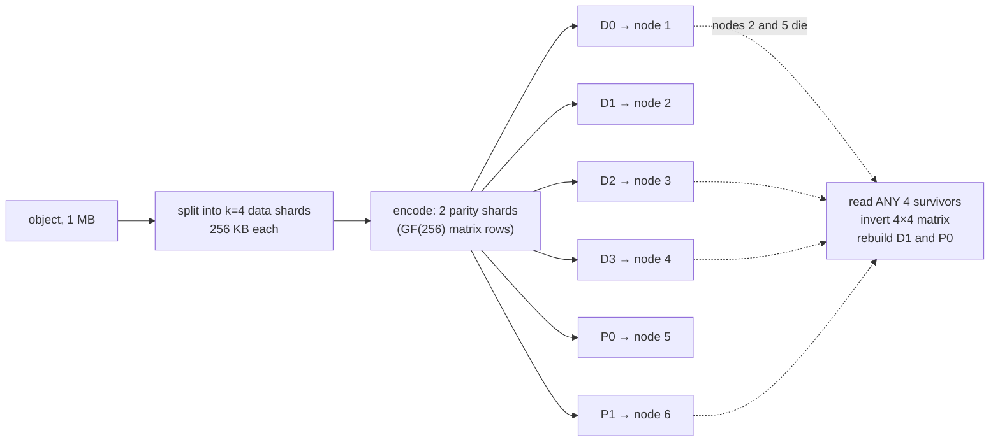
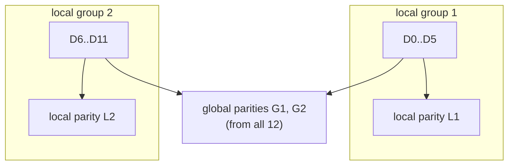

# Under the Hood: How Do Storage Systems Survive Losing Disks with 1.5× Overhead Instead of 3 Full Copies? (erasure coding)

## 1. The hook

A big object store loses disks **every day**: at a few million drives and ~1–2% of them dying per year, that's dozens to hundreds of dead disks daily. Nobody loses a photo. The simple way to get there is to keep **3 full copies** of everything, so 1 PB of user data costs 3 PB of disks.

Yet systems like HDFS, Ceph, Backblaze and Facebook's warm storage keep data just as safe (often safer) at **1.4–1.5×**. They don't keep copies. They keep **math**: a few extra "parity" pieces from which any lost piece can be recomputed. That's **erasure coding**.

💡 **Erasure:** a piece of data you *know* is missing (dead disk, unreachable node), as opposed to silently corrupted. Erasure codes repair known-missing pieces; checksums are what tell you a piece is bad so you can treat it as erased.

---

## 2. Life before it

### RAID: parity inside one box
💡 **RAID (Redundant Array of Independent Disks):** combining several disks in one server so they act as one, with redundancy. Named in **1988** by Patterson, Gibson and Katz (*A Case for Redundant Arrays of Inexpensive Disks*, SIGMOD).

| Scheme | How | Overhead | Survives |
|---|---|---|---|
| **RAID 1** (mirroring) | every disk has a twin with the same bytes | 2× | 1 disk per pair |
| **RAID 5** | stripe data over N−1 disks + 1 **XOR parity** block per stripe | e.g. 5 disks: 5/4 = 1.25× | any 1 disk |
| **RAID 6** | like RAID 5 with **2** parity blocks (P = XOR, Q = a Reed–Solomon-style code) | e.g. 6 disks: 6/4 = 1.5× | any 2 disks |

💡 **Stripe:** one "row" across all disks: a block from each data disk plus the parity blocks computed from them. **Parity:** extra bytes computed from the data so a missing piece can be recalculated.

RAID lives in one server: lose the server, the rack's power, or the controller, and every disk goes with it.

### Triple replication: copies across machines
**GFS** (Google, SOSP 2003) and **HDFS** (its open-source clone) took the opposite approach: cheap servers, and every block copied to **3 different machines**, two of them in another rack. Simple, fast to read, fast to repair (copy one replica). But:

```text
1 PB of data × 3 replicas            = 3.0 PB of disk
1 PB with RS(6,3):  1 PB × 9/6       = 1.5 PB   (saves 1.5 PB)
1 PB with RS(10,4): 1 PB × 14/10     = 1.4 PB   (saves 1.6 PB)
```

At exabyte scale, 1.5 PB saved per PB stored is whole data-center buildings. So in the 2010s the big storage systems moved their **cold** data to erasure codes.

💡 **RS(k, m):** Reed–Solomon with **k** data pieces and **m** parity pieces; overhead = (k + m) / k. RS(6,3) = 9 pieces, any 6 rebuild the data.

The math was much older: **Irving S. Reed and Gustave Solomon**, *Polynomial Codes over Certain Finite Fields* (Journal of SIAM, **1960**), written at MIT Lincoln Laboratory. It sat in space probes, CDs and QR codes for decades before storage systems used it at data-center scale.

---

## 3. The clever idea

**Split the data into k pieces and compute m extra parity pieces in such a way that ANY k of the k + m pieces are enough to rebuild everything.** Spread the k + m pieces over different disks, racks or zones: you survive any m failures while storing only (k + m)/k times the data.

Replication is the special case k = 1: one data piece, m extra copies, overhead 1 + m.

---

## 4. Step by step

### Level 1: XOR parity (k data + 1 parity)
💡 **XOR (`^`):** bitwise "exclusive or": a bit is 1 if exactly one of the two inputs is 1. Key property: `a ^ a = 0`, so XOR-ing a value in twice cancels it out.

Take one byte from each of 4 data shards (real output from the demo, §7):

```text
D0 = 5A   D1 = 3C   D2 = F0   D3 = 0F         (hex bytes)
P  = D0 ^ D1 ^ D2 ^ D3 = 99                    (store this as the 5th shard)

Disk holding D2 dies:
D0 ^ D1 ^ D3 ^ P = D0 ^ D1 ^ D3 ^ (D0 ^ D1 ^ D2 ^ D3) = D2 = F0   ✔ (every other term cancels)
```

Do that for every byte position and the whole shard comes back. That's RAID 5. Its limit: **one** equation, so it can solve for **one** unknown. Lose two shards and you have one equation with two unknowns.

💡 **Shard:** one of the k + m pieces; each goes to a different disk/machine.

### Level 2: Reed–Solomon = "more points than you need on a curve"
To survive m losses you need m **independent** equations. Reed–Solomon gets them from a fact you learned in school: **2 points define a line, 3 points define a parabola, k points define a curve of degree k − 1**.

Worked with ordinary numbers, k = 2, m = 2:

```text
data: 5 and 7  → treat them as points (1, 5) and (2, 7) on a line
the line through them: y = 2x + 3
evaluate it at 2 more points: x = 3 → 9,  x = 4 → 11      (the parity shards)
store 4 shards: 5, 7, 9, 11

lose BOTH data shards; keep (3, 9) and (4, 11):
slope = (11 − 9) / (4 − 3) = 2, intercept = 9 − 2·3 = 3  → y = 2x + 3
x = 1 → 5, x = 2 → 7                                       ✔ data back
```

Any 2 of the 4 points define the same line, so **any 2 shards** rebuild it. For k = 4 the curve is a cubic, any 4 of the points define it, and you can add as many extra points (parity shards) as you want.

One snag: with normal numbers, values grow past 255 and need fractions, so a byte wouldn't fit in a byte. Reed–Solomon does the same arithmetic in a **finite field** called **GF(256)**.

💡 **GF(256) (a "Galois field"):** a number system with exactly 256 values (one byte) where you can add, subtract, multiply and divide and always get another byte back. Addition is XOR; multiplication is done with two 256-entry lookup tables (logarithms and anti-logarithms). Same trick as "clock arithmetic" where 11 + 3 = 2, but chosen so division always works.

### How real libraries phrase it: a matrix
Libraries write "evaluate at more points" as a matrix multiplication. The top k rows are the identity (data shards are stored unchanged, which is called a **systematic** code), the bottom m rows produce parity:

```text
 encoding matrix (6×4)        data       shards
 [   1    0    0    0 ]                  [ D0 ]
 [   0    1    0    0 ]     [ D0 ]       [ D1 ]
 [   0    0    1    0 ]  ×  [ D1 ]   =   [ D2 ]
 [   0    0    0    1 ]     [ D2 ]       [ D3 ]
 [  71  167  122  186 ]     [ D3 ]       [ P0 ]   P0 byte = 71·D0 + 167·D1 + 122·D2 + 186·D3  (GF(256) math)
 [ 167   71  186  122 ]                  [ P1 ]
```

The matrix is built (as a **Vandermonde** or **Cauchy** matrix) so that **any 4 of its 6 rows can be inverted**. To decode: take any 4 surviving shards, pick the matching 4 rows, invert that 4×4 matrix, multiply. Out come D0..D3.

💡 **Matrix inverse:** the "undo" of a matrix multiplication, like dividing to undo multiplying. **Vandermonde / Cauchy matrix:** two recipes for matrices whose square sub-blocks are always invertible; that guarantee is what makes "any k" work.



### Durability: why repair speed matters as much as m
💡 **AFR (annualized failure rate):** % of disks that die per year. Backblaze publishes theirs: roughly 1–2%. **Repair window:** time from a disk dying to its data being rebuilt elsewhere.

Rough, independent-failure arithmetic, AFR 2%, after **one** shard is already lost:

```text
chance a given disk dies in a 1-day window:  p = 0.02 × 1/365 ≈ 5.5e-5
3× replication: both remaining copies die     p²            ≈ 3.0e-9
RS(6,3): 3 of the remaining 8 shards die      C(8,3) × p³ = 56 × 1.6e-13 ≈ 9.2e-12

same, 7-day repair window:  p ≈ 3.8e-4
3× replication:  p²          ≈ 1.5e-7     (49× worse)
RS(6,3):         56 × p³     ≈ 3.2e-9     (343× worse: p is cubed)
```

💡 **C(8,3):** "8 choose 3" = 56 ways to pick which 3 of the 8 remaining shards fail.

Two lessons: (1) RS(6,3) at 1.5× beats 3 copies at 3× because it tolerates **3** losses, not 2. (2) Durability depends heavily on **how fast you repair**, so real systems rebuild in parallel from many nodes and prioritise stripes that have already lost two shards. Real failures are correlated (a rack's power, a bad firmware batch), which is why shards go to different racks or zones; that's where the "11 nines" style numbers come from.

---

## 5. Where you've already used it

| You used | Erasure coding inside |
|---|---|
| **Amazon S3** and other cloud object stores | S3 is designed for 99.999999999% ("11 nines") durability across ≥3 zones; AWS says it uses erasure coding but 🟡 **does not publish the exact scheme** ([object storage](../HLD/technologies/object-storage.md)) |
| **HDFS** (Hadoop 3.0, Dec 2017, HDFS-7285) | built-in policies `RS-3-2-1024k`, `RS-6-3-1024k` (the default), `RS-10-4-1024k`, `XOR-2-1-1024k`: Reed–Solomon with 1 MB "cells" striped across DataNodes |
| **Ceph** erasure-coded pools | choose `k` and `m` in an erasure-code profile; plugins include jerasure, ISA-L (Intel's SIMD-accelerated library) and LRC |
| **Facebook f4** (OSDI 2014) | warm BLOBs (photos no longer hot): RS(10,4) in a cell (1.4×) + cross-region XOR → effective replication **3.6× → 2.8× or 2.1×** ([case study](../case-studies/video-upload-transcode-and-storage.md)) |
| **Backblaze Vaults** (2015) | each file split into **17 data + 3 parity** shards over 20 Storage Pods (20/17 ≈ 1.18×); they open-sourced their Java Reed–Solomon library |
| **Azure Storage** | Local Reconstruction Codes (§6) |
| **Linux RAID 6** (`md`) | the Q parity uses GF(256) with the same polynomial (0x11D) as the demo (H. Peter Anvin, *The mathematics of RAID-6*) |
| **CDs, DVDs, Blu-ray, QR codes, deep-space probes** | Reed–Solomon fixes scratches, torn corners and radio noise (a future page: QR codes, `U22` in the [roadmap](../ROADMAP.md)) |

💡 **SIMD:** CPU instructions that process 16–64 bytes at once; it's what makes GF(256) multiplication run at many GB/s per core.

---

## 6. Limits and trade-offs

- **Repair is network-heavy.** Replication repairs a lost block by copying 1 replica. RS(k, m) must read **k** shards to rebuild 1: a dead 16 TB disk under RS(6,3) means reading ~96 TB across the network (6 × 16 TB). Facebook measured this on its HDFS cluster as hundreds of TB of repair traffic per day (*XORing Elephants*, VLDB 2013).
- **Degraded reads are slow.** 💡 **Degraded read:** a read that hits a missing shard. Instead of one disk read you fetch k shards from k machines and decode, so tail latency jumps exactly when the system is already stressed.
- **CPU.** Encoding on write, decoding on degraded reads. Small with SIMD libraries (ISA-L), but not zero; replication costs no CPU at all.
- **Small objects hurt.** Each shard has a minimum size and its own metadata. A 4 KB object split into 6 + 3 pieces is 9 tiny writes, 9 index entries, 9 IOPS. Systems pack small objects into big containers (Haystack/f4 volumes, S3's internal blobs) and erasure-code the container. 💡 **IOPS:** I/O operations per second, the disk's request budget.
- **Writes and updates are awkward.** Changing one byte means recomputing parity for its stripe, so EC fits **write-once** data (blobs, logs, backups, video). Mutable hot data stays replicated.
- **Hot vs cold.** The common design: new, frequently read data stays **replicated** (fast reads, cheap repair); once it cools, a background job re-encodes it with EC. Facebook's Haystack (hot) → f4 (warm) is the textbook case.

### Local Reconstruction Codes (Azure, 2012)
Huang et al., *Erasure Coding in Windows Azure Storage* (USENIX ATC **2012**, best paper) attacked the repair cost. **LRC(12, 2, 2)**: 12 data shards in two groups of 6, one **local** parity per group (XOR-like), plus 2 **global** parities.



```text
overhead: (12 + 2 + 2) / 12 = 1.33×
one lost data shard (by far the most common case): read its 5 group mates + L1 = 6 shards
RS(12,4), same 1.33× overhead: read 12 shards
```

Half the repair traffic for the same storage, at the cost of a slightly more complex code. Ceph ships an LRC plugin; Facebook's HDFS used a similar idea.

---

## 7. Try it

**Run the demo** in [`code/ErasureCodingDemo.java`](code/ErasureCodingDemo.java) (~130 lines, no dependencies): XOR parity over a 1 MB buffer, then Reed–Solomon RS(4,2) with a Cauchy matrix over GF(256). It deletes **every one of the 15 possible pairs** of shards, rebuilds from the 4 survivors, and compares bytes.

```sh
cd under-the-hood/code
java ErasureCodingDemo.java
```

Real output (Java 21, Linux; middle of the pair list trimmed):

```text
== Part 1: XOR parity, 4 data shards + 1 parity ==
one byte from each shard: D0=5A D1=3C D2=F0 D3=0F -> P = D0^D1^D2^D3 = 99
lose D2: D0^D1^D3^P = F0 (was F0)
1 MB file: lose shard 0, XOR the other 4 -> identical: true
...
1 MB file: lose shard 4, XOR the other 4 -> identical: true

== Part 2: Reed-Solomon over GF(256), k=4 data + m=2 parity ==
parity rows of the encoding matrix (Cauchy):
  P0 = [71, 167, 122, 186] . [D0 D1 D2 D3]
  P1 = [167, 71, 186, 122] . [D0 D1 D2 D3]
encoded 1 MB into 6 shards of 262,144 bytes in 18 ms
  lose D0 + D1 -> rebuilt, bytes identical: true
  lose D0 + D2 -> rebuilt, bytes identical: true
  ...
  lose D3 + P1 -> rebuilt, bytes identical: true
  lose P0 + P1 -> rebuilt, bytes identical: true
15 of 15 two-shard losses recovered
lose 3 shards -> only 3 left, fewer than k=4: data is gone (RS(4,2) tolerates 2)

== Cost for this 1 MB file ==
3x replication : stores 3,145,728 bytes (3.00x), survives 2 lost copies, repair 1 copy reads 1,048,576 bytes
XOR 4+1        : stores 1,310,720 bytes (1.25x), survives 1 lost shard,  repair 1 shard reads 1,048,576 bytes
RS(4,2)        : stores 1,572,864 bytes (1.50x), survives 2 lost shards, repair 1 shard reads 1,048,576 bytes
RS repair reads 4 shards to rebuild 1: 1,048,576 bytes over the network to recreate 262,144 bytes
```

What to notice:
- **15 of 15**: every possible pair, including "both data shards gone, rebuild from parity only" and "both parities gone".
- **Same safety as 3 copies (2 losses) at half the disk** (1.5× vs 3×).
- **The bill comes at repair time:** rebuilding one 256 KB shard reads 1 MB (4×). With replication, repairing a whole lost copy reads exactly its own size.
- Things to try: change `M` to 3 and check all 20 triples; time `reconstruct` vs a plain array copy to feel the CPU cost; set `K = 10, M = 4` and print the overhead.

**Real tools** (not installed here, not run): on a Hadoop 3 cluster, `hdfs ec -listPolicies`, then `hdfs ec -setPolicy -path /cold -policy RS-6-3-1024k`; on Ceph, `ceph osd erasure-code-profile set myprofile k=4 m=2` and create a pool with it.

---

## 8. Where it shows up in this repo

- [File storage & sync](../HLD/interviews/file-storage-sync/README.md): the block store is erasure-coded at ~1.5×; [L5-senior.md](../HLD/interviews/file-storage-sync/L5-senior.md) does the 6 + 3 arithmetic and the scrubbing/repair story.
- [Object storage](../HLD/technologies/object-storage.md): how S3-style stores reach 11 nines across zones.
- [Video upload, transcode and storage case study](../case-studies/video-upload-transcode-and-storage.md): Facebook's Haystack (hot, replicated) vs f4 (warm, erasure-coded).
- [Distributed key-value store](../HLD/interviews/distributed-kv-store/README.md): uses plain replication with quorums, because small, mutable, latency-sensitive values are exactly where EC fits badly (§6).
- [Sharding and replication](../HLD/concepts/sharding-and-replication.md): the replication side of the trade-off.
- Sibling page: [content-defined chunking](content-defined-chunking.md), how the same storage systems decide what a "block" is before erasure-coding it.

## 9. Sources

- I. S. Reed, G. Solomon, *Polynomial Codes over Certain Finite Fields*, Journal of the Society for Industrial and Applied Mathematics (1960).
- D. Patterson, G. Gibson, R. Katz, *A Case for Redundant Arrays of Inexpensive Disks (RAID)*, SIGMOD 1988.
- S. Ghemawat, H. Gobioff, S.-T. Leung, *The Google File System*, SOSP 2003 (3 replicas by default).
- C. Huang, H. Simitci, Y. Xu, A. Ogus, B. Calder, P. Gopalan, J. Li, S. Yekhanin, *Erasure Coding in Windows Azure Storage*, USENIX ATC 2012 (LRC(12,2,2), 1.33×).
- M. Sathiamoorthy et al., *XORing Elephants: Novel Erasure Codes for Big Data*, VLDB 2013 (Facebook HDFS repair traffic, locally repairable codes).
- S. Muralidhar et al., *f4: Facebook's Warm BLOB Storage System*, OSDI 2014 (RS(10,4), 3.6× → 2.8× / 2.1×).
- Apache Hadoop 3.0.0 release (Dec 2017) and *HDFS Erasure Coding* docs (policies, `RS-6-3-1024k` default).
- Backblaze blog, *Backblaze Vaults: Zettabyte-Scale Cloud Storage Architecture* and *Backblaze Open-Sources Reed-Solomon Erasure Coding Source Code* (2015), 17 + 3 shards; Backblaze Drive Stats reports for AFR.
- H. Peter Anvin, *The mathematics of RAID-6* (Linux kernel paper, 2004, updated later).
- Ceph docs, *Erasure code* (profiles, jerasure / ISA-L / LRC plugins). AWS S3 docs (11 nines durability design); 🟡 S3's internal coding scheme is not public.
- The demo output was produced by running it in this environment (Java 21).

⬅️ [Under the Hood index](README.md) · 🏠 [Home](../README.md)
