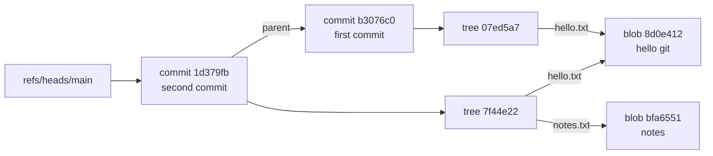

# Under the Hood: How Does Git Keep Your Entire History So Cheaply? (and why is a commit ID a hash)

## 1. The hook

Clone a repo and you get **every version of every file since the first commit**, on your laptop. Creating a branch takes milliseconds and costs **41 bytes**. `git checkout` of a year-old commit works offline. And the commit ID isn't `r1234`, it's something like `b3076c03fe490d65dc85a823967a9d0176d19eeb`.

How can a full copy of history be that cheap, and why is the ID a 40-character hash instead of a counter?

The answer is one idea: **name every piece of data by a hash of its content.** Git is, at its core, a tiny key-value store where the key is computed from the value.

💡 **Hash function:** a function that turns any input into a short fixed-size fingerprint; the same input always gives the same output, and a tiny change gives a completely different one. **SHA-1:** the hash Git uses by default; it outputs 160 bits, written as 40 hex characters.

---

## 2. Life before it

### CVS and Subversion: a central server stores diffs per file
- **CVS** (1990, built on RCS from 1982) kept one history file per source file (`foo.c,v`), storing **reverse deltas** (the latest version in full plus "how to go back one version" diffs). A commit touching 10 files was 10 separate per-file changes: **not atomic**, so a crash mid-commit left the repo half-updated, and branches were per-file tags.
- **Subversion** (SVN, 1.0 in 2004) fixed atomic commits and gave global revision numbers (`r1234`). But history lived **on the server**: `svn log` or a diff against last month needed the network, and merging branches was painful (merge tracking only arrived in SVN 1.5, 2008).

💡 **Delta / diff:** a description of the changes between two versions ("line 12 changed to X") instead of a full copy.

### BitKeeper and the 2005 break
The Linux kernel used **BitKeeper**, a proprietary *distributed* version control system (every developer has the full history), from 2002 under a free licence. In **April 2005** that free licence was withdrawn after a dispute over reverse-engineering its protocol. Linus Torvalds needed a replacement that could handle thousands of patches a day, and none of the free tools were fast enough. He started writing **Git** in early April 2005; Git was managing its own source code by **April 7, 2005**, and the Linux 2.6.12 release (June 2005) was managed in Git. Junio Hamano took over maintenance in July 2005 and still maintains it.

Linus's design goals: fast, distributed, and **"strong safeguards against corruption, either accidental or malicious"**.

---

## 3. The clever idea

**Content-addressed storage:** every object (a file's contents, a directory listing, a commit) is stored under the hash of its own bytes. Identical content gets the same name, so it is **stored once**; objects point to each other by hash, so history is a **Merkle DAG** and any corruption or tampering changes the hashes and is detected.

💡 **Merkle tree / DAG:** a structure where each node's ID is a hash that includes its children's hashes, so the top hash vouches for everything below it ([Merkle trees](../HLD/concepts/merkle-trees-and-anti-entropy.md)). **DAG (directed acyclic graph):** nodes with one-way arrows and no loops; Git's commits form one because a merge commit has two parents.

---

## 4. Step by step

### The four object types

| Object | Contains | Analogy |
|---|---|---|
| **blob** | A file's raw bytes. No filename, no permissions | The contents of a ConfigMap value |
| **tree** | A directory listing: mode, type, hash, name per entry | `ls -l` of a folder, but each entry points to content by hash |
| **commit** | Hash of the top-level tree, parent commit hash(es), author, committer, message | A deployment record: "this exact snapshot, after that one, by me" |
| **tag** (annotated) | Hash of an object + tagger + message (optionally signed) | A release label |

Every object is stored the same way:

```text
key   = SHA-1( "<type> <size in bytes>\0<content>" )
file  = .git/objects/<first 2 hex chars>/<remaining 38 chars>
bytes = zlib-compress( "<type> <size>\0<content>" )
```

💡 **zlib:** a standard lossless compression library (the same algorithm family as gzip). The 2-character folder is a **fan-out**: it spreads objects over 256 directories so no single directory holds millions of files.

### What `git add` and `git commit` actually write

1. `git add hello.txt` hashes the file's content, writes a **blob** into `.git/objects`, and records "hello.txt → that blob hash" in the **index** (the staging area, a file at `.git/index`).
2. `git commit` writes a **tree** for every directory (from the index), then a **commit** object pointing at the root tree and at the previous commit (its **parent**).
3. It then overwrites the branch file `.git/refs/heads/main` with the new commit's hash. That's it: a **branch is a 41-byte text file** containing a commit hash (40 hex chars + newline). `HEAD` is a file saying which branch you're on (`ref: refs/heads/main`).

💡 **Ref:** a human-friendly name (branch, tag) that points to a commit hash. Moving a branch = rewriting one small file.

Here is the real object graph from the "Try it" session below, after two commits where the second one adds `notes.txt` and leaves `hello.txt` unchanged:



Both trees point to the **same** blob `8d0e412`: the unchanged file is not copied. Two commits, but only **6 objects** on disk (2 commits, 2 trees, 2 blobs).

### Why the hash chain gives integrity for free
The commit hash covers the tree hash, which covers each blob hash, and the commit also covers its parent's hash. Change one byte of a file from 2019 and its blob hash changes, so its tree hash changes, so that commit's hash changes, and so does **every commit after it**. If you know the hash of the latest commit (from a signed tag, or from GitHub), you've verified the whole history. `git fsck` re-hashes everything and reports mismatches. This is also why "rewriting history" (`rebase`, `commit --amend`) always produces **new** commit IDs.

### Packfiles: where the real space saving happens
Loose objects are full (compressed) copies. Change one line of a 589 KB file 10 times and you have 11 loose blobs of ~200 KB each. So Git periodically runs **`git gc`** (garbage collect; also triggered automatically and on `push`/`fetch`), which bundles objects into a **packfile** (`.git/objects/pack/*.pack` plus an `.idx` index for lookup by hash):

- Similar objects are stored as **deltas** against each other ("same as object X, but append these bytes").
- Git's heuristic keeps the **newest** version whole and stores older versions as deltas, because you read recent versions most.
- Unreachable objects (from deleted branches, amended commits) are eventually dropped.

Real numbers from the session below (11 versions of a 589 KB file):

```text
before gc: 39 loose objects, 2,400 KB
after  gc: 1 packfile,         213 KB   (2,400 / 213 ≈ 11× smaller)
each old version stored as a delta of 38–39 bytes against the newest one
```

The hash names stay the same; only the storage format changed. Content addressing (the "name") and delta compression (the "storage") are separate layers.

### Why branching and cloning are cheap
- **Branch:** write 41 bytes. No files are copied, because the branch just points into the shared object graph.
- **Merge base:** walking parent hashes back to the common ancestor is a graph search over small commit objects.
- **Fetch/push:** "I have commit X; what do you have?" Both sides compare hashes and send only the missing objects, packed. Same trick as replicas comparing Merkle tree hashes in [anti-entropy repair](../HLD/concepts/merkle-trees-and-anti-entropy.md).

---

## 5. Where you've already used it (content addressing outside Git)

| You used | Content-addressed how |
|---|---|
| **Docker / OCI images** | Each layer and the image manifest are named `sha256:<digest>` of their bytes. `nginx@sha256:...` pins an exact image; a tag like `:latest` is just a movable ref, like a Git branch. Shared base layers are pulled and stored once |
| **Kustomize `configMapGenerator`** | Appends a hash of the content to the ConfigMap name, so changing config changes the name and forces a rollout |
| **Bazel / build caches** | Remote cache keys are hashes of inputs; outputs live in a "Content Addressable Storage" (the Remote Execution API literally calls it CAS) |
| **IPFS** | Files are addressed by a CID (content ID: a hash of the content) instead of a server location |
| **Nix** | Store paths look like `/nix/store/<hash>-openssl-3.x`. Careful: by default that hash is of the build *inputs* (input-addressed); content-addressed derivations are an optional, newer feature |
| **S3 ETags** (sort of) | For a single-part upload without KMS encryption (server-side encryption with managed keys) the ETag is the MD5 (an older, now-insecure hash) of the object; for multipart uploads it isn't. Useful as a change detector, not a guaranteed content hash ([object storage](../HLD/technologies/object-storage.md)) |
| **Dedup systems** | Dropbox-style block dedup and upload dedup ([content fingerprinting](../HLD/concepts/content-fingerprinting-and-dedup.md)) |

Infra analogy: deploying by **image digest** instead of tag is the same reason Git uses hashes instead of names: the ID *is* the content, so "which version is running?" has an unambiguous answer.

---

## 6. Limits and trade-offs

- **Large binary files.** Every version of a 500 MB video or model file is a new blob, and binaries rarely delta well, so the repo (and every clone) grows forever. **Git LFS** (Large File Storage, GitHub 2015) stores a small pointer file in Git and the real bytes on a separate server.
- **Monorepo scale.** Cloning *all* history of a huge repo is slow. Mitigations: **shallow clone** (`--depth 1`, only recent commits), **partial clone** (`--filter=blob:none`, fetch file contents on demand, around 2018), and **sparse checkout** (only some folders in the working tree; the `git sparse-checkout` command arrived in Git 2.25, 2020). Microsoft built GVFS/VFS for Git (2017, a virtual file system that downloads files only when opened) and later Scalar to host Windows (roughly 300 GB, 3.5 million files) in Git.
- **SHA-1 is broken for collisions.** In **February 2017** Google and CWI Amsterdam published **SHAttered**: two different PDFs with the same SHA-1. A collision means an attacker could, in theory, swap an object for a malicious one with the same name. Git responded in **Git 2.13 (2017)** by switching to **SHA-1DC**, a SHA-1 implementation that detects the known collision-attack patterns and refuses them.
- **The move to SHA-256.** Git 2.29 (October 2020) added experimental support for SHA-256 repositories (`git init --object-format=sha256`, 64-hex-char IDs); Git 2.42 (2023) dropped the "experimental" label. Interoperability between SHA-1 and SHA-256 repos is still work in progress, and hosting support is limited, so almost every repo you meet is still SHA-1. Git 3.0 is planned to default to SHA-256.
- **Hashes aren't human-friendly** and aren't ordered: you can't tell which of two commits is newer from their IDs (compare [ID generation](../HLD/concepts/id-generation.md), where sortable IDs are a design goal). SVN's `r1234` was easier to talk about.
- **Immutability has a cost:** you can't "edit" an object, only write a new one. Removing a leaked secret from history means rewriting every later commit (new hashes for everyone, force-push).

---

## 7. Try it

Run this in an empty scratch directory (not inside another repo). `GIT_CONFIG_GLOBAL=/dev/null` ignores your personal Git config (e.g. commit signing) so the output is clean. Output below is real (Git 2.43, Linux).

```sh
cd "$(mktemp -d)" && export GIT_CONFIG_GLOBAL=/dev/null
git init -q -b main demo && cd demo
git config user.name Demo && git config user.email demo@example.com
echo 'hello git' > hello.txt
git add hello.txt
find .git/objects -type f
```
```text
.git/objects/8d/0e41234f24b6da002d962a26c2495ea16a425f
```

The blob's name is just the SHA-1 of `"blob 10\0hello git\n"` (10 = byte length of `hello git` plus the newline):

```sh
git hash-object hello.txt
printf 'blob 10\0hello git\n' | sha1sum
git cat-file -t 8d0e412 ; git cat-file -s 8d0e412 ; git cat-file -p 8d0e412
python3 -c "import zlib;print(zlib.decompress(open('.git/objects/8d/0e41234f24b6da002d962a26c2495ea16a425f','rb').read()))"
```
```text
8d0e41234f24b6da002d962a26c2495ea16a425f
8d0e41234f24b6da002d962a26c2495ea16a425f  -
blob
10
hello git
b'blob 10\x00hello git\n'
```

Same hash both ways: **your file will get exactly this blob ID on any machine in the world.** Now commit, then add a second file and commit again:

```sh
git commit -q -m "first commit"
git cat-file -p HEAD ; git cat-file -p 'HEAD^{tree}' ; cat .git/refs/heads/main
echo 'notes' > notes.txt && git add notes.txt && git commit -q -m "second commit"
git cat-file -p HEAD ; git cat-file -p 'HEAD^{tree}'
find .git/objects -type f | wc -l
```
```text
tree 07ed5a7aebb914e3a02edf6d622b82d364037e3c
author Demo <demo@example.com> 1791453600 +0000
committer Demo <demo@example.com> 1791453600 +0000

first commit
100644 blob 8d0e41234f24b6da002d962a26c2495ea16a425f	hello.txt
b3076c03fe490d65dc85a823967a9d0176d19eeb
tree 7f44e223894d93a5069be81aed0623f4daad1156
parent b3076c03fe490d65dc85a823967a9d0176d19eeb
...
second commit
100644 blob 8d0e41234f24b6da002d962a26c2495ea16a425f	hello.txt
100644 blob bfa655111293037a5564088d1a9bbca4cbcf446b	notes.txt
6
```

`hello.txt` still points at blob `8d0e412`: reused, not copied. Your commit and tree hashes will differ from mine (they include your timestamp and name); the blob hashes won't. Finally, watch `git gc` pack a file with 10 small edits:

```sh
seq 1 100000 > big.txt && git add big.txt && git commit -q -m "add big"
for i in $(seq 1 10); do echo "edit $i" >> big.txt; git commit -qam "edit $i"; done
git count-objects -v ; git gc -q ; git count-objects -v
git verify-pack -v .git/objects/pack/*.idx | grep blob | head -4
```
```text
count: 39        size: 2400      in-pack: 0     packs: 0    size-pack: 0     (before)
count: 0         size: 0         in-pack: 39    packs: 1    size-pack: 213   (after, sizes in KB)
44d5d12891d9af84bba6b0a3c9ec60219d82849b blob   588966 212886 1838
8d0e41234f24b6da002d962a26c2495ea16a425f blob   10 19 214724
bfa655111293037a5564088d1a9bbca4cbcf446b blob   6 15 214743
cab8fb3d41e47a63cf9284e0f129eee82417f062 blob   25 38 215097 1 44d5d12891d9af84bba6b0a3c9ec60219d82849b
```

(`count-objects` output condensed to one line each.) The newest `big.txt` (589 KB) is stored whole (213 KB compressed); each older version is a **38-byte delta** against it (the trailing `1 44d5d12...` means "delta, depth 1, base object 44d5d12"). Bonus: `git init --object-format=sha256 s256` gives 64-character IDs, and the same blob hashes to `0cee7efe07c21236...` there, which equals `printf 'blob 10\0hello git\n' | sha256sum`.

---

## 8. Where it shows up in this repo

- [Merkle trees & anti-entropy](../HLD/concepts/merkle-trees-and-anti-entropy.md): the same hash-of-hashes structure, used by Cassandra/Dynamo replicas to find differences.
- [Content fingerprinting & dedup](../HLD/concepts/content-fingerprinting-and-dedup.md): hash the content to find duplicates; Git is exact-match dedup by design.
- [Object storage](../HLD/technologies/object-storage.md): immutable objects, ETags, and why S3 keys are *not* content hashes by default.
- [ID generation](../HLD/concepts/id-generation.md): hash-derived IDs (deterministic, unordered) vs generated IDs (ordered, need coordination).
- [Ledgers & event sourcing](../LLD/concepts/ledgers-and-event-sourcing.md): append-only history where each entry can carry the hash of the previous one.
- [Collaborative Editor (HLD)](../HLD/interviews/collaborative-editor/README.md) and [Text Editor (LLD)](../LLD/interviews/text-editor/README.md): version history and undo are a DAG of snapshots, the same shape as Git's commit graph.
- [Video upload case study](../case-studies/video-upload-transcode-and-storage.md): dedup of uploaded content by fingerprint.

## 9. Sources

- Linus Torvalds, Git's initial commit "Initial revision of git, the information manager from hell" (April 7, 2005), and his 2007 Google Tech Talk on Git (design goals, distributed model, integrity).
- Scott Chacon & Ben Straub, *Pro Git* (2nd ed., 2014), chapter 10 "Git Internals": objects, packfiles, refs.
- Git documentation: `git-cat-file(1)`, `git-hash-object(1)`, `git-gc(1)`, `gitformat-pack(5)`, `hash-function-transition` (SHA-256 plan).
- Git 2.13 (2017), 2.29 (2020) and 2.42 (2023) release notes: SHA-1DC, SHA-256 repositories, SHA-256 no longer experimental.
- Stevens, Bursztein, Karpman, Albertini, Markov, *The first collision for full SHA-1* (SHAttered, CWI + Google, February 2017).
- Microsoft DevOps blog on GVFS / Scalar and the Windows repository (2017–2020).
- All command output above was produced by running the commands with Git 2.43 on Linux.

⬅️ [Under the Hood index](README.md) · 🏠 [Home](../README.md)
