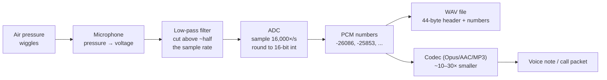
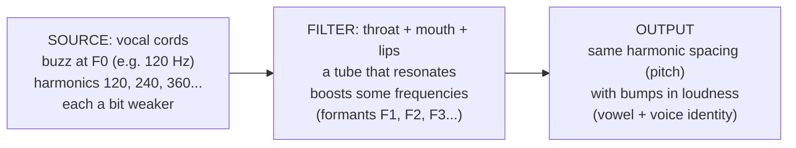

# Under the Hood: How Is a Voice Stored in a File, and Where in the Numbers Are "Pitch" and "Whose Voice"? (digital audio)

## 1. The hook

You record a 10-second WhatsApp voice note. Your friend plays it and instantly knows three things: it's **you** (not your brother), you said **"aa"** not **"ee"**, and your voice went **up** at the end of the question.

Open the file and there is no field called `pitch`, no field called `speaker`, no field called `vowel`. A raw audio file is **one long list of integers**, like `-26086 -25853 -23530 -19096 ...`. Every one of those three facts is hidden in the *pattern* of those numbers. This page shows how the list is made, where pitch and "voice" live in it, and how apps shrink it from megabytes to kilobytes.

💡 **Frequency / Hz (hertz):** how many times per second something repeats. 120 Hz = 120 times a second. **kHz** = thousand per second.

---

## 2. Life before it

**Sound is air pressure wiggling.** Your vocal cords push air in quick puffs; the air near your mouth gets slightly squeezed and stretched, a few hundred times a second, and that ripple travels to an ear. Plot the pressure against time and you get a wavy line, the **waveform**.

💡 **Amplitude:** how far the wave swings from the middle. Bigger swing = louder. **Analog:** a signal stored as a continuous physical quantity (a groove depth, a magnetic strength) instead of numbers.

For a century, sound was stored **analog**: Edison's phonograph (1877) cut the wiggle into a groove; vinyl records and cassette tapes did the same with plastic and magnetism. The copy *is* the wave, so every copy, every play and every scratch adds noise, and long-distance phone lines added hiss with every amplifier.

The digital fix came in pieces:
- **1928, Harry Nyquist** (*Certain Topics in Telegraph Transmission Theory*) showed how many values per second a line can carry; **1949, Claude Shannon** (*Communication in the Presence of Noise*) stated the **sampling theorem**: measure a wave often enough and you can rebuild it *exactly*.
- **1937–1938, Alec Reeves** patented **PCM** (pulse-code modulation: send the wave as a stream of numbers). Phone networks adopted it in the 1960s (Bell's T1 lines, 1962: digital links carrying 24 calls as numbers); the ITU's **G.711** (1972) is still the 64 kbps phone codec today.
- **1980, Sony + Philips "Red Book"** defined the audio CD: 44,100 samples/s, 16 bits, 2 channels. The music industry went digital.

💡 **Codec (coder–decoder):** the algorithm that turns audio into bytes and back (G.711, MP3, AAC, Opus). **kbps:** thousands of bits per second, the "size per second" of audio.

---

## 3. The clever idea

**Measure the air pressure thousands of times a second and write each measurement down as an integer: the file is just that list.** Pitch and "whose voice" are not stored anywhere; they are *patterns* in the list (how often it repeats, and the mix of frequencies inside each repeat) that software recovers with math, mainly the Fourier transform.

---

## 4. Step by step

### 4.1 From air to numbers



💡 **Microphone:** a thin membrane that moves with the air; the movement produces a tiny **voltage** (electrical push) that rises and falls with the pressure. **ADC (analog-to-digital converter):** a chip that reads that voltage at fixed instants and outputs integers. The reverse chip in your earphones is a **DAC**.

**Step 1: sampling (how often).** The ADC reads the voltage at a fixed rate, the **sample rate**.

| Use | Sample rate | Highest frequency kept (half of it) |
|---|---|---|
| Old landline phone (G.711) | 8,000 /s | 4,000 Hz (filtered to ~300–3,400 Hz) |
| "HD voice", most voice apps and speech AI | 16,000 /s | 8,000 Hz |
| CD, Spotify downloads | 44,100 /s | 22,050 Hz |
| Video, Zoom/Meet internals, pro audio | 48,000 /s | 24,000 Hz |

Why "half"? **Nyquist rule:** to capture a wave that goes up and down *f* times a second you need **more than 2 × f** samples per second, at least one on each hump and one on each dip. Humans hear roughly 20 Hz – 20,000 Hz, so music needs > 40,000 samples/s; 44,100 leaves a little room for the filter. Speech carries most of its meaning below ~4,000 Hz (hence phones at 8,000/s) and nearly all of it below 8,000 Hz (hence 16,000/s for voice). 💡 **Aliasing:** what happens if you break the rule. A 9,000 Hz whistle sampled 16,000×/s produces the *same* numbers as a 7,000 Hz tone (16,000 − 9,000), a fake sound. That's why a **low-pass filter** (a circuit that lets low frequencies through and blocks high ones) sits before the ADC and removes everything above half the rate first. (Same effect as wagon wheels spinning backwards in films.)

**Step 2: quantisation (how precisely).** Each reading is rounded to the nearest integer the format allows, the **bit depth**.

```text
16-bit: 2^16 = 65,536 levels, stored as a Java short: -32,768 .. +32,767
dynamic range ≈ 6.02 dB × 16 bits ≈ 96 dB   (20 × log10(65,536) = 96.3)
 8-bit: 256 levels → ≈ 48 dB → audible hiss
24-bit: 16.7 million levels → ≈ 144 dB → studio recording headroom
```

💡 **dB (decibel):** a log scale for "how much louder". +6 dB ≈ twice the amplitude, +20 dB = 10× the amplitude. **Dynamic range:** the gap between the loudest sound the format can hold and the rounding noise floor. 96 dB is roughly "a whisper to a rock concert".

**Step 3: write the list.** That's **PCM** (pulse-code modulation): no compression, sample after sample. A **WAV** file is a 44-byte header followed by those samples. Here is the real header the demo (§7) wrote, byte by byte:

```text
52 49 46 46 | A4 3E 00 00 | 57 41 56 45 | 66 6D 74 20 | 10 00 00 00 | 01 00 | 01 00
  "RIFF"      file size-8     "WAVE"       "fmt "       fmt size 16   PCM=1   1 channel
80 3E 00 00 | 00 7D 00 00 | 02 00 | 10 00 | 64 61 74 61 | 80 3E 00 00 | ...samples...
 16,000 Hz    32,000 B/s    2 B/frame 16-bit  "data"     16,000 bytes follow
```

💡 **Little-endian:** the low byte comes first, so `80 3E` means 0x3E80 = 16,000. Java's `DataOutputStream` writes big-endian, which is why the demo uses a `ByteBuffer` set to `LITTLE_ENDIAN`. **Channel:** one independent stream; stereo = 2 channels, stored interleaved (left, right, left, right…).

**How big is that?**

```text
CD stereo, 1 minute : 44,100 samples/s × 2 bytes × 2 channels × 60 s = 10,584,000 bytes ≈ 10.6 MB
   bitrate          : 44,100 × 16 bits × 2 = 1,411,200 bit/s ≈ 1,411 kbps
Voice, 16 kHz mono  : 16,000 × 2 bytes × 60 s = 1,920,000 bytes ≈ 1.9 MB per minute (256 kbps)
Phone, G.711        : 8,000 × 1 byte (8-bit, log-scaled) = 64 kbps ≈ 480 KB per minute
Opus voice @ 24 kbps: 24,000 / 8 × 60 = 180,000 bytes ≈ 180 KB per minute (~10× smaller than 16 kHz PCM)
```

### 4.2 Where pitch lives: how often the pattern repeats

When you say "aaa" your vocal cords open and close at a steady rate, say 120 times a second. Each puff produces the same wiggly shape, so the waveform **repeats every 1/120 s = 8.33 ms**, which at 16,000 samples/s is every **133.3 samples**. That repeat rate is the **fundamental frequency, F0**, and it's what we hear as pitch.

| Speaker | Typical speaking F0 (rough ranges, vary a lot between people) |
|---|---|
| Adult male | ~85–180 Hz |
| Adult female | ~165–255 Hz |
| Child | ~250–400 Hz 🟡 |

Pitch changes *during* speech: a question rises at the end; in tonal languages it changes word meaning. Software tracks it every ~10–20 ms.

**Finding it, method 1: autocorrelation.** 💡 **Autocorrelation:** slide a copy of the wave over itself and score how well they line up at each shift. At a shift of exactly one period (133 samples) the copy lands on the same shape and the score jumps close to 1.0. Shift with the best score → period → `16,000 / 133.3 = 120 Hz`. This is the core of classic pitch trackers (YIN, 2002, is a refined version).

**Finding it, method 2: the Fourier transform.** The big idea (Joseph Fourier, 1807–1822): **any repeating wave, however wiggly, is a sum of plain sine waves**, and those sines sit at exactly F0, 2×F0, 3×F0, … These are the **harmonics**. A 120 Hz voice contains energy at 120, 240, 360, 480 Hz… A 220 Hz voice: 220, 440, 660… So **pitch = the spacing between the peaks** in the frequency picture.

💡 **Sine wave:** the smoothest possible wave, a pure tone (like a tuning fork). **DFT / FFT:** the **discrete Fourier transform** takes N samples and answers "how much of each sine frequency is in here?"; the **FFT** (fast Fourier transform, Cooley & Tukey 1965) computes the same answer in N log N steps instead of N². **Spectrum:** the result, a bar chart of loudness vs frequency.

### 4.3 Where "whose voice" and "which vowel" live: the shape over the harmonics

Two people at the **same 120 Hz pitch** produce harmonics at the **same frequencies** (120, 240, 360…). What differs is **how loud each harmonic is**. That relative loudness pattern is **timbre** (pronounced "TAM-ber"), the "colour" of a sound. It's why a violin and a flute playing the same note don't sound alike.

For speech, the shape comes from the **source–filter model** (Gunnar Fant, *Acoustic Theory of Speech Production*, 1960):



💡 **Resonance:** a shape that "rings" at certain frequencies, like blowing over a bottle. **Formant:** a resonance of your vocal tract, a frequency region that comes out louder. Moving your tongue and lips moves the formants. **Spectral envelope:** the smooth curve over the tops of the harmonic peaks; the formants are its bumps.

The first two formants mostly decide the **vowel** (Peterson & Barney measured 76 speakers in 1952; values below are approximate adult averages, they vary with speaker):

| Vowel | F1 | F2 | Mouth |
|---|---|---|---|
| "aa" (as in *father*) | ~700 Hz | ~1,100–1,200 Hz | open jaw, tongue low and back |
| "ee" (as in *see*) | ~300 Hz | ~2,300 Hz | nearly closed, tongue high and front |

And **who** is speaking is a mix of: average F0 (pitch range), the exact formant positions (longer vocal tract → all formants lower, which is why adult men's formants sit ~15–20% below women's 🟡), the higher formants F3–F4, how "breathy" or "pressed" the buzz is (how fast the harmonics fade), accent, speed and rhythm. Speaker-recognition systems learn this mix from the spectrum, not from any single number.

**Loudness** is the simplest: the size of the numbers. Halve every sample → 6 dB quieter. Push samples past ±32,767 and they get flattened (**clipping**, §6).

**The spectrogram: all of it in one picture.** Cut the audio into ~20–30 ms slices, run an FFT on each, and stack them: time on x, frequency on y, loudness as colour. Horizontal stripes with even spacing = harmonics (spacing = pitch); dark bands sliding up and down = formants (vowels changing); vertical smears = consonants like "s" and "t". Speech-to-text models, Shazam and voice assistants all start from (a variant of) this picture.

### 4.4 How codecs shrink it 10–100×

**Lossless** codecs (FLAC, 2001) predict each sample from the previous ones and store only the small error: ~40–60% of the WAV size, bit-perfect. To go far smaller you must throw information away (**lossy**), and the trick is to throw away what ears don't notice:

- **Psychoacoustics** 💡 (the science of what humans actually perceive). A loud sound **masks** quieter sounds at nearby frequencies and for a few ms after it; very high and very low frequencies need much more energy to be heard at all.
- **MP3** (MPEG-1 Audio Layer III, ISO/IEC 11172-3, 1993; Fraunhofer IIS), **AAC** (1997) and Opus's music mode: cut audio into ~2–20 ms frames, transform each to frequencies (the **MDCT**, modified discrete cosine transform: a Fourier cousin that works well on overlapping short frames), then spend bits only where the masking model says errors would be audible. `1,411 kbps CD ÷ 128 kbps MP3 ≈ 11×` smaller, and most listeners can't reliably tell.
- **Speech codecs** model the **source–filter** idea directly (**LPC**, linear predictive coding, Itakura & Saito 1968; Atal 1970s): per 20 ms frame, send "the filter shape" (~10–16 numbers describing the formants), "the pitch", "how loud", and a small description of the buzz. The decoder rebuilds the voice. That's why voice fits in 6–16 kbps.
- **Opus** (RFC 6716, 2012) combines both: **SILK** (from Skype, LPC-style, for speech) and **CELT** (MDCT, for music), 6–510 kbps, 2.5–60 ms frames. **WebRTC** (the browser standard for real-time audio/video calls), which Google Meet and many browser call apps use, requires Opus support (RFC 7874, 2016). Typical voice calls use ~16–32 kbps; WhatsApp voice notes are widely reported to be Opus in an `.opus`/Ogg file (Ogg: a simple container format that wraps the codec's packets) 🟡 (WhatsApp doesn't document its codec settings).

---

## 5. Where you've already used it

| You used | What's happening in the numbers |
|---|---|
| **WhatsApp voice notes** | mic → 16 kHz-ish PCM → Opus (🟡 bitrate not public) → small file uploaded to object storage, link sent in the chat |
| **Zoom / Google Meet / Teams calls** | 20 ms frames of Opus (or a vendor codec) in UDP packets (UDP: send-and-forget network packets, no waiting for lost ones to be resent); the app lowers bitrate when the network is bad, like video ABR |
| **Spotify "Normal / High / Very high"** | the same song encoded at several bitrates (Spotify documents ~96 / 160 / 320 kbps tiers 🟡 and lossless options since 2025 🟡); higher = fewer masking shortcuts |
| **Shazam** | spectrogram → pick the loudest peaks → hash pairs of peaks → look them up (a future page: `U15` in the [roadmap](../ROADMAP.md)) |
| **"Hey Google" / Siri / Alexa** | 16 kHz audio → spectrogram-like features → a small always-on model listens for the wake word |
| **Call-centre recordings at work** | often 8 kHz G.711 WAVs: 480 KB/min, cheap to keep for compliance; speech analytics runs on them |
| **Auto-tune, voice changers** | detect F0, shift the harmonic spacing, keep the envelope → same voice, new pitch (or move the envelope → "chipmunk" voice) |

---

## 6. Limits and trade-offs

- **Aliasing:** sample too slowly (or skip the filter) and high sounds fold into fake lower ones. Downsampling 48 kHz → 16 kHz must low-pass filter first; naive "take every 3rd sample" adds metallic garbage.
- **Clipping:** a sound louder than the format's maximum is cut flat at ±32,767. Flat tops = new harmonics that weren't there = harsh distortion, and it can't be undone. That's why recorders keep headroom (peaks around −6 to −12 dB).
- **Lossy artefacts:** at low bitrates you hear "swirly", "underwater" or "metallic" sound (pre-echo: a faint smear just before a sharp drum hit; missing high end). Every re-encode (download MP3, edit, re-encode) loses more: keep a lossless master, as video pipelines keep the original upload.
- **Latency vs quality on calls:** a codec needs a frame of audio before it can encode it. 20 ms frames + network + a **jitter buffer** 💡 (the receiver holds packets for 20–100 ms so late ones still play in order) add up; beyond ~150 ms one-way, people start talking over each other (ITU-T G.114 🟡). Bigger frames compress better but add delay; music streaming can buffer seconds, calls can't.
- **Why voice codecs sound bad on music:** they assume "one buzz source + one vocal tract filter". A guitar chord, two singers or background music breaks that model, so hold music on a phone line sounds mushy. Opus switches to its MDCT mode for music, if the bitrate allows.
- **Pitch detection is not trivial on real speech:** whispers and "s"/"f" sounds have no pitch at all, and trackers often jump an octave (picking 2× or ½× the true period). The demo guards against this by taking the *first* strong autocorrelation peak.
- **Sample rate is not "quality" past a point:** 44.1 kHz already covers the hearing range; 96/192 kHz helps editing headroom, not listening.

---

## 7. Try it

**Run the demo** [`code/VoiceDemo.java`](code/VoiceDemo.java) (~170 lines, no dependencies). It builds four "voice-like" vowels with the source–filter recipe (a buzz of harmonics, each multiplied by a two-formant envelope), writes real 16-bit 16 kHz mono WAV files, reads them back, finds the pitch with autocorrelation and prints a DFT spectrum. Runs in ~1.3 s.

```sh
cd under-the-hood/code
java VoiceDemo.java            # add --keep to keep the .wav files and play them
```

Real output (Java 21, Linux):

```text
== 1. Write: a voice is just a list of numbers ==
header of a-120Hz.wav (44 bytes):
  52 49 46 46 A4 3E 00 00 57 41 56 45 66 6D 74 20 10 00 00 00 01 00
  01 00 80 3E 00 00 00 7D 00 00 02 00 10 00 64 61 74 61 80 3E 00 00
  = 'RIFF' size 'WAVE' 'fmt ' 16, PCM=1, channels=1, 16000 Hz, 32000 bytes/s, 2, 16 bits, 'data' 16000
samples 1000..1011 (one every 1/16000 s): -26086 -25853 -23530 -19096 -13112 -6333 588 7109 12709 16892 19321 20095
a-120Hz.wav    16,044 bytes = 44 header + 8,000 samples x 2 bytes | loudest sample 26,214 of 32,767 | pitch found 120.0 Hz (true 120)
i-120Hz.wav    16,044 bytes = 44 header + 8,000 samples x 2 bytes | loudest sample 26,214 of 32,767 | pitch found 120.0 Hz (true 120)
a-220Hz.wav    16,044 bytes = 44 header + 8,000 samples x 2 bytes | loudest sample 26,214 of 32,767 | pitch found 220.0 Hz (true 220)
i-220Hz.wav    16,044 bytes = 44 header + 8,000 samples x 2 bytes | loudest sample 26,214 of 32,767 | pitch found 220.0 Hz (true 220)

== 2. Strongest peaks in each spectrum (Hz, dB below loudest) ==
'a' @ 120 Hz:   719 (  0)    602 ( -5)   1199 ( -7)    840 ( -9)    121 (-10)
'i' @ 120 Hz:   238 (  0)    359 ( -3)    121 ( -3)    480 (-15)   2281 (-19)
'a' @ 220 Hz:   660 (  0)   1102 (-11)    879 (-12)    441 (-13)   1320 (-13)
'i' @ 220 Hz:   219 (  0)    441 (-11)   2199 (-22)   2422 (-25)    660 (-26)

== 3. Spectrum, 0-3000 Hz in 125 Hz rows (bar = loudest harmonic in the row) ==
   Hz  | 'a' @120 Hz      | 'i' @120 Hz      | 'a' @220 Hz      | 'i' @220 Hz
    0  | #############    | ###############  |                  |
  125  | ###########      | ################ | ###########      | ################
  250  | ###########      | ###############  |                  |
  375  | ############     | ###########      | ############     | ############
  500  | ##############   | ########         |                  |
  625  | ################ | ######           | ################ | #######
  750  | #############    | #####            | #                |
  875  | ###########      | ####             | ############     | #####
 1000  | ############     | ###              | ############     | ###
 1125  | ##############   | ###              |                  |
 1250  | ############     | ###              | ############     | ###
 1375  | #########        | ###              |                  |
 1500  | #######          | ###              | #######          | ###
 1625  | ######           | ###              |                  |
 1750  | #####            | ###              | #####            | ###
 1875  | ####             | ####             | ####             | #####
 2000  | ####             | #####            |                  |
 2125  | ###              | ########         | ###              | #########
 2250  | ###              | ##########       |                  |
 2375  | ##               | ########         | ##               | ########
 2500  | ##               | ######           |                  |
 2625  | ##               | ####             | ##               | ####
 2750  | #                | ##               | #                | ##
 2875  | #                | #                |                  |

done in 1353 ms
```

What to notice:
- **It's just numbers.** 0.5 s of voice = 8,000 shorts = 16,000 bytes + 44 header = 16,044 bytes. `file` and `ffprobe` both recognise it as `Microsoft PCM, 16 bit, mono 16000 Hz`.
- **Pitch is recovered exactly** (120.0 / 220.0 Hz) from the raw samples, though no file stores it.
- **Same pitch, different vowel (columns 1 vs 2):** the peaks sit at the same multiples of 120 Hz, but 'a' is loudest around 600–850 Hz and has a second bump near 1,200 Hz, while 'i' is loud below ~400 Hz, nearly silent in the middle and bumps again around 2,100–2,400 Hz. That's F1/F2 moving: the **envelope** is the vowel.
- **Same vowel, different pitch (columns 1 vs 3):** at 220 Hz every other 125 Hz row is empty because the harmonics are 220 Hz apart: the **spacing** is the pitch. The overall bumps stay in the same places.
- **Honest caveat:** at 220 Hz the strongest 'a' peak is 660 Hz, not 700 Hz, because there is no harmonic *at* 700 Hz to boost; the formant can only lift whichever harmonics fall near it. That's a real effect: high voices "sample" the envelope sparsely, which is one reason sopranos' vowels are hard to make out on high notes. The synthetic vowels sound buzzy and robotic (no breath, no pitch wobble), but are recognisable as "aa" and "ee".

**Real tools.** After `--keep`, `ffmpeg -i a-120Hz.wav -c:a libopus -b:a 16k a.opus` turned the 16,044-byte WAV into a **1,083-byte** Opus file here (0.5 s at 16 kbps = 1,000 bytes + container overhead), ~15× smaller. `ffmpeg -i any-voice-note.opus -lavfi showspectrumpic=s=800x400 spec.png` draws a spectrogram of your own WhatsApp voice note; look for the evenly spaced harmonic stripes rising at the end of a question. Things to try in the code: change `0.8` in `synth` to `1.5` (clipping: samples get stuck at +32,767 / −32,768; watch new peaks appear in the spectrum while pitch detection still works), add a third vowel "oo" (~300/870 Hz 🟡), or set `SR = 8_000` and see what the 'i' formant at 2,300 Hz does to the phone-quality version.

---

## 8. Where it shows up in this repo

- [Chat system: product intro](../HLD/interviews/chat-system/00-understand-the-product.md) (§3.7 photos, videos, voice notes): voice notes are uploaded as compressed files to [object storage](../HLD/technologies/object-storage.md); the message carries a link.
- [Video streaming interview](../HLD/interviews/video-streaming/README.md): every video has an audio track (usually AAC or Opus) encoded alongside the video rungs.
- [Video transcoding pipeline](../HLD/concepts/video-transcoding-pipeline.md): containers vs codecs (MP4 + AAC, WebM + Opus), audio normalisation and fingerprinting as side branches.
- [Case study: video upload, transcode and storage](../case-studies/video-upload-transcode-and-storage.md): keep the original, derive the compressed copies.
- Sibling page: [adaptive bitrate in the player](adaptive-bitrate-player.md): the same "lower the bitrate when the network is bad" decision that call apps make for audio.
- [Content fingerprinting and dedup](../HLD/concepts/content-fingerprinting-and-dedup.md): audio fingerprints build on the spectrogram from §4.3 (Shazam, `U15` in the [roadmap](../ROADMAP.md)).

## 9. Sources

- H. Nyquist, *Certain Topics in Telegraph Transmission Theory*, Transactions of the AIEE (1928).
- C. E. Shannon, *Communication in the Presence of Noise*, Proceedings of the IRE (1949): the sampling theorem.
- A. H. Reeves, PCM patent (French patent 1938, filed 1937); ITU-T G.711, *Pulse code modulation of voice frequencies* (1972).
- Sony/Philips *Compact Disc Digital Audio* "Red Book" (1980; later IEC 60908): 44.1 kHz, 16-bit, stereo.
- J. W. Cooley, J. W. Tukey, *An Algorithm for the Machine Calculation of Complex Fourier Series* (1965): the FFT.
- G. E. Peterson, H. L. Barney, *Control Methods Used in a Study of the Vowels*, JASA (1952): formant measurements of 76 speakers.
- G. Fant, *Acoustic Theory of Speech Production* (1960): the source–filter model.
- F. Itakura, S. Saito (1968) and B. S. Atal, M. R. Schroeder (1970s) on linear predictive coding of speech.
- A. de Cheveigné, H. Kawahara, *YIN, a fundamental frequency estimator for speech and music*, JASA (2002).
- ISO/IEC 11172-3, MPEG-1 Audio incl. Layer III / MP3 (1993); ISO/IEC 13818-7, MPEG-2 AAC (1997).
- J.-M. Valin, K. Vos, T. Terriberry, *Definition of the Opus Audio Codec*, RFC 6716 (2012); J.-M. Valin, C. Bran, *WebRTC Audio Codec and Processing Requirements*, RFC 7874 (2016).
- Typical F0 ranges (85–180 / 165–255 Hz) are the commonly cited textbook figures (e.g. Baken 1987); real speakers vary widely. 🟡 Child F0 range, the ~15–20% formant offset, G.114's 150 ms figure, Spotify's tiers and WhatsApp's codec settings are from general references and vendor statements, not verified against primary documents here.
- The demo output and the ffmpeg/ffprobe/file results were produced by running them in this environment (Java 21, Linux).

⬅️ [Under the Hood index](README.md) · 🏠 [Home](../README.md)
