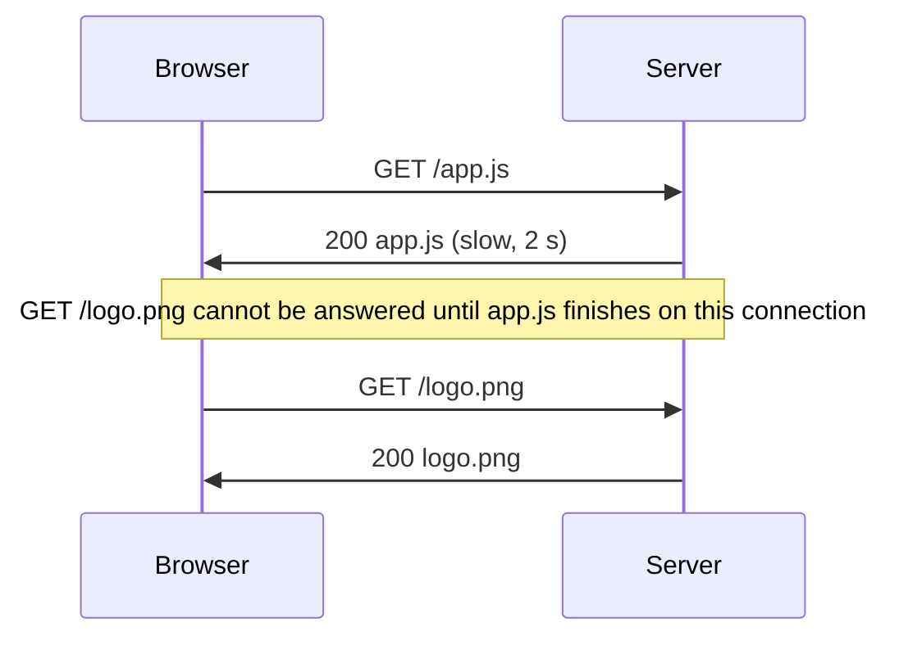
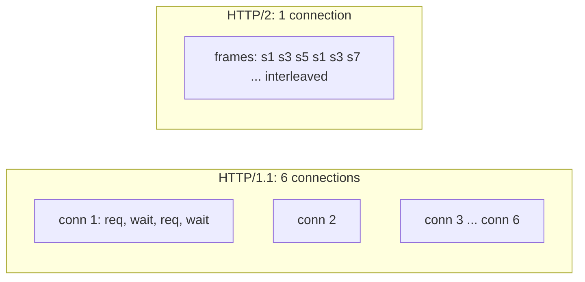
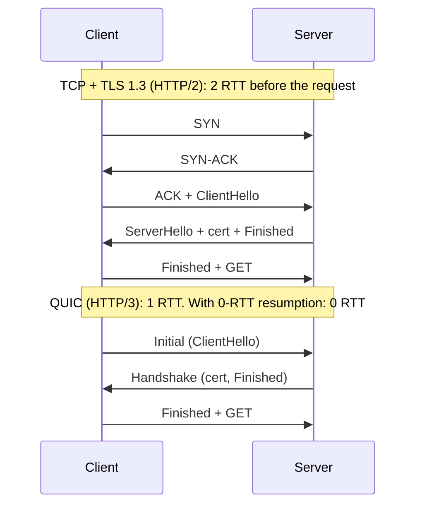

# Under the Hood: Why Did HTTP Need Versions 2 and 3?

## 1. The hook

HTTP/1.1 was good enough to run the web from 1997 to 2015. Then Google, Cloudflare and every browser vendor spent a decade building HTTP/2, and then threw away TCP itself to build HTTP/3. A page is still "GET this, GET that", so what was broken? And why can a faster protocol still stall on one lost packet?

💡 **HTTP (HyperText Transfer Protocol):** the request/response language of the web: `GET /index.html` and the server replies with a status and a body.
💡 **TCP:** the reliable, ordered byte-stream layer under HTTP. See [tcp.md](tcp.md) for slow start and head-of-line blocking, which this page leans on.
💡 **RTT:** round-trip time, about 200 ms between India and the US.

---

## 2. Life before it

- **HTTP/0.9 (1991) and HTTP/1.0 (1996, RFC 1945):** one TCP connection per request. A page with 30 images paid 30 handshakes, and each fresh connection started with a tiny congestion window ([tcp.md](tcp.md)).
- **HTTP/1.1 (1997, RFC 2068; revised RFC 2616 in 1999 and RFC 7230-7235 in 2014):** added **keep-alive** (reuse one connection for many requests), `Host` headers (many sites on one IP) and **pipelining** (send request 2 before response 1 arrives).
- **Pipelining failed in practice.** Responses must still come back in order, so one slow response blocks all behind it (HTTP-level head-of-line blocking), and buggy proxies broke it. Browsers shipped it disabled.
- **The workaround:** browsers open **about 6 parallel connections per host**, and sites invented **domain sharding** (`img1.`, `img2.`), **sprite sheets** and bundling to dodge the limit. Each extra connection pays its own handshake and slow start, and the 6 compete with each other for bandwidth.
- Also, headers repeat: every request resends the same 500-2,000 bytes of cookies and `User-Agent`, uncompressed.

**SPDY (Google, announced 2009)** tested a fix in Chrome and Google servers. It became the base of **HTTP/2 (2015, RFC 7540; now RFC 9113, 2022)**.

---

## 3. The clever idea

Keep HTTP's meaning (methods, headers, status codes) but change the **wire format**: chop every message into small tagged **frames**, so many requests can share one connection, interleaved, with no one waiting in line. Then, because TCP itself still forces one global line, HTTP/3 moves the same idea onto a transport (QUIC) where each stream has its own line.

---

## 4. Step by step

### 4.1 HTTP/1.1: one lane per connection



To get parallelism the browser opens extra connections (up to 6 per host). With 6 lanes and 60 resources you still queue in 10 waves.

### 4.2 HTTP/2: many streams, one connection

- **Binary frames:** text lines became compact binary frames (HEADERS, DATA, ...), each tagged with a **stream ID**.
- **Streams:** each request/response pair is a stream. Frames from different streams are **interleaved** on one TCP connection, so the slow `app.js` does not block `logo.png`.
- **HPACK (RFC 7541, 2015):** header compression using a table both sides keep. The second request sends "header #62" instead of a 1 KB cookie. (Chosen over plain gzip because compressing headers with gzip leaked secrets via the CRIME attack, 2012.)
- **Priorities and flow control per stream** so a big download does not starve small ones.
- **Server push:** server sends files it expects you to need. In practice caches made it wasteful; Chrome removed support in 2022 (🟡 version details), and RFC 9113 keeps it only as optional. Treat it as an experiment that did not pay off.
- Browsers use HTTP/2 **only over TLS**, agreed during the TLS handshake via **ALPN** (Application-Layer Protocol Negotiation: a list of protocol names `h2`, `http/1.1` in the hello message; see [tls-1-3-handshake.md](tls-1-3-handshake.md)). No extra round trip.



**gRPC** (Google, open sourced 2015) is built on HTTP/2: each RPC is a stream, which gives cheap multiplexing, streaming in both directions and trailers (headers sent after the body) for the status code. That is also why many [API gateways](../HLD/interviews/api-gateway/README.md) and load balancers need explicit HTTP/2 support for gRPC, and why a plain L4 balancer sends all of one client's RPCs to one backend: there is only **one** long-lived connection to balance.

### 4.3 What HTTP/2 could not fix: TCP head-of-line blocking

HTTP/2 multiplexes many streams over **one** TCP connection, and TCP delivers bytes in strict order. One lost packet freezes **every** stream until it is retransmitted (at least one RTT, 200 ms here). On a clean fibre link it is rare. On lossy mobile networks, one connection with all eggs in it can be *worse* than 6 connections (a loss only stalls one). Measurements by Google and others (🟡 numbers vary by study) showed HTTP/2 wins on good networks and can lose at around 2%+ packet loss.

You cannot just fix TCP: it lives in operating-system kernels and in middleboxes (NATs, firewalls) that drop packets they do not understand. Changing it means waiting years for every device to update.

### 4.4 HTTP/3 and QUIC: streams on UDP

**QUIC** (Google, 2012-2013 experiment; standardised as **RFC 9000, 2021**) rebuilds reliability **in user space on top of UDP**, which every middlebox already passes. **HTTP/3 (RFC 9114, 2022)** is HTTP mapped onto QUIC.

💡 **UDP:** the bare "send a packet, no promises" protocol. QUIC adds its own reliability, ordering and congestion control on top of it.

What changes:

1. **Independent streams.** Loss recovery is per stream. Lose a packet for stream 3 and streams 1 and 5 keep flowing. HOL blocking is gone (apart from within one stream).
2. **TLS 1.3 built in.** QUIC's handshake carries the TLS 1.3 handshake inside it, so transport and encryption are set up together: **1 RTT** for a new connection (TCP + TLS 1.3 needs 2).
3. **0-RTT resumption.** A returning client can send the request in its very first packet (data encrypted with a remembered key). Caveat: 0-RTT data can be **replayed** by an attacker, so only safe (idempotent) requests should use it.
4. **Connection IDs and migration.** A TCP connection is identified by the 4-tuple (source and destination IP and port), so when your phone leaves Wi-Fi for mobile data the IP changes and every TCP connection dies. A QUIC connection is identified by a **connection ID**, so it survives the switch. This also lets load balancers route by ID instead of by address; see [maglev-hashing.md](maglev-hashing.md) for how large balancers stick a flow to a backend.
5. **Headers:** QPACK (RFC 9204) replaces HPACK, adjusted for out-of-order delivery.



### 4.5 How the browser picks a version

The first visit uses TCP + TLS and the server replies with a header `Alt-Svc: h3=":443"` ("I also speak HTTP/3 on UDP 443"). Next time the browser tries QUIC (racing it against TCP). Newer DNS HTTPS records (SVCB, RFC 9460, 2023) can announce this before the first connection. See [dns.md](../HLD/technologies/dns.md).

Numbers to remember (200 ms RTT, new connection to a TLS 1.3 server):

| Protocol | Round trips before request leaves | Time |
|---|---|---|
| HTTP/1.1 or 2 over TCP + TLS 1.3 | 1 (TCP) + 1 (TLS) | 400 ms |
| HTTP/3 first visit | 1 | 200 ms |
| HTTP/3 with 0-RTT | 0 | 0 ms |

---

## 5. Where you have used it without knowing

- Chrome DevTools Network tab, Protocol column: `h2`, `h3`. The 6-parallel-connection waterfall you used to see on old sites is HTTP/1.1.
- Every gRPC call between your microservices ([service-mesh-and-envoy.md](../HLD/technologies/service-mesh-and-envoy.md) is mostly HTTP/2 plumbing).
- YouTube, Google, Facebook, Cloudflare-fronted sites, where a [CDN](../HLD/technologies/cdn.md) usually terminates HTTP/3 at the edge and speaks HTTP/1.1 or 2 to your origin.
- [WebSockets](../HLD/technologies/websockets-and-sse.md) started as an HTTP/1.1 `Upgrade`; HTTP/2 does not allow that upgrade and uses a different mechanism (RFC 8441, 2018).

---

## 6. Limits and trade-offs

- **HTTP/2 helps most for many small resources.** One big download sees little gain.
- **Load balancing is harder** with one long-lived connection: spread by request (L7), not by connection, or one backend gets everything.
- **QUIC costs CPU**: user-space crypto and per-packet UDP handling mean more CPU than TCP, which has had decades of kernel and NIC offload. Early reports spoke of 2x CPU (🟡 improved since).
- **UDP is sometimes blocked** by corporate firewalls; clients silently fall back to TCP, so you must keep HTTP/2 working.
- **0-RTT replay** limits what you can send early.
- **Observability:** tcpdump shows QUIC as opaque encrypted UDP. Debugging needs qlog or key logging.

---

## 7. Try it

In the sandbox this page was written in, outbound HTTPS goes through a proxy that refused my tunnel to `github.com` (`CONNECT tunnel failed, response 403`) and curl 8.5.0 was built without HTTP/3, so I **could not capture real protocol negotiation output**. The commands below are what to run on your own machine:

```bash
# Which version was used? (prints 2 if the server speaks h2)
curl -sI --http2 https://www.cloudflare.com -o /dev/null -w '%{http_version}\n'

# See ALPN (the protocol negotiation inside TLS) in the verbose output
curl -sv --http2 https://www.cloudflare.com -o /dev/null 2>&1 | grep -iE 'ALPN|HTTP/2'

# Does the server advertise HTTP/3?
curl -sI https://www.cloudflare.com | grep -i alt-svc

# Speak HTTP/3 directly (needs a curl built with HTTP/3 support)
curl --http3 -sI https://www.cloudflare.com
```

What to look for: ALPN lines such as `ALPN: curl offers h2,http/1.1` then `ALPN: server accepted h2`; `alt-svc: h3=":443"` in the headers. Also try `curl --http1.1 -w '%{time_total}\n'` versus `--http2` on a page with many assets using the DevTools Network tab's "Protocol" column.

---

## 8. Where it shows up

- [tcp.md](tcp.md): slow start and head-of-line blocking, the two problems versions 2 and 3 attack.
- [tls-1-3-handshake.md](tls-1-3-handshake.md): the handshake QUIC folds into its own.
- [cdn.md](../HLD/technologies/cdn.md): edges terminate HTTP/3 near the user.
- [API gateway](../HLD/interviews/api-gateway/README.md): protocol translation (HTTP/2 or gRPC outside, HTTP/1.1 inside).
- [websockets-and-sse.md](../HLD/technologies/websockets-and-sse.md): long-lived streams over HTTP.

---

## 9. Sources

- RFC 1945, HTTP/1.0 (1996); RFC 2068 (1997) and RFC 7230 (2014), HTTP/1.1.
- RFC 7540, HTTP/2 (2015), obsoleted by RFC 9113 (2022); RFC 7541, HPACK (2015).
- Google, "SPDY: An experimental protocol for a faster web" (2009).
- RFC 9000, QUIC transport (2021); RFC 9001, QUIC with TLS; RFC 9114, HTTP/3 (2022); RFC 9204, QPACK (2022).
- RFC 8441, WebSockets over HTTP/2 (2018); RFC 9460, SVCB/HTTPS DNS records (2023).
- Langley et al., "The QUIC Transport Protocol: Design and Internet-Scale Deployment", SIGCOMM (2017).
- Unverified (🟡): Chrome's server-push removal timing, the packet-loss crossover figure, QUIC CPU overhead ratio.
