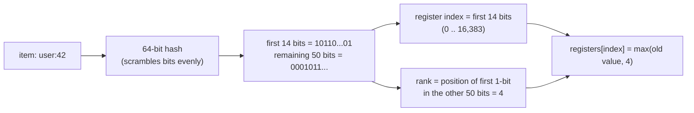
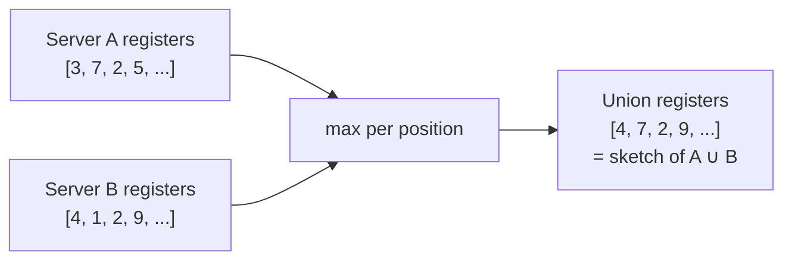

# Under the Hood: How Do You Count a Billion Unique Users in 12 KB? (HyperLogLog)

## 1. The hook

Your dashboard says **"Unique visitors today: 48,213,907"**. Redis answered that with `PFCOUNT` in microseconds, and the key holding it is **12 KB**, the size of a small text file. It would still be 12 KB at a billion visitors.

An exact answer needs every visitor ID stored somewhere so a repeat visit isn't counted twice. So how can 12 KB "remember" 48 million people? It can't, and it doesn't need to: it keeps a tiny statistical fingerprint that tells you the count to within about **1%**.

💡 **Distinct count (cardinality):** how many *different* items appear, ignoring repeats. 5 page views by 2 people = 5 views but a distinct count of 2.

---

## 2. Life before it

### The exact way: remember everyone
```java
Set<Long> seen = new HashSet<>();
seen.add(userId);            // for every event
int unique = seen.size();
```

Memory grows with the number of **distinct** items:

```text
1e9 IDs × 8 bytes (raw long)                         =  8 GB, before any overhead
Java HashSet<Long>: ~65 bytes per ID (measured, §7) × 1e9 ≈ 65 GB
Per page, per day, per country... multiply again.
```

And it doesn't **combine**. If 50 web servers each counted their own visitors, you can't add the 50 numbers: a user who hit two servers would be counted twice. You'd have to ship all the IDs to one place and union them. Same for "unique users this week" from 7 daily counts.

💡 **Merge / union:** combining the results of several counters into one answer for "all of them together", the way you'd aggregate per-pod metrics into one cluster-wide number.

### The long road to the trick
- **1985, Flajolet & Martin**, *Probabilistic Counting Algorithms for Data Base Applications*: hash each item and watch the bit patterns; a few small bitmaps estimate distinct counts. The core insight of everything below.
- **2003, Durand & Flajolet**, *LogLog Counting of Large Cardinalities*: keep only the **maximum** pattern seen per bucket. Counting up to 2^64 needs a max of at most 64, which fits in 6 bits: memory is "log of log n", hence the name.
- **2007, Flajolet, Fusy, Gandouet, Meunier**, *HyperLogLog: the analysis of a near-optimal cardinality estimation algorithm*: same registers, smarter averaging (harmonic mean), error drops from 1.30/√m to **1.04/√m**.
- **2013, Heule, Nunkesser, Hall (Google)**, *HyperLogLog in Practice*: **HyperLogLog++**: 64-bit hashes, better accuracy for small counts, a compact "sparse" form while the count is small. This is what BigQuery and Elasticsearch use.

Redis named its commands `PF...` after **Philippe Flajolet**, who died in 2011.

---

## 3. The clever idea

**Hash every item to random-looking bits and remember only the longest run of leading zeros you've seen.** A hash starting with 20 zeros happens about once per million distinct items, so seeing one hints you've seen about a million. Repeats hash the same way, so they change nothing. One such guess is very noisy, so split items into **16,384 buckets**, keep the max per bucket, and average them.

```text
P(hash starts with 1 zero then a 1)   = 1/4
P(hash starts with k zeros)           = 1/2^k
P(hash starts with 20 zeros)          = 1/1,048,576  ≈ "one in a million"
```

Analogy: if someone tells you their longest streak of heads in a row was 20, you'd guess they flipped a coin about a million times, without them telling you the number of flips.

---

## 4. Step by step

### What happens on `add(item)`



💡 **Hash function:** turns any input into a fixed-size number that looks random; the same input always gives the same number. **Register:** one small slot in an array, here holding a number 0–51 (6 bits).

### A tiny worked example (4 registers, 8-bit hashes)
The first 2 bits pick one of 4 registers, the rank is the position of the first `1` in the remaining 6 bits.

| Item | Hash | Register | Remaining bits | Rank | Registers after |
|---|---|---|---|---|---|
| alice | `01 001011` | 1 | `001011` | 3 | [0, 3, 0, 0] |
| bob | `11 100000` | 3 | `100000` | 1 | [0, 3, 0, 1] |
| carol | `01 000101` | 1 | `000101` | 4 | [0, **4**, 0, 1] (max of 3 and 4) |
| alice again | `01 001011` | 1 | `001011` | 3 | [0, 4, 0, 1] **unchanged**: duplicates are free |
| dave | `00 010000` | 0 | `010000` | 2 | [2, 4, 0, 1] |

True distinct count: 4. With so few registers and one still at zero, HLL uses **linear counting** (below): `4 × ln(4 / 1 empty register) = 5.5`. Way off, because 4 registers is far too few. That's exactly why real HLL uses 16,384.

### From registers to a count
Each register saw roughly `n / m` items, so `2^register` estimates `n / m`. Combine all `m` registers:

```text
estimate = α × m² / Σ 2^(−register[j])        α ≈ 0.7213 / (1 + 1.079/m) ≈ 0.7213 (a bias-correcting constant)
```

The `Σ 2^(−x)` is a **harmonic mean** (average of reciprocals, then flip). It's used because one lucky register with a huge value (a hash with 30 leading zeros) would wreck a normal average; the harmonic mean barely notices it. That switch is the "Hyper" over LogLog.

### Accuracy vs memory

```text
standard error ≈ 1.04 / √m
m = 16,384 = 2^14:  1.04 / 128 = 0.81%
memory = 16,384 registers × 6 bits = 98,304 bits = 12,288 bytes = 12 KB
```

**Standard error** = the typical size of the miss: about 2 in 3 estimates land within ±0.81%, about 95% within ±1.6%. Quadruple the registers to halve the error. At a billion, 0.81% is ±8 million, which nobody needs on a "unique visitors" chart.

### Small counts: linear counting
When few items have been added, most registers are still 0 and the formula above overestimates. HLL then switches to **linear counting**: if `V` of the `m` registers are empty, estimate `m × ln(m / V)` (the expected number of empty buckets after throwing `n` balls into `m` buckets, solved for `n`). Rule from the 2007 paper: use it while the estimate is below `2.5 × m` and some register is empty. HLL++ improves this middle zone further with measured bias-correction tables.

### Merging: register-wise max
Two sketches built with the same hash and `m` merge by taking `max(a[j], b[j])` for every register. The result is **exactly** the sketch you'd have built from the union of both inputs, so the merged estimate is as accurate as either one, and overlaps are never double-counted.



This is what makes HLL the right tool for distributed counting: each server, shard or hour keeps its own 12 KB sketch, and any rollup (cluster-wide, daily → weekly) is just a merge.

---

## 5. Where you've already used it

| You used | Which uses |
|---|---|
| [Redis](../HLD/technologies/redis.md) `PFADD` / `PFCOUNT` / `PFMERGE` | HLL with 16,384 registers, 6 bits each, 12 KB dense, plus a sparse encoding for small sets |
| BigQuery `APPROX_COUNT_DISTINCT`, `HLL_COUNT.*` | HyperLogLog++ |
| Presto / Trino `approx_distinct(x)` | HLL, default standard error 2.3% (configurable) |
| [Elasticsearch](../HLD/technologies/elasticsearch.md) / OpenSearch `cardinality` aggregation | HyperLogLog++, near-exact below `precision_threshold` (default 3,000) |
| Apache Druid, ClickHouse (`uniq`, `uniqHLL12`), Spark `approx_count_distinct` | HLL-family sketches |
| Any dashboard showing "unique users / IPs / devices" over big data | almost certainly one of the above |

---

## 6. Limits and trade-offs

- **Approximate.** ~1% is fine for analytics, wrong for billing, quotas, or "has this user voted?" Use an exact store there ([counters at scale](../HLD/concepts/counters-at-scale.md)).
- **It can't list items, or tell you if one specific item was seen.** It answers "how many", nothing else. "Was X seen?" is a [Bloom filter](../HLD/concepts/bloom-filters.md) job; "which items are most frequent?" is [Count-Min Sketch / top-k](../HLD/concepts/top-k-and-heavy-hitters.md).
- **No deletes.** A register holds a max; you can't know whether removing one item should lower it. Count per time window (hourly sketches) and merge the windows you want instead.
- **Intersections are weak.** `|A ∩ B| = |A| + |B| − |A ∪ B|` works, but the errors of three estimates add up: bad when the overlap is small.
- **Hash quality matters.** Leading-zero counting assumes uniformly random bits. A weak hash (Java's `Long.hashCode()` of sequential IDs is nearly the identity) makes registers wildly wrong. Use a mixing hash (MurmurHash, SplitMix64, xxHash).
- **Sketches only merge with sketches of the same `m` and hash.** Pick them once for the whole fleet, like agreeing on a metrics label schema.

---

## 7. Try it

**Run the demo** in [`code/HyperLogLogDemo.java`](code/HyperLogLogDemo.java): a full HLL in ~90 lines with m = 2^14 registers and a SplitMix64 hash.

```sh
cd under-the-hood/code
java -Xmx2g HyperLogLogDemo.java
```

Real output (Java 21, Linux):

```text
registers m = 16,384, standard error 1.04/sqrt(m) = 0.81%
sketch memory: 16,384 registers x 6 bits = 12,288 bytes (always, for any count)

distinct user ids                true        1,000   estimate          995   error  -0.54%
distinct user ids                true      100,000   estimate      101,347   error  +1.35%
distinct user ids                true    1,000,000   estimate    1,022,694   error  +2.27%
distinct user ids                true   10,000,000   estimate    9,973,671   error  -0.26%
20 runs of 1M: typical (rms) error 0.97%, worst 1.94%
1M users, each seen 5 times      true    1,000,000   estimate    1,022,694   error  +2.27%

server A alone                   true    6,000,000   estimate    5,969,639   error  -0.51%
server B alone                   true    6,000,000   estimate    5,981,057   error  -0.32%
A + B summed (double counts)     true   10,000,000   estimate   11,950,696   error +19.51%
merge(A, B) = register max       true   10,000,000   estimate    9,973,671   error  -0.26%

HashSet<Long> with 1,000,000 ids: ~62 MB of heap (~65 bytes per id)
HyperLogLog for the same ids:  12,288 bytes
```

What to notice:
- The single 1M run is off by 2.27%, an unlucky draw (almost 3 standard errors). Over 20 different runs the typical error is 0.97%, close to the promised 0.81%. HLL guarantees a *distribution* of errors, not a bound on each answer.
- 5× duplicates produce the **identical** estimate: repeats don't move any register.
- Adding A and B over-counts by the 2M overlap; `merge(A, B)` gives **exactly** the same estimate (9,973,671) as the sketch built on all 10M ids directly.
- 62 MB vs 12 KB: about 5,000× smaller.

**Redis** (verified here on Redis 7.0.15):

```sh
redis-server --daemonize yes
redis-cli PFADD visitors:2026-10-08 alice bob carol alice   # (integer) 1 = some register changed
redis-cli PFCOUNT visitors:2026-10-08                        # (integer) 3   (alice counted once)
redis-cli PFADD visitors:2026-10-09 carol dave
redis-cli PFMERGE visitors:week visitors:2026-10-08 visitors:2026-10-09    # OK
redis-cli PFCOUNT visitors:week                              # (integer) 4   (carol counted once)
redis-cli PFCOUNT visitors:2026-10-08 visitors:2026-10-09    # (integer) 4   (union on the fly)
redis-cli MEMORY USAGE visitors:2026-10-08                   # (integer) 120  (small: sparse encoding)
```

Then 1,000,000 distinct ids (`user:1` ... `user:1000000`) into one HLL vs a Redis set:

```text
PFCOUNT big                       999674        (-0.03%)
STRLEN big                        12304         (16-byte header + 12,288 bytes of registers)
MEMORY USAGE big                  14384
PFDEBUG ENCODING big              dense

SCARD exact                       1000000
MEMORY USAGE exact SAMPLES 0      48388640      (~46 MB for the exact set)
```

An HLL key is an ordinary Redis string, so `GET` it, copy it to another Redis, and merge there.

---

## 8. Where it shows up in this repo

- [Counters at scale](../HLD/concepts/counters-at-scale.md): when to use HLL vs exact counters vs sharded counters.
- [News feed](../HLD/interviews/news-feed/README.md): view counts on posts; "unique viewers per post" is a 12 KB HLL each ([counters at scale](../HLD/concepts/counters-at-scale.md) §3.5).
- [URL shortener](../HLD/interviews/url-shortener/README.md): the analytics pipeline; "unique clickers per link per day" is a natural HLL per link, merged into weekly/monthly numbers.
- [Metrics & monitoring](../HLD/interviews/metrics-monitoring/README.md): **cardinality** (distinct series) is that system's scaling limit; an HLL per tenant is a cheap way to estimate it without listing every series.
- Sibling sketches: [Bloom filters](../HLD/concepts/bloom-filters.md) ("seen it?") and [top-k / Count-Min Sketch](../HLD/concepts/top-k-and-heavy-hitters.md) ("how often?").

## 9. Sources

- P. Flajolet, G. N. Martin, *Probabilistic Counting Algorithms for Data Base Applications* (Journal of Computer and System Sciences, 1985).
- M. Durand, P. Flajolet, *LogLog Counting of Large Cardinalities* (ESA, 2003).
- P. Flajolet, É. Fusy, O. Gandouet, F. Meunier, *HyperLogLog: the analysis of a near-optimal cardinality estimation algorithm* (AofA, 2007): the estimator, α constant, 1.04/√m, linear-counting switch.
- S. Heule, M. Nunkesser, A. Hall, *HyperLogLog in Practice: Algorithmic Engineering of a State of The Art Cardinality Estimation Algorithm* (EDBT, 2013): HyperLogLog++.
- Salvatore Sanfilippo (antirez), *Redis new data structure: the HyperLogLog* (2014, Redis 2.8.9); Redis docs for `PFADD`/`PFCOUNT`/`PFMERGE`: "standard error of 0.81%", up to 12 KB per key.
- Product docs: BigQuery approximate aggregate functions, Trino `approx_distinct`, Elasticsearch cardinality aggregation.
- The demo and `redis-cli` outputs were produced by running them in this environment (Java 21, Redis 7.0.15).

⬅️ [Under the Hood index](README.md) · 🏠 [Home](../README.md)
