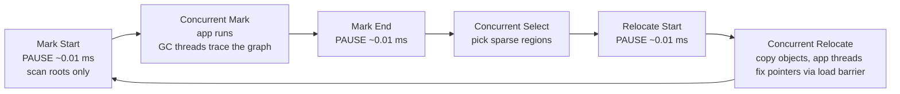

# Under the Hood: How Does ZGC Pause for Under a Millisecond? (generational GC, G1 regions, load barriers)

## 1. The hook

A Java service holds a 16 GB heap (the memory area where objects live). With the old default collector, a "full GC" could freeze every thread for **seconds**, so your p99 latency graph grows teeth and the load balancer's health checks fail. With **ZGC** the same heap is cleaned with pauses that JDK's own docs call "under a millisecond" (we measure **0.024 ms** below). The heap got 100x bigger, the pause did not grow. **How can a collector move live objects around while your threads keep using them?**

💡 **Garbage collection (GC):** the JVM automatically finds objects nobody references any more and reclaims their memory, so Java code has no `free()`. Background: [references and GC](../LLD/libraries/java/references-and-gc.md).

---

## 2. Life before it

### Reference counting and manual free
C/C++ programmers call `free()` themselves: forget once and you leak, do it twice and you crash. Early Lisp (McCarthy, 1960) invented tracing garbage collection to remove this class of bugs.

### Tracing GC and the stop-the-world problem
💡 **Tracing:** start from **roots** (thread stacks, static fields) and follow every reference; anything reached is live, everything else is garbage. **Stop-the-world (STW) pause:** all application threads are frozen so the heap does not change under the collector. The simplest algorithm:
1. **Mark** all live objects. 2. **Sweep** (free) the rest. 3. **Compact** (slide the survivors together to remove holes, like defragmenting) so big objects can still be allocated.

Cost of everything in one STW: proportional to **live data**, i.e. the bigger the heap, the longer the freeze. At roughly 1 GB of live data per second of marking (🟡 rule of thumb, varies a lot), a 16 GB live set means pauses of many seconds.

### The generational hypothesis (1980s)
Observation (Ungar, 1984, Generation Scavenging): **most objects die young** (a request's temporary strings, DTOs). So split the heap into **young** and **old** generations; collect the small young area often and cheaply (only the survivors are copied), the old area rarely.

### The JVM's collectors, in order
| Collector | When | Idea |
|---|---|---|
| **Serial** | JDK 1.3 | One GC thread, STW everything. Fine for tiny heaps / small containers |
| **Parallel** | JDK 1.4/5, default until JDK 8 | Many GC threads, still STW. Best raw throughput |
| **CMS** | JDK 1.4.1-1.5, removed JDK 14 | Marks the old generation *concurrently* (while the app runs) but never compacts, so fragmentation eventually forces a long full GC |
| **G1** | Experimental JDK 6u14 (2009), default since **JDK 9 (2017)** | Heap cut into regions, collect the most garbage-filled ones first, pause target |
| **ZGC** | Experimental JDK 11 (2018), production **JDK 15**, generational **JDK 21 (2023)** | Concurrent compaction using load barriers; pauses independent of heap size |
| **Shenandoah** | Red Hat; JDK 12 (2019), production in 15 | Same goal, different barrier technique |

---

## 3. The clever idea

**Let the application threads themselves help move objects:** every time a thread *loads* a reference from the heap, a tiny check (a **load barrier**) notices "this pointer still points to the old copy" and fixes it on the spot. Because the check is built into reads, the collector can relocate live objects *while the program runs* and only needs to stop the world for a few microseconds to flip a phase.

---

## 4. Step by step



### 4.1 G1: a better STW (the default you probably run)
The heap is cut into ~2,048 equal **regions** (1-32 MB each, e.g. 4 GB heap / 2 MB = 2,048 regions). A region is Eden (new), Survivor, Old or Humongous (huge object). A young collection copies live objects from Eden regions into free regions: STW, but only a few regions' worth.

How can it collect one region without scanning the whole heap? Each region keeps a **remembered set**: a list of "which other regions point into me". Roots + remembered set = everything that can reach this region. Writes that create cross-region pointers go through a **write barrier** (code the JIT adds after every reference store) that updates the sets.

You give G1 a goal: `-XX:MaxGCPauseMillis=200` (default). It measures how long evacuating a region takes and picks as many of the garbage-richest regions ("garbage first", hence the name) as fit the budget. A goal, not a guarantee: our run below saw 26.8 ms with a 200 ms goal, but a bigger live set pushes it up.

### 4.2 ZGC: why pauses don't grow with the heap
Three STW pauses per cycle, each doing only **constant-size work** (scan thread stacks/roots). The heavy parts, marking and relocating, are concurrent.

The trick that makes concurrent relocation safe is the **coloured pointer**. A 64-bit reference has spare bits (the heap needs fewer than 64 bits of address). ZGC uses some bits as flags ("colour"): e.g. *remapped*, *marked*. A **good colour** means "this pointer is current". The load barrier is, in pseudocode:
```text
ref = load(field)
if (ref.colour != currentGoodColour)      // rare path: stale pointer
    ref = fixUp(ref)                      // find the object's new address (forwarding table), maybe copy it now
    store back the fixed pointer (self-healing)
return ref                                // fast path: one compare + branch
```
Compare to editing a shared config: instead of locking everyone out while you rename a key, you leave a redirect from the old name to the new one and every reader that hits the old name rewrites its own reference. Each stale pointer is fixed at most once ("self-healing"). Since JDK 21 ZGC is **generational** (`-XX:+UseZGC -XX:+ZGenerational` in 21; the default mode from JDK 23, 🟡 verify for your version), so short-lived objects are cheap again.

### 4.3 Cost: nothing is free
- Barriers add a few % CPU on every read (ZGC) or write (G1).
- ZGC keeps **extra headroom**: it needs free memory to allocate into while it collects. If the app allocates faster than the GC can free, threads hit an **allocation stall** (they wait). We saw exactly that below.
- Concurrent GC threads compete with your code for cores: tiny containers (1-2 CPUs) suffer.

---

## 5. Where you have used it without knowing

- Every Java service. JDK 9+ with 2+ CPUs and 1.8 GB+ RAM selects G1 by default; below that ("not a server-class machine") the JVM picks **Serial** (🟡 rule as documented for JDK 9-21). Small containers therefore often run Serial without anyone choosing.
- Kafka brokers, Elasticsearch, Cassandra: all tuned around GC pauses (the Kafka page notes why it avoids a heap cache: [Kafka speed tricks](kafka-speed-tricks.md)).
- Pause budgets show up in dashboards as latency spikes: see [metrics and monitoring](../HLD/interviews/metrics-monitoring/README.md). GC pause is a classic "false alarm" for a health check or a lock lease timeout.
- [Virtual threads](../LLD/concepts/virtual-threads.md) create millions of short-lived stack objects; the young generation absorbs that.

---

## 6. Limits and trade-offs

| Goal | Best choice | Price |
|---|---|---|
| Max **throughput** (batch jobs) | Parallel | Longest pauses |
| Balanced default | G1 | Pauses tens-hundreds of ms on big heaps; ~10-20% memory overhead for remembered sets (🟡) |
| Lowest **latency**, big heaps | ZGC / Shenandoah | More CPU, more spare memory, slightly lower throughput |
| Tiny heap / tiny container | Serial | Pause grows with heap, single thread |

Three-way tension: **throughput vs latency vs memory footprint**. You can usually win two.

### Containers: sizing the heap
The JVM heap is only part of the process: add metaspace (class data), thread stacks (about 1 MB each by default, so 200 threads = 200 MB), JIT code cache, direct buffers and GC structures.
```text
container limit 1 GiB, -Xmx1g   → heap alone can reach 1 GiB, plus ~200-300 MB other → kernel OOM-kills the container (exit 137)
safer: -XX:MaxRAMPercentage=70  → heap 0.7 × 1024 = ~717 MB, ~300 MB left for non-heap
```
The JVM reads the container's cgroup limit (see [containers under the hood](containers-namespaces-cgroups.md)); without a limit, `MaxRAMPercentage` defaults to 25% of RAM. `OutOfMemoryError: Java heap space` means the *heap* was full (tune `-Xmx`); `OOMKilled` means the *container* was full (tune the percentage).

---

## 7. Try it: measured on this machine

[`code/GcDemo.java`](code/GcDemo.java) keeps a ~200 MB live set (200,000 byte arrays of 1 KB), churns it, and allocates 3 million 2 KB short-lived arrays, timing every loop iteration. The slowest iterations show how long our thread was frozen. Machine: 4 CPUs, OpenJDK 21.0.12, heap `-Xmx512m` (a deliberately tight heap: live set is ~40% of it).

```bash
javac -d /tmp/gc under-the-hood/code/GcDemo.java
java -cp /tmp/gc -Xmx512m -XX:+UseSerialGC -Xlog:gc GcDemo
java -cp /tmp/gc -Xmx512m -XX:+UseG1GC     -Xlog:gc GcDemo
java -cp /tmp/gc -Xmx512m -XX:+UseZGC      -Xlog:gc GcDemo
```

Real results (one run each, timings vary run to run):

| Collector | GC pause lines | Longest GC pause | 5 slowest loop iterations (ms) | Wall time |
|---|---|---|---|---|
| Serial | 60 | 396 ms | 280.8, 107.9, 34.5, 33.3, 29.9 | 2,559 ms |
| G1 | 62 | 26.8 ms | 27.9, 17.6, 15.8, 14.3, 12.8 | 1,854 ms |
| ZGC, 512 MB | 37 allocation stalls | n/a (see below) | 49.4, 47.6, 45.5, 44.0, 43.1 | 2,130 ms |
| ZGC, 1 GB | pauses 0.005-0.024 ms | **0.024 ms** | 12.8, 7.3, 7.2, 3.3, 2.0 | 1,913 ms |

Sample log lines:
```text
[3.318s][info][gc] GC(58) Pause Young (Allocation Failure) 364M->257M(387M) 22.620ms      (Serial)
[1.994s][info][gc] GC(50) Pause Young (Prepare Mixed) (G1 Evacuation Pause) 484M->237M(512M) 15.263ms   (G1)
[0.155s][info][gc,phases] GC(0) Pause Mark Start 0.011ms                                   (ZGC, 1 GB, -Xlog:gc,gc+phases)
[0.181s][info][gc,phases] GC(0) Pause Mark End 0.009ms
[0.188s][info][gc,phases] GC(0) Pause Relocate Start 0.005ms
[0.624s][info][gc] Allocation Stall (main) 31.668ms                                        (ZGC, 512 MB)
```

What to learn from it:
1. **Serial** froze our thread for up to ~0.4 s (a full collection); **G1** stayed within tens of ms.
2. **ZGC's real pauses are microseconds** (0.005-0.024 ms) in the phase log.
3. But with only 512 MB for a 200 MB live set ZGC's slowest *iterations* were ~45 ms: the **allocation stalls**. The pause was not in a STW phase; the thread simply had to wait for the concurrent GC to free memory. The "sub-millisecond" promise is about STW pauses and assumes **headroom**. With 1 GB, the worst iteration fell to 12.8 ms (and some of that is JIT warm-up and OS noise, since this is a tiny, non-rigorous test).
4. This is a toy benchmark: one run, a 4-CPU VM, no warm-up control. Trust the shape, not the digits.

Also try: `-XX:+UseParallelGC`, `-Xmx2g`, `-XX:MaxGCPauseMillis=20` with G1, and `-Xlog:gc*` for the full detail.

---

## 8. Where it shows up

- [References and GC](../LLD/libraries/java/references-and-gc.md): weak/soft references and how the collector treats them.
- [Virtual threads](../LLD/concepts/virtual-threads.md), [metrics monitoring](../HLD/interviews/metrics-monitoring/README.md), [Kafka speed tricks](kafka-speed-tricks.md), [containers](containers-namespaces-cgroups.md), [Kubernetes scheduler](kubernetes-scheduler.md) (memory requests = what the scheduler reserves, so heap sizing feeds into pod requests).

---

## 9. Sources

- Ungar, *Generation Scavenging*, ACM SIGSOFT/SIGPLAN, 1984.
- McCarthy, *Recursive functions of symbolic expressions*, 1960.
- Detlefs et al., *Garbage-First Garbage Collection*, ISMM 2004.
- OpenJDK ZGC wiki (wiki.openjdk.org/display/zgc) and JEP 333 (ZGC, 2018), JEP 377 (production, 2020 for JDK 15), JEP 439 (Generational ZGC, 2023), JEP 248 (G1 default, 2017), JEP 189 (Shenandoah).
- Oracle *HotSpot Virtual Machine Garbage Collection Tuning Guide* (JDK 21, 2023).
- Per Lidén, *ZGC: A Scalable Low-Latency Garbage Collector* talks (2018-2019).
- 🟡 Unverified: "1 GB/s marking" rule of thumb; G1 memory overhead 10-20%; ZGC generational default from JDK 23; CMS/Shenandoah version details; exact server-class detection rule.
