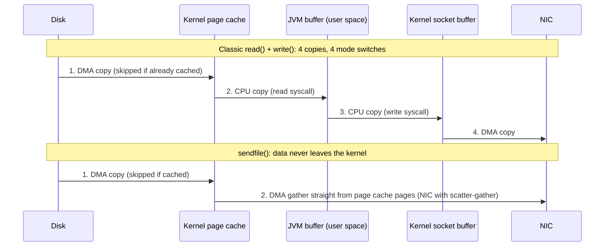

# Under the Hood: How Does Kafka Push Millions of Messages a Second Through Ordinary Disks? (sequential I/O, page cache, zero-copy)

## 1. The hook

In 2014 Jay Kreps (one of Kafka's creators) published a benchmark titled *"2 Million Writes Per Second (On Three Cheap Machines)"*: three ordinary servers with spinning hard disks, data replicated 3 times. A spinning disk can do about **100 random operations per second** (arithmetic in §2). So how do two million messages a second land on disks that can only "jump" a hundred times a second, and then get read back by many consumers?

Kafka doesn't have one secret trick. It has five boring ones that multiply: **append-only writes, the OS page cache, zero-copy sends, batching with compression, and partitions.** Each removes one kind of waste. This page goes through them with numbers, then measures three of them on this machine.

💡 **Kafka in one line:** a distributed, append-only log. Producers append messages to a **partition** (one ordered log file sequence), consumers read it by **offset** (position number). Full intro: [Kafka](../HLD/technologies/kafka.md).

---

## 2. Life before it

### Messaging systems built on trees and per-consumer queues
Brokers of the 2000s (JMS brokers such as ActiveMQ) usually kept a **queue per consumer** plus a B-tree-style index (a sorted tree stored in disk pages, see [B-tree](b-tree.md)) to track which message is where and who acknowledged it. Every send, ack and delete updated the structure in place: small writes **at random positions** on disk. When data no longer fit in RAM, throughput collapsed.

### Why random positions are the enemy (hard disk arithmetic)
💡 **Seek:** a hard disk (HDD) has a mechanical arm; to read a different place it must move the arm (seek, ~4–9 ms) and then wait for the platter to spin the right sector under it (**rotational latency**). **IOPS:** I/O operations per second.

```text
7,200 rpm disk: one rotation = 60,000 ms ÷ 7,200 = 8.33 ms → wait half a turn on average ≈ 4.2 ms
random I/O ≈ seek ~6 ms + rotation ~4 ms ≈ 10 ms → 1,000 ms ÷ 10 ms ≈ 100 IOPS
100 IOPS × 4 KB per I/O = 400 KB/s of random writes
the same disk writing sequentially: ~150–200 MB/s (no arm movement at all)
150 MB/s ÷ 0.4 MB/s ≈ 375× faster just by not jumping around
```

Kafka's design docs quote an even starker measurement: six 7,200 rpm SATA disks in RAID-5 did **~600 MB/s linear writes but ~100 KB/s random writes, a gap of over 6,000×**.

### The JVM-cache instinct
The other instinct of the time: "disks are slow, so keep messages in a big in-memory cache inside the process". In Java that means millions of objects on the **heap** (the memory the JVM manages for your objects), which brings **garbage collection (GC)** pauses (the JVM stopping or slowing your threads to find and free unused objects; see [references and GC](../LLD/libraries/java/references-and-gc.md)), and object headers that can double the memory per message.

Kafka was built at LinkedIn around 2010 and described in the **NetDB 2011** paper *Kafka: a Distributed Messaging System for Log Processing* (Kreps, Narkhede, Rao). It became an Apache top-level project in 2012.

---

## 3. The clever idea

**Treat the disk as a tape and the OS as the cache:** only ever append to the end of files, let the operating system's page cache hold the hot data, keep messages in one binary format from producer to disk to consumer so the broker never has to touch them, and hand file bytes to the network with `sendfile` so they never enter the JVM at all.

---

## 4. Step by step

### 4.1 Trick 1: append-only, sequential writes
A partition is a folder of **segment files** (e.g. 1 GB each, see [log segments](../HLD/concepts/log-segments-retention-and-compaction.md)). A write is always "append these bytes to the end of the active segment". No updates in place, no index rebalancing, no deletes per message (old segments are dropped whole). Reads are "start at offset X and read forward", also sequential.

```text
1M messages/s × 100 bytes = 100 MB/s of appends    → fits one HDD's sequential bandwidth
as random 1-message writes: 1M IOPS needed          → ~10,000 HDDs at 100 IOPS each
```

Does this still matter on **SSDs** (flash disks, no moving parts)? Less, but yes. Flash can't overwrite a page in place: it writes to fresh pages and later erases whole **erase blocks** (often a few MB) in the background, a job done by the drive's firmware (the **FTL**, flash translation layer). Small random writes scatter live data across many blocks, so the drive copies more data internally (**write amplification**), wears faster, and its latency gets spikier. Big sequential writes fill and free blocks cleanly. The OS also helps sequential patterns: **read-ahead** (fetching the next pages before you ask) and **write-behind** (merging many small writes into a few large ones).

### 4.2 Trick 2: the OS page cache instead of a heap cache
💡 **Page cache:** RAM the Linux kernel uses to keep recently read or written file data, in 4 KB **pages**. A `write()` normally just copies into the page cache and returns ("dirty" page); kernel **flusher threads** write dirty pages to disk later. A `read()` of cached data never touches the disk.

Kafka writes every message to the file system right away, but **does not wait for it to reach the disk**. Readers that are near the end of the log (the normal case) are served from pages that were written seconds ago and are still in RAM.

```text
Broker with 64 GB RAM, JVM heap -Xmx6g (the docs' example setting):
  ~55+ GB left for the page cache, with no GC cost at all
  writes of 100 MB/s × 30 s (the docs' rule-of-thumb buffer) = 3 GB of hot tail per broker
  → consumers that are less than a few minutes behind never cause a disk read
```

Why not cache inside the JVM too? Data would sit in **both** places (double caching: once in the page cache, once on the heap), as Java objects that are bigger than the raw bytes and need GC. The page cache also **survives a broker restart** (the process dies, the kernel keeps the pages), while a heap cache starts cold. The design docs' summary: up to **28–30 GB of cache on a 32 GB machine without GC penalties**.

### 4.3 Trick 3: zero-copy with `sendfile`
💡 **System call (syscall):** your program asking the kernel to do something (`read`, `write`). **Context switch** (here, strictly a *mode switch*): the CPU switching from your program to kernel code and back, which costs time and flushes some CPU caches. **DMA (direct memory access):** hardware (disk controller, network card) copying data to/from RAM by itself, without the CPU. **NIC:** the network interface card. **Socket buffer:** kernel memory holding bytes waiting to be sent on a connection.

The classic way to send a file to a consumer:

```java
while ((n = file.read(buf)) > 0) socket.write(buf, 0, n);   // read into the JVM, write back out
```



| | read + write loop | `sendfile` (`FileChannel.transferTo`) |
|---|---|---|
| Syscalls per chunk | 2 (`read`, `write`) | 1 (`sendfile`, and one call can move a whole segment) |
| User/kernel mode switches | 4 | 2 |
| Copies by the CPU | 2 (page cache → JVM, JVM → socket) | 0 with a scatter-gather NIC (only page pointers go into the socket buffer); 1 without |
| Copies by DMA | 2 | 2 |
| Data in the JVM heap | yes, every byte, for every consumer | never |

💡 **Scatter-gather:** a NIC feature that lets the card collect one packet from several separate memory areas, so the kernel can point it at page cache pages instead of copying them into a contiguous buffer first.

In Java, `FileChannel.transferTo(position, count, socketChannel)` (since Java 1.4, 2002) becomes `sendfile` on Linux; Kafka's consumer fetch path uses it. With 5 consumer groups reading the same partition, the bytes are read from disk **once** into the page cache, and each group's fetch is a `sendfile` from those same pages. One extra Java detail: reading into a **heap** `ByteBuffer` costs one *more* copy, because the JDK reads into a temporary off-heap buffer first and then copies into your array.

### 4.4 Trick 4: batching and compression, end to end
💡 **Batching:** grouping many messages into one request/write so fixed per-operation costs (a syscall, a network round trip, a disk I/O, a header) are paid once per batch instead of once per message. **Compression codecs:** gzip, Snappy, LZ4, zstd, algorithms trading CPU time for smaller bytes.

1. **Producer** collects messages per partition into a **record batch** (`batch.size`, default 16 KB; `linger.ms` waits a few ms for the batch to fill) and compresses the **whole batch**. Compressing 500 similar JSON events together finds the repeated field names; compressing each alone barely helps.
2. **Broker** checks the batch (CRC, record count; it may decompress to validate) and **appends the compressed bytes as they arrived**.
3. **Consumer** fetches the same compressed batch (via `sendfile`, untouched) and decompresses it.

```text
1M msgs/s × 100 B = 100 MB/s raw → ~4× compression (typical for logs/JSON, varies) → 25 MB/s
  on the producer's network, on the broker's disk, on replication traffic and on every consumer's network
one 16 KB batch ≈ 160 messages → 1M msgs/s ≈ 6,250 produce requests/s instead of 1,000,000
```

### 4.5 Trick 5: one binary format, and partitions for parallelism
The record batch has a fixed binary layout shared by producer, broker log and consumer: a header (base offset, length, CRC-32C checksum, compression type, producer id, base timestamp), then records whose offset and timestamp are stored as small **deltas** from the header in **varints** (variable-length integers: small numbers take 1 byte instead of 8). Because disk format = network format, the broker never parses or rewrites messages on the read path, which is what makes `sendfile` possible. 💡 **CRC:** a checksum used to detect corrupted bytes.

**Partitions** turn one log into many independent logs spread across brokers and disks. Each partition is sequential on its own; consumers in a group read different partitions in parallel ([Kafka §3.1](../HLD/technologies/kafka.md)). Throughput scales by adding partitions and brokers rather than by making one log faster.

---

## 5. Where you've already used it

| You've seen | Same trick |
|---|---|
| `free -m` showing most RAM as `buff/cache` on a Kafka or database host | the page cache holding hot file data; "used" memory that's really a cache |
| Logback/Log4j2 `AsyncAppender` or a `BufferedWriter` | batching many small writes into one syscall ([logging libs](../LLD/libraries/java/slf4j-logback-and-log4j2.md)) |
| Nginx `sendfile on;`, Netflix Open Connect serving video | `sendfile` from page cache to socket ([Netflix case study](../case-studies/netflix-open-connect-and-chaos-engineering.md)) |
| Postgres WAL, MySQL redo log, etcd/Raft logs | the same "append sequentially, update the slow structure later" idea ([file I/O and fsync](../LLD/libraries/java/file-io-and-fsync.md)) |
| LSM-tree databases (Cassandra, RocksDB) | turning random writes into sequential ones ([LSM trees](../HLD/concepts/lsm-trees-and-storage-engines.md)) |
| Prometheus `remote_write` / OpenTelemetry exporters batching with gzip/snappy | batch-then-compress over the network |

---

## 6. Limits and trade-offs

- **TLS kills zero-copy (mostly).** 💡 **TLS:** the encryption behind HTTPS ([TLS and mTLS](../HLD/concepts/tls-and-mtls.md)). Encryption happens in user space (the JVM's SSL engine), so the broker must read bytes into the JVM, encrypt, and write them out again: back to the copy loop, plus encryption CPU. Kafka's docs say plainly that `sendfile` is **not used when SSL is enabled**. **Kernel TLS (kTLS)** (Linux 4.13, 2017) lets the kernel, or even the NIC, do the encryption so `sendfile` works again; Netflix uses it on FreeBSD. Kafka's docs state it does not support in-kernel TLS sendfile.
- **Lagging consumers read cold data.** A consumer replaying yesterday's data misses the page cache, hits the disk, and pulls old pages *into* the cache, evicting the hot tail that up-to-date consumers and followers rely on. One backfill job can raise everyone's latency. Mitigations: separate clusters or brokers for replays, quotas, tiered storage for old data.
- **Durability comes from replication, not fsync.** 💡 **fsync:** a syscall that blocks until a file's dirty pages are really on disk ([file I/O and fsync](../LLD/libraries/java/file-io-and-fsync.md)). By default Kafka **never calls fsync per message**; the docs recommend leaving it to the OS, because replicas on other machines (`acks=all`, `min.insync.replicas=2`) are a stronger guarantee than one local disk, and fsync per write "can reduce performance by two to three orders of magnitude". The catch: if all in-sync replicas lose power at the same moment, unflushed data is gone. Racks/zones for replicas are part of the durability story.
- **Small messages and no batching waste it all.** `linger.ms=0` with a slow trickle, or `acks=all` with one message per request, means one request, one header, one log append per message. Per-message overhead (a 61-byte batch header, a few bytes of varint fields per record, request headers, syscalls) dominates 50-byte payloads when each batch holds one message. Batching trades a few ms of latency for throughput.
- **Too many partitions per disk turn sequential into random.** 1,000 partitions appending to the same disk are 1,000 interleaved write positions. The page cache and write-behind smooth it, but more partitions also mean more open files, more memory and slower leader elections.
- **Compression costs CPU** on producers and consumers, and the broker must recompress if the topic's `compression.type` differs from the producer's.

---

## 7. Try it

**Run the demo** in [`code/KafkaSpeedDemo.java`](code/KafkaSpeedDemo.java) (Java 21, no dependencies, ~9 s, uses up to ~250 MB in a temp dir that it deletes):

```sh
cd under-the-hood/code
java KafkaSpeedDemo.java
```

Real output (Java 21, Linux, 4 vCPUs, ext4 on a virtual disk in a cloud VM, 16 GB RAM; one of three runs):

```text
(a) 1 KB records: sequential append vs random offsets (write = into page cache, fsync = to disk)
  50,000 records, one fsync at the end:
    sequential: write    81 ms + fsync    58 ms =   139 ms
    random    : write   453 ms + fsync   605 ms =  1058 ms  (7.6x slower)
   2,000 records, fsync after EVERY write:
    sequential: write     7 ms + fsync   346 ms =   353 ms
    random    : write    22 ms + fsync   613 ms =   635 ms  (1.8x slower)

(b) send a 64 MB file to a local socket, 10 times each (file is in the page cache)
  read+write via heap buffer :   395 ms wall ( 1620 MB/s), sender thread CPU   379 ms
  transferTo (sendfile)      :   343 ms wall ( 1866 MB/s), sender thread CPU   297 ms

(c) 100,000 messages of 100 bytes written to a file (page cache, no fsync)
  one write() per message:   90 ms (100,000 syscalls)
  64 KB batches         :    6 ms (153 syscalls)
```

Across three runs: (a) random was **7.6–14×** slower with one fsync and **1.3–1.8×** with fsync per write; (b) `transferTo` was **8–13% faster** in wall time and used **15–40% less sender CPU**; (c) batching was **12–16×** faster.

How to read it honestly:
- **(a) is not the HDD's 375×.** This is a virtual disk backed by flash, and the page cache absorbs the writes. The random case still loses because each 1 KB write lands on its own 4 KB page: 50,000 pages to create and flush (~200 MB) instead of 12,500 (~50 MB), scattered instead of contiguous. With fsync after *every* write, both sides pay the same per-flush latency (~0.2–0.3 ms each here), which hides the pattern: this is exactly why Kafka avoids per-message fsync.
- **(b) is smaller than textbooks** because this is **loopback**: there is no NIC, the receiving side still copies every byte, and the kernel often runs the receiver's network processing on the sender's CPU. The copy we removed is one of several. On a real network, with many consumers per broker, the saved CPU copy matters more. `strace -c -f` on this demo counted **12 `sendfile` calls** for 12 sends of the 64 MB file (2 warm-ups + 10 timed), versus thousands of `read`/`write` pairs for the loop.
- **(c) is pure syscall overhead:** ~0.6–0.9 µs per syscall × 100,000. The bytes written are identical.

Things to try: set `mb = 512` in part (b) and drop caches first (`sync; echo 3 > /proc/sys/vm/drop_caches`, needs root) to see cold reads; change `slots` in part (a) to `n` (dense file) and watch the gap shrink; run with `strace -c -f java KafkaSpeedDemo.java` to count syscalls yourself.

**On a real Kafka host:** `free -m` (look at `buff/cache`), `vmstat 1` (`bi` = blocks read from disk; near 0 means consumers are served from cache), and the bundled `kafka-producer-perf-test.sh --num-records 1000000 --record-size 100 --throughput -1 --producer-props bootstrap.servers=localhost:9092 batch.size=65536 linger.ms=10 compression.type=lz4` vs `linger.ms=0 batch.size=0` (not run here: no Kafka in this environment).

---

## 8. Where it shows up in this repo

- [Distributed Message Queue](../HLD/interviews/distributed-message-queue/README.md): the interview this page belongs to; [L5-senior.md](../HLD/interviews/distributed-message-queue/L5-senior.md) §3.5 "Where the throughput comes from" is the interview version of this page.
- [Kafka](../HLD/technologies/kafka.md) §3.2 "Why it's fast": the short version.
- [Log segments, retention and compaction](../HLD/concepts/log-segments-retention-and-compaction.md): how the append-only files are split, indexed and deleted.
- [B-tree](b-tree.md): the random-I/O structure Kafka chose not to build on; [LSM trees](../HLD/concepts/lsm-trees-and-storage-engines.md): another way to make writes sequential.
- [epoll](epoll.md): Kafka's network layer is Java NIO selectors, i.e. epoll; zero-copy saves the bytes, epoll saves the threads.
- [File I/O and fsync in Java](../LLD/libraries/java/file-io-and-fsync.md): `FileChannel`, `force()`, page cache vs disk.
- [Back-of-the-envelope](../HLD/concepts/back-of-the-envelope.md): disk and network numbers to use in estimates.

## 9. Sources

- J. Kreps, N. Narkhede, J. Rao, *Kafka: a Distributed Messaging System for Log Processing*, NetDB workshop 2011.
- J. Kreps, *Benchmarking Apache Kafka: 2 Million Writes Per Second (On Three Cheap Machines)*, LinkedIn Engineering blog, April 2014 (3 producers, 3× async replication). 🟡 Exact per-test numbers not re-checked here; the headline figure is.
- J. Kreps, *The Log: What every software engineer should know about real-time data's unifying abstraction*, LinkedIn Engineering, 2013.
- Apache Kafka documentation, *Design* §"Persistence" ("Don't fear the filesystem": 600 MB/s vs 100 KB/s, 6,000×; 28–30 GB cache on 32 GB) and §"Efficiency" (four copies and two system calls, `sendfile` not used with SSL, end-to-end batch compression); *Operations: Hardware and OS* (`-Xmx6g` example, 30 s buffer rule, "disable application fsync entirely"); *Implementation: Message format* (record batch v2, CRC-32C, varints; introduced in Kafka 0.11, 2017). Read from the docs source in the apache/kafka repository, 2026.
- S. K. Palaniappan, P. B. Nagaraja, *Efficient data transfer through zero copy*, IBM developerWorks, 2008 (copy and context-switch counts, `transferTo`).
- Linux man page `sendfile(2)`; kernel TLS documentation (TX added in Linux 4.13, 2017).
- 🟡 HDD seek/rotation figures are typical spec-sheet values, not measured here; the "~4× compression" figure is illustrative and varies with data.
- The demo output was produced by running it in this environment (Java 21).

⬅️ [Under the Hood index](README.md) · 🏠 [Home](../README.md)
