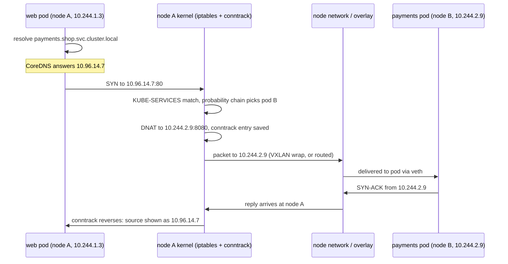

# Under the Hood: How Does a Request Reach Your Pod? (Kubernetes Networking)

## 1. The hook

In Kubernetes, pods die and are reborn with new IP addresses all day, yet `curl http://payments` from another pod just works, and traffic is spread across whichever pods are alive right now. There is no load balancer process you can point to. So who is actually forwarding the packet, and where is the "payments" address even stored?

💡 **Pod:** the smallest unit Kubernetes runs: one or more containers that share one network identity. See [containers-namespaces-cgroups.md](containers-namespaces-cgroups.md) for how that sharing works.
💡 **Node:** a machine (VM or server) that runs pods. The [scheduler](kubernetes-scheduler.md) picks which one.
💡 **Packet / NAT:** Network Address Translation rewrites the addresses in a packet's header on the fly, like a receptionist who forwards calls for "sales" to whoever is on shift.

---

## 2. Life before it

- **Docker's default (2013 onwards)** gave each container a private IP behind a per-host NAT bridge. Two containers on different hosts could not talk by IP without port-mapping tricks (`-p 8080:80`), and apps had to learn "the host's IP and my mapped port".
- **Kubernetes (open sourced by Google, 2014)** declared a simpler rule, the **flat network model**: every pod gets its own IP, every pod can reach every other pod's IP **without NAT**, and nodes can reach all pods. The model is simple; making a real network behave that way is the job of a plug-in.
- But pod IPs change on every restart, so you cannot hard-code them. That needs a stable name and address on top: the **Service**.

---

## 3. The clever idea

Give each group of pods a **virtual IP** (the ClusterIP) that belongs to no machine. Every node's kernel is programmed with rules that say "a packet to that virtual IP: rewrite its destination to one of the current pod IPs." The load balancer is not a box on the path; it is a **table in the kernel of the sender's own node**.

💡 **Analogy:** instead of one central switchboard, every office gets the same copy of the phone directory, and each caller looks up "payments" and dials a real extension directly.

---

## 4. Step by step

### 4.1 Pod IPs: the CNI plug-in

When a pod starts, the node's **kubelet** (the node agent) calls a **CNI plug-in** (Container Network Interface, a small standard from CoreOS/CNCF, ~2015-2016) which creates a virtual cable (a **veth pair**) from the pod's network namespace to the node, assigns an IP from the node's slice of the cluster range (e.g. node A gets `10.244.1.0/24`), and sets up routes. 🟡 Exact details differ per plug-in.

How a packet gets from node A to a pod on node B depends on the plug-in:

| Approach | How | Example plug-ins (🟡 behaviour varies by mode) | Trade-off |
|---|---|---|---|
| **Overlay** | Wrap the pod packet in an outer packet addressed node-to-node (e.g. VXLAN: a UDP tunnel). | Flannel (VXLAN mode), Calico (VXLAN/IP-in-IP mode), Cilium (tunnel mode) | Works on any network; adds a few dozen bytes of header (smaller MTU) and some CPU. |
| **Routed** | Tell the network that `10.244.2.0/24` lives at node B, using BGP or static routes. No wrapping. | Calico (BGP mode), cloud VPC-native CNIs (AWS VPC CNI gives pods real VPC IPs) | Faster and easier to debug; needs the network to cooperate. |
| **eBPF dataplane** | Programs loaded into the kernel handle forwarding and policy. | Cilium | Fewer layers, see 4.4. |

### 4.2 Services, ClusterIP and EndpointSlices

You create a Service named `payments` in namespace `shop`:

- Kubernetes allocates a **ClusterIP**, say `10.96.14.7`. No interface owns it.
- A controller watches pods matching the Service's label selector (only **Ready** ones) and keeps an **EndpointSlice** object: the current list of pod IP:port pairs (up to 100 per slice by default).
- On every node, **kube-proxy** (or a replacement) watches the API server and turns this into kernel rules.

Same idea as [service discovery](../HLD/concepts/service-discovery.md) with a registry: pods register (via readiness), the registry is the API server's data, and clients resolve through DNS plus the virtual IP.

### 4.3 DNS: CoreDNS

Apps use names, not `10.96.14.7`. **CoreDNS** (a cluster add-on, default since Kubernetes 1.13, 2018) answers:

```
payments.shop.svc.cluster.local  ->  10.96.14.7
   |       |    |      |
 service  ns  "svc"  cluster domain
```

Each pod's `/etc/resolv.conf` has `search shop.svc.cluster.local svc.cluster.local cluster.local` and `ndots:5`, so a short name `payments` is tried against those suffixes. A gotcha: `ndots:5` means an external name such as `api.example.com` (2 dots, fewer than 5) is first tried with each cluster suffix, producing several wasted failed lookups. Appending a trailing dot (`api.example.com.`) avoids it. General DNS background: [dns.md](../HLD/technologies/dns.md).

### 4.4 kube-proxy: turning the virtual IP into a pod IP

**iptables mode** (the long-time default): kube-proxy writes **NAT rules** into the kernel's iptables firewall tables. Conceptually:

```
KUBE-SERVICES:   dst 10.96.14.7:80  -> jump KUBE-SVC-PAYMENTS
KUBE-SVC-PAYMENTS (3 pods):
   33.3% probability -> KUBE-SEP-A  (DNAT to 10.244.1.5:8080)
   50.0% probability -> KUBE-SEP-B  (DNAT to 10.244.2.9:8080)
   otherwise         -> KUBE-SEP-C  (DNAT to 10.244.3.2:8080)
```

The probabilities are `1/3`, then `1/2` of the remaining, then the rest: the chain gives each pod an equal share without any counter. **DNAT** (destination NAT) rewrites the destination address in the packet header.

**IPVS mode** (stable since 1.11, 2018): uses the kernel's L4 load balancer (IP Virtual Server) with hash tables instead of long rule lists, and offers algorithms like least-connections.

**eBPF** (Cilium and others): load balancing runs in small verified programs inside the kernel, looked up in hash maps, and it can do the rewrite at the socket's `connect()` call so the packet never needs NAT at all. Cilium can fully replace kube-proxy.

### 4.5 conntrack: remembering the rewrite

The reply from the pod comes from `10.244.2.9`, but the client called `10.96.14.7`. The kernel's **conntrack** (connection tracking) table remembers "this flow was rewritten to B", so the reply's source is translated back and later packets of the same connection go to the **same** pod. The decision is made **once per connection**, not per packet. Implications: a long-lived connection (gRPC over HTTP/2, see [http-1-2-3.md](http-1-2-3.md)) sticks to one pod forever, so Kubernetes' built-in balancing is *per connection*, not per request. That is a main reason for [service meshes](../HLD/technologies/service-mesh-and-envoy.md) and client-side balancing. The conntrack table also has a size limit (`nf_conntrack_max`); when full, packets are dropped (`nf_conntrack: table full, dropping packet` in dmesg), a classic production incident under heavy short-lived connections ([tcp.md](tcp.md) explains why those pile up).

### 4.6 Worked example: pod `web` calls `payments`



The TCP handshake from [tcp.md](tcp.md) is the same as ever; the pod simply never knows it was rewritten.

### 4.7 From outside the cluster

| Type | What it does | Notes |
|---|---|---|
| **ClusterIP** | Virtual IP, reachable only inside the cluster | Default |
| **NodePort** | Opens the same port (30000-32767) on **every** node, forwarding to the Service | Crude; clients must know node IPs |
| **LoadBalancer** | Asks the cloud to create an external [load balancer](../HLD/technologies/load-balancer.md) pointing at the NodePorts | One cloud LB per Service costs money |
| **Ingress** | One L7 HTTP entry point (e.g. NGINX, Envoy-based) routing by host and path to many Services | Needs an ingress controller installed |
| **Gateway API** | Newer, richer successor to Ingress (role-split resources: Gateway, HTTPRoute); GA in 2023 🟡 | Supports more protocols and traffic splitting |

With `externalTrafficPolicy: Local` the client's source IP is kept and the extra hop to another node is avoided, at the cost of uneven balancing.

---

## 5. Where you have used it without knowing

- Every `http://service-name` URL in a Spring Boot config on Kubernetes.
- `Connection refused` right after a deploy: the pod was not yet Ready, so it was not in the EndpointSlice.
- "Only one of my 5 gRPC servers gets traffic": conntrack stickiness from 4.5.
- Slow DNS lookups inside pods: the `ndots:5` gotcha.

---

## 6. Limits and trade-offs

- **iptables rules are a linked list.** Matching a packet walks rules one by one: **O(n)** in the number of Services. Updates rewrite the whole table. Reports from large clusters (🟡 order of magnitude only) show that with several thousand Services (tens of thousands of rules) updates take seconds to minutes and per-packet latency grows. This drove IPVS (hash lookup, O(1)) and eBPF (hash maps, incremental updates).
- **Per-connection balancing** only (see 4.5).
- **Overlay costs:** reduced MTU, extra CPU, harder packet captures.
- **conntrack table** limits and the 5-second DNS timeout bug seen with UDP DNS races (🟡 older kernels).
- **Network policies** (who may talk to whom) are enforced by the CNI; not every plug-in supports them.

---

## 7. Try it

This sandbox has no Kubernetes cluster and no `kubectl`. The only thing I could run was the host's NAT table, which is empty because nothing here programs it:

```bash
$ iptables -t nat -L -n | head -8
Chain PREROUTING (policy ACCEPT)
target     prot opt source               destination         

Chain INPUT (policy ACCEPT)
target     prot opt source               destination         

Chain OUTPUT (policy ACCEPT)
target     prot opt source               destination
```

On a node of a real cluster this table contains the chains `KUBE-SERVICES`, `KUBE-NODEPORTS`, `KUBE-SVC-*` and `KUBE-SEP-*`. The sandbox did report `net.netfilter.nf_conntrack_max = 262144`, which is the conntrack ceiling from 4.5.

Commands to run on a real cluster (e.g. kind or minikube), shown without output:

```bash
kubectl get svc,endpointslices -n shop            # the VIP and the pod IPs behind it
kubectl get pods -o wide -n shop                  # pod IPs and their nodes
kubectl exec -it <pod> -- cat /etc/resolv.conf    # search domains and ndots:5
kubectl exec -it <pod> -- nslookup payments.shop.svc.cluster.local
# on a node (kind: docker exec -it <node> bash):
iptables -t nat -L KUBE-SERVICES -n | head
iptables -t nat -L KUBE-SVC-<hash> -n             # the probability chain
conntrack -L | grep 10.96.14.7                    # the remembered rewrite
kubectl -n kube-system get cm kube-proxy -o yaml | grep mode   # iptables / ipvs
```

Things to try: scale the Deployment from 3 to 5 and re-run `iptables -t nat -L KUBE-SVC-<hash>`; watch the chain gain two entries and the probabilities change to 1/5, 1/4, 1/3, 1/2, rest.

---

## 8. Where it shows up

- [kubernetes-scheduler.md](kubernetes-scheduler.md): decides which node a pod lands on, and so which CNI slice its IP comes from.
- [containers-namespaces-cgroups.md](containers-namespaces-cgroups.md): the network namespace the veth pair plugs into.
- [service-mesh-and-envoy.md](../HLD/technologies/service-mesh-and-envoy.md): per-request balancing that fixes the per-connection limit.
- [load-balancer.md](../HLD/technologies/load-balancer.md): the cloud LB behind `type: LoadBalancer`.
- [dns.md](../HLD/technologies/dns.md) and [service-discovery.md](../HLD/concepts/service-discovery.md): CoreDNS is service discovery.
- [tcp.md](tcp.md), [http-1-2-3.md](http-1-2-3.md): what rides on top.

---

## 9. Sources

- Kubernetes documentation: "Cluster Networking", "Service", "EndpointSlices", "DNS for Services and Pods", "Virtual IPs and Service Proxies".
- Kubernetes blog, "Kubernetes 1.11: In-Cluster Load Balancing and CoreDNS Plugin Graduate to General Availability" (2018) (IPVS GA).
- CNI specification, CNCF (spec 0.x from 2015-2016, 1.0 in 2021).
- Gateway API project documentation, GA release v1.0 (2023).
- Cilium documentation, "Kubernetes without kube-proxy".
- RFC 7348, VXLAN (2014).
- Haibin Michael Xie et al., "Scaling Kubernetes Service Proxying", KubeCon talks on iptables vs IPVS (2017-2018, 🟡 exact figures not checked).
- Unverified (🟡): per-plug-in default modes, rule-count thresholds, and the DNS race bug scope.
