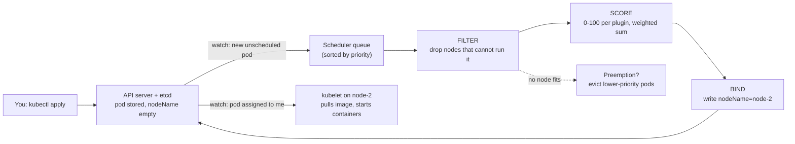

# Under the Hood: How Does Kubernetes Pick a Node for Your Pod? (filter, score, bind)

## 1. The hook

You run `kubectl apply -f deploy.yaml` with 20 replicas. A few seconds later, 20 pods are running, spread over a 50-node cluster, none of them on a node that is out of memory, the database pods on SSD nodes, and the three replicas of one service in three different zones. Nobody told Kubernetes which node to use. **Who decided, and how, in milliseconds, with thousands of pods and hundreds of nodes?**

💡 **Kubernetes (k8s) in one line:** a system that runs your containers on a fleet of machines and keeps them running. A **pod** is the smallest unit it schedules: one or more containers that always run together on one machine. A **node** is one machine (VM or physical) in the cluster.

---

## 2. Life before it

### Humans with spreadsheets
Before cluster schedulers, "which server runs which service" was a spreadsheet or a Chef/Puppet role per host. A host dies at 3 a.m. and the on-call engineer moves services by hand. Utilisation was poor: every service got its own machines "to be safe", so fleets ran at **~10-30% CPU** (an often-quoted figure from Google's papers, 🟡 exact numbers vary by paper).

### Borg, Omega, Kubernetes
Google ran into this first and built **Borg** (internal, from about 2003-2004; described publicly in the **EuroSys 2015** paper *Large-scale cluster management at Google with Borg*). Borg mixed batch and serving jobs on the same machines and used a two-step scheduler: **feasibility checking** (which machines *can* run it) then **scoring** (which is *best*). Kubernetes (open-sourced 2014, v1.0 in 2015) inherited exactly that idea. Its scheduler was later rebuilt as a plug-in pipeline, the **scheduling framework** (alpha in 1.15, 2019; stable around 1.19, 2020, 🟡 exact versions).

If you have read [distributed job scheduler](../HLD/interviews/distributed-job-scheduler/README.md): that problem is "run this at 9:00". This one is "where does this run?". Different question, same family.

---

## 3. The clever idea

**Make placement a two-phase funnel on a queue of unscheduled pods:** first *filter* away every node that cannot legally run the pod (hard rules), then *score* the survivors (soft preferences) and pick the best, then write one field (`spec.nodeName`) to say "this pod goes there". The scheduler never starts anything itself; the node's agent (the **kubelet**) sees the field and does the work.

---

## 4. Step by step



### 4.1 The watch loop
💡 **Watch:** instead of polling, a client opens a long-lived HTTP stream to the **API server** (the front door of the cluster; it stores everything in **etcd**, a consistent key-value store) and gets an event whenever an object changes. The same trick as a config-change subscription, or a Kafka consumer tailing a topic.

The scheduler watches for pods whose `spec.nodeName` is empty and puts them in a **priority queue** (high-priority pods first). It takes one pod at a time ("scheduling cycle"). Placement decisions are therefore **serial**: one scheduler instance, one pod after another. That is a deliberate simplification (no two decisions race over the same free memory); Kubernetes clusters of several thousand nodes schedule on the order of **100 pods/s** (🟡 SIG-scalability targets, varies by version).

### 4.2 Filter: hard rules (a node either passes or is dropped)
| Rule | Plain meaning | Example |
|---|---|---|
| **Resources** | Sum of `requests` of pods already there + this pod's request must fit in the node's **allocatable** | needs 2 CPU, node has 1.5 left: out |
| **Taints / tolerations** | A node can say "keep out unless you tolerate me" | GPU nodes tainted `gpu=true:NoSchedule`; only GPU pods carry the toleration |
| **Node selector / node affinity** | Pod asks for nodes with a label | `disktype=ssd`, `zone in (a, b)` |
| **Pod affinity / anti-affinity** | Pod wants to be near (or away from) other pods | "never two `payments` replicas on one node" |
| **Topology spread constraints** | Keep counts of matching pods even across zones/nodes | max skew 1 between zones |
| **Ports, volumes** | Host port already taken; volume lives in another zone | PVC bound in `zone-b`: only zone-b nodes |

💡 **Allocatable:** node capacity minus what is reserved for the OS and kubelet (e.g. a 4-CPU / 16 GiB node may advertise ~3.9 CPU / ~14.5 GiB). **Request:** the amount a pod *declares* it needs; the scheduler reserves this much. **Limit:** the cap enforced at runtime, see [containers under the hood](containers-namespaces-cgroups.md).

### 4.3 Score: soft preferences (rank the survivors)
Each scoring plugin gives each node 0-100; scores are multiplied by plugin weights and summed. Common plugins:
- **NodeResourcesFit** with a strategy: `LeastAllocated` (default: prefer emptier nodes, spreads load), `MostAllocated` (prefer fuller nodes, **bin-packs**), `RequestedToCapacityRatio` (custom curve).
- **NodeResourcesBalancedAllocation**: prefer nodes where CPU% and memory% used end up close to each other (avoids a node with CPU full and memory empty: wasted).
- **ImageLocality**: prefer nodes that already have the container image (saves a pull of maybe 500 MB).
- **InterPodAffinity / NodeAffinity / TaintToleration / PodTopologySpread** in their *preferred* (soft) forms.

On big clusters the scheduler does not score all nodes: it stops after finding enough feasible ones (`percentageOfNodesToScore`, defaulting to an adaptive 5-50%; in a 5,000-node cluster that is ~10% = 500 nodes) because "best of 500" is nearly as good as "best of 5,000" and far cheaper.

### 4.4 Worked example: 3 nodes, one pod
New pod requests **CPU 1000m (= 1 core), memory 2 GiB**. State (allocatable 4 CPU / 8 GiB each):

| Node | CPU already requested | Mem already requested | Tainted? | Fits? |
|---|---|---|---|---|
| node-1 | 3.5 | 4 GiB | no | 3.5 + 1 = 4.5 > 4: **filtered out** |
| node-2 | 1.0 | 2 GiB | no | 2.0 ≤ 4, 4 ≤ 8: fits |
| node-3 | 2.0 | 6 GiB | no | 3.0 ≤ 4, 8 ≤ 8: fits (exactly) |

`LeastAllocated` score = average of free fractions after placement, ×100:
```text
node-2: CPU free = (4 - 2.0)/4 = 50%   mem free = (8 - 4)/8 = 50%   → (50 + 50)/2 = 50
node-3: CPU free = (4 - 3.0)/4 = 25%   mem free = (8 - 8)/8 =  0%   → (25 +  0)/2 = 12.5
BalancedAllocation: node-2 CPU 50% vs mem 50% used → diff 0 → high; node-3 75% vs 100% → diff 25 pts → lower
```
**node-2 wins** and the scheduler writes `nodeName: node-2`. With `MostAllocated` node-3 would win (fuller), which is what you want when you want to **empty out nodes so an autoscaler can remove them**.

### 4.5 Bind, then the kubelet takes over
Binding is one API write (a `Binding` object). The scheduler first **assumes** the pod is on node-2 in its own in-memory cache, so the next pod's decision already sees that capacity as used, then binds asynchronously. If the bind fails, the assumption is rolled back.

### 4.6 Preemption: no node fits
If filter leaves zero nodes and the pod has a **PriorityClass** (a named integer, e.g. `critical=1000000`), the scheduler looks for a node where evicting *lower-priority* pods would make room, picks the one that harms the least (fewest victims, lowest priorities), marks the pod `nominatedNodeName`, and deletes the victims (they get their **grace period**, 30 s by default). Same logic as an on-call engineer killing a batch job to make room for a payment service.

### 4.7 The scheduling framework: plugins at extension points
Each phase is a list of **plugins** called at named hooks: `QueueSort` -> `PreFilter` -> `Filter` -> `PostFilter` (this is where preemption lives) -> `PreScore` -> `Score` -> `Reserve` -> `Permit` -> `PreBind` -> `Bind` -> `PostBind`. You can add your own (batch "gang" scheduling, GPU topology) or run a **second scheduler** and choose per pod with `schedulerName`. Think of it as middleware in a servlet filter chain.

---

## 5. Where you have used it without knowing

- Every `kubectl scale` or rolling update, every **HPA** (horizontal pod autoscaler) scale-up, every CronJob run.
- **Cluster Autoscaler / Karpenter**: they react to pods stuck "Pending, unschedulable" by adding nodes. The scheduler's failure is their trigger.
- The same two-phase "eligible set, then rank" design appears in load balancers ([least-connections picks among healthy backends](../HLD/technologies/load-balancer.md)) and in [scheduling algorithms](../LLD/concepts/scheduling-algorithms.md) such as bin-packing.

---

## 6. Limits and trade-offs

- **Requests, not usage, decide.** A pod that requests 2 CPU but uses 0.1 still *occupies* 2 CPU on paper. Over-requesting wastes money (nodes "full" at 15% real use); under-requesting causes noisy neighbours and OOM kills. Right-sizing requests is the biggest cost lever (see [resource pools and sizing](../LLD/concepts/resource-pools-and-sizing.md)).
- **Spreading vs bin-packing:** spread = resilience and lower latency tail; pack = lower bill and easier scale-down. You pick one by plugin weights.
- **Point-in-time decisions.** The scheduler places a pod once. It never moves it when the cluster later becomes imbalanced (the separate *descheduler* project does that).
- **Single serial loop** caps throughput; huge batch jobs (10,000 pods at once) need tuned queues or a batch scheduler (Volcano, Kueue).
- **Not hashing.** Unlike [consistent hashing](../HLD/concepts/consistent-hashing.md), placement is state-aware and not stable: re-creating a pod may land elsewhere. Use StatefulSets plus volumes when identity matters.

---

## 7. Try it yourself

No cluster was available while writing this page (`kubectl` is not installed here), so there is no output to quote. On a local cluster (`kind create cluster` or minikube):

```bash
# 1. Ask for more CPU than any node has, watch it stay Pending
kubectl create deployment big --image=nginx
kubectl set resources deployment big --requests=cpu=64   # no node has 64 cores
kubectl get pods -l app=big                                   # STATUS: Pending
kubectl describe pod big                                # read the Events section at the bottom
# Expect a line shaped like (your numbers will differ):
#   Warning  FailedScheduling  default-scheduler  0/1 nodes are available: 1 Insufficient cpu.

# 2. See where pods actually landed
kubectl get pods -o wide                                # NODE column

# 3. Taints: taint your node, create a pod, see it refuse
kubectl taint nodes --all demo=true:NoSchedule
kubectl run t --image=nginx && kubectl describe pod t   # "had untolerated taint {demo: true}"
kubectl taint nodes --all demo-                         # remove taint

# 4. Requests vs usage on each node
kubectl describe node <name>                            # "Allocated resources" table
kubectl top node                                        # needs metrics-server
```
Messages of the form `0/N nodes are available: X Insufficient cpu, Y node(s) had untolerated taint ...` are the **filter phase's tally**: each filter plugin counts how many nodes it eliminated.

---

## 8. Where it shows up

- [Distributed job scheduler (HLD)](../HLD/interviews/distributed-job-scheduler/README.md): "when" scheduling; this page is the "where".
- [Resource pools and sizing](../LLD/concepts/resource-pools-and-sizing.md) and [scheduling algorithms](../LLD/concepts/scheduling-algorithms.md).
- [Consistent hashing](../HLD/concepts/consistent-hashing.md): the contrasting, stateless placement approach.
- [Containers, namespaces, cgroups](containers-namespaces-cgroups.md): what `requests` and `limits` turn into on the node.

---

## 9. Sources

- Verma et al., *Large-scale cluster management at Google with Borg*, EuroSys 2015.
- Kubernetes docs: *Kubernetes Scheduler*, *Scheduling Framework*, *Taints and Tolerations*, *Pod Topology Spread Constraints*, *Pod Priority and Preemption*, *Scheduler Performance Tuning* (kubernetes.io, current docs, 2024-2025).
- Burns et al., *Borg, Omega, and Kubernetes*, ACM Queue, 2016.
- 🟡 Unverified: exact release numbers for scheduling-framework graduation; the ~100 pods/s figure; "10-30% utilisation" figure.
