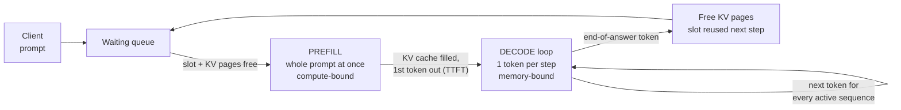

# Under the Hood: How Do You Serve a Chatbot to Thousands of Users on a Few GPUs? (prefill, decode, KV cache, continuous batching)

## 1. The hook

You send a long question to a chatbot. Half a second later the first word appears. Then the rest streams out word by word and takes ten seconds to finish. Why is the *start* fast and the *rest* slow, even though the model is the same? And how can a provider answer thousands of such conversations at once on a handful of very expensive GPUs? **Where does the time go, and what is the scarce resource?**

💡 **GPU (graphics processing unit):** a chip with thousands of small cores, good at doing the same arithmetic on lots of numbers at once. It has its own fast memory (**HBM**, high-bandwidth memory) soldered next to it, typically 40-80 GB on a data-centre card. **Token:** the unit an LLM reads and writes, roughly 3/4 of an English word. **LLM (large language model):** a neural network with billions of numbers (**parameters** or **weights**) that predicts the next token given all the tokens so far.

---

## 2. Life before it

### One request, one GPU
The first serving setups were simple: load the model, take a request, run it to the end, take the next. A GPU worth tens of thousands of dollars then sat mostly idle waiting on memory (section 4.2) and served one user at a time. At a rented price of roughly $2-4 per GPU-hour (🟡 varies a lot by cloud and card), that is ruinous.

### Static batching, then waste
The obvious fix is **batching**: group requests and run them together. Early servers did **static batching**: collect N requests, run them all until the *last* one finishes, then start the next group. But answers have wildly different lengths (a 10-token "yes" next to a 600-token essay), so short ones finish early and their slots sit idle. Newcomers wait for the whole group.

### Orca and vLLM
- **Orca** (Yu et al., OSDI 2022) proposed scheduling at the level of a single *iteration* (one token step) instead of a whole request, now called **continuous batching** or *in-flight batching*. 🟡 I am confident of the idea and venue, less of exact speed-up figures.
- **vLLM** (Kwon et al., SOSP 2023) attacked the other waste, memory: its **PagedAttention** stores each conversation's working memory in small fixed-size pages like an OS does. The paper reported that earlier systems wasted a large fraction of GPU memory (🟡 figures of roughly 60-80% are quoted) and that paging cut that to a few percent.

---

## 3. The clever idea

**Treat the GPU like an operating system treats a CPU:** hand it a fresh batch *every token step* (let sequences join and leave between steps, instead of per request), and give each sequence's memory out in small pages on demand (instead of one big reserved block). Both tricks exist to keep the *expensive weight read* shared by as many users as memory allows.

---

## 4. Step by step



### 4.1 Two phases: prefill, then decode
A **transformer** (the architecture behind LLMs) produces one token at a time, each depending on all earlier tokens. Two phases follow from that:

1. **Prefill:** your whole prompt (say 1,000 tokens) is already known, so the GPU processes all of it **in parallel** in one big pass. Lots of arithmetic per byte of weights read. Result: the first output token plus the saved state of the prompt (the KV cache, 4.4). This is the "half a second".
2. **Decode:** now each new token needs the previous one, so it is **strictly one token per step**. 300 tokens means 300 steps, one after another. This is the "ten seconds".

Analogy: prefill is `cat`-ing a whole log file into a parser in one go; decode is a `tail -f` consumer that must handle each new line before it can know the next.

### 4.2 Why decode is memory-bound (illustrative arithmetic)
💡 **Memory bandwidth:** how many bytes per second the GPU can pull from its HBM into its cores (modern data-centre cards: roughly 2-3 TB/s, 🟡 depends on card). **FLOP:** one arithmetic operation (a multiply or add). **Compute-bound / memory-bound:** the limit is the chip's arithmetic speed / the speed memory feeds it.

Take an illustrative 7-billion-parameter model stored in 16-bit (2 bytes per number):

- Weights = 7×10⁹ × 2 B = **14 GB**.
- Every decode step must read **all** of them from HBM, because every parameter takes part in producing the next token.
- At ~2 TB/s: 14 GB ÷ 2000 GB/s = **7 ms per step** → upper bound ≈ 1 / 0.007 ≈ **140 tokens/s for one sequence** (illustrative; real servers also read the KV cache and have overheads, so they land lower).

And the arithmetic is tiny: about 2 FLOPs per parameter per token = 14 GFLOP. On a GPU that can do ~400 TFLOP/s (illustrative), that is 14×10⁹ ÷ 400×10¹² ≈ **35 µs**, 200 times less than the 7 ms spent waiting for memory. The GPU's cores are ~99% idle during single-user decode. Think of a 64-core server whose only job is to read a 14 GB file from disk for every one-line reply.

### 4.3 Batching: share one weight read
The weights read in a step are the same no matter whose token we compute. So serve **B sequences per step**: one 14 GB read, B tokens out.

- Batch of 1: 7 ms → 1 token. Batch of 32: ~7 ms (plus a little compute and KV reads) → 32 tokens, i.e. ~4,500 tokens/s upper bound, still illustrative.
- Cost per token drops almost B-fold until compute or memory capacity gets in the way. Compute would allow roughly 200 sequences per step in this example; **memory capacity** stops us first (next section).

Trade-off: a bigger batch makes each step slightly longer, so each user's tokens arrive a little slower. Throughput up, per-user speed down slightly.

### 4.4 The KV cache: why memory, not compute, limits concurrency
For each new token, **attention** (the step where a token looks at all previous tokens) needs two vectors per earlier token per layer, called **K** (key) and **V** (value). Recomputing them for the whole history at every step would be quadratic work, so servers **store** them: the **KV cache**. It is a per-conversation cache of "what the model already worked out about the text so far".

Illustrative model (roughly a Llama-2-7B shape, 🟡 real models vary, newer ones use *grouped-query attention* to shrink this several-fold): 32 layers, 32 KV heads, 128 values per head, 16-bit.

- Per token = 2 (K and V) × 32 layers × 32 heads × 128 × 2 B = **524,288 B = 0.5 MB**.
- A 4,000-token conversation = 4,000 × 0.5 MB = **2 GB**.
- 80 GB GPU − 14 GB weights − ~6 GB for activations/overhead (🟡 guess) ≈ 60 GB of KV space → 60 ÷ 2 = **~30 concurrent 4k conversations**, not 200.

So concurrency is capped by **bytes of KV cache**, which is why long prompts hurt everyone: one 32k-token conversation eats 16 GB, the same as eight 4k ones. This is the same kind of limit as a [connection pool or memory budget](../LLD/concepts/resource-pools-and-sizing.md): a fixed pool, and requests beyond it must wait.

### 4.5 Static vs continuous batching
Static batching reserves a slot per request until the *longest* finishes. **Continuous batching** re-decides **every step**: finished sequences leave immediately, waiting ones are prefilled and join. Slots are never idle while someone waits. Like a thread pool pulling from a queue versus "wait for all 16 tasks of a wave to finish before starting the next".

### 4.6 PagedAttention: virtual memory for the KV cache
You do not know in advance how long an answer will be. The naive approach reserves a contiguous block for the maximum length (say 4k tokens = 2 GB) per request, wasting most of it for a 50-token answer (**internal fragmentation**) and leaving unusable gaps (**external fragmentation**).

PagedAttention does what an OS does for RAM: split KV memory into fixed **blocks** (e.g. 16 tokens = 8 MB here), give each sequence a **block table** (logical position → physical block), allocate a new block only when the sequence grows past the last one. Sequences sharing a prefix (the same system prompt) can point to the *same* physical blocks. Waste falls to under one block per sequence, so many more sequences fit, and batches (4.3) get bigger.

### 4.7 Quantization: fewer bits per weight
**Quantization** stores numbers with fewer bits. Same 7B model: 16-bit = 14 GB, 8-bit = 7 GB, 4-bit ≈ 3.5-4 GB (plus small scale factors).

| Bits | Weights | Decode bound at 2 TB/s | Free memory for KV (80 GB card, same overhead) | Quality |
|---|---|---|---|---|
| 16 | 14 GB | ~140 tok/s/seq | ~60 GB | baseline |
| 8 | 7 GB | ~280 tok/s/seq | ~67 GB | usually near-identical (🟡) |
| 4 | ~3.5 GB | ~570 tok/s/seq | ~70 GB | small but measurable loss on some tasks (🟡) |

It wins twice: fewer bytes to read per step, more room for KV cache. The KV cache itself can also be stored in 8-bit. The cost is accuracy, which you must measure on *your* task.

---

## 5. Where you have already used it (without knowing)

- **Streaming answers** word by word in any chatbot are the decode loop, shown as it happens. The delay before the first word is prefill plus queue time.
- **"Context window" limits and pricing** (input tokens cheaper than output tokens in most APIs, 🟡 typical, not universal): input goes through the parallel, compute-efficient prefill; output goes through the slow memory-bound decode.
- **Prompt caching** features reuse the KV cache of an unchanged prompt prefix, the same trick as shared PagedAttention blocks.
- **Thread pool / connection pool / [back-pressure](../LLD/concepts/back-pressure.md)** thinking: a fixed number of slots, a queue in front, reject or wait when full.

---

## 6. Limits and trade-offs

- **Metrics pull in different directions.**
  - **TTFT** (time to first token): queue wait + prefill. What the user feels as "is it alive?".
  - **TPOT / ITL** (time per output token / inter-token latency): the gap between streamed tokens. Under ~50-100 ms feels smooth (🟡 rule of thumb).
  - **Throughput** (tokens/s across all users) drives cost: **cost per million tokens** = GPU $/hour ÷ (tokens/s × 3600) × 10⁶. Illustrative: $2/h at 2,000 tok/s = 2 ÷ 7.2M × 10⁶ ≈ **$0.28 per million tokens**. Double the batch efficiency and the cost halves.
  - Bigger batches raise throughput and lower cost but raise TPOT. Track **p99** (the value 99% of requests beat), not just averages, same as any latency SLO.
- **Prefill interferes with decode.** A huge prompt's prefill occupies the GPU and stalls everyone's next token (a latency spike). Mitigations: *chunked prefill* (split it across steps) or running prefill and decode on separate GPU pools (*disaggregation*). 🟡 Both are active areas; details differ per engine.
- **Preemption.** If KV memory runs out mid-flight, an engine must pause a sequence and either swap its pages to CPU RAM or throw them away and recompute later. Latency spike, but better than a crash.
- **Multi-GPU.** A model bigger than one GPU's memory is split across GPUs (*tensor parallelism*), adding interconnect traffic and making the unit of scheduling "a group of N GPUs".
- **Variable output length** is unknowable up front, so capacity planning uses distributions, not constants.

### Running it on Kubernetes (infra view)
- **GPUs are an extended resource.** A vendor *device plugin* advertises a count (e.g. `nvidia.com/gpu: 8`) on each node and pods request `nvidia.com/gpu: 1` in `limits`. They are integers and **cannot be overcommitted or fractional by default**, unlike CPU requests in the [scheduler](kubernetes-scheduler.md): a pod asking for a GPU either gets a whole one or stays Pending. GPU nodes are usually **tainted** so non-GPU pods stay off.
- **Sharing a GPU.** *MIG* (multi-instance GPU, on newer NVIDIA data-centre cards) cuts one card into isolated slices with their own memory and bandwidth. *Time-slicing* lets pods take turns with no memory isolation, so one pod can starve or crash another. 🟡 Feature availability depends on card model and operator version. For large LLMs, whole GPUs are the norm, since KV memory is the product you are selling.
- **CPU-based autoscaling is wrong here.** CPU stays low while the GPU is saturated. Scale on **queue depth** (waiting requests), **running + waiting requests per replica**, or **KV-cache utilisation**, exposed as Prometheus metrics (vLLM publishes such gauges, 🟡 exact metric names vary by version) and fed to HPA via custom metrics or KEDA. Scale-up must be early because of cold starts.
- **Cold starts are slow.** A new replica must schedule onto a GPU node (maybe provision one, minutes), pull a multi-GB container image, load **14 GB of weights** (at ~1-2 GB/s from object storage = 7-14 s; a 70B model at 16-bit is 140 GB: minutes), then initialise CUDA and warm up. Mitigations: pre-pulled images, weights cached on local NVMe or a shared volume, a warm pool of spare replicas, and a minimum replica count. Cgroups limit CPU and RAM only, see [containers under the hood](containers-namespaces-cgroups.md).

---

## 7. Try it yourself

**Demo (ran here):** [`code/BatchingSim.java`](code/BatchingSim.java) simulates a GPU in *simulated time* (no real GPU, no real model). A decode step costs 25 ms + 0.5 ms per sequence in the batch (a fixed "weight read" plus a small per-sequence cost); admitting a request costs 20 ms of prefill; the batch holds at most 16 sequences (stand-in for full KV memory). 400 requests arrive randomly (mean gap 400 ms) with skewed output lengths (10 to 600 tokens, mean ~130). Both strategies get the identical workload.

```
cd under-the-hood/code && java BatchingSim.java
```
Real output from this machine:
```
400 requests, avg gap 400 ms, batch cap 16, step = 25 ms + 0.5 ms/seq
static      throughput    158 tok/s | avg TTFT   76774 ms | p99 TTFT  154884 ms | p99 latency   162814 ms
continuous  throughput    306 tok/s | avg TTFT      88 ms | p99 TTFT     765 ms | p99 latency    15590 ms
```
How to read it:
- **static** cannot keep up: each wave of 16 lasts as long as its longest answer while short ones idle, so the queue grows and TTFT balloons to minutes. Its throughput (~160 tok/s) is its *capacity*.
- **continuous** keeps up with the offered load (~306 tok/s is just how many tokens arrived per second) with TTFT under 100 ms on average. Its capacity is higher still: with a gap of 120 ms it reached ~437 tok/s, and static ~159 tok/s (set `MEAN_GAP_MS = 120` and re-run: real output `continuous 437 tok/s`, `static 159 tok/s`, but now both queue up and continuous p99 TTFT climbs to ~62 s, because the load is beyond what even continuous batching can serve).
- The numbers come from made-up constants; the **shape** (same work, 2-3x more capacity, TTFT collapses from minutes to milliseconds) is what the demo shows.

**Things to try:** change `MAX_BATCH` to 4 and 64 (small batch = low throughput; large = higher TPOT); set `STEP_BASE_MS` to 5 (a quantized/faster model) and watch capacity jump; make all output lengths equal and see static batching catch up (waste comes from uneven lengths).

**On a real machine** (not run here, no GPU): `pip install vllm`, then `vllm serve <small-model>` and send 50 parallel `curl` requests to `/v1/completions`; the server log prints running/waiting request counts and KV-cache usage, and `/metrics` exposes them for Prometheus (🟡 exact output varies by version).

---

## 8. Where it shows up

- [LLM gateway (HLD)](../HLD/interviews/llm-gateway/README.md): the layer in front of these servers: routing, rate limits by tokens, fallback.
- [RAG and vector search](../HLD/concepts/rag-and-vector-search.md): retrieval makes prompts long, which makes prefill and KV memory the cost.
- [Kubernetes scheduler](kubernetes-scheduler.md): how a GPU request is placed (or stays Pending).
- [Containers, namespaces, cgroups](containers-namespaces-cgroups.md): why GPU memory is *not* limited by the usual container limits.
- [Resource pools and sizing](../LLD/concepts/resource-pools-and-sizing.md) and [back-pressure](../LLD/concepts/back-pressure.md): fixed slots, queues, and what to do when full.
- [Interviews in the AI era](../guides/interviews-in-the-ai-era.md): "design an LLM-backed feature" questions expect these numbers.

---

## 9. Sources

- Yu et al., *Orca: A Distributed Serving System for Transformer-Based Generative Models*, OSDI 2022.
- Kwon et al., *Efficient Memory Management for Large Language Model Serving with PagedAttention* (vLLM), SOSP 2023.
- Vaswani et al., *Attention Is All You Need*, NeurIPS 2017 (the transformer and attention).
- Dettmers et al., *LLM.int8()*, NeurIPS 2022, and Frantar et al., *GPTQ*, ICLR 2023 (8-bit and 4-bit quantization).
- Kubernetes docs: *Schedule GPUs*, *Device Plugins* (kubernetes.io); NVIDIA docs on MIG and GPU time-slicing in the GPU Operator (2023-2025).
- 🟡 Unverified: all hardware numbers (2 TB/s, 400 TFLOP/s, $2/GPU-hour) are round illustrative figures; the "60-80% waste" figure from the vLLM paper; the KV-cache shape is a Llama-2-7B-like approximation; "input tokens cheaper than output" is typical, not universal; the 50-100 ms smoothness rule of thumb; vLLM metric names; MIG/time-slicing availability per card.
