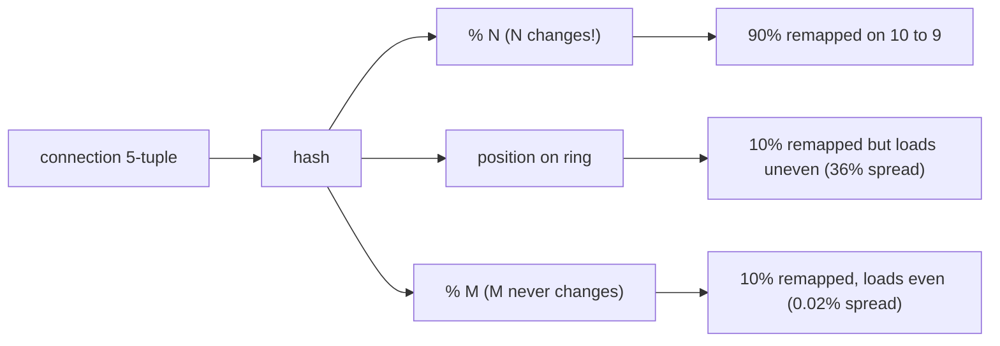

# Under the Hood: How Do Load Balancers Spread Connections Evenly and Survive a Server Dying? (Maglev hashing)

## 1. The hook

A load balancer in front of 10 servers has two jobs that fight each other. **Spread** the traffic evenly, and **never send a packet of an existing connection to a different server**. Then a server dies, or you add one. How do you change the set of servers without breaking thousands of live connections, and keep the load even on the new set?

💡 **Load balancer (LB):** a machine or service that receives client traffic and forwards it to one of many backend servers. See [load-balancer.md](../HLD/technologies/load-balancer.md).
💡 **TCP connection:** a long-lived conversation between client and server made of many packets. All of them must reach the **same** server, because that server holds its state (the TLS session, the half-uploaded file). A packet landing on another server gets "connection reset".
💡 **5-tuple:** source IP, source port, destination IP, destination port, protocol; the five fields that identify one connection.

---

## 2. Life before it

- **Modulo hashing:** `backend = hash(5-tuple) % N`. Perfectly even and stateless, until N changes. Going from 10 to 9 servers remaps about 90% of all connections (the demo below measures this).
- **Connection table:** the LB remembers `connection -> backend`. Works, but the table is memory-hungry, every LB instance needs its own copy, and when an LB itself dies or the router shifts a flow to a different LB, the memory is gone.
- **Consistent hashing** (Karger et al., MIT, 1997) places servers on a ring so removing one only moves that server's share. See [consistent-hashing.md](../HLD/concepts/consistent-hashing.md). Its weakness for this job: with few points per server the ring is **unevenly loaded**.
- **Google's Maglev (NSDI 2016, Eisenbud et al.)**: Google's software network load balancer, running on ordinary servers instead of special hardware, needed lookups fast enough for line-rate traffic, almost-perfect balance, and minimal disruption. The lookup-table method it uses is what people now call **Maglev hashing**.

---

## 3. The clever idea

Precompute a **lookup table** with a fixed number of slots `M` (a prime such as 65,537). Each backend has its own **personal preference list** of slots (a permutation). Backends take turns, each claiming its next preferred free slot, until the table is full. Looking up a connection is then one hash and one array read: `table[hash(5-tuple) % M]`.

Taking turns guarantees every backend ends up with `M / N` slots, within one. Preference lists that do not change when other backends come or go keep most slots with their old owner.

---

## 4. Step by step

### 4.1 Why modulo hashing and rings both fall short



The table keeps the number that changes (backend count) **out** of the hash. The hash maps into a table whose size never changes; only the contents of the table change.

### 4.2 Building the table

Each backend `i` gets two numbers from hashing its name:

- `offset` in `[0, M-1]`
- `skip` in `[1, M-1]`

Its preference list is `slot_j = (offset + j x skip) mod M` for `j = 0, 1, 2, ...`. Because `M` is **prime**, this visits every slot exactly once before repeating, so each list is a true permutation of all slots. (With a non-prime M, a skip sharing a factor with M would revisit a few slots and never reach the others.)

Fill loop, in pseudocode:

```text
table = [empty] * M
repeat until full:
    for each backend i in order:
        take i's next preferred slot; skip it if already taken
        table[slot] = i
```

Tiny hand example, M = 7, backends A (offset 3, skip 4) and B (offset 0, skip 2):

| Round | A's preference list | A claims | B's preference list | B claims |
|---|---|---|---|---|
| 1 | 3, 0, 4, 1, 5, 2, 6 | slot 3 | 0, 2, 4, 6, 1, 3, 5 | slot 0 |
| 2 | next: 0 (taken), 4 | slot 4 | next: 2 | slot 2 |
| 3 | next: 1 | slot 1 | next: 4 (taken), 6 | slot 6 |
| 4 | next: 5 | slot 5 | table full | |

Result: A owns 3, 4, 1, 5; B owns 0, 2, 6; A gets one extra only because 7 is odd. Cost to build: roughly `O(M)` normally; the paper bounds the worst case at `O(M log M)`. A rebuild after a backend change takes milliseconds, and the LB swaps in the new table atomically.

### 4.3 Removing a backend

Rebuild with the 9 survivors. The dead backend's slots go to someone, but every survivor's preference list is unchanged, so most of **their** slots are still claimed by them. A few move around (the paper calls this a small "extra disruption"; they trade perfection in disruption for perfection in balance).

### 4.4 Connection tracking as backup

Even 0.2% of live connections moving would reset them. So Maglev (the paper's design) keeps a small per-machine **connection tracking table**: the first packet of a flow uses the hash lookup and the choice is remembered; later packets use the remembered backend. After a table change, existing flows keep their old backend; **only new flows** use the new table. The hash is the fallback when the memory is lost (the router shifted the flow to another LB machine, which has the same table and picks the same backend with high probability). Hash for spreading, memory for stickiness.

In the paper, routers first spread packets over the Maglev machines with ECMP (💡 **equal-cost multi-path**: the router hashes the flow to choose among equally good next hops), and each Maglev machine does the 5-tuple lookup and forwards to the backend.

### 4.5 Real numbers

From [`code/MaglevDemo.java`](code/MaglevDemo.java) (M = 65,537, 10 backends, one removed):

| Metric | Modulo | Ring, 100 vnodes | Maglev |
|---|---|---|---|
| Load spread, (max - min) / ideal | 0% (even) | **36.1%** (7,781 to 11,390 per 10,000 ideal) | **0.02%** (6,553 to 6,554 of 6,553.7) |
| Moved after removing 1 of 10 | **90.1%** | 10.0% | 10.2% |
| Moved although owner was alive | ~80% | ~0% | 0.2% |

The ideal on removal is 10%, the dead server's own share. Maglev pays 0.2% extra for balance that the ring needs thousands of virtual nodes to approach. 💡 **Virtual node (vnode):** a server placed at many positions on the ring so its share averages out.

---

## 5. Where you've used it without knowing

- **Google Cloud's network load balancing** is built on Maglev 🟡 (Google's public documentation).
- **Envoy** proxy ships a `MAGLEV` load-balancing policy (default table size 65,537) as an alternative to ring hash 🟡. Kubernetes service meshes built on Envoy use it for consistent routing.
- **Katran** (Meta's open-source layer-4 load balancer) uses a Maglev-style table 🟡.
- Same pattern in any "keep users sticky to a node while nodes come and go" problem: cache clusters, sharded WebSocket gateways, the infra layer under k8s Services (where `kube-proxy` picks a pod per connection, though with different methods).

---

## 6. Limits and trade-offs

- **Not strictly minimal disruption.** Ring hashing moves exactly the dead node's share (10.0% in the demo), Maglev slightly more (10.2%). The connection table covers the gap.
- **Table size is a dial.** `M` must be much larger than N (the paper suggests at least 100 x N for good balance) 🟡; a table of 65,537 four-byte entries is only 256 KB and fits in CPU cache. Bigger M, better balance, slower rebuild.
- **Weights:** backends of different size can be given proportional turns; adds a little complexity.
- **Layer 4 only in spirit.** Consistent per-connection choice is needed for TCP. For stateless HTTP behind a layer-7 proxy, plain round robin or least-connections is simpler and adapts to slow servers, which hashing cannot.
- **Hash skew:** if one key (one client IP, one hot tenant) sends most of the traffic, no hash balances it; that is a different fix (split the key, or route by load).

---

## 7. Try it

```sh
cd under-the-hood/code
java MaglevDemo.java
```

Real output (Java 21):

```text
Maglev table: M=65,537, 10 backends, ideal share 6553.7 entries each
  entries per backend: min=6,553 max=6,554 (spread 0.02%)

Remove backend-3 (should move ~10% of traffic, the dead server's share):
  Maglev:        10.2% of entries changed owner (0.2% moved although their owner was alive)
  Modulo (hash%N): 90.1% of connections changed backend
  Ring, 100 vnodes: 10.0% of connections changed backend

Load spread over 100,000 connections (ideal 10,000 each):
  Ring, 100 vnodes: min=7,781 max=11,390 (spread 36.1%)
  Maglev:           min=6,553 max=6,554 of 65,537 entries (spread 0.02%)
```

Things to try: set vnodes to 1,000 and watch the ring's spread shrink; drop M to 101 and see Maglev's balance get worse; remove two backends; add an 11th instead of removing one; change `M` to a non-prime like 65,536 and see the loop struggle because skips no longer cover every slot. For the quorum and ring side of this family see [hash-ring-quorum](../see-it-work/hash-ring-quorum/README.md).

---

## 8. Where it shows up

- [Consistent hashing](../HLD/concepts/consistent-hashing.md): the ring this improves on for load balancing.
- [Load balancer](../HLD/technologies/load-balancer.md): the component that uses it.
- [Hash ring and quorum demo](../see-it-work/hash-ring-quorum/README.md).

---

## 9. Sources

- D. E. Eisenbud et al., "Maglev: A Fast and Reliable Software Network Load Balancer", NSDI (2016).
- D. Karger et al., "Consistent Hashing and Random Trees", STOC (1997).
- Envoy documentation, "Load balancing: Maglev" 🟡.
- Meta Engineering, Katran announcement (2018) 🟡.
- 🟡 = recalled, not re-checked: Envoy default table size, Katran details, Google Cloud usage, the "100 x N" rule of thumb.
