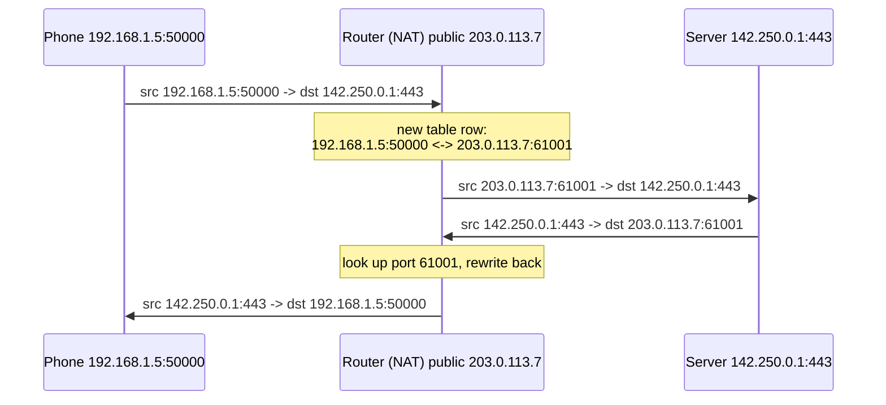

# Under the Hood: How Do 10 Phones Share One Public IP, and Why Did Our Kubernetes Nodes Start Dropping Packets? (NAT and conntrack)

## 1. The hook

Your home has a phone, two laptops, a TV and a fridge. Your ISP gave you **one** public address. Yet all of them browse at once, and every website replies to the right device. Now the on-call version: at 02:10 a node starts losing packets, the app logs show random timeouts, and `dmesg` says `nf_conntrack: table full, dropping packet`. Same mechanism, two faces. What is it, and where does it run out?

💡 **IP address:** the number that says where a packet goes on the internet (`203.0.113.7`). **Packet:** one small chunk of data with a "from" and a "to" address on its front.
💡 **Port:** a number (0-65535) that picks one program on a machine, like an apartment number inside a building (the IP is the street address).
💡 **dmesg:** the command that prints the Linux kernel's own log messages.

---

## 2. Life before it

- IPv4 addresses are 32 bits: 2^32 = 4,294,967,296 (about 4.3 billion). That sounded endless in 1981, until every phone and laptop wanted one.
- The central pool of free blocks, held by **IANA** (the body that hands out address blocks), ran out in **February 2011** (🟡 date from memory). Regional registries followed over the next years; APNIC (Asia-Pacific) was first (🟡).
- **RFC 1918 (1996)** reserved three **private ranges** that anyone may reuse inside their own network and that are never routed on the public internet: `10.0.0.0/8` (16.7 million addresses), `172.16.0.0/12` (about 1 million) and `192.168.0.0/16` (65,536).
- **NAT** (Network Address Translation) was described in **RFC 1631 (1994)** and later **RFC 3022 (2001)** as a stop-gap. It outlived every "temporary" prediction.

💡 **Analogy:** a company switchboard. Fifty employees have internal extensions (private IPs); outside callers see one main number (public IP). The receptionist remembers who called out, so replies go to the right desk.

---

## 3. The clever idea

The router sitting between private and public networks **rewrites the source address and port of every outgoing packet** to its own public IP and a fresh port, and writes the swap in a table. When the reply arrives, it looks up the port and rewrites it back. The table is the whole trick, and the table is also what fills up.

---

## 4. Step by step

### 4.1 One phone opens one connection

Phone `192.168.1.5` opens a connection to `142.250.0.1:443` from its own random port 50000. The router owns public IP `203.0.113.7`.



This variant, many private hosts behind one public IP told apart by port, is called **PAT** (Port Address Translation) or "NAPT". It is what people mean by "NAT" 99% of the time.

### 4.2 The table has a size limit

Each row is a **connection**, keyed by (source IP, source port, destination IP, destination port, protocol). The pool of ports per public IP is about 65,535 minus the reserved low ports.

- Different destinations can reuse the same public port, because the key includes the destination. So the real limit is about **64,000 simultaneous connections from one public IP to one destination IP:port** (🟡 exact usable range depends on the implementation; Linux defaults to ephemeral ports 32768-60999, about 28,000, see `/proc/sys/net/ipv4/ip_local_port_range`).
- Rows must expire. Nobody tells a router "I'm done" if the phone just walks out of Wi-Fi range. So each row has a **timeout**: seconds for a UDP flow (DNS lookups), minutes to **days** for an established TCP connection (see [tcp.md](tcp.md) for the states).

### 4.3 Linux does it with conntrack

On a Linux box (a VM, a Kubernetes node, a home router running OpenWrt), the kernel's **netfilter** framework hooks into the packet path. Its **conntrack** (connection tracking) module keeps a row per flow in a hash table in kernel memory. NAT rules (`iptables -t nat ... MASQUERADE`) use that table to remember rewrites. Even without NAT, firewalls and Kubernetes Services use it to know "this reply belongs to a connection we allowed".

Knobs you will meet:

| Setting | Meaning |
|---|---|
| `nf_conntrack_max` | Maximum rows. Beyond this, new flows are dropped. |
| `nf_conntrack_count` | Rows right now. Alert when count / max passes ~80%. |
| `nf_conntrack_buckets` | Hash table size (more buckets = faster lookup). |
| `nf_conntrack_tcp_timeout_established` | Idle time before a TCP row is removed. Default is **432000 s = 5 days** on many kernels (🟡 check your distro). |
| `nf_conntrack_udp_timeout` | Idle UDP row lifetime. Default about 30 s (🟡). |

Each row costs a few hundred bytes of kernel memory (🟡 roughly 300 bytes), so 262,144 rows is on the order of 80 MB. The limit exists to protect memory.

### 4.4 The classic outage

```
nf_conntrack: nf_conntrack: table full, dropping packet
```

Why it happens on Kubernetes nodes:

1. [kube-proxy](kubernetes-networking.md) (iptables or IPVS mode) and pod-to-Service traffic go through conntrack: every pod connection to a ClusterIP is a row, and DNAT (destination rewrite, the mirror of SNAT) is stored in it.
2. A busy node with many pods, short-lived HTTP calls with no keep-alive, and a 5-day idle timeout accumulates dead rows faster than they expire.
3. Count hits max. The kernel cannot create a row for a **new** flow, so it **drops the first packet**. Existing connections still work, which makes the failure look random: "some requests time out, retries succeed".
4. A related DNS-specific bug: two parallel UDP lookups (A and AAAA) from the same source port can race on row insertion and one is dropped, causing the famous 5-second DNS timeouts in Kubernetes (🟡 reported widely around 2018-2019; fixes landed in the kernel and in node-local DNS caches).

Fixes, from cheap to structural: raise `nf_conntrack_max` (and buckets); shorten the established timeout; use connection pooling and keep-alive so you open fewer connections; use a node-local DNS cache; skip tracking for traffic that does not need it (`NOTRACK` rules); in eBPF-based CNIs (e.g. Cilium) replace kube-proxy and its conntrack use (🟡 vendor claim, measure first).

### 4.5 Same problem in the cloud: SNAT port exhaustion

Servers in a private subnet reach the internet through a **NAT gateway** (AWS NAT Gateway, Azure NAT, Cloud NAT on GCP). It is the same PAT table, run for you.

- One public IP gives about 64k ports **per destination IP:port** (🟡 AWS documents about 55,000 simultaneous connections per unique destination per NAT gateway; check current docs for each cloud).
- 2,000 pods all calling `api.payments.example:443` through one NAT IP share about 64k ports. If each pod holds 40 open connections, 80,000 > 64,000. New connections fail with timeouts, and the gateway's `ErrorPortAllocation` metric climbs (🟡 AWS metric name).
- Fixes: connection reuse, more NAT IPs (each adds ~64k), or going direct via private endpoints so traffic skips NAT.

### 4.6 CGNAT: your phone shares an IP with thousands of strangers

Mobile carriers ran out of public IPv4 long ago. They use **CGNAT** (Carrier-Grade NAT, RFC 6888, 2013; shared space `100.64.0.0/10` from RFC 6598) so thousands of subscribers share a pool of public IPs. Large Indian carriers (Jio, Airtel and others) are widely reported to use IPv6 natively on 4G/5G plus CGNAT for the IPv4 leftovers (🟡 specifics vary and are not public in detail).

Consequences you can observe:
- "Your IP" on a speed-test site is not yours alone; IP-based rate limits and bans hit innocent neighbours. This is why [load balancers](../HLD/technologies/load-balancer.md) and API gateways should not rate-limit on IP alone.
- Port-forwarding to your phone is impossible.

### 4.7 Why NAT breaks inbound connections, and how calls still work

NAT only creates a row when an **inside** host sends first. A packet arriving from outside for `203.0.113.7:61001` with no matching row is dropped. Two phones on different NATs that both want to call each other can send, but neither can receive.

The workaround is the **ICE** framework used by WebRTC video and voice calls (see [chat-system](../HLD/interviews/chat-system/README.md) for where calls fit):

1. **STUN** server: each phone asks "what public IP:port do you see me coming from?" (a mirror).
2. Both exchange those addresses via a signalling server and **send packets at each other at the same time**. Each outgoing packet opens a row in its own NAT, so the other's packet is now "a reply" and gets through. This is **hole punching**.
3. If the NATs are strict (symmetric NAT, common on CGNAT), punching fails and the call is **relayed through a TURN server**, which costs the provider bandwidth. Often cited figures are that roughly 10-20% of calls need a relay (🟡 varies a lot by network).

### 4.8 The long-term fix: IPv6

IPv6 addresses are 128 bits: about 3.4 x 10^38. Every device can have a globally unique address, so no translation, no port table, no hole punching. A firewall still blocks unwanted inbound traffic, but by policy, not by accident. Adoption is partial: Google's public statistics showed roughly 45-50% of users reaching it over IPv6 in the mid 2020s (🟡 check ipv6-test or Google's IPv6 stats page for the current number), with India among the high-adoption countries thanks to mobile carriers.

---

## 5. Where you have used it without knowing

- Every home Wi-Fi router. Every phone hotspot.
- Docker's default bridge network (`docker0`) masquerades container traffic out through the host.
- Pods reaching the internet from a private cluster; EC2 instances in a private subnet.
- Every Kubernetes Service call, via DNAT in conntrack.

## 6. Limits and trade-offs

| Pro | Con |
|---|---|
| Saved IPv4 for 30 years | Stateful: the table is a memory limit and a single point of failure |
| Accidental inbound protection | Breaks peer-to-peer, needs STUN/TURN |
| Hides internal addressing | Hides client identity: IP bans, geo-location and logs become fuzzy |
| Transparent to apps | Idle connections silently vanish after the timeout: send TCP keep-alives shorter than the NAT timeout (many clouds use ~350 s; 🟡) |

That last row is a classic: a long-lived DB connection idles for 6 minutes, the NAT drops the row, and the next query hangs until a timeout. Keep-alive and connection-validation settings in your connection pool exist for this reason.

## 7. Try it

Run in the sandbox this page was written in (a small Linux VM):

```
$ cat /proc/sys/net/netfilter/nf_conntrack_max
262144
$ cat /proc/sys/net/netfilter/nf_conntrack_count
0
$ conntrack -C
conntrack: command not found      # the userspace tool is not installed here
$ ip addr
ip: command not found             # also missing; use the next line
$ hostname -I
192.0.2.2
```

Reading: the kernel allows 262,144 tracked connections, none in use (this VM does no NAT). `192.0.2.2` is from `192.0.2.0/24`, a block reserved for documentation and examples (RFC 5737), not a public address. On your own laptop or a Kubernetes node try:

```
conntrack -L | head          # list rows (needs the conntrack tool, root)
conntrack -C                 # count rows
watch -n1 cat /proc/sys/net/netfilter/nf_conntrack_count
sudo dmesg | grep conntrack  # look for "table full"
curl ifconfig.me             # your public IP; compare with `hostname -I`
```

Experiment: open 20 `curl`s in a loop and watch the count rise, then wait and see the UDP rows expire first.

## 8. Where it shows up

- [kubernetes-networking.md](kubernetes-networking.md): kube-proxy, Services, DNAT, and why conntrack matters there.
- [tcp.md](tcp.md): connection states and idle timeouts that conntrack mirrors.
- [Load balancer](../HLD/technologies/load-balancer.md): L4 load balancers do their own NAT/tracking; `X-Forwarded-For` exists because NAT hides the client.
- [chat-system](../HLD/interviews/chat-system/README.md): voice/video calls need STUN/TURN.
- [dns.md](../HLD/technologies/dns.md): the UDP lookups that trigger the 5-second timeout bug.

## 9. Sources

- RFC 1918, Address Allocation for Private Internets (1996); RFC 1631 (1994) and RFC 3022 (2001), NAT; RFC 6598 (2012) and RFC 6888 (2013), CGNAT; RFC 5737 (2010), documentation ranges.
- RFC 8445 (2018, ICE), RFC 8489 (2020, STUN), RFC 8656 (2020, TURN).
- Linux kernel documentation, `nf_conntrack-sysctl` (settings and defaults vary by version).
- IANA IPv4 exhaustion announcement (2011) (🟡 date from memory); AWS NAT Gateway documentation (port limits, 🟡 re-check current numbers).
- Weave Works blog and Kubernetes issue tracker on DNS 5-second timeouts (2018-2019) (🟡 from memory).
- Everything marked 🟡 was written from memory and not re-verified.
