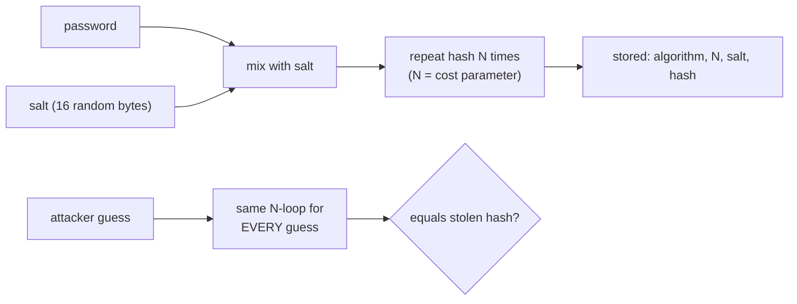

# Under the Hood: How Do You Make Cracking Stolen Passwords Deliberately Slow? (password hashing)

## 1. The hook

Every engineering team is told: "never store passwords, store hashes". Then a database leaks anyway, and within days attackers have cracked millions of the passwords. If a hash is one-way, how can anyone get the passwords back? And the odd fix: the industry's answer was to make the hash function **deliberately slow**, the one place in computing where we add waste on purpose. Why?

💡 **Hash function:** a function that turns any input into a fixed-size fingerprint (SHA-256 gives 32 bytes). Same input, same output; you cannot run it backwards. Normally designers want it **fast**.
💡 **Brute force / dictionary attack:** trying guesses (every word in a list, then variations like `Passw0rd!`) and hashing each to see if it matches a stolen hash.

---

## 2. Life before it

- **1970s, Unix `crypt`**: Robert Morris and Ken Thompson (*Password Security: A Case History*, 1979) already stored hashed passwords with a 12-bit **salt** and ran the hash 25 times to slow guessing.
- Then came the habit of using general hashes: MD5 (1992), SHA-1 (1995), SHA-256 (2001). They were built to hash gigabytes quickly, which is exactly wrong here. A modern GPU computes **billions** of SHA-256 per second (🟡 hashcat benchmarks put one high-end consumer GPU in the 10-25 billion/s range for SHA-256; MD5 is higher).
- **Rainbow tables** (Philippe Oechslin, 2003): precompute huge chains of hash-to-password once, then reverse any **unsalted** hash by lookup in seconds.
- Breaches made it concrete. **LinkedIn (2012)** leaked about 6.5 million hashes that were **unsalted SHA-1**, and most were cracked quickly; the fuller dump of ~117 million surfaced in 2016 🟡. **RockYou (2009)** had stored passwords in **plain text**, and its leaked list is still the standard cracking dictionary. **Adobe (2013)** used reversible encryption (3DES, one key, no per-user salt), so identical passwords produced identical ciphertext 🟡 details as reported then.

---

## 3. The clever idea

Do not make the hash unbreakable (it cannot be). Make **each guess expensive**: add a unique **salt** per user so work cannot be shared, then repeat the hash thousands of times (**key stretching**) or make it need lots of **memory** so a GPU cannot run millions in parallel.

---

## 4. Step by step

### 4.1 Salt: kill the shared work

A **salt** is a random value (16 bytes) stored next to the hash and mixed into the input: `hash(salt + password)`.

- Two users with `hunter2` now have different hashes (see demo section 1), so one guess tests **one** account, not all accounts at once.
- A rainbow table would need to be rebuilt per salt, which makes precomputation pointless.
- The salt is **not secret**; it is just uniqueness.

### 4.2 Stretching: multiply the cost per guess

Instead of one hash, run it `N` times in a chain (PBKDF2 does an HMAC loop; 💡 HMAC is a hash mixed with a secret key, so the result depends on both). The legitimate server pays this cost **once per login**; the attacker pays it **per guess, billions of guesses**.



### 4.3 The family tree

| Algorithm | Year | Idea | Cost knob |
|---|---|---|---|
| crypt (DES-based) | 1979 | salt + 25 rounds | fixed |
| PBKDF2 (RFC 2898, RSA Labs) | 2000 | HMAC repeated N times | iterations |
| bcrypt (Provos and Mazieres) | 1999 | Blowfish key setup (4 KB state, cache-bound) repeated 2^cost times | cost (work factor) |
| scrypt (Colin Percival) | 2009 | forces use of large **memory** | N, r, p |
| Argon2 (Biryukov, Dinu, Khovratovich) | 2015 | **memory-hard**, tunable memory + time + threads; won the Password Hashing Competition | memory, iterations, parallelism |

💡 **Memory-hard:** an algorithm that needs, say, 64 MB of RAM *per guess*. A GPU has thousands of cores but shares limited fast memory, so it can run far fewer guesses at once. PBKDF2 needs almost no memory, so GPUs and custom chips (ASICs) love it.

### 4.4 Real numbers (this machine, one CPU core)

From [`code/PasswordHashDemo.java`](code/PasswordHashDemo.java):

| Scheme | Guesses/s | 1 billion guesses |
|---|---|---|
| plain SHA-256 | 1,670,185 | 599 seconds (10 min) |
| PBKDF2-SHA256, 1,000 iterations | 1,134 | 10.2 days |
| PBKDF2-SHA256, 100,000 iterations | 17 | 697.7 days (1.9 years) |
| PBKDF2-SHA256, 600,000 iterations | 4 | 3,202 days (8.8 years) |

Arithmetic: 1,000,000,000 / 1,134 per second = 881,834 s = 10.2 days. Dividing again by 86,400 s/day gives the other rows. A GPU is 1,000s of times faster than this one core on SHA-256, so the *ratios* matter more than the absolute figures: **600,000 iterations makes each guess ~420,000 times more expensive than plain SHA-256** (1,670,185 / 4). OWASP's 2023 guidance 🟡 suggests PBKDF2-HMAC-SHA256 at 600,000 iterations, or Argon2id with at least 19 MiB memory and 2 iterations. The right number is "what your login server can afford": about 100-500 ms per hash.

### 4.5 Pepper

A **pepper** is a secret value (unlike a salt) kept **outside** the database, e.g. in a secrets manager or HSM (a tamper-resistant hardware box that does crypto without revealing the key). Mix it in (HMAC with the pepper) and a stolen database alone is useless. Cost: key management and rotation, which is why many teams skip it. Infra analogy: like keeping DB credentials in Vault rather than in the same repo as the config.

---

## 5. Where you've used it without knowing

- Every "Create account" form; Spring Security's `BCryptPasswordEncoder` and `Pbkdf2PasswordEncoder` (the stored string like `$2a$10$...` carries algorithm, cost and salt, so you can raise cost later).
- Linux `/etc/shadow` (`$6$` means SHA-512-crypt; newer distros use `$y$` for yescrypt 🟡).
- Disk encryption and password managers derive their key from your master password with PBKDF2, scrypt or Argon2; a wallet or Wi-Fi WPA2 passphrase uses PBKDF2 with 4096 iterations.
- Not the same thing: a card **PIN** is only 4-6 digits, so slow hashing cannot save it; see [card-and-pin-security.md](../LLD/concepts/card-and-pin-security.md) for why it is protected by hardware and attempt limits instead.

---

## 6. Limits and trade-offs

- **Slow for you too.** 100 ms of CPU per login is a DoS lever: an attacker spamming login attempts burns your CPU. Rate limit and consider hashing on a dedicated pool.
- **Weak passwords still fall.** `123456` is guess number 1 in any dictionary; cost only helps against *strong-ish* passwords. Block known-breached passwords (a [Bloom filter](../HLD/concepts/bloom-filters.md) of billions of leaked passwords fits in memory and answers "definitely not in the list / maybe in the list"; Have I Been Pwned offers a k-anonymity API for the same purpose).
- **Memory-hard costs RAM per login**: 64 MB x 1,000 concurrent logins is 64 GB. Tune to your load.
- **bcrypt** truncates at 72 bytes and (older versions) ignores everything after a NUL; prehash carefully.
- Hardware advances: costs must be **raised over time**; store the parameters with each hash and rehash on next successful login.
- Never invent your own scheme (`sha256(sha256(pw)+salt)`); use a vetted library.
- Hashing is for *verifying* a password. For API tokens (high-entropy random strings) a fast hash is fine, see [authentication-oauth-jwt.md](../HLD/concepts/authentication-oauth-jwt.md).

---

## 7. Try it

[`code/PasswordHashDemo.java`](code/PasswordHashDemo.java) (52 lines, JDK only: `MessageDigest` and `PBKDF2WithHmacSHA256` from `javax.crypto`). It shows the salt effect and measures guesses per second.

```sh
cd under-the-hood/code
java PasswordHashDemo.java
```

Real output (Java 21, Linux, one core; your numbers will differ):

```text
== 1. Salt: same password, three users ==
user1 salt=cfef86f0..  hash=926dff468315b6ff865048fb..
user2 salt=474ee965..  hash=32c35249bad57af6761bdb25..
user3 salt=1df9d548..  hash=0aa4e2c1ffec7e0816bcb696..

== 2. Guesses per second on ONE core ==
plain SHA-256                 1,670,185 guesses/s   1 billion guesses: 599 seconds
PBKDF2-SHA256 x 1000              1,134 guesses/s   1 billion guesses: 10.2 days (0.0 years)
PBKDF2-SHA256 x 100000               17 guesses/s   1 billion guesses: 697.7 days (1.9 years)
PBKDF2-SHA256 x 600000                4 guesses/s   1 billion guesses: 3,202.3 days (8.8 years)
```

Speeds depend heavily on the machine and on what else is running: a later run on the same container measured about 3× more guesses/s in every row (e.g. 5.7M SHA-256/s, 6 PBKDF2-600k/s). The **ratios** between rows are what stay the same, and they are the point.

Things to try: change the password and see the speed stay the same (cost does not depend on it); run `sha256sum` vs `openssl passwd -6` in a loop; add `Runtime.getRuntime().availableProcessors()` threads and watch guesses/s scale with cores, then picture a GPU with 10,000 of them.

---

## 8. Where it shows up

- [authentication-oauth-jwt.md](../HLD/concepts/authentication-oauth-jwt.md): login flows, where the password check happens.
- [card-and-pin-security.md](../LLD/concepts/card-and-pin-security.md): why short secrets need a different defence.
- [bloom-filters.md](../HLD/concepts/bloom-filters.md): rejecting known-breached passwords cheaply.

---

## 9. Sources

- R. Morris, K. Thompson, *Password Security: A Case History*, CACM, 1979.
- P. Oechslin, *Making a Faster Cryptanalytic Time-Memory Trade-Off* (rainbow tables), CRYPTO, 2003.
- N. Provos, D. Mazieres, *A Future-Adaptable Password Scheme* (bcrypt), USENIX, 1999.
- B. Kaliski, *RFC 2898: PKCS #5 v2.0 (PBKDF2)*, 2000; *RFC 8018*, 2017.
- C. Percival, *Stronger Key Derivation via Sequential Memory-Hard Functions* (scrypt), 2009; *RFC 7914*, 2016.
- A. Biryukov, D. Dinu, D. Khovratovich, *Argon2*, 2015; Password Hashing Competition winner, 2015; *RFC 9106*, 2021.
- OWASP *Password Storage Cheat Sheet* (2023 values) 🟡 numbers change; check the current version.
- Breach details (LinkedIn 2012/2016, RockYou 2009, Adobe 2013): contemporary press reports 🟡 figures approximate.
