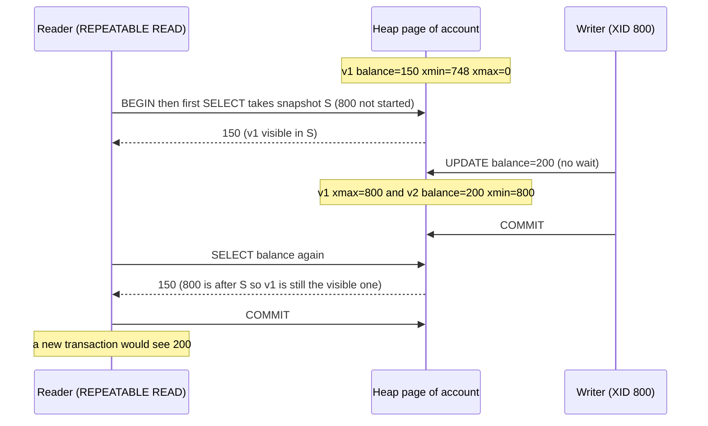

# Under the Hood: How Do Readers and Writers in Postgres Not Block Each Other? (MVCC)

## 1. The hook

A reporting query scans a 50 GB `orders` table for 20 minutes. Meanwhile the checkout service keeps updating rows in that same table, thousands of times a second. Neither waits for the other, and the report still sees a **consistent** picture: every row as it was when the report started, not a mix of old and new.

How? If the report reads row 5 while checkout is changing row 5, someone has to wait... unless there are **two copies of row 5**.

That's the trick: **MVCC (multi-version concurrency control)**. Postgres never overwrites a row in place. It writes a new version and lets each transaction pick the version it's allowed to see.

💡 **Transaction:** a group of statements that succeed or fail together (`BEGIN ... COMMIT`). **Concurrency control:** the rules a database uses so simultaneous transactions don't corrupt each other's view of the data ([transactions & isolation](../LLD/concepts/transactions-and-isolation.md)).

---

## 2. Life before it

### Locking: readers and writers queue behind each other
The classic approach (IBM's System R in the 1970s; still SQL Server's default on-premises, which only added snapshot isolation in 2005) is **two-phase locking**:

- A reader takes a **shared lock** on the row: other readers may also read, but nobody may write.
- A writer takes an **exclusive lock**: nobody else may read or write the row until the writer commits.

💡 **Lock:** a flag saying "I'm using this, wait your turn". **Shared** = many holders allowed; **exclusive** = one holder only, like a k8s `Lease` held by one leader.

So the 20-minute report holds shared locks and **checkout waits**; or checkout holds an exclusive lock and **the report waits**. Under load that means lock queues, timeouts and deadlocks (two transactions each waiting for a lock the other holds). Teams worked around it with dirty reads (`NOLOCK` hints in SQL Server) that could return half-written data.

### The idea arrives
David Reed described multi-version timestamps in his 1978 MIT PhD thesis; Bernstein and Goodman formalised multiversion concurrency control in the early 1980s. Oracle shipped a version-based read consistency in the 1980s, and **PostgreSQL 6.5 (1999)** replaced table-level locking with MVCC (work led by Vadim Mikheev). SQL Server added optional snapshot isolation in 2005; MySQL's InnoDB engine has always been MVCC.

---

## 3. The clever idea

**Keep old versions of each row and stamp each version with the transaction IDs that created and deleted it.** A transaction takes a **snapshot** ("which transactions had committed when I started?") and reads only the versions that were alive in that snapshot. Readers never need locks, so **readers don't block writers and writers don't block readers**. Writers still block other writers *on the same row*.

---

## 4. Step by step

### Every row version carries two transaction IDs
Postgres stores a table as a **heap**: an unordered file of **8 KB pages**, each holding many **tuples** (row versions). Each tuple header has:

| Field | Meaning |
|---|---|
| `xmin` | ID of the transaction that **created** this version (INSERT or UPDATE) |
| `xmax` | ID of the transaction that **deleted or replaced** it (0 = still current) |
| `ctid` | Physical address: (page number, slot in page). For an old version it points to the newer version |

💡 **XID (transaction ID):** a 32-bit counter Postgres hands out to each transaction that writes. **Page:** the unit Postgres reads from disk and caches in memory (its buffer pool), 8 KB by default.

### UPDATE = insert a new version + mark the old one
`UPDATE account SET balance = 150 WHERE id = 1`, run by transaction 748:

1. Find the current version (xmin 747, xmax 0, at slot `(0,1)`).
2. Write a **new** tuple with `balance = 150`, xmin **748**, xmax 0, at slot `(0,2)`.
3. Set the old tuple's **xmax = 748** and its ctid to `(0,2)` ("my replacement lives there").
4. Nothing is erased. A DELETE is just step 3 without step 2.

### The snapshot and the visibility rule
A snapshot is basically three things: the lowest still-running XID, the next XID not yet assigned, and the list of XIDs running right now. Simplified rule: **a tuple version is visible to me if**

- its `xmin` committed **before my snapshot** (not in my "still running" list), **and**
- its `xmax` is 0, aborted, or committed **after** my snapshot.

Postgres looks up "did XID 748 commit or abort?" in a small status log (`pg_xact`, 2 bits per transaction) and caches the answer in **hint bits** (flag bits in the tuple header) so the next reader doesn't have to look again.

### Worked example: a reader and a writer at the same time



The writer didn't wait for the reader, and the reader didn't wait for the writer. That's the whole point. (XID 800 is illustrative; the real run in section 7 shows the same timeline.)

### Isolation levels are just "when do I take the snapshot?"

| Level | Snapshot taken | Effect |
|---|---|---|
| **READ COMMITTED** (Postgres default) | At the start of **each statement** | Two SELECTs in one transaction can see different values |
| **REPEATABLE READ** | At the **first statement** of the transaction | Same answer all transaction long; if you try to update a row someone else changed since your snapshot you get `could not serialize access due to concurrent update` and retry |
| **SERIALIZABLE** | Same as REPEATABLE READ, plus **SSI** (Serializable Snapshot Isolation, Postgres 9.1, 2011) | Tracks read/write dependencies between transactions and aborts one if the outcome couldn't have happened in some serial order |

Details and anomalies: [transactions & isolation](../LLD/concepts/transactions-and-isolation.md). Writers on the same row still serialize: the second `UPDATE` waits on the first one's row lock (see the 999 ms wait in section 7). If you need "read then write safely", use `SELECT ... FOR UPDATE` or a version column ([optimistic vs pessimistic locking](../LLD/concepts/optimistic-vs-pessimistic-locking.md)).

### The bill: dead tuples and VACUUM
Old versions don't disappear on their own. Once **no running transaction's snapshot can see a version**, it is **dead**, and **VACUUM** reclaims its space for reuse:

- **autovacuum** (built-in background workers, on by default since 8.3, 2008) runs VACUUM on a table once dead tuples exceed `50 + 20% of rows` (defaults: `autovacuum_vacuum_threshold` + `autovacuum_vacuum_scale_factor`). For a 100M-row table that is `50 + 0.2 × 100,000,000 ≈ 20 million` dead tuples before it kicks in, which is why big hot tables get per-table settings.
- Plain VACUUM marks space as **reusable** but rarely shrinks the file. A table that got updated in bulk stays big: **bloat**. `VACUUM FULL` (or the `pg_repack` extension) rewrites it, but VACUUM FULL locks the table exclusively while it runs.
- **A long-running transaction blocks cleanup for the whole database**: VACUUM can't remove anything that transaction might still see. The classic on-call story: a connection stuck `idle in transaction` (an app that did `BEGIN` and never committed, often a leaked pooled connection) for 6 hours, and every busy table bloats. Long queries on a replica with `hot_standby_feedback = on` (the replica tells the primary which old versions it still needs), and abandoned **replication slots** (the primary keeps WAL and old row versions for a consumer that never comes back), do the same.

### HOT updates: avoiding index work
Indexes ([B-tree](b-tree.md)) point to a tuple's `ctid`. A new version at a new ctid would normally need a **new entry in every index**, even indexes on columns that didn't change. **HOT (heap-only tuple)** updates (Postgres 8.3, 2008) skip that when (a) no indexed column changed and (b) the new version fits on the **same page**: the index keeps pointing to the old slot, which forwards to the new version. Leaving free space in pages (`fillfactor`, the percentage of each page to fill on insert, set below 100) makes HOT more likely.

This is the heart of **Uber's 2016 complaint** when moving from Postgres to MySQL: for their update-heavy tables with many indexes, non-HOT updates meant every update rewrote entries in every index, plus WAL for all of it, which also flowed to replicas (**write amplification**: one logical change causing many physical writes) ([Uber case study, §4](../case-studies/uber-from-monolith-to-h3-and-microservices.md)).

💡 **WAL (write-ahead log):** the append-only log every change is written to before the data files, used for crash recovery and replication ([durability, WAL & snapshots](../LLD/concepts/durability-wal-and-snapshots.md)).

### Transaction ID wraparound and freezing
XIDs are **32-bit**: about 4.29 billion values, compared in a circle where ~2.1 billion (2^31) are "in the past" and the rest "in the future". At 10,000 writing transactions per second:

```text
2^31 / 10,000 per s = 2,147,483,648 / 10,000 ≈ 214,748 s ≈ 60 hours ≈ 2.5 days
```

After that, old rows would suddenly look like they were created "in the future" and vanish. So VACUUM **freezes** old tuples: marks them "visible to everyone, forever", so their xmin no longer matters. Autovacuum forces an anti-wraparound VACUUM once a table's oldest unfrozen XID is `autovacuum_freeze_max_age` (default **200,000,000**) transactions old. If freezing can't keep up (often because a long transaction blocks it), Postgres eventually **refuses new writes** to protect data. Sentry wrote publicly about such an outage in 2015.

### How MySQL InnoDB does the same job differently

| | PostgreSQL | MySQL InnoDB |
|---|---|---|
| Where the new version goes | New tuple in the heap; old one stays in place | Row updated **in place**; old version copied to the **undo log** ([undo & redo logs](../LLD/concepts/undo-logs-and-redo-logs.md)) |
| Reading an old version | Read the old tuple directly | Walk back through undo records to rebuild it |
| Cleanup | VACUUM / autovacuum on the table | **Purge** threads trim the undo log |
| Secondary indexes point to | Physical tuple location (ctid) | The **primary key** (one indirection), so unchanged indexes don't need touching |
| Long transaction cost | Table and index bloat | Undo log (history list) grows; reads of old versions get slower |
| Rollback | Cheap: just mark the XID aborted | Expensive: apply undo records |

Oracle uses the undo approach too (its famous error `ORA-01555: snapshot too old` is a long query whose old versions were already overwritten in undo). Append-only engines take MVCC further: [LSM trees](../HLD/concepts/lsm-trees-and-storage-engines.md) never update in place at all.

---

## 5. Where you've already used it

| You used | MVCC underneath |
|---|---|
| A Spring `@Transactional` service on Postgres | READ COMMITTED: each query sees a fresh snapshot, never blocked by other writers |
| `pg_dump` for a backup while the app runs | One REPEATABLE READ transaction: a consistent snapshot of the whole database with no write locks |
| An "idle in transaction" alert in your Postgres dashboard | That connection's snapshot is holding back VACUUM |
| JPA `@Version` / `UPDATE ... WHERE version = ?` | Application-level versioning on top of the same idea |
| etcd (`kubectl get --resource-version`), CockroachDB, Oracle, InnoDB | All multi-version: etcd keeps revisions of every key; k8s watches read "changes since revision N" |
| `CREATE INDEX CONCURRENTLY` hanging | It waits for older snapshots to finish before it can trust the index |

---

## 6. Limits and trade-offs

- **Space for time:** every UPDATE writes a whole new row version (Postgres has no in-place update), so update-heavy tables churn and need tuned autovacuum.
- **VACUUM is a background job you must monitor:** `n_dead_tup`, table size, `age(datfrozenxid)`. Running out of autovacuum workers on a big cluster is a real incident class.
- **Long transactions are poison:** set `idle_in_transaction_session_timeout` and `statement_timeout`; watch replication slots.
- **Writers still block writers** on the same row. Hot rows (a global counter, a popular seat) serialize no matter what; the fix is design (shard the counter, queue the work), not MVCC.
- **REPEATABLE READ is not SERIALIZABLE:** write skew (two transactions read overlapping data and each write a different row) still gets through; use SERIALIZABLE and retry, or explicit locks.
- **Index-heavy update workloads** suffer write amplification unless updates are HOT (the Uber lesson).

---

## 7. Try it

Real output from **PostgreSQL 16.15** on Linux (`sudo -u postgres psql`, in a throwaway database). The demo table has autovacuum off so VACUUM only runs when we ask.

```sql
CREATE EXTENSION pageinspect;   -- lets you read raw pages; superuser only
CREATE TABLE account (id int PRIMARY KEY, owner text, balance int) WITH (autovacuum_enabled = off);
INSERT INTO account VALUES (1, 'alice', 100);
SELECT xmin, xmax, ctid, * FROM account;
--  xmin | xmax | ctid  | id | owner | balance
--   747 |    0 | (0,1) |  1 | alice |     100
UPDATE account SET balance = 150 WHERE id = 1;
SELECT xmin, xmax, ctid, * FROM account;
--   748 |    0 | (0,2) |  1 | alice |     150      <- new version, new slot, new xmin
```

Look at the raw page: both versions are there, the old one stamped `xmax = 748` and pointing to `(0,2)`. The flags show it was a **HOT** update, and the primary-key index still has one entry, pointing at the old slot:

```sql
SELECT lp, t_xmin, t_xmax, t_ctid, ... hot flags ... FROM heap_page_items(get_raw_page('account', 0));
--  lp | t_xmin | t_xmax | t_ctid |     hot_flags
--   1 |    747 |    748 | (0,2)  | {HEAP_HOT_UPDATED}
--   2 |    748 |      0 | (0,2)  | {HEAP_ONLY_TUPLE}
SELECT itemoffset, ctid FROM bt_page_items('account_pkey', 1);
--           1 | (0,1)
SELECT n_tup_upd, n_tup_hot_upd, n_live_tup, n_dead_tup FROM pg_stat_user_tables WHERE relname = 'account';
--          1 |             1 |          1 |          1
VACUUM account;
SELECT lp, lp_flags, t_xmin, t_xmax, t_ctid FROM heap_page_items(get_raw_page('account', 0));
--   1 |        2 |        |        |            <- dead version gone; slot 1 is now a redirect (flag 2) to slot 2
--   2 |        1 |    748 |      0 | (0,2)
```

(The hot-flags column was computed with `heap_tuple_infomask_flags(t_infomask, t_infomask2)`.) Changing an indexed column is *not* HOT: `UPDATE account SET id = 2 WHERE id = 1` added a second index entry, `(0,3)`, next to `(0,1)`.

**Reader vs writer, two sessions.** Sessions A (REPEATABLE READ) and C (READ COMMITTED) each read, sleep 2 s, and read again; session B updates the row in the middle (`t` = seconds within the minute):

```text
A1  41.065  balance 150     (A: REPEATABLE READ, first read)
C1  41.064  balance 150     (C: READ COMMITTED, first read)
B   UPDATE ... SET balance = 200   Time: 2.103 ms   <- writer did not wait for the readers
B1  42.071  balance 200
A2  43.069  balance 150     <- same transaction, still sees its snapshot
C2  43.067  balance 200     <- new statement, new snapshot
A3  43.069  balance 200     <- after A committed
```

**Writer vs writer.** One session runs `UPDATE ... SET balance = 300`, then sleeps 2 s before committing. One second in, another session runs a plain `SELECT` (0.726 ms, sees the old 200) and then `UPDATE ... SET balance = balance + 1`: **Time: 999.276 ms**, it waited for the row lock. The result was **301**: in READ COMMITTED, the waiting UPDATE re-reads the newly committed version before applying `+ 1`.

**Bloat and a long transaction** (100,000 rows, autovacuum off):

```text
after INSERT                        3544 kB
after UPDATE of every row           7080 kB    <- two versions of every row
(VACUUM, then a REPEATABLE READ transaction stays open while all rows are updated again)
VACUUM: tuples: 0 removed, 200000 remain, 100000 are dead but not yet removable
(the long transaction commits)
VACUUM: tuples: 100000 removed, 100000 remain, 0 are dead but not yet removable
after VACUUM                        7080 kB    <- space reusable, file not smaller
after VACUUM FULL                   3544 kB    <- rewritten
```

Clean up with `DROP DATABASE`. Fun fact from writing this page: another session on the same server had a long INSERT open during a first attempt, and VACUUM refused to remove *any* of my dead tuples until it finished. That's the long-transaction problem, live.

---

## 8. Where it shows up in this repo

- [PostgreSQL](../HLD/technologies/postgresql.md): when to choose it, replication, scaling.
- [Transactions & isolation](../LLD/concepts/transactions-and-isolation.md): anomalies and isolation levels, locking vs MVCC.
- [Undo & redo logs](../LLD/concepts/undo-logs-and-redo-logs.md): the InnoDB/Oracle way to keep old versions.
- [Optimistic vs pessimistic locking](../LLD/concepts/optimistic-vs-pessimistic-locking.md): `FOR UPDATE` vs version columns, for writer-writer conflicts.
- [Durability, WAL & snapshots](../LLD/concepts/durability-wal-and-snapshots.md) and [LSM trees & storage engines](../HLD/concepts/lsm-trees-and-storage-engines.md).
- [B-tree](b-tree.md): the index structure that HOT updates avoid touching.
- [KV Store L6](../LLD/interviews/kv-store/L6-staff.md): build MVCC yourself. [Movie Booking](../LLD/interviews/movie-booking/README.md): writer-writer conflicts on seats. [Splitwise](../LLD/interviews/splitwise/README.md) / [ledgers](../LLD/concepts/ledgers-and-event-sourcing.md): append-only history as a design choice.
- [Uber case study](../case-studies/uber-from-monolith-to-h3-and-microservices.md): write amplification and the move to MySQL.

## 9. Sources

- David P. Reed, *Naming and Synchronization in a Decentralized Computer System* (MIT PhD thesis, 1978): the origin of multi-version timestamps.
- Philip Bernstein & Nathan Goodman, *Multiversion Concurrency Control: Theory and Algorithms* (ACM TODS, 1983).
- PostgreSQL 16 documentation: chapter 13 "Concurrency Control", 25.1 "Routine Vacuuming" (including "Preventing Transaction ID Wraparound Failures"), `pageinspect`, and `src/backend/access/heap/README.HOT`.
- Michael Cahill et al., *Serializable Isolation for Snapshot Databases* (SIGMOD 2008); Dan Ports & Kevin Grittner, *Serializable Snapshot Isolation in PostgreSQL* (VLDB 2012).
- Evan Klitzke, *Why Uber Engineering Switched from Postgres to MySQL* (Uber blog, July 2016).
- Sentry, *Transaction ID Wraparound in Postgres* (blog, 2015).
- MySQL 8.0 reference manual, "InnoDB Multi-Versioning".
- All query output above was produced by running it against PostgreSQL 16.15 in this environment.

⬅️ [Under the Hood index](README.md) · 🏠 [Home](../README.md)
