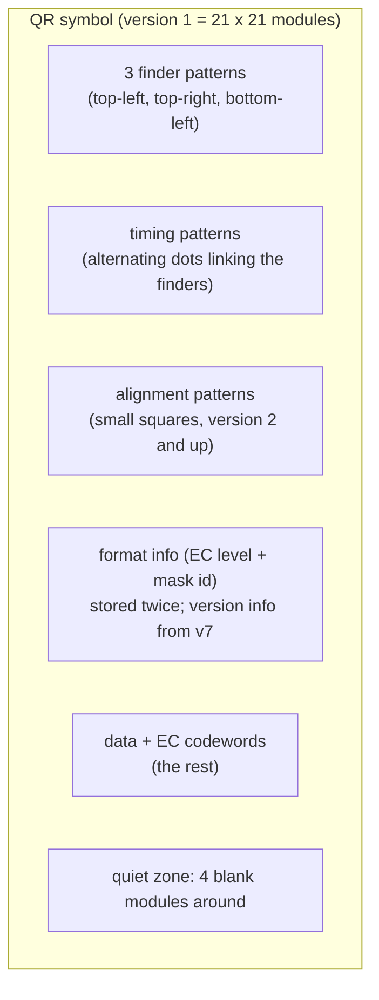
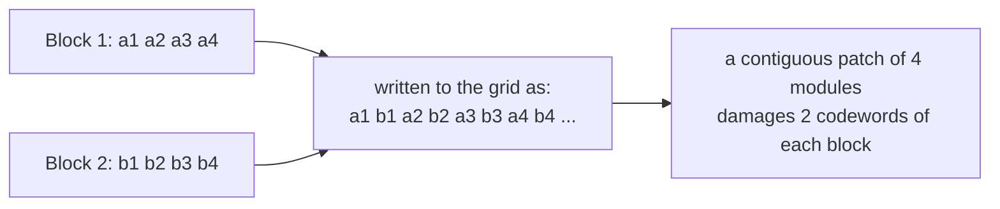
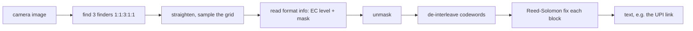

# Under the Hood: How Does a QR Code Still Scan with a Corner Torn Off? (QR codes and Reed-Solomon)

## 1. The hook

A shop's UPI QR sticker is creased, smudged with chai and half-covered by a coin tray, and your phone still reads it in a fraction of a second, from any angle, even upside down. Nobody told the camera where the code starts or which way is up. How does a grid of black and white squares carry a payment address, find itself in the picture, and survive damage?

💡 **Module:** one black or white square of the code, the "pixel" of a QR code.
💡 **Byte / codeword:** 8 bits. In QR terminology a **codeword** is one 8-bit unit of the encoded message.

---

## 2. Life before it

- Barcodes (1D, since the 1950s-70s) read left to right along a single line and hold only ~20 digits. Scan them at an angle or with a scratch across the line and the read fails.
- In the early 1990s **Denso** (a Toyota group supplier; its unit later became **Denso Wave**) needed to track car parts through factories with thousands of part types, including Japanese characters. Engineer **Masahiro Hara** and team designed a 2D code and released **QR ("Quick Response") in 1994** 🟡 (details of the story as told by Denso Wave).
- Denso Wave held the patents but chose not to enforce them, which is a big reason QR spread everywhere. It became the international standard **ISO/IEC 18004** (first edition 2000; updated since 🟡).
- Smartphone cameras (2010s) made it free to scan. In India, **UPI QR** (see [upi.md](upi.md)) put one on every shop counter, with a UPI address like `upi://pay?pa=shop@bank&pn=Shop&am=50` as the payload.

---

## 3. The clever idea

Do three jobs with one picture: **(1)** special marks that any camera can find at any rotation, **(2)** a grid of modules carrying the message **plus extra math** (Reed-Solomon error-correction codewords), and **(3)** a "mask" that scrambles the pattern so it never forms confusing shapes. Because the extra math is **spread out** across the whole symbol, a local scratch only hurts a little of each piece, and every piece can be repaired.

---

## 4. Step by step

### 4.1 The anatomy



| Part | What it does |
|---|---|
| **Finder patterns** | A 7 x 7 square-in-square at three corners. A scan line through its centre always crosses black:white:black:white:black in the ratio **1:1:3:1:1**, at any angle. Software looks for that ratio, finds the three, and the missing fourth corner tells it which way is up. |
| **Timing patterns** | Alternating black/white row and column between finders; lets the decoder count modules even if the photo is stretched or tilted. |
| **Alignment patterns** | Small squares in larger codes that correct warping (a code on a curved bottle). |
| **Format info** | 15 bits: the error-correction level (2 bits), the mask id (3 bits) and a built-in check code, written **twice** at two places so one damaged copy is survivable. |
| **Quiet zone** | The blank border (4 modules); without it the finder cannot be told apart from the background. |

**Versions** run from **1 to 40**; size is `4 x version + 17` modules per side: version 1 is 21 x 21, version 40 is 177 x 177. Version 40 at low correction holds up to ~2,953 bytes of binary data or ~7,089 digits 🟡 (from the standard's tables). Encoder picks the smallest version that fits your text.

### 4.2 Error-correction levels

You choose how much of the symbol is spent on repair data:

| Level | Can recover about | Cost |
|---|---|---|
| **L** (low) | 7% of codewords | smallest code |
| **M** (medium) | 15% | |
| **Q** (quartile) | 25% | |
| **H** (high) | 30% | biggest code for the same text |

It is a dial like the replication factor in a database: more safety, more storage. Printed logos in the middle of a QR code work because that area is "damage" the H level repairs.

### 4.3 Reed-Solomon, the QR-specific part

[erasure-coding.md](erasure-coding.md) explains Reed-Solomon (RS) and the arithmetic over GF(256) (a number system with 256 values, so every symbol is one byte). Same idea here: `k` data bytes plus `2t` repair bytes can fix up to `t` wrong bytes **even when you do not know which ones are wrong** (storage systems know which disk died; a camera does not know which module was smudged). Difference from storage: the repair bytes also have to **find** the errors, which costs twice as many.

Real example from the standard's tables 🟡: **version 1, level H** has 26 codewords in total: 9 data and 17 repair. 17 repair bytes fix up to `floor(17 / 2) = 8` wrong bytes out of 26 (about 31%, matching "30%" for H). **Version 1, level L**: 19 data, 7 repair, fixes 3 wrong bytes (about 12% of 26, while the nominal figure is 7% since the standard is conservative and counts differently for larger symbols).

An RS block can be at most 255 codewords (one byte-sized field), so big symbols are cut into several **blocks**, each with its own repair bytes.

### 4.4 Interleaving: why a scratch is survivable

If block 1 were stored first, then block 2, a torn corner would wipe out most of one block and none of the others, and block 1 would be unrecoverable. So the encoder **interleaves**:



Data codewords of all blocks are taken one column at a time, then the repair codewords the same way. A damaged patch of the grid is therefore a few codewords from **every** block instead of all of one, and each block only needs to fix its small share. Analogy: spreading replicas of a service across racks so one rack failure takes down a bit of each, not all of one.

### 4.5 Masking: avoid ugly patterns

Real data can contain long runs of white or an accidental look-alike of a finder pattern, which confuses scanners. The encoder defines **8 mask patterns** (e.g. flip every module where `(row + column)` is even). It tries all 8, **scores** each result on four penalty rules (long same-colour runs, 2 x 2 blocks, finder-like 1:1:3:1:1 shapes, imbalance of black vs white) and keeps the lowest score. The chosen mask's id goes into the format info, so the decoder can flip the same modules back (XOR is its own undo). The format info itself is masked with a fixed pattern.

### 4.6 The reading pipeline



---

## 5. Where you've used it without knowing

- UPI shop stickers, PhonePe/GPay payment screens, menu cards, boarding passes, Wi-Fi sharing (`WIFI:T:WPA;S:name;P:pass;;`), WhatsApp Web login, 2FA app setup (`otpauth://` links).
- Dynamic UPI QR on a POS machine encodes the exact amount; the static sticker encodes only the shop's address. Both are just text that the QR layer carries without understanding it.

---

## 6. Limits and trade-offs

- **Higher EC = bigger code = harder to scan at a distance.** Use M for ordinary text; H only when you overlay a logo or print on rough surfaces.
- **Error correction is not security.** Anyone can print a QR code; a sticker pasted over a shop's real one sends money to someone else. The code carries no signature. (Real UPI apps show the payee name for you to confirm; check it.)
- Reed-Solomon fixes **random byte damage**. Damage to all three finder patterns, or to both copies of the format info, is fatal.
- **Capacity** has a ceiling (~3 KB). It is a pointer (a URL), not a file.
- Short URLs make small, easy codes; long UTM-tagged URLs make dense ones that cheap cameras struggle with. See [url-shortener](../HLD/interviews/url-shortener/README.md) for the matching design problem.

---

## 7. Try it

`qrencode` is not installed on every machine; either install it (`apt install qrencode`, `brew install qrencode`) or use Python:

```sh
qrencode -t ANSIUTF8 'upi://pay?pa=test@upi'            # prints the code in the terminal
qrencode -l H -o h.png 'upi://pay?pa=test@upi'          # level H, as an image
pip install segno && python3 -c "import segno; segno.make('upi://pay?pa=test@upi', error='m').terminal(compact=True)"
```

We ran the Python version (`qrencode` was not available in our sandbox). Real output for level M:

```text
█▀▀▀▀▀▀▀█▀▀▀█▀▀▀▀██▀▀▀▀▀▀▀█
█ █▀▀▀█ █▀▄▄█▄▀▀▀██ █▀▀▀█ █
█ █   █ ██▀▄█  ▄█▄█ █   █ █
█ ▀▀▀▀▀ █ ▄ ▄▀█ █ █ ▀▀▀▀▀ █
█▀█▀███▀▀██ ▀▄█▄ ███▀██▀█▀█
██▀█▄▄█▀▀▄ ▀▄█▀  ▄▄▄█▀█ █ █
██▀▀▀▄█▀▄█ ██▄██▀ ▄ █▄██▀▀█
█▀ ▀ █▄▀█   ▀█ ▀    ▄▀▀▄▄ █
█▀▀▄▀ █▀▄  █▀▀▀ ▀ ▀▀▀▀▀█▄▀█
█▀▀▀▀▀▀▀█ ▄ █ ▀▀▄ █▀█ ▄▄▄ █
█ █▀▀▀█ ██▀▄▄▄▀▀  ▀▀▀ ▀█▄▀█
█ █   █ █▀██▀█▄█▄█ ██ ▄▄ ▀█
█ ▀▀▀▀▀ █▀  ▀▀ █  █▀▀▀▄██▀█
▀▀▀▀▀▀▀▀▀▀▀▀▀▀▀▀▀▀▀▀▀▀▀▀▀▀▀
```

Look for the three nested-square finder patterns (top-left, top-right, bottom-left) and the dotted timing line between them. This 22-character payload fits **version 2 (25 x 25 modules)** at levels L and M, but needs **version 3 (29 x 29)** at Q and H: the same text, a bigger grid, because more of it is repair data (measured with segno's `symbol_size`).

Things to try: render the same text at L and H and compare sizes; open the PNG in an image editor, paint a black rectangle over one data corner (not a finder) and scan with your phone at level L vs H to see where recovery stops; scan the UPI QR on a shop and read the text with any QR reader before paying.

---

## 8. Where it shows up

- [UPI](upi.md): the QR is how payer apps learn the payee address.
- [Erasure coding](erasure-coding.md): same Reed-Solomon math, applied to disks instead of pixels.
- [URL shortener](../HLD/interviews/url-shortener/README.md): short links give lighter QR codes.

---

## 9. Sources

- ISO/IEC 18004 (QR Code symbology; first edition 2000; later revisions).
- Denso Wave, "QR Code" history and specification pages (qrcode.com) 🟡.
- I. S. Reed and G. Solomon, "Polynomial Codes over Certain Finite Fields", *J. SIAM* (1960).
- Thonky.com QR tutorial (tables of codewords per version/level; used for the version 1 numbers) 🟡.
- 🟡 = recalled from the standard or tutorials, not re-verified here: block layouts, capacity figures, the 1994 origin story details.
