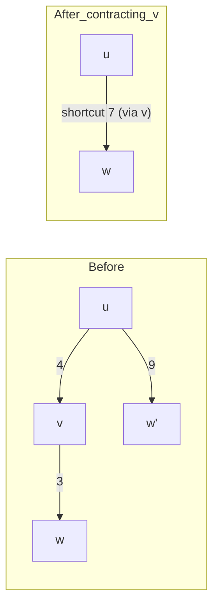
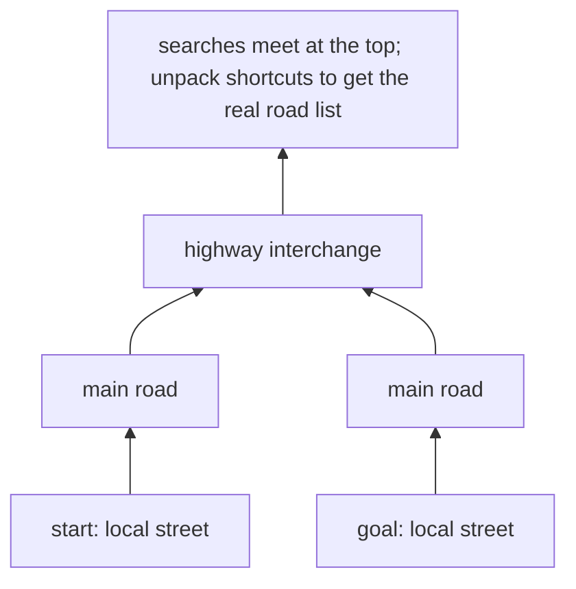

# Under the Hood: How Does a Maps App Find a Route Across a Country in Milliseconds? (route planning)

## 1. The hook

You type "Delhi to Mumbai" and a route appears before your thumb leaves the screen. The road network of a country has tens of millions of intersections, and the textbook shortest-path algorithm would visit a big fraction of them. So how does the answer arrive in a few milliseconds, and why does the "obvious" algorithm take seconds?

💡 **Graph:** points (**nodes**) joined by links (**edges**). For maps: nodes are intersections, edges are road segments, and each edge carries a **weight** (travel time or distance).
💡 **Millisecond (ms) / microsecond (µs):** 1/1,000 and 1/1,000,000 of a second. A blink takes ~100 ms.

---

## 2. Life before it

- **Dijkstra (1959)**, from Edsger Dijkstra's three-page paper: grow a "settled" region outward from the start, always settling the closest unsettled node next. Correct and simple, and still the base of everything below.
- **A\* (1968)**, Hart, Nilsson and Raphael (Stanford Research Institute, for the Shakey robot): same idea, but steer toward the goal using a guess of the remaining distance.
- **Bidirectional search**: run one search from the start and one backward from the goal; they meet in the middle.
- By the early 2000s, road graphs with **18 to 24 million nodes** (Western Europe, the US; the standard research benchmarks 🟡) made a plain Dijkstra query take **seconds**. Fine for a research toy, unusable for a server answering thousands of requests per second.
- **Contraction Hierarchies (CH)**, Geisberger, Sanders, Schultes and Delling (2008), changed the game by moving work from query time to a one-off **preprocessing** step.

---

## 3. The clever idea

Long trips always use the same few "important" roads (highways), so **precompute shortcuts that jump over unimportant intersections**. At query time the search only climbs up the hierarchy (local street, then main road, then highway) and touches a few hundred to a few thousand nodes instead of millions.

---

## 4. Step by step

### 4.1 Why Dijkstra is slow (real numbers)

Dijkstra settles nodes in order of distance, so its explored area is a **disc** around the start that grows until it reaches the goal. For a trip across the country the disc covers a large share of the map.

Arithmetic for Western Europe (🟡 ~18 million nodes): a cross-country query settles roughly half the nodes, about 9 million. Each settle costs ~200 ns (a heap operation plus memory misses; 💡 a **heap** or **priority queue** is a structure that always hands you the smallest item next). 9,000,000 x 200 ns = 1.8 s per query. At 1,000 queries per second you would need ~1,800 CPU cores just for routing.

Try it on a small map with [`code/RouteDemo.java`](code/RouteDemo.java): a 200 x 200 grid (40,000 nodes), seeded random edge costs of 10 to 12, corner to corner.

### 4.2 A\* and bidirectional search: smarter, but not enough

A\* picks the next node by `cost so far + guess of cost left`. The guess (**heuristic**) must never overestimate, or A\* can miss the best route. Straight-line distance times the cheapest cost per unit never overestimates, since no road is shorter than a straight line. Bidirectional search halves the radius of each disc, so two discs of radius r/2 have half the area of one disc of radius r (area grows with the square of the radius).

The demo's honest result: for far-apart corners, **both help only a little** (91% and 97% of the map still settled), because the random road costs make the guess loose and every detour is nearly as good as the best path. For a short trip A\* shines (37 nodes vs 312). Real maps with highways are worse for A\*: the guess is "55 m/s everywhere", but most roads are slower, so the guess is far from the truth.

### 4.3 Contraction Hierarchies: precompute the shortcuts

**Preprocessing (once per map, offline):**

1. Rank every node by "importance" (a cul-de-sac is low, a highway interchange is high).
2. Take the least important node `v` and **contract** it: remove it, and for every pair of neighbours `u -> v -> w`, check whether the shortest path from `u` to `w` really goes through `v`. If yes, add a **shortcut edge** `u -> w` with the combined weight. (The check is a small local search called a **witness search**: if another path as short exists, no shortcut is needed.)
3. Repeat until every node is contracted. The final graph = original edges + shortcuts, each node carrying its rank.



**Query (milliseconds):** run a bidirectional Dijkstra where the forward search from the start may only follow edges **to higher-ranked** nodes, and the backward search from the goal likewise. Both searches climb toward the "highway layer" and meet at the top. Shortcuts keep the cost exact, so the answer is still the true shortest path.



Numbers reported in the 2008 paper 🟡 (Western Europe, 2008 hardware): preprocessing in the order of **tens of minutes**, query in the order of **a fraction of a millisecond**, searching a few hundred nodes, a speed-up of **several thousand times** over Dijkstra. Treat the exact figures as unverified; the orders of magnitude are what to remember: 9,000,000 nodes before, ~500 after.

### 4.4 Real roads change: traffic

CH precomputes with **fixed weights**. But "Delhi ring road at 6 pm" has a different cost than at 3 am, and an accident changes it right now. Redoing hours of preprocessing every few minutes is impossible. The answer is to **split preprocessing in two**:

- **Metric-independent part (slow, rare):** the structure of the graph (which nodes group together, which cells touch).
- **Metric-dependent part (fast, frequent):** fill in the weights on that structure; takes seconds.

This is **Customizable Route Planning (CRP)**, Delling, Goldberg, Pajor and Werneck (Microsoft Research, 2011) 🟡; it cuts the map into nested cells, precomputes shortest distances between each cell's border nodes, and re-computes only those when traffic weights change. Open-source OSRM offers both CH and a multi-level (cell-based) mode for the same reason 🟡. Which production map service uses what exactly is not public; do not state it as fact.

Infra analogy: CH is a **build step** (compile once, fast to run); CRP is a build step with **config separated from code**, so a config change (live traffic) needs a quick re-link rather than a full rebuild.

---

## 5. Where you've used it without knowing

- Every "ETA to destination" and "fastest route" in a maps app, and the three alternative routes it shows.
- **Ride-hailing**: matching a rider to the nearest driver by **road time**, not straight-line distance, because a driver 300 m away across a river is far. See [ride-sharing](../HLD/interviews/ride-sharing/README.md) and the Uber [case study](../case-studies/uber-from-monolith-to-h3-and-microservices.md).
- Delivery apps' rider assignment, logistics route optimisation, game AI pathfinding (A\* is the staple there).
- First narrow candidates with a [geospatial index](../HLD/concepts/geospatial-indexing.md) (who is within ~2 km), then run the route engine only on those few candidates.

---

## 6. Limits and trade-offs

- **Preprocessing cost and memory**: the shortcuts add roughly as many edges as the map already has 🟡; a new map version needs a rebuild.
- **Frozen weights**: plain CH cannot take live traffic cheaply (that is the CRP motivation above). Many systems accept a hybrid: static CH for the base network plus a periodic re-customise.
- **One cost function per preprocessing**: car, bike and walk need separate hierarchies; "avoid tolls" needs another or a slower fallback.
- **Turn costs and restrictions** ("no right turn") complicate the graph, usually by turning each road end into its own node.
- **Exactness**: the methods above return the true shortest path. Some systems trade that for speed; say so in an interview if you propose it.

---

## 7. Try it

```sh
cd under-the-hood/code
java RouteDemo.java
```

Real output (Java 21, seed 42; node counts are deterministic, costs depend on the seed):

```text
Graph: 200 x 200 grid = 40,000 nodes, edge cost 10..12
Route: top-left corner to bottom-right corner

Dijkstra               cost=4089  nodes settled=40,000 (100.0% of map)
A* (10 x Manhattan)    cost=4089  nodes settled=36,548 (91.4% of map)
Bidirectional          cost=4089  nodes settled=38,661 (96.7% of map)

All three agree on the cost.

Short trip (13 blocks apart): Dijkstra settles 312, A* settles 37
```

Things to try: change the edge cost range to `10 + rnd.nextInt(11)` (10 to 20) and watch A\* get worse; raise the heuristic to `15 *` (no longer a lower bound). Real result when we tried it: A\* settles only 399 nodes (1.0%) but returns cost 4,262 instead of 4,089, a route 4.2% longer than the best. That is the speed-vs-exactness dial. The demo does not implement CH: that needs the contraction step above, and the point is to feel why the three classic methods stall. The OSRM project (open source, uses OpenStreetMap data) lets you run CH yourself.

---

## 8. Where it shows up

- [Ride-sharing HLD](../HLD/interviews/ride-sharing/README.md): ETA service and matching.
- [Geospatial indexing](../HLD/concepts/geospatial-indexing.md): the candidate-filter step before routing.
- [Uber case study](../case-studies/uber-from-monolith-to-h3-and-microservices.md).

---

## 9. Sources

- E. W. Dijkstra, "A note on two problems in connexion with graphs", *Numerische Mathematik* (1959).
- P. Hart, N. Nilsson, B. Raphael, "A Formal Basis for the Heuristic Determination of Minimum Cost Paths", *IEEE Trans. SSC* (1968).
- R. Geisberger, P. Sanders, D. Schultes, D. Delling, "Contraction Hierarchies: Faster and Simpler Hierarchical Routing in Road Networks", WEA (2008).
- D. Delling, A. Goldberg, T. Pajor, R. Werneck, "Customizable Route Planning", SEA (2011) 🟡 year and venue from memory.
- OSRM project documentation (CH and MLD algorithms) 🟡.
- 🟡 = from memory, not re-checked: graph sizes, preprocessing and query times, shortcut counts.
