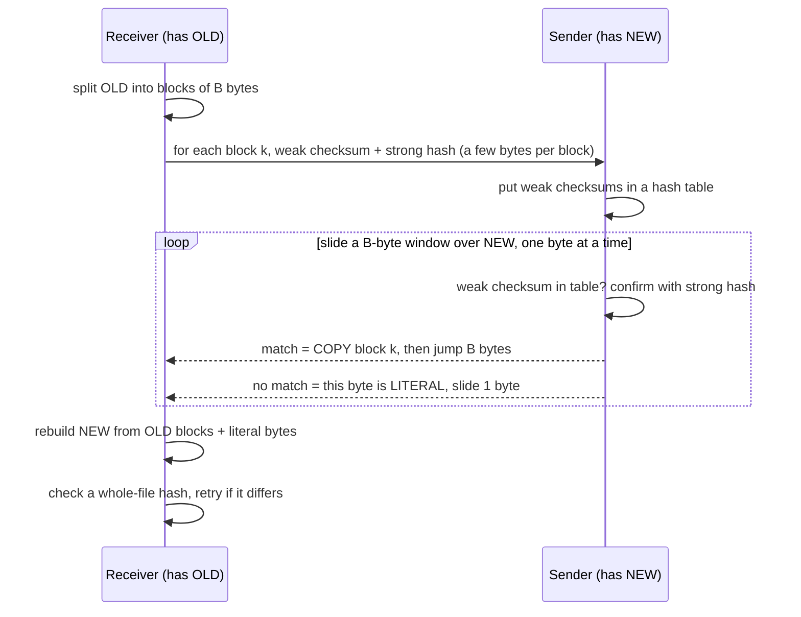

# Under the Hood: How Does rsync Send Only the Bytes That Changed? (rolling checksums)

## 1. The hook

You have a 100 MB file on a server. You change 1 MB in the middle on your laptop and run `rsync`. It finishes in a second and reports it sent about **1 MB**, not 100 MB.

Think about how odd that is. The **receiver** has the old file. The **sender** has the new file. Neither side has the other's copy, so neither can run `diff`. And if you insert one byte at the very start, every byte after it moves one position to the right, so even "compare block 1 with block 1" fails everywhere. Yet rsync still sends almost nothing (measured in §7: **1 literal byte** for a 100 MB file).

The answer is a checksum that can **slide** along a file one byte at a time for almost no cost. That's the **rolling checksum**, the heart of the rsync algorithm.

💡 **Checksum / hash:** a short number computed from a block of data; the same data always gives the same number, and different data almost always gives a different one. Comparing two 16-byte hashes is much cheaper than shipping two 2 KB blocks to compare them.

---

## 2. Life before it

### Attempt 1: copy the whole file
`scp` and `ftp` send every byte, every time. Fine on a LAN, painful over the 1990s internet, and still painful today for big files:

```text
1 GB file over a 10 Mbit/s link (10 Mbit/s ÷ 8 = 1.25 MB/s):
1,024 MB ÷ 1.25 MB/s ≈ 819 s ≈ 14 minutes, to ship a change of 1 MB
```

### Attempt 2: `diff` and `patch`
`diff old new` produces a tiny patch, but it needs **both files on the same machine**. Getting the old file to the sender is the very transfer you're trying to avoid.

### Attempt 3: compare fixed blocks by hash
Receiver hashes block 0, block 1, block 2... of its old file and sends the list; sender hashes the same positions of the new file and sends the blocks whose hash differs. This works for **in-place** changes. But insert one byte at offset 0 and every block boundary in the new file is shifted by one: **no block matches** (our demo in §7 measures 0 of 512). Inserting text is the most common edit there is.

In **June 1996, Andrew Tridgell and Paul Mackerras** at the Australian National University published the technical report *The rsync algorithm* (TR-CS-96-05) and released the `rsync` tool. Tridgell (also the creator of Samba) later made it the core of his 1999 PhD thesis.

---

## 3. The clever idea

**The receiver hashes its old file in fixed blocks. The sender checks every byte offset of the new file, not just multiples of the block size, for a block that matches one of those hashes.** That would be far too slow with a normal hash, so rsync uses a cheap **weak checksum that can be updated in O(1) when the window slides by one byte**, and confirms the rare hits with an expensive **strong hash**.

💡 **O(1):** constant time; the cost doesn't grow with the block size. Sliding a 2 KB window costs the same few additions as sliding a 128 KB one.

---

## 4. Step by step

### The protocol



💡 **Hash table:** a lookup structure (like Java's `HashMap`) that finds a key in about one step regardless of how many keys it holds. **Literal bytes:** raw data sent as-is because no block in the old file matched.

### The rolling (weak) checksum
For the window of bytes `X[k] ... X[l]` (length `B = l − k + 1`), rsync keeps two 16-bit sums:

```text
a(k,l) = ( X[k] + X[k+1] + ... + X[l] )                      mod 2^16
b(k,l) = ( B·X[k] + (B−1)·X[k+1] + ... + 1·X[l] )            mod 2^16
weak   = a + 2^16 · b            (one 32-bit number)
```

Slide the window right by one byte (drop `X[k]`, add `X[l+1]`):

```text
a(k+1, l+1) = a(k,l) − X[k] + X[l+1]
b(k+1, l+1) = b(k,l) − B·X[k] + a(k+1, l+1)
```

Two subtractions, two additions, one multiply: **the same cost for B = 700 bytes or B = 128 KB.** Recomputing a normal hash from scratch at every offset would cost B operations per offset instead.

💡 **mod 2^16:** keep only the remainder after dividing by 65,536, i.e. keep the low 16 bits. The sums wrap around instead of growing forever. **Fletcher / Adler-32:** classic checksums built the same way from a plain sum plus a weighted sum (Adler-32 is the one inside zlib/gzip). rsync's weak checksum is a close cousin.

A tiny worked roll, window size B = 3, bytes `[10, 20, 30, 40]`:

| Window | a | b | How |
|---|---|---|---|
| `[10, 20, 30]` | 60 | 3·10 + 2·20 + 1·30 = 100 | computed from scratch |
| `[20, 30, 40]` | 60 − 10 + 40 = **90** | 100 − 3·10 + 90 = **160** | rolled in O(1) |
| check | 20 + 30 + 40 = 90 ✓ | 3·20 + 2·30 + 1·40 = 160 ✓ | from scratch, same answer |

### Why two hashes
- The **weak** checksum is cheap but only 32 bits and easy to collide: different blocks sometimes share it. It's a filter: "maybe a match".
- The **strong** hash (MD4 in 1996, MD5 later, xxHash options since rsync 3.2 in 2020) is computed only when the weak one hits, so its cost is paid a few hundred times, not millions.
- After rebuilding, the receiver compares a **whole-file** strong hash. If an unlucky collision slipped through, rsync redoes the file. Correctness never depends on luck.

💡 **MD4 / MD5 / xxHash:** functions producing a 128-bit fingerprint of data. MD4/MD5 are too broken for security today but are still fine for "did this block change by accident?". xxHash is a newer, much faster non-cryptographic hash. **Collision:** two different inputs with the same hash.

### What happens on an insertion
Insert 3 bytes at offset 0. The sender's window at offset 0 doesn't match anything, so byte 0 is literal; slide; offset 1, literal; offset 2, literal; at **offset 3** the window covers exactly old block 0: match, copy, jump 2 KB, and every later block lines up again. Cost: 3 literal bytes. The rolling search **re-finds the alignment by itself**.

### Arithmetic: 1 GB file, 1 MB changed in the middle

```text
block size B ≈ √(file size)  (rsync's default rule, capped at 128 KB)
√1,073,741,824 = 32,768 bytes = 32 KB
blocks       = 1 GB ÷ 32 KB = 32,768 blocks
signatures   = 32,768 × (4-byte weak + 16-byte strong) = 655,360 bytes ≈ 640 KB   (receiver → sender)
changed      = 1 MB ÷ 32 KB = 32 blocks, +1 if the edit isn't block-aligned = 33 blocks
literal data ≈ 33 × 32 KB ≈ 1.03 MB                                          (sender → receiver)
total        ≈ 0.64 + 1.03 ≈ 1.7 MB   vs 1,024 MB for a full copy  → ~600× less
at 1.25 MB/s: ~1.4 s instead of ~14 min
```

Real rsync truncates the strong hash it sends per block (it measured ~7 bytes per block on the wire in §7), so its signature traffic is smaller than this 20-byte model.

---

## 5. Where you've already used it

| You used | What happens |
|---|---|
| `rsync` over SSH (deploy scripts, backups, copying logs or build artifacts between boxes) | exactly this algorithm; note that **local** copies (`rsync a/ b/`) default to `--whole-file`, because reading both files costs more than just copying |
| **librsync** / `rdiff` | the same algorithm as a library: `rdiff signature`, `rdiff delta`, `rdiff patch` as three separate steps. Used by Duplicity backups. Dropbox's early desktop client is reported to have used librsync for deltas (🟡 unverified here) |
| **zsync** (Colin Phipps, 2005) | rsync turned around for HTTP downloads: the server publishes a `.zsync` file of block checksums once, the *client* does the rolling search against its old copy and fetches only the missing ranges with HTTP range requests. Used for Linux ISO / AppImage updates |
| **Container image pushes** | *not* rsync: layers are content-addressed whole tarballs (named by their SHA-256), and a push skips layers the registry already has. Change one byte in a layer and the whole layer is re-uploaded |
| **Git packfiles** | not rsync either: both versions are on the same machine, so Git computes a copy/insert delta locally (`diff-delta.c` indexes the base object with a small Rabin-style rolling hash, same family of trick) ([Git object store](git-object-store.md)) |

💡 **SSH:** the encrypted remote-shell protocol; rsync usually runs as `rsync` on both ends talking over an SSH connection. **HTTP range request:** asking a web server for bytes `X–Y` of a file instead of the whole thing.

The same "send fingerprints first, then only what differs" idea shows up between database replicas as [Merkle trees and anti-entropy](../HLD/concepts/merkle-trees-and-anti-entropy.md), and between backup clients and stores as [content-defined chunking](content-defined-chunking.md).

---

## 6. Limits and trade-offs

- **The sender does the CPU work.** It reads the whole new file, rolls a checksum at every non-matching offset and does a hash-table lookup at each. A server syncing to thousands of clients (a mirror) pays this per client; that's why zsync moved the work to the client. The receiver reads its whole old file too: rsync trades **disk I/O and CPU for network**.
- **Block size is a trade-off.** Small blocks find small changes precisely but mean more signatures; big blocks are cheap to describe but a 1-byte change costs a whole block of literals:

  ```text
  1 GB file, 2 KB blocks:  524,288 blocks × 20 B = 10 MB of signatures, 1-byte edit costs ~2 KB
  1 GB file, 1 MB blocks:    1,024 blocks × 20 B = 20 KB of signatures, 1-byte edit costs ~1 MB
  ```

  `√(file size)` balances the two; `--block-size` overrides it.
- **Compressed and encrypted files defeat it.** Change one byte before gzip/zip/encryption and the output changes from that point to the end (compression) or everywhere (good encryption is designed so). No blocks match, so rsync sends everything. Workarounds: sync the uncompressed data, or `gzip --rsyncable` / `zstd --rsyncable`, which reset the compressor at content-defined points so a change stays local.
- **It's one file versus its own old version.** rsync doesn't dedupe across *different* files or users; a renamed or moved file is a full copy unless you use `--fuzzy`. Backup systems that want "store each chunk once across everything" use [content-defined chunking](content-defined-chunking.md) instead.
- **It needs a round trip and the old file present.** Fine for sync; useless for a first upload. For "resume a big upload after a failure" you want [chunked/resumable uploads](../HLD/concepts/resumable-and-chunked-uploads.md), not deltas.

💡 **Round trip:** a message there and a reply back; on a high-latency link (latency = travel time of one message) each one costs tens to hundreds of ms.

---

## 7. Try it

**Run the demo** in [`code/RollingHashDemo.java`](code/RollingHashDemo.java): the whole algorithm on a 1 MB random "file" with 2 KB blocks, a 3-byte insertion at the start, 100 bytes overwritten at ~500 KB and a 50-byte insertion at ~700 KB.

```sh
cd under-the-hood/code
java RollingHashDemo.java
```

Real output (Java 21, Linux):

```text
old file 1,048,576 bytes, new file 1,048,629 bytes, block size 2,048 -> 512 blocks
edits: +3 bytes at offset 0, 100 bytes changed at ~500 KB, +50 bytes at ~700 KB

blocks matched at the SAME offset (no rolling): 0 of 512

rolling search: weak-checksum hits 510, of which false alarms 0
matched blocks (copy instructions): 510 of 512
literal bytes sent: 4,149 in 3 runs
receiver -> sender (signatures): 10,240 bytes
sender -> receiver (delta):      6,201 bytes
total on the wire: 16,441 bytes = 1.6% of the 1,048,629-byte file
rebuilt == new file: true
```

What to notice:
- **0 of 512** blocks match at fixed offsets: the 3-byte insertion at the start broke Attempt 3 completely.
- Literal bytes = 3 (the insertion) + 2,048 (the block holding the 100 changed bytes) + 2,098 (the block split by the 50-byte insertion, plus those 50 bytes) = **4,149**. Exactly what the theory predicts.
- The receiver rebuilt a byte-identical file from its old copy plus 6 KB of instructions.

**Real rsync** (rsync 3.2.7, two local folders; `--no-whole-file` forces the delta algorithm, which local copies skip by default):

```sh
mkdir -p src dst && head -c 100M /dev/urandom > src/big.bin && rsync -a src/ dst/
dd if=/dev/urandom of=src/big.bin bs=1M count=1 seek=50 conv=notrunc   # overwrite 1 MB at offset 50 MB
rsync -av --no-whole-file --stats src/ dst/
```

```text
Total file size: 104,857,600 bytes
Literal data: 1,054,720 bytes
Matched data: 103,802,880 bytes
Total bytes sent: 1,095,645
Total bytes received: 71,719
total size is 104,857,600  speedup is 89.82
```

Literal data = 103 blocks × 10,240 bytes: rsync chose `√104,857,600 = 10,240`-byte blocks, and the 1 MB edit covered 102.4 of them. "Total bytes received" (71 KB) is the signature list: ~7 bytes for each of the 10,240 blocks. Then insert a single byte at the very front:

```sh
(printf 'X'; cat src/big.bin) > src/tmp && mv src/tmp src/big.bin
rsync -av --no-whole-file --stats src/ dst/
```

```text
Literal data: 1 bytes
Matched data: 104,857,600 bytes
Total bytes sent: 41,089
```

One literal byte. Without `--no-whole-file` the same local run reported `Literal data: 104,857,600 bytes`, `Matched data: 0 bytes`.

---

## 8. Where it shows up in this repo

- [File storage & sync](../HLD/interviews/file-storage-sync/README.md): "the user edited 1 MB of a 1 GB file, what do we upload?" is the core deep dive.
- [Chunking and block-level dedup](../HLD/concepts/chunking-and-block-level-dedup.md): fixed blocks vs rsync-style deltas vs content-defined chunks, in a design.
- [File sync and conflict resolution](../HLD/concepts/file-sync-and-conflict-resolution.md): what happens after the bytes arrive.
- [Content-defined chunking](content-defined-chunking.md): the sibling trick that dedupes across files and users, built on the same rolling-hash idea.
- [Content fingerprinting and dedup](../HLD/concepts/content-fingerprinting-and-dedup.md): hashing whole files/pages to skip exact duplicates.
- [Resumable and chunked uploads](../HLD/concepts/resumable-and-chunked-uploads.md) and [object storage](../HLD/technologies/object-storage.md): where uploaded blocks end up.
- [Merkle trees and anti-entropy](../HLD/concepts/merkle-trees-and-anti-entropy.md): the replica-to-replica version of "compare fingerprints, ship only the difference".

## 9. Sources

- Andrew Tridgell, Paul Mackerras, *The rsync algorithm*, Technical Report TR-CS-96-05, Australian National University (June 1996): the protocol, the rolling checksum formulas, two-level hashing.
- Andrew Tridgell, *Efficient Algorithms for Sorting and Synchronization*, PhD thesis, ANU (1999).
- rsync man page and `NEWS` (rsync 3.2.0, 2020: xxHash checksum choices); default block size ≈ √(file size), max 128 KB in protocol 30+ (from the man page / source, and consistent with the 10,240-byte blocks measured above).
- John G. Fletcher, *An Arithmetic Checksum for Serial Transmissions* (IEEE Trans. Communications, 1982); Mark Adler, Adler-32 in zlib (1995).
- Colin Phipps, *zsync: optimised rsync over HTTP* (technical paper, 2005); librsync / `rdiff` documentation.
- Dropbox's use of librsync: commonly reported (e.g. Drago et al., *Inside Dropbox*, IMC 2012, and the client's open-source acknowledgements) but 🟡 not verified for this page.
- The demo and `rsync --stats` outputs were produced by running them in this environment (Java 21, rsync 3.2.7).

⬅️ [Under the Hood index](README.md) · 🏠 [Home](../README.md)
