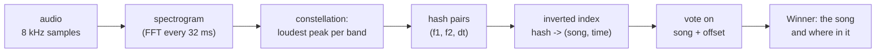
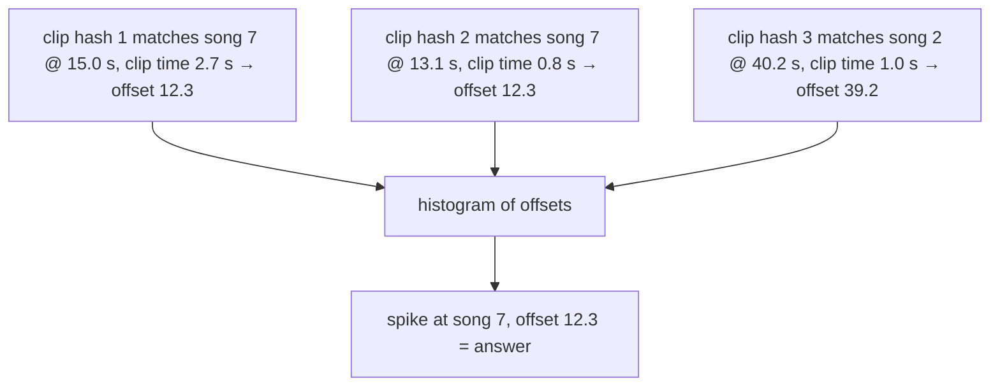

# Under the Hood: How Is a Song Recognised in 3 Seconds in a Noisy Cafe? (audio fingerprinting)

## 1. The hook

A song plays in a cafe: chatter, coffee machine, a bad phone microphone. You hold up your phone for three seconds and it names the track, even though your recording shares almost **no samples** with the studio file (different volume, echo, noise, compression). Out of tens of millions of songs, how can a server find the one match in under a second, and why does background noise not break it?

---

## 2. Life before it

- Comparing recordings sample by sample fails: any change in volume, speed or noise changes every number. See [how-sound-is-stored.md](how-sound-is-stored.md): audio is just a long list of integers.
- Early ideas used whole-clip features like loudness or overall pitch, which are too coarse to separate millions of songs, or compared long stretches directly, which is far too slow at scale.
- **Shazam** began in London around 1999-2000 (Chris Barton, Philip Inghelbrecht, Dhiraj Mukherjee, Avery Wang). Early on, in the 2000s, you dialled **2580**, held the phone to the music, and got the answer back as a text message. Avery Wang published the method: *An Industrial-Strength Audio Search Algorithm* (ISMIR, 2003).
- The search problem is the same as "find these words in a million documents", just with sound: use an [inverted index](../HLD/concepts/inverted-index.md).

---

## 3. The clever idea

Throw away almost everything and keep only the **loudest dots on the spectrogram** (the "constellation"), then record **pairs of dots** as hashes. Dots survive noise because loud things stay loud; pairs make each hash specific enough to look up; and a **vote on time offsets** turns thousands of messy lookups into one confident answer.

---

## 4. Step by step



### 4.1 Spectrogram

💡 **FFT (fast Fourier transform):** a quick way to split a short slice of sound into "how much of each pitch is in it". Do it every few milliseconds and stack the slices: that picture (time across, pitch up, brightness = loudness) is the **spectrogram**. Basics in [how-sound-is-stored.md](how-sound-is-stored.md).

### 4.2 Constellation of peaks

Keep only points that are the **strongest in their neighbourhood** (our demo takes the loudest bin in each of 4 frequency bands per frame; production uses local maxima over time and frequency). Why this survives noise: a cafe adds a faint hiss everywhere, but it rarely **outshouts the loudest note** at a given moment. Peaks stay put; only some get lost, and a few false ones appear. It also survives lossy compression (MP3, phone codec) which mostly removes quiet detail.

### 4.3 Hash pairs

One peak alone, `(f1 = 880 Hz at t = 5.2 s)`, appears in countless songs. A single peak carries about 9-10 bits of information (🟡 Wang's paper mentions 10-bit frequencies); useless as a key. So pair an **anchor peak** with a few peaks in a "target zone" just after it:

`hash = (f1, f2, dt)`, with `dt` the time gap between them. About 10 + 10 + 10 bits = **30 bits** → over a billion possible values (2^30 = 1,073,741,824). The hash uses only **relative** time, so it is the same whether the clip starts at 0 s or 2 minutes in. The record stored is `hash -> (songId, anchorTime)`.

Fan-out multiplies robustness: if each anchor makes 5 pairs, losing one peak costs only a few hashes, not the anchor's whole identity.

### 4.4 Index and query

Index: for every hash from every song, append `(songId, anchorTime)` to that hash's list (exactly a posting list in an [inverted index](../HLD/concepts/inverted-index.md)).

Query: fingerprint the 3 s clip the same way (about 600 hashes per second of audio in the demo → 1,816 for 3 s, where production is tuned lower 🟡), look up each hash, and collect the matching `(songId, anchorTime_in_song)` entries.

### 4.5 Voting on the time offset

Most matches are **coincidences** (a hash that also appears elsewhere by chance). The genuine ones share a secret: the clip started `T` seconds into the song, so for **every true match**, `anchorTime_in_song - anchorTime_in_clip = T`. Count votes per `(songId, T)`:

- Wrong songs: coincidences scatter over many different offsets → a handful of votes each.
- The right song: hundreds of hashes agree on one offset → a tall spike.



This is also why it can say **where** in the song you are.

### 4.6 Scale arithmetic

Assume 50 million songs x 200 s average = 10,000,000,000 s of audio. At ~20 stored hashes per second (a realistic thinning 🟡), that is 200 billion entries. Each entry = songId (4 bytes) + time (4 bytes) = 8 bytes → 200e9 x 8 = **1.6 TB**: it fits in a few machines' RAM or SSD, sharded by hash. A query touches ~100-2,000 posting lists; each list is a few thousand entries on average (200e9 / 2^30 ≈ 186 entries per 30-bit hash value). So a lookup reads on the order of 2,000 x 186 = ~370,000 entries (about 3 MB) and finishes in milliseconds (the time is dominated by the phone's network). Compare this with the demo's 20 songs.

---

## 5. Where you've used it without knowing

- Shazam / Google "Now Playing" / Siri song ID; YouTube **Content ID** uses fingerprints (a related but different scheme) to flag copyrighted uploads; radio and TV monitoring for royalties and ad verification.
- Duplicate detection of files and media: same family of "fingerprint, don't compare the bytes" ideas, see [content-fingerprinting-and-dedup.md](../HLD/concepts/content-fingerprinting-and-dedup.md).

---

## 6. Limits and trade-offs

- **Needs the same recording.** It matches a specific studio master (or a live recording already indexed). A cover version, humming, or a different tempo has different peaks and fails; humming search ("query by humming") is a different, harder technique.
- **Speed changes** (a DJ pitching a track up 8%) shift all frequencies and times; basic fingerprints break, so later systems add tolerance.
- **Noise limit:** below roughly 0 dB or lower SNR (🟡 Wang reports working at -6 to -9 dB with good conditions) peaks drown. The demo below succeeds at -6 dB.
- **Hash collisions vs size trade-off:** more bits per hash = fewer false matches but less tolerance to peak jitter; denser fan-out = more robust but a bigger index.
- Very short or sparse music (a solo quiet note) gives few peaks.

---

## 7. Try it

Apps: Shazam or Google's "What's this song" on your phone. Command-line: Chromaprint's `fpcalc song.mp3` (the AcoustID fingerprinter, a different scheme) prints a fingerprint of a file. I did not run those here.

**Run the demo** [`code/FingerprintDemo.java`](code/FingerprintDemo.java) (87 lines, no dependencies). It synthesises 20 fake "songs" (30 s of random chords), builds the full pipeline (own FFT, peaks, hashes, index, offset voting), cuts a 3 s clip from song 7 at 12.3 s, buries it in noise **twice as loud as the music**, and searches.

```sh
cd under-the-hood/code
java FingerprintDemo.java        # ~5 s
```

Real output (Java 21):

```text
indexed 20 songs x 30 s: 373,920 hashes stored (7,056 distinct keys)
query: 3 s of song 7 from 12.3 s, noise 2x the music's loudness (SNR -6 dB)
query hashes: 1816, index matches: 358607 (mostly coincidences)
  song 7, offset 12.29 s -> 217 votes
  song 7, offset 12.32 s -> 210 votes
  song 7, offset 12.26 s -> 185 votes
  best wrong answer: song 6, frame offset 173 -> 58 votes
```

Reading it: 358,607 raw matches look hopeless, because this toy's hashes are coarse (only 7,056 distinct keys, so everything collides, unlike the 30-bit hashes above). Yet voting finds song 7 at 12.3 s (offsets 12.26-12.32 are the same spike, smeared by the 32 ms frame step) with 217 votes versus 58 for the best wrong answer. Things to try: raise `noise` to 4, shorten the clip to 1 s, or reduce bands to 2 and watch the gap shrink.

---

## 8. Where it shows up

- [how-sound-is-stored.md](how-sound-is-stored.md): spectrograms and the FFT.
- [inverted-index.md](../HLD/concepts/inverted-index.md): the lookup structure.
- [content-fingerprinting-and-dedup.md](../HLD/concepts/content-fingerprinting-and-dedup.md): fingerprints as cheap identities for big blobs.

---

## 9. Sources

- A. Wang, *An Industrial-Strength Audio Search Algorithm*, ISMIR, 2003.
- A. Wang, J. Smith, *System and methods for recognizing sound and music signals in high noise and distortion*, US Patent 6,990,453, filed 2000 🟡 number/date as remembered.
- A. Wang, *The Shazam Music Recognition Service*, CACM, 2006.
- Shazam company history (founding 1999-2000, 2580 dial-in service) from press accounts 🟡 not re-verified.
- Scale figures in 4.6 are my own illustrative assumptions, not Shazam's numbers.
