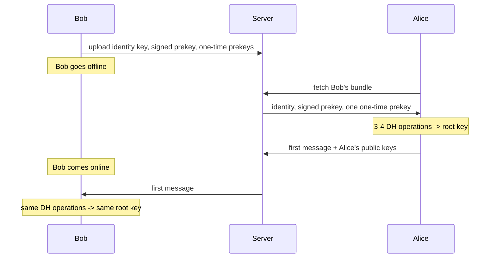
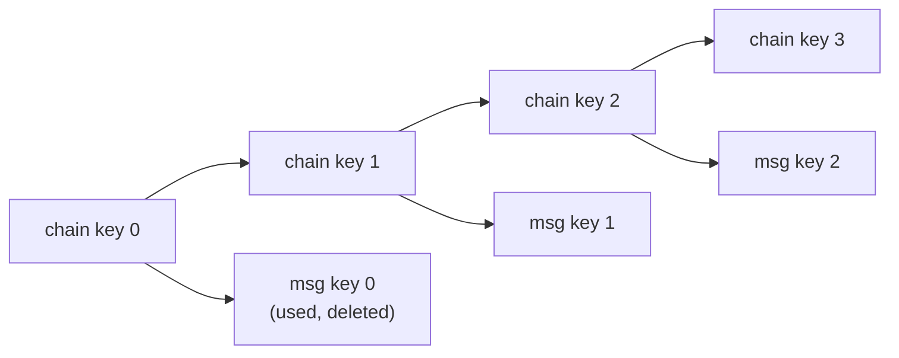
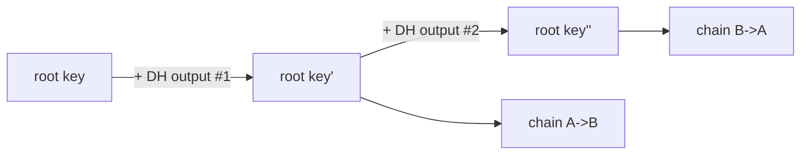

# Under the Hood: How Does Stealing Today's Key Not Reveal Yesterday's Messages? (Signal Double Ratchet)

## 1. The hook

Your phone is stolen, or malware copies its memory, and the thief gets the encryption key your chat app is using **right now**. Can they read last month's messages? Can they read tomorrow's? In most systems the answer is "yes, both": one key opens everything. Signal's design (also used by WhatsApp) says: **no to the past, and no to the future after a short while**. How can a key be that disposable?

💡 **Encryption key:** a secret number used to scramble and unscramble a message.
💡 **End-to-end encryption (E2EE):** only the two phones hold the keys, so even the chat company's servers see only scrambled bytes. See [end-to-end-encryption.md](../HLD/concepts/end-to-end-encryption.md).

---

## 2. Life before it

- **Early secure messaging (PGP email, 1991):** one long-term key pair per person. Steal the private key and every past message ever sent to you opens. No **forward secrecy**.
- **Off-the-Record Messaging (OTR, 2004; Borisov, Goldberg, Brewer):** for chat, it made fresh keys for each conversation and deleted them, and introduced the idea of ratcheting (a one-way gear). It needed both people online at the same time.
- **TextSecure (Open Whisper Systems, Moxie Marlinspike and Trevor Perrin, 2013)** combined OTR's ratchet with asynchronous start (message someone who is offline). The ratchet design was first called **Axolotl**, later renamed the **Double Ratchet**; the full suite is the **Signal Protocol**.
- **Adoption:** WhatsApp announced it had finished rolling the Signal Protocol out to all users in **April 2016** (🟡 date from memory). Facebook Messenger (optional "secret conversations", 2016) and Google's Messages/RCS have followed with variants (🟡 not re-checked).

---

## 3. The clever idea

Throw a **new key away after every single message** by deriving each key from the previous one with a **one-way function**: going forward is easy, going backward is impossible. Then, every time the conversation changes direction, **mix in a brand-new Diffie-Hellman secret**, so a thief who is holding the chain gets locked out again.

---

## 4. Step by step

### 4.1 Two properties in plain words

- **Forward secrecy:** a key stolen **today** does not reveal **past** messages. (The old keys no longer exist and cannot be recomputed.)
- **Post-compromise security (also "self-healing" or "future secrecy"):** after a theft, the conversation **recovers** on its own after a round trip or two. (New secrets that the thief never saw get mixed in.)

💡 **Analogy:** a rotating Kubernetes service-account token or a TLS cert with a short TTL. Short-lived credentials limit what a leak is worth. The ratchet takes that to the extreme: a TTL of one message.

### 4.2 Diffie-Hellman refresher

Two people can agree on a shared secret over a public channel using one-way "mixing" maths. Each keeps a private number and publishes a public one. Full story with the paint analogy in [tls-1-3-handshake.md](tls-1-3-handshake.md). Signal uses the **X25519** curve (the same one TLS 1.3 uses).

### 4.3 X3DH: starting a chat while the other person is offline

TLS needs the server to answer live. Chat cannot: Bob's phone may be off. So Bob uploads, ahead of time, to the server:

- a long-term **identity key**,
- a medium-term **signed prekey** (signed with his identity key so it cannot be forged),
- a batch of **one-time prekeys** (each used for one new conversation, then deleted).

💡 **Prekey:** a half-finished Diffie-Hellman, a public value waiting for someone to complete it.

Alice downloads Bob's bundle, mixes it with her own identity key and a fresh key using **three or four DH operations**, and gets a shared secret **without Bob being online**. She sends her first message together with the public values she used, and Bob later repeats the same maths. This is **X3DH (Extended Triple Diffie-Hellman)**. The result is the first **root key**.



### 4.4 Ring 1: the symmetric ratchet (new key per message)

Each side holds a **chain key**. For each message it runs a **KDF (key derivation function)**, a one-way scrambling function (here HMAC-SHA256):

- `message key = KDF(chain key, "msg")` : used once, then deleted.
- `next chain key = KDF(chain key, "chain")` : replaces the old chain key, which is deleted.

Because KDF is one-way, from today's chain key you can compute **tomorrow's** keys but not **yesterday's**. That gives forward secrecy.



Weakness alone: a thief with chain key 2 can follow the chain forever.

### 4.5 Ring 2: the DH ratchet (heal after theft)

Every time the other person replies, the reply carries a **new public DH value**. Both sides do a fresh Diffie-Hellman with the latest values and feed the output into the **root key**, which starts a **new chain**. The thief's stolen chain no longer matches, and the thief never saw the new private numbers.



"Double" = the fast inner ratchet (per message) + the slower outer ratchet (per round trip).

### 4.6 Out-of-order messages

Messages can arrive late or swapped. Each message header says "chain N, message number k". If k is ahead of what the receiver has, it runs the chain forward and **stores the skipped message keys** (with a cap and expiry) so the late message can still be opened. The cost is that the stored keys are, for a while, a small exception to forward secrecy.

### 4.7 The demo shows it

`code/RatchetDemo.java` uses only JDK classes: `KeyAgreement("X25519")`, `Mac("HmacSHA256")` as KDF, and AES-GCM for the messages. See section 7.

---

## 5. Where you have used it without knowing

Every WhatsApp, Signal, and (with secret conversations on) Messenger chat. The little "messages are end-to-end encrypted" banner in WhatsApp is this. Note [Telegram's default chats are not E2EE](../case-studies/whatsapp-vs-telegram.md); only its "secret chats" use a similar idea.

---

## 6. Limits and trade-offs

| Limit | Why |
|---|---|
| **Metadata is visible** | Who talks to whom, when, and how often is known to the server (Signal minimises it with "sealed sender"; others keep more). |
| **Device compromise** | Malware that reads the screen or the *live* keys sees everything on that device. The ratchet only protects keys, not the app. Messages saved on the phone are as safe as the phone. |
| **Backups** | Cloud backups of chat history can be a way around E2EE unless they are also encrypted with a key the provider cannot read. |
| **Groups** | Pairwise ratchets for each member are too costly for big groups, so groups use **sender keys**: each member shares one chain with everyone, ratcheted symmetrically. This keeps forward secrecy but gives weaker healing. See [chat-system](../HLD/interviews/chat-system/README.md) for group fan-out design. |
| **Multi-device** | Each device needs its own session, so a message is encrypted once per device. |
| **Key verification** | Without comparing "safety numbers" or QR codes, a server could swap Bob's keys (a man-in-the-middle). |
| **Skipped keys** | Stored for late messages, so they weaken forward secrecy a little. |

---

## 7. Try it

⚠️ **Toy code, not secure.** It fakes X3DH with a fixed seed, reuses a fixed AES-GCM nonce (only acceptable because each key is used once), and has no headers, no skipped keys, no authentication of identity. It only illustrates the key flow. For real use, use libsignal.

```sh
cd under-the-hood/code && java RatchetDemo.java
```

Real output from this sandbox (key fingerprints are the first 8 hex digits and change every run):

```text
Alice->Bob key=ca5de0fa  bob decrypts: READ: "hi Bob"
Alice->Bob key=95e07ffb  bob decrypts: READ: "are you there?"
Alice->Bob key=6b73078c  bob decrypts: READ: "lunch at 1?"
-- attacker steals Bob's chain key 72a2f234 --
  old message with stolen-key-derived guess 19801ac4: cannot decrypt
  old message with stolen-key-derived guess 19801ac4: cannot decrypt
  old message with stolen-key-derived guess 19801ac4: cannot decrypt
  NEXT message (same chain) key=19801ac4 attacker: READ: "my PIN is 4321"
Bob->Alice (DH ratchet) key=59d1afe3  alice decrypts: READ: "ok, 1pm"
Alice->Bob after 2nd DH step key=0f55bcd4
  attacker (stolen chain): cannot decrypt   <- healed
```

Reading it:

- Three messages, three different keys (`ca5de0fa`, `95e07ffb`, `6b73078c`): a new key each time.
- The attacker steals the chain key `72a2f234`. All the attacker can compute from it is what comes **next** (`19801ac4`). The three "cannot decrypt" lines show that the key derived from the stolen state does not open the three earlier messages (the guess is the only candidate the attacker can compute; the earlier keys are not recoverable from it). The three lines print the same guess on purpose: going *forward* is the only direction the attacker can compute, because the KDF (key derivation function: a one-way hash step) can't be run backwards, so there is no second candidate to try. (Key fingerprints are random and differ on every run; the pattern of READ / cannot decrypt is what stays the same.)
- The **next** message on the same chain is readable by the attacker: that is the window of exposure.
- After Bob and Alice each perform a DH ratchet step (new random key pairs), the attacker's chain no longer matches and the last message is unreadable.

Things to try: skip the second DH step and watch the attacker keep reading. Print `root` fingerprints after each DH step. Add a cache of skipped message keys and deliver messages out of order.

---

## 8. Where it shows up

- [end-to-end-encryption.md](../HLD/concepts/end-to-end-encryption.md): E2EE in designs, key distribution, what the server can and cannot see.
- [whatsapp-vs-telegram.md](../case-studies/whatsapp-vs-telegram.md): different encryption defaults.
- [chat-system](../HLD/interviews/chat-system/README.md): the E2EE and group discussion in the chat interview.
- [tls-1-3-handshake.md](tls-1-3-handshake.md): the same Diffie-Hellman, used for one connection instead of a rolling chat.

---

## 9. Sources

- M. Marlinspike, T. Perrin, *The Double Ratchet Algorithm*, Signal specification, rev. 1, 2016.
- M. Marlinspike, T. Perrin, *The X3DH Key Agreement Protocol*, Signal specification, 2016.
- N. Borisov, I. Goldberg, E. Brewer, *Off-the-Record Communication, or, Why Not To Use PGP*, WPES 2004.
- K. Cohn-Gordon, C. Cremers, B. Dowling, L. Garratt, D. Stebila, *A Formal Security Analysis of the Signal Messaging Protocol*, EuroS&P 2017.
- WhatsApp Encryption Overview whitepaper, 2016 onward (🟡 version not re-checked); rollout announcement April 2016 🟡.
- D. J. Bernstein, *Curve25519*, 2006; RFC 7748, 2016.
- Telegram's default chats not E2EE: Telegram FAQ (🟡 not re-checked today).
