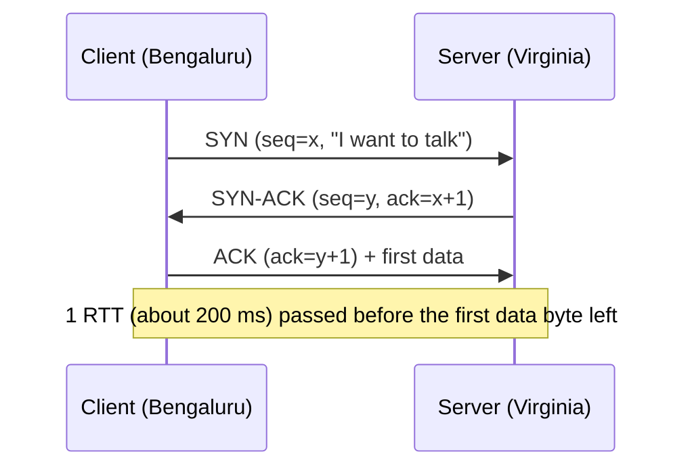
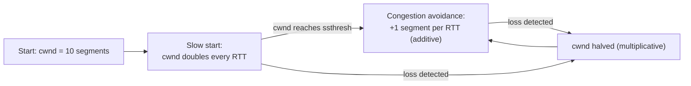

# Under the Hood: Why Is the First Request on a New Connection Slow? (TCP)

## 1. The hook

Your service in Bengaluru calls an API in Virginia. The response is only 50 KB, the server answers in 2 ms, yet the first call takes over a second, while the same call on a connection that has been open for a minute takes 250 ms. Nothing is wrong with the server. What was TCP doing during that extra time, and why can a brand-new connection send only about 14 KB in its first round trip?

💡 **TCP (Transmission Control Protocol):** the layer that turns the unreliable internet (packets get lost, duplicated, reordered) into a reliable, ordered byte stream. Almost everything you use (HTTP, Postgres, Redis, Kafka) rides on it.
💡 **RTT (round-trip time):** time for a message to reach the server and the reply to come back. India to US East is roughly 200 ms (🟡 typical, varies by route).
💡 **Packet / segment:** the internet moves data in small chunks (about 1,500 bytes on Ethernet). A TCP chunk is called a *segment*; its payload is at most about 1,460 bytes (the **MSS**, maximum segment size).

---

## 2. Life before it

- **1970s, ARPANET:** the first network protocol (NCP) assumed the network never lost anything. Real networks did.
- **1974-1981, Vint Cerf and Bob Kahn:** designed TCP/IP; **RFC 793 (1981)** is the TCP spec still in force in spirit today (updated by RFC 9293, 2022).
- **October 1986, congestion collapse:** the link between two Berkeley sites fell from 32 Kbit/s to 40 bit/s (that is not a typo). Every sender retransmitted lost data at full speed, which jammed the network further.
- **1988, Van Jacobson** fixed it with **slow start** and **congestion avoidance** ("Congestion Avoidance and Control"). Almost every TCP stack since carries his ideas.

---

## 3. The clever idea

Do not trust the network and do not trust the receiver: **number every byte**, wait for acknowledgements, and let the sender's speed be set by two limits, how much the **receiver** can hold (flow control) and how much the **network** can carry (congestion control), discovered by probing: start small, speed up until packets are lost, then back off.

---

## 4. Step by step

### 4.1 The 3-way handshake



Why three messages? Each side must prove it can both send and receive, and agree on a random starting **sequence number** (so stray old packets from a previous connection are not mistaken for new ones). TLS then adds more round trips on top; see [tls-1-3-handshake.md](tls-1-3-handshake.md).

### 4.2 Sequence numbers, ACKs and retransmission

Every byte has a number. A segment says "these are bytes 1000-2459"; the receiver replies "I have everything up to 2459, send 2460 next" (a cumulative ACK).

- **Lost segment:** the sender starts a timer, the **RTO** (retransmission timeout), computed from measured RTT (RFC 6298: smoothed RTT plus 4 times its variance, minimum 1 second by the RFC, Linux uses 200 ms). On expiry it resends and **doubles** the timer (exponential backoff).
- **Fast retransmit:** if three duplicate ACKs arrive ("still waiting for 2460"), the sender resends at once without waiting for the timer.

💡 **Analogy:** registered post with a tracking number. If no delivery confirmation arrives in time, you send the parcel again.

### 4.3 Flow control: do not drown the receiver

Each ACK carries a **receive window** (rwnd): "I have this many bytes of free buffer." The sender never has more than rwnd unacknowledged bytes in flight. If the app is slow to read, the window shrinks to zero and the sender pauses. This is the same idea as **backpressure** in a queue or Kafka consumer.

### 4.4 Congestion control: do not drown the network

The receiver cannot tell the sender how busy the routers in between are, so the sender keeps a private estimate, the **congestion window (cwnd)**, and sends at most `min(cwnd, rwnd)` bytes unacknowledged.



- **Slow start** is "slow" only in the starting size: it grows exponentially (doubling per RTT).
- **AIMD** (additive increase, multiplicative decrease): creep up by one segment per RTT, halve on loss. It makes competing flows converge to fair shares, like cars merging in traffic.
- **CUBIC** (2008, the Linux default for many years) grows along a cubic curve instead of a straight line, recovering faster on long fat links.
- **BBR** (Google, 2016) ignores loss as the signal and instead estimates the bottleneck bandwidth and minimum RTT. 🟡 Behaviour on shared links has been debated (fairness vs CUBIC); BBRv2/v3 exist.

### 4.5 The arithmetic: why the first request is slow

**Initial window:** RFC 6928 (2013) raised the starting cwnd to **10 segments** (it was 3 earlier, then 4). Linux has used 10 since kernel 3.0 (2011).

- 10 segments x 1,460 bytes = **14,600 bytes (about 14 KB)** can be sent before the first ACK returns.

Fetching a 50 KB response on a **new** connection, RTT = 200 ms (ignoring TLS):

| Step | Time | cwnd | Bytes delivered so far |
|---|---|---|---|
| SYN / SYN-ACK | 0-200 ms | n/a | 0 |
| Request sent + first flight arrives | 200-400 ms | 10 | 14,600 |
| Second flight (cwnd 20) | 400-600 ms | 20 | 14,600 + 29,200 = 43,800 |
| Third flight (cwnd 40, only 6,200 bytes left) | 600-800 ms | 40 | 50,000 |

Total about **4 RTT = 800 ms** (add 1-2 RTT for TLS: 1.0-1.2 s). On a warm connection cwnd is already large, so the same 50 KB takes **1 RTT = 200 ms**. The extra 600+ ms is pure protocol warm-up. This is also why shaving bytes (compression) can save a whole round trip, and why CDNs put the server near the user: they cut RTT itself ([cdn.md](../HLD/technologies/cdn.md)).

Linux also has `tcp_slow_start_after_idle=1` (default): after the connection is idle for about one RTO, cwnd is reset to the initial value, so even a reused but idle connection becomes "cold" again.

### 4.6 Head-of-line blocking

TCP delivers bytes **in order**. If segment 5 is lost and segments 6-9 arrive, the kernel holds 6-9 back until 5 is retransmitted (one RTT or more) even though the app might not care about order between them. This is **head-of-line (HOL) blocking**, and it is the reason HTTP/3 left TCP; see [http-1-2-3.md](http-1-2-3.md).

### 4.7 Nagle and delayed ACK

- **Nagle's algorithm (1984):** do not send a tiny segment while earlier data is unacknowledged; wait and batch. It saves bandwidth.
- **Delayed ACK:** the receiver waits up to ~40 ms (Linux) hoping to piggy-back its ACK on a reply.
- **Together** a write-write-read pattern can stall about 40 ms: the second small write waits for an ACK, the ACK waits for the delay timer. Latency-sensitive clients set `TCP_NODELAY` (Java: `socket.setTcpNoDelay(true)`; Netty and most RPC libraries do it by default).

### 4.8 Closing, TIME_WAIT and port exhaustion

The side that closes first ends in **TIME_WAIT** for 60 s on Linux (2 x MSL, "maximum segment lifetime"), so late stray packets from the old connection cannot corrupt a new one on the same address pair.

A connection is identified by 4 values: source IP, source port, destination IP, destination port. A client calling one server IP:port can use only its ephemeral ports (Linux default range 32768-60999, about 28,000 ports). Opening and closing a connection per request means roughly `28,000 / 60 s ≈ 470` new connections per second per destination before you run out of ports (`Cannot assign requested address`). This is a classic problem for a service calling one load balancer address at high rate.

### 4.9 Keep-alive and why pools exist

Every cost above (handshake, TLS, cold cwnd, TIME_WAIT) is paid **per connection**. So infrastructure keeps connections open and reuses them:

- **TCP keep-alive** probes (Linux: first after 2 hours by default, so most apps tune it) detect dead peers and stop idle-timeout middleboxes (load balancers, NAT) from silently dropping the connection.
- **Connection pools** (HikariCP for databases, HTTP client pools) keep a few warm connections. See [hikaricp-and-jdbc-pools.md](../LLD/libraries/java/hikaricp-and-jdbc-pools.md) and the sizing logic in [resource-pools-and-sizing.md](../LLD/concepts/resource-pools-and-sizing.md).
- A [load balancer](../HLD/technologies/load-balancer.md) in front of you also has idle timeouts (AWS ALB defaults to 60 s 🟡); a pooled connection idle longer than that dies, which surfaces as a "connection reset" on the first request after quiet periods. Set the client pool's max idle time below the LB's.

---

## 5. Where you have used it without knowing

- Every `Connection reset by peer` and `Read timed out` in a Java stack trace.
- `HikariPool ... Connection is not available` and the "validation timeout" settings.
- `TIME_WAIT` counts in a load test dashboard; "Address already in use" when restarting a server quickly (fix: `SO_REUSEADDR`).
- A slow first request after a deploy or after a quiet night: cold connections, cold JIT, cold caches stacked together.
- A server handling many sockets with few threads is the topic of [epoll.md](epoll.md).

---

## 6. Limits and trade-offs

- **Reliable and ordered costs latency**: HOL blocking, 1 RTT to open, slow start.
- **Loss is read as congestion.** On Wi-Fi or mobile, loss is often radio noise, so TCP slows down needlessly (one reason BBR and QUIC exist).
- **Bufferbloat:** large router buffers make loss-based algorithms fill the buffer first, adding hundreds of ms of queueing delay.
- **Middleboxes** (NAT, firewalls) freeze the protocol: new TCP features take a decade to deploy. QUIC runs over UDP and encrypts its headers partly to avoid this.
- **Fast Open (RFC 7413, 2014)** can put data in the SYN, but is poorly deployed. 🟡

---

## 7. Try it

The sandbox this page was written in has no `ss` or `ip` installed, so socket-level output below comes from `/proc` and `sysctl` instead. On your own Linux machine run `ss -s` and `ss -tin` (the `-i` flag prints per-connection `cwnd`, `rtt`, `rto`, `retrans`).

```bash
$ cat /proc/net/sockstat
sockets: used 74
TCP: inuse 60 orphan 0 tw 2 alloc 60 mem 255

$ sysctl net.ipv4.tcp_congestion_control net.ipv4.tcp_slow_start_after_idle \
         net.ipv4.tcp_fin_timeout net.ipv4.ip_local_port_range
net.ipv4.tcp_congestion_control = bbr
net.ipv4.tcp_slow_start_after_idle = 1
net.ipv4.tcp_fin_timeout = 60
net.ipv4.ip_local_port_range = 32768	60999
```

Reading it: 60 TCP sockets in use, 2 in TIME_WAIT (`tw 2`). This machine uses BBR; many distributions default to CUBIC. Slow-start-after-idle is on, the ephemeral port range is the 28,232 ports used in the arithmetic above.

Things to try on your machine:

1. `ss -tin dst <server-ip>` while a download runs and watch `cwnd:` grow.
2. `sudo tc qdisc add dev lo root netem delay 100ms` then `curl localhost:8000` to feel a 200 ms RTT (remove with `tc qdisc del dev lo root`).
3. `ss -s` during a load test: count `timewait`.
4. Compare `curl -w '%{time_connect} %{time_appconnect} %{time_starttransfer}\n' -o /dev/null -s https://example.com` on a first call (the fields are cumulative seconds: TCP connected, TLS done, first byte).

---

## 8. Where it shows up

- [epoll.md](epoll.md): how one thread watches thousands of these sockets.
- [tls-1-3-handshake.md](tls-1-3-handshake.md): the round trips added on top of TCP's.
- [http-1-2-3.md](http-1-2-3.md): how HTTP fought TCP's costs.
- [load-balancer.md](../HLD/technologies/load-balancer.md): L4 balancers pick a backend per TCP connection; idle timeouts; connection draining.
- [hikaricp-and-jdbc-pools.md](../LLD/libraries/java/hikaricp-and-jdbc-pools.md), [resource-pools-and-sizing.md](../LLD/concepts/resource-pools-and-sizing.md): why pools exist.

---

## 9. Sources

- RFC 793, "Transmission Control Protocol" (1981); RFC 9293, TCP specification update (2022).
- Van Jacobson, "Congestion Avoidance and Control", SIGCOMM (1988).
- RFC 5681, TCP Congestion Control (2009); RFC 6298, Computing TCP's Retransmission Timer (2011).
- RFC 6928, "Increasing TCP's Initial Window" (2013).
- Ha, Rhee, Xu, "CUBIC: a new TCP-friendly high-speed TCP variant" (2008); RFC 8312 (2018).
- Cardwell et al., "BBR: Congestion-Based Congestion Control", ACM Queue (2016).
- RFC 896, Nagle, "Congestion Control in IP/TCP Internetworks" (1984).
- RFC 7413, TCP Fast Open (2014).
- Unverified (🟡): the 1986 collapse figures are as commonly quoted from Jacobson's paper; the ALB 60 s default and BBRv2/v3 status may have changed.
