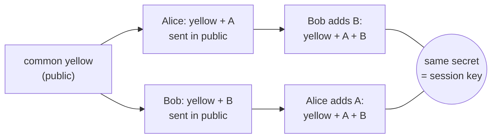
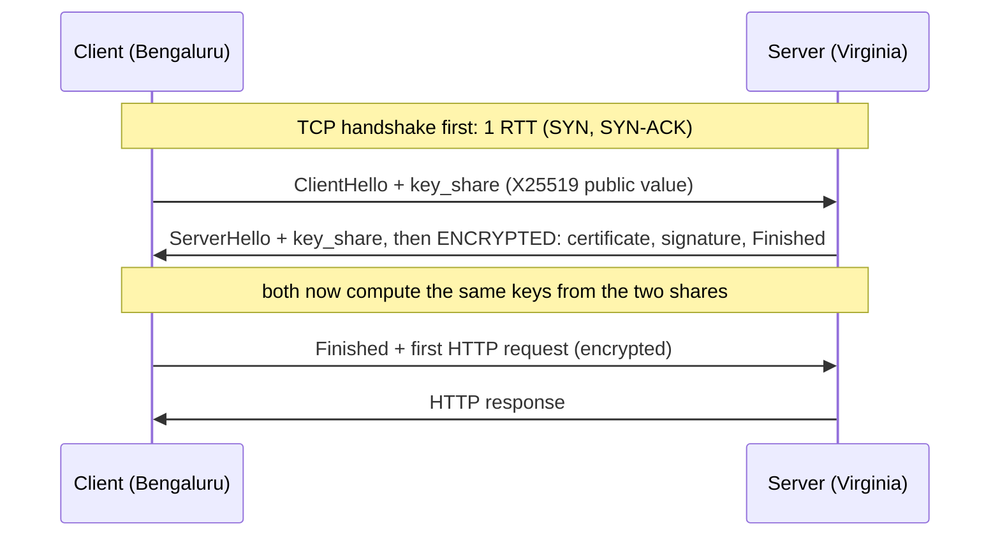

# Under the Hood: How Is an Encrypted Connection Set Up in One Round Trip? (TLS 1.3)

## 1. The hook

You type `https://bank.example` on a phone in Bengaluru; the server is in Virginia. Before the first byte of your page can arrive, two strangers who have **never met** must agree on a secret key, while anyone on the cable (your ISP, a café Wi-Fi owner) listens to every word. How can a secret be agreed in public? And why did TLS 1.3 (2018) manage it in **one** back-and-forth where TLS 1.2 needed **two**, when every back-and-forth costs ~200 ms on this route?

💡 **TLS (Transport Layer Security):** the encryption layer under `https://`. It gives you privacy (nobody can read), integrity (nobody can change it silently) and identity (you really talk to the bank). See [tls-and-mtls.md](../HLD/concepts/tls-and-mtls.md) for how designs use it.
💡 **RTT (round-trip time):** time for a message to go to the server and the reply to come back. India to US East is roughly 200 ms (light in fibre is slow and the path is long).
💡 **Handshake:** the opening conversation before real data, where both sides agree on settings and keys.

---

## 2. Life before it

- **SSL 2.0/3.0 (1995-1996, Netscape)** invented "https". Both had design flaws; SSL 3.0 fell to the **POODLE** attack (2014) and was retired (RFC 7568, 2015).
- **TLS 1.0 (1999), 1.1 (2006), 1.2 (2008, RFC 5246)** fixed things one by one. TLS 1.2 handshake: the client says hello, the server answers with its certificate, **then a second round trip** carries the key exchange. Cost: **2 RTT** before any data, on top of **1 RTT** for TCP itself.
- Old TLS also let the server choose **RSA key transport**: the client invents the secret and encrypts it with the server's long-term public key. Cheap, but if that private key leaks in 2030, someone who **recorded** your 2024 traffic can decrypt all of it. And a menu of ancient options (RC4, CBC, compression) kept producing attacks: BEAST (2011), CRIME (2012), Heartbleed (2014, a bug in the OpenSSL library, not the protocol), FREAK/Logjam (2015).

**TLS 1.3 (RFC 8446, August 2018)** deleted the bad menu items and rewrote the handshake so the client **guesses** what the server will pick and sends its half of the key exchange immediately.

---

## 3. The clever idea

The client sends its key-exchange share **in the very first message** (betting on the common curve), so server and client can both compute the same session key after **one** round trip. And that key is made from throwaway numbers, so recording traffic today never helps a thief later.

---

## 4. Step by step

### 4.1 Agreeing on a secret in public: Diffie-Hellman (the paint analogy)

💡 **Analogy:** both pick a **secret colour**. They publicly agree on a **common yellow**. Each mixes their secret into the yellow and sends the mix across the room. Mixing is easy, **un-mixing is impossible**. Each then adds their own secret to the other's mix. Both end with the same brown (yellow + A + B). The eavesdropper saw yellow, A+yellow and B+yellow, but cannot subtract yellow back out.



In maths, "mixing" is a one-way operation (Whitfield Diffie, Martin Hellman, **1976**). TLS 1.3 uses the **elliptic-curve** version, **ECDHE**: the "E" is for elliptic curve, the last "E" is **ephemeral** (a fresh secret for every connection). The popular curve **X25519** uses 32-byte public values; the "mix" is a point multiplication on a curve that a laptop does in ~50 µs (🟡 order of magnitude).

### 4.2 The handshake, round trip by round trip



1. **ClientHello:** supported ciphers, a random number, and the **key share** (the "yellow+A" mix). This guess is why 1.3 is faster: in 1.2 the client had to wait to learn which method the server picks.
2. **ServerHello:** its own share. From this point both sides can derive the keys, so **everything after (even the certificate) is encrypted**. Under 1.2 the certificate went in the clear, so watchers saw who you were talking to.
3. **Certificate + signature:** the server proves it is really `bank.example` (next section).
4. **Finished:** each side sends a MAC (a keyed checksum) over the whole transcript. If an attacker had altered any earlier message, this fails and the connection dies. The client's request rides along with its Finished.

### 4.3 Who is on the other end: certificates

Diffie-Hellman alone has a hole: you could be agreeing a secret with the **attacker** ("man in the middle"). The server must prove identity.

- A **certificate** says "public key K belongs to `bank.example`", signed by a **certificate authority (CA)**.
- The server sends its leaf certificate plus an **intermediate** certificate. Your OS/browser ships a **root store** of ~150 trusted root CAs (🟡 count varies by vendor).
- The client checks the chain: leaf signed by intermediate, intermediate signed by a root it already trusts, names match, dates valid. The server then **signs the handshake transcript** with the leaf's private key, proving it owns the certificate.

Infra analogy: the same trust chain as a cluster CA signing node certs in Kubernetes; "the root store" is the CA bundle you mount into pods.

### 4.4 Forward secrecy

The long-term key only **signs** now; it never encrypts the session key. The session key comes from the ephemeral shares, which are deleted after the handshake. Steal the server's private key next year and you still cannot decrypt last year's recording. This property is called **forward secrecy**. TLS 1.3 makes it mandatory (RSA key transport was removed).

### 4.5 The latency arithmetic (India to US, RTT = 200 ms)

| Setup | Round trips before the response starts arriving | Time to first response byte |
|---|---|---|
| TCP + TLS 1.2 | TCP 1 + TLS 2 + request 1 = 4 | 4 x 200 = **800 ms** |
| TCP + TLS 1.3 | TCP 1 + TLS 1 + request 1 = 3 | 3 x 200 = **600 ms** |
| TCP + TLS 1.3, **0-RTT** resumption | TCP 1 + request 1 = 2 | 2 x 200 = **400 ms** |
| QUIC (HTTP/3), first visit | 1 + request 1 = 2 | **400 ms** |
| QUIC, **0-RTT** resumption | request 1 | **200 ms** |

For a page that needs 6 sequential connections to different hosts this is seconds, which is why CDNs terminate TLS near the user: the handshake runs over a 20 ms hop instead of 200 ms (see [cdn.md](../HLD/technologies/cdn.md)).

### 4.6 0-RTT resumption, and its catch

After one visit the server hands the client a **session ticket** (a sealed copy of the key material). On the next visit the client uses it to encrypt the **request itself in the first packet** ("early data"). No wait at all.

The catch: **replay**. A recorded 0-RTT packet can be sent again by an attacker and the server cannot tell it is a copy (it has no fresh random from the client's side yet). A replayed `GET /home` is harmless; a replayed `POST /transfer?amount=5000` is a double payment. So servers allow early data **only for safe, idempotent requests**, or reject it, and keep short ticket lifetimes. Connect to the idea of idempotency keys in payments, e.g. [upi.md](upi.md).

### 4.7 QUIC folds it all together

TCP and TLS were separate protocols, so their handshakes stacked. **QUIC (RFC 9000, 2021)** runs on UDP and puts the **transport and TLS 1.3 handshake in the same packets**: connection set-up and key agreement in 1 RTT, and 0-RTT on repeat. It also gives each stream independent loss recovery and survives your phone switching from Wi-Fi to 4G (connections are named by an ID, not by IP+port). HTTP/3 (RFC 9114, 2022) is HTTP on top of QUIC.

---

## 5. Where you've used it without knowing

- Every padlock in the browser; every `kubectl` call; every gRPC/HTTPS call between microservices.
- "Resumed" connections: opening a site you visited an hour ago is faster because of the ticket.
- Your [load balancer](../HLD/technologies/load-balancer.md) probably **terminates TLS**: it does the handshake and talks plain HTTP (or re-encrypts) to backends. Keeping connections alive amortises the handshake cost.
- Mutual TLS in service meshes: both sides present certificates, covered in [tls-and-mtls.md](../HLD/concepts/tls-and-mtls.md).

---

## 6. Limits and trade-offs

- A full handshake still costs CPU (signature verify on the client, sign on the server) and a round trip; that is why **connection reuse** (keep-alive, HTTP/2 multiplexing) matters more than a faster handshake.
- 0-RTT trades security (replay) for speed; do not enable it for non-idempotent endpoints.
- Certificates are the weak link in practice: CA compromise (DigiNotar, 2011), expired certs causing outages, revocation that is mostly best-effort.
- **Quantum:** X25519 can in theory be broken by a large quantum computer; "record now, decrypt later" is the worry. Browsers and CDNs began deploying **hybrid** key shares (X25519 + ML-KEM) from 2023-2024 🟡 (exact dates/versions vary).
- QUIC over UDP is sometimes blocked by corporate firewalls; clients fall back to TCP+TLS.

---

## 7. Try it

Run in this repo's sandbox. Honest note: outbound HTTPS here goes through a **proxy that intercepts TLS**, so (a) `example.com` is blocked (HTTP 403 on the proxy's CONNECT) and (b) the certificate issuer you see is the proxy's own CA, not the site's real CA. The protocol and cipher lines are still real TLS 1.3, but between the client and the proxy. On your own laptop the issuer will be a public CA (e.g. Let's Encrypt).

```sh
curl -sv -o /dev/null https://github.com 2>&1 | grep -E 'SSL connection|ALPN|issuer'
printf '' | openssl s_client -connect github.com:443 -tls1_3 2>/dev/null | grep -E 'Protocol|Cipher|Verification'
```

Real output (via the sandbox proxy):

```text
* SSL connection using TLSv1.3 / TLS_AES_128_GCM_SHA256 / X25519 / RSASSA-PSS
* ALPN: server did not agree on a protocol. Uses default.
*  issuer: CN=CCR agent-proxy interception CA (production) 2026-08; O=Anthropic
Verification: OK
    Protocol  : TLSv1.3
    Cipher    : TLS_AES_128_GCM_SHA256
```

Reading it: `TLSv1.3` is the protocol; `X25519` is the key-exchange curve (the paint mixing); `RSASSA-PSS` is the signature proving identity; `TLS_AES_128_GCM_SHA256` is the bulk cipher (AES-128 in GCM mode, SHA-256 for key derivation). **ALPN** (application-layer protocol negotiation) is how client and server agree on `h2` (HTTP/2) inside the handshake, with no extra round trip. The `issuer:` line is the chain-of-trust check made visible. To see TLS 1.2 vs 1.3 yourself: add `-tls1_2` to `openssl s_client` against a server that allows it, and count the extra flights with `-msg`.

---

## 8. Where it shows up

- [tls-and-mtls.md](../HLD/concepts/tls-and-mtls.md): TLS termination, mTLS between services, certificate rotation.
- [load-balancer.md](../HLD/technologies/load-balancer.md): where TLS is terminated and why.
- [cdn.md](../HLD/technologies/cdn.md): short-RTT edges make the handshake cheap.
- [upi.md](upi.md): replay protection and idempotency in payments.

---

## 9. Sources

- E. Rescorla, *RFC 8446: TLS 1.3*, IETF, 2018.
- T. Dierks, E. Rescorla, *RFC 5246: TLS 1.2*, 2008.
- W. Diffie, M. Hellman, *New Directions in Cryptography*, IEEE Trans. Information Theory, 1976.
- D. J. Bernstein, *Curve25519*, 2006; RFC 7748 (X25519), 2016.
- J. Iyengar, M. Thomson, *RFC 9000: QUIC*, 2021; M. Bishop, *RFC 9114: HTTP/3*, 2022.
- *RFC 7568: Deprecating SSLv3*, 2015 (POODLE, Moeller/Bodo/Langley, Google, 2014).
- Cloudflare blog posts on TLS 1.3 and 0-RTT replay (2017-2019) 🟡 exact titles not re-checked.
- Hybrid post-quantum key share rollout 2023-2024 🟡 not verified here.
