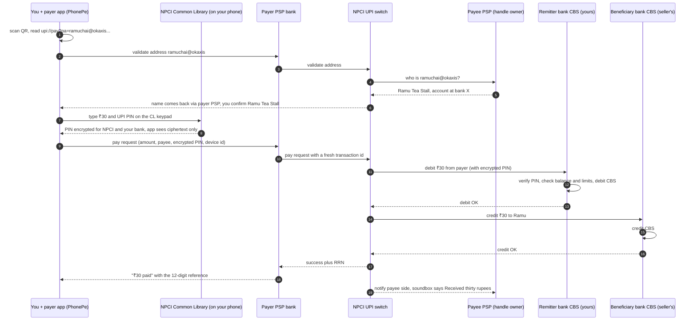
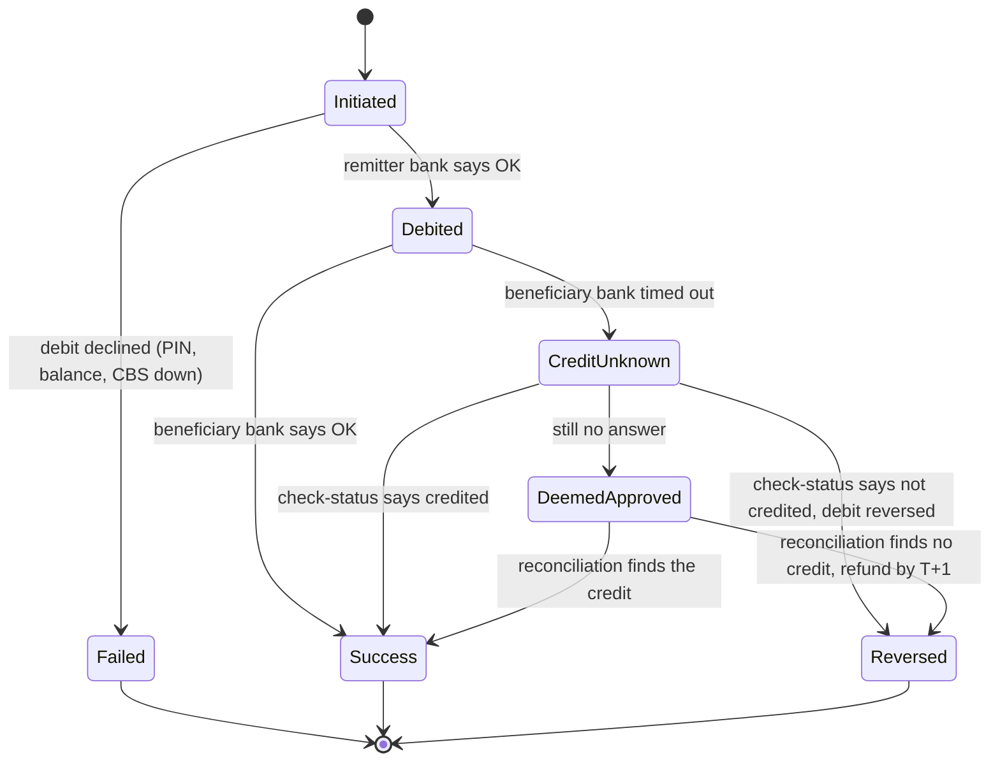

# Under the Hood: What Happens in the ~2 Seconds Between "Pay" and "₹ Debited"? (UPI)

## 1. The hook

You scan the QR code taped to a chai stall, type ₹30, enter your 4- or 6-digit PIN, and about two seconds later your phone says **"₹30 paid"** while the stall's little speaker box says **"Received thirty rupees"**.

Think about what just happened. Your money is at, say, SBI. The chai seller's account is at, say, a small cooperative bank. You used PhonePe; his QR sticker and soundbox came from a different app. **Four different companies** that don't share a database just agreed that ₹30 left one account and arrived in another, and nobody typed an account number or an IFSC code.

The answer is **UPI (Unified Payments Interface)**: a shared "switch" run by **NPCI** that turns an address like `ramuchai@okaxis` into a bank account and runs a debit and a credit across two banks in one round trip. In September 2026 it handled about **24 billion** of these payments in a month (§4).

💡 **NPCI (National Payments Corporation of India):** the not-for-profit company set up by RBI and the banks to run India's shared payment rails (IMPS, RuPay, UPI). **RBI:** India's central bank and payments regulator. **IFSC:** the 11-character code identifying a bank branch, e.g. `SBIN0001234`.

---

## 2. Life before it

### NEFT: batches, like a cron job
**NEFT (National Electronic Funds Transfer)** collects transfers and settles them in **batches**. Until December 2019 it ran 8 am to 7 pm on working days (closed on 2nd and 4th Saturdays). Since **16 December 2019** it runs 24×7 in **48 half-hourly batches** a day, and the receiving bank must credit or return the money within 2 hours of the batch settling (RBI circular, 6 Dec 2019). Better, but still "submit and wait for the next batch", and you need the payee's **account number + IFSC**.

💡 **Settlement:** the moment banks actually move money between their own accounts at RBI to cover what their customers sent each other. **Batch:** a group of requests processed together at a fixed time, like a cron job that runs every 30 minutes.

### IMPS: instant, but clunky to address
**IMPS (Immediate Payment Service)**, launched by NPCI on **22 November 2010**, was the real breakthrough: instant, 24×7, including holidays. But to pay someone you needed their **account number + IFSC**, or their mobile number plus a **7-digit MMID** (Mobile Money Identifier) their bank gave them. Nobody remembers an MMID.

### Cards and wallets
**Cards** need a 16-digit number, expiry, CVV and an OTP online, or a card machine that costs the shop rent and a fee per swipe; a chai stall won't buy one for ₹30 sales. **Wallets** (Paytm-style) were easy at the counter, but you had to **top up first**, and a Paytm wallet couldn't pay a Mobikwik merchant: each was a **closed loop**, like an internal service mesh that can't talk to anyone else's.

💡 **OTP:** a one-time password sent by SMS. **CVV:** the 3-digit code on the back of a card. **POS terminal:** the card machine at a shop counter.

| | Address you need | Speed | Works across banks/apps |
|---|---|---|---|
| NEFT | account + IFSC | next half-hourly batch | yes |
| IMPS | account + IFSC, or mobile + MMID | seconds | yes |
| Card | 16-digit number, CVV, OTP or a POS machine | seconds | yes, if the shop has a terminal |
| Wallet | phone number | instant | **no**, only inside that wallet |
| **UPI** | **`name@handle` or a QR** | **seconds** | **yes, any app ↔ any bank** |

---

## 3. The clever idea

**Give every bank account a human-friendly address (`name@handle`, the VPA / UPI ID), and put one central switch in the middle that resolves that address and orchestrates a debit at the payer's bank and a credit at the payee's bank, in real time, over the IMPS-style rails banks already had.** Any app can join through a bank partner, so any app can pay any account.

It's DNS plus a router for money: the UPI ID is the hostname, the switch is the resolver and the L7 router (a proxy that routes by request content, like Envoy or an ingress), and each bank's core system is the backend.

NPCI ran a **pilot on 11 April 2016** in Mumbai with **21 banks** (launched by RBI Governor Raghuram Rajan) and **went live for the public on 25 August 2016**, when banks started publishing UPI apps.

💡 **VPA (Virtual Payment Address) / UPI ID:** an alias like `asha@okhdfcbank` that points to a real account. The part after `@` (the **handle**) tells the switch which company owns the alias. You can change or delete it without changing your bank account, like a DNS record.

---

## 4. Step by step

### The cast

| Player | Example | Job |
|---|---|---|
| **Payer app** (TPAP, third-party app provider) | PhonePe, Google Pay, Paytm, BHIM | The screen you tap. Not a bank. |
| **Payer PSP bank** | the bank behind the app's handle | Connects the app to NPCI, owns the app's handles, does device binding |
| **NPCI UPI switch** | NPCI's central system | Resolves addresses, routes messages, keeps the transaction state, computes settlement |
| **Payee PSP** | owner of `@okaxis`, `@ybl`, … | Knows which account sits behind the payee's UPI ID |
| **Remitter bank** | your bank (SBI) | Checks your PIN and balance, **debits** you |
| **Beneficiary bank** | the seller's bank | **Credits** the seller |

💡 **PSP (Payment Service Provider):** here, a bank licensed to connect apps to UPI. PhonePe or Google Pay can't connect to NPCI directly; they ride on one or more PSP banks (the handle suffix shows which: `@ybl`, `@okaxis`, `@oksbi` are commonly seen examples). **CBS (Core Banking System):** the bank's main ledger system holding account balances (Finacle, Flexcube and similar), the "database of record" every debit and credit must hit.

### Before your first payment: device binding (once)
When you set up the app, it **sends an SMS from your phone** to a number the PSP controls. The PSP checks that the SMS really arrived from the mobile number registered with your bank, and then **binds that phone + SIM** to your account (stores a device fingerprint). Bank FAQs say this needs mobile data, an outgoing SMS pack, and on iOS you press "send" yourself (e.g. Indian Overseas Bank's UPI FAQ). That's factor one, "something you have". The UPI PIN is factor two, "something you know".

💡 **SIM:** the chip that ties your phone to your mobile number. **Two-factor authentication (2FA):** needing two different kinds of proof, so a stolen PIN alone (or a stolen phone alone) isn't enough. 🟡 Exact rules (token expiry, attempts per day) come from vendor and bank write-ups, not NPCI's own text.

### The payment, hop by hop



Step by step in plain words:

1. **Scan and validate (steps 1–6).** The QR is just text: a `upi://pay?...` link with the payee's UPI ID and name (§7). The switch asks the handle's owner who `ramuchai@okaxis` is and shows you the registered name: your "are you sure?" moment.
2. **PIN in NPCI's Common Library (steps 7–8).** The PIN keypad is drawn by the **NPCI Common Library (CL)**, a component every UPI app must embed. The CL encrypts the PIN (with keys NPCI publishes) before it leaves the phone, so the app only passes along ciphertext (the scrambled, encrypted form). NPCI's 2017 circulars describe the CL as the piece apps embed "to set/reset/change UPI PIN, balance enquiry and debit authorization". 🟡 *"The app can never see your PIN" is the design intent; I couldn't confirm from primary sources that every app/keypad implementation makes it technically impossible.*
3. **Pay request, then debit first (steps 9–13).** The app's PSP bank adds its own checks (is this device bound? risk score?) and forwards it to NPCI with a unique transaction id. NPCI sends the debit to your bank. Your bank decrypts/verifies the PIN, checks balance and daily limits, and debits its CBS. If anything fails here (wrong PIN, no balance, CBS down), the payment stops and nothing has moved.
4. **Then credit (steps 14–16).** Only after a confirmed debit does NPCI ask the seller's bank to credit.
5. **Respond (steps 17–19).** Success flows back with a **reference number** (RRN), and the payee side is notified, which is what makes the soundbox talk.

💡 **RRN (Retrieval Reference Number) / UTR (Unique Transaction Reference):** the 12-digit id of this UPI transaction that every party can look up. Apps label it differently ("UPI Ref No", "UTR", "UPI transaction ID"). It's the trace id you give the bank when something goes wrong, exactly like a request id in your logs.

**Where's the actual money?** At steps 12 and 15 only the two banks' own ledgers changed (your balance −30, Ramu's +30). The banks owe each other money now. NPCI adds up all the debits and credits per bank and **settles the net amounts** between banks' accounts at RBI several times a day: 10 settlement cycles a day since 1 August 2024, per an NPCI circular reported by secondary sources (🟡 not checked against the NPCI circular itself). Customers see "instant"; banks settle in batches. That's **deferred net settlement**: like batching 10,000 small writes into one bulk update.

### Time budget
"~2 seconds" is the typical experience, not an NPCI number. NPCI does set timeouts: from **16 June 2025** the pay request/response must finish within **15 seconds** (down from 30) and "check transaction status" within **10 seconds** (down from 30), per news coverage of NPCI's April 2025 circular (🟡 secondary sources; they disagree on the validate-address timeout, 8 vs 10 s).

### When the answer doesn't come back: pending, deemed approved, auto-reversal
The dangerous case is **debit OK, credit unknown**: the beneficiary bank timed out. Did Ramu get the ₹30 or not? The switch can't just retry the credit blindly (Ramu might get ₹60), and can't refund blindly (Ramu might get ₹30 for free).



- **Check status, not retry.** NPCI's 2017 circular on debit reversals says that if the beneficiary bank doesn't answer the credit, NPCI sends up to **three "check transaction" messages**, and if still unanswered it starts a **credit reversal**. A transaction whose outcome stays unknown is treated as **deemed approved** and is resolved through end-of-day **reconciliation** between the banks. 🟡 *The exact state names and rules above are my simplification of the circular's summary; the full circular wasn't readable.*
- **RBI puts a clock on it.** RBI's **TAT circular (20 September 2019, effective 15 October 2019)** says: for UPI, if your account is debited but the beneficiary isn't credited, the money must be **auto-reversed by T+1**, otherwise the bank pays you **₹100 per day** of delay, without you having to complain. For a merchant payment where the merchant never got confirmation, the limit is **T+5**.

💡 **TAT (turnaround time):** the deadline to fix a failed transaction. **T+1:** one day after the transaction day (T). **Reconciliation:** comparing two parties' records line by line to find mismatches ([payment reconciliation](../HLD/concepts/payment-reconciliation.md)). **Idempotent:** doing it twice has the same effect as once; the transaction id makes every step safe to repeat ([idempotency](../HLD/concepts/idempotency-and-delivery-semantics.md)).

This is a **saga** in disguise: a debit and a credit in two different databases that can't share one transaction, with a compensating step (the reversal) when the second half fails ([sagas](../HLD/concepts/sagas-and-distributed-transactions.md)).

### Pay vs collect
- **Pay (push):** you start it, you enter the PIN. Every QR payment is this.
- **Collect (pull):** the payee sends you a request, you approve it with your PIN. Useful for "Pay with UPI ID" at checkout on a website. It's also the scam: "I'm sending you money, just enter your PIN to receive it." **A UPI PIN is only ever used to send money.** NPCI capped P2P collect requests at ₹2,000 in 2019, and a circular dated **29 July 2025** directed that **person-to-person collect requests stop from 1 October 2025**; merchant collect (checkout on big apps) continues (news reports of the circular; 🟡 I found only pre-deadline coverage, not confirmation of the go-live).

💡 **P2P / P2M:** person-to-person and person-to-merchant payments.

### Newer branches of the same tree
- **UPI Lite** (launched **20 September 2022**): a small balance kept "on device" for tiny payments **without a PIN** each time. Limits raised by RBI on **4 December 2024** to **₹1,000 per payment** and **₹5,000 balance**. The point is load: chai-sized payments don't each hit your bank's CBS. 🟡 *How the bank mirrors the on-device balance internally isn't publicly documented in detail.*
- **RuPay credit cards on UPI** (live **20 September 2022**, announced by RBI in June 2022): the "account" behind your UPI ID can be a credit card, so the debit goes to a credit line instead of a savings account.

### The numbers

| What | Value | Source |
|---|---|---|
| Transactions, September 2026 | **24.07 billion** worth ₹29.37 lakh crore | news reports of NPCI data (🟡 not read on NPCI's own site) |
| Transactions, August 2026 (record) | 24.51 billion, average 791 million/day | same |
| Average size | ₹29.37 lakh crore ÷ 24.07 billion = 2.937×10¹³ ÷ 2.407×10¹⁰ ≈ **₹1,220** | arithmetic |
| Average TPS, August 2026 | 791,000,000 ÷ 86,400 s ≈ **9,150 per second** | arithmetic |
| Peak TPS | not published by NPCI that I could find. Evening/festival peaks are surely several times the average; ~2–3× would mean ~20,000–27,000 TPS (🟡 my estimate) | — |
| Per-transaction limit | **₹1 lakh** general (P2P); **₹5 lakh** for verified hospitals and education (Jan 2024) and tax (Sept 2024); since **15 Sept 2025**, ₹5 lakh per payment and up to ₹10 lakh/day for categories like capital markets, insurance, travel. Banks may set lower | NPCI circulars as reported (🟡 secondary; daily caps vary by category) |

💡 **TPS:** transactions per second. **Lakh / crore:** 1 lakh = 100,000; 1 crore = 10 million. So ₹29.37 lakh crore = 29.37 × 10⁵ × 10⁷ = ₹2.937 × 10¹³.

---

## 5. Where you've already used it

| You saw | What was going on |
|---|---|
| The QR at every chai stall, auto stand, kirana shop | A static `upi://pay?pa=...&pn=...` link printed as a QR. No terminal, no fee to the shop for the hardware |
| The soundbox saying "Received ₹30" | The payee PSP's notification (step 19) pushed to a device |
| The name popping up before you enter the PIN | The validate-address call (steps 2–6) |
| "Money debited but not received" | The `CreditUnknown` / deemed-approved path. It usually resolves within hours; RBI's outer limit is T+1, then ₹100/day compensation |
| "Bank server busy" / "Transaction declined by your bank" | A **technical decline**: the remitter or beneficiary bank's CBS was slow or down. NPCI was fine, the backend wasn't, like a 503 from one upstream behind a healthy load balancer |
| Paying with GPay to someone who uses PhonePe | Interoperability: both apps speak to the same switch |
| A UTR you pasted into a support chat | The RRN, the cross-company trace id |

---

## 6. Limits and trade-offs

- **Only as reliable as the slowest bank.** UPI needs **two** banks' CBS to answer within seconds. Old core systems with nightly batch jobs and maintenance windows show up as technical declines. A payment's availability is roughly the *product* of the two banks' and the switch's availability: 99.9% × 99.9% × 99.99% ≈ 99.79%.
- **A central switch is critical national infrastructure.** One operator, one protocol, billions of payments. NPCI has had public outages; in 2025 it tightened API rate limits after finding that PSPs flooding "check transaction status" calls had caused queue overflows and failures (reported by Inc42; 🟡 secondary). Same lesson as a retry storm against your own service: status polling needs backoff and limits.
- **Fraud moves to people.** The cryptography is strong (device binding + encrypted PIN), so attackers target the human: fake collect requests, "enter PIN to receive", screen-sharing apps, fake customer-care numbers, SIM swaps. No protocol fixes social engineering; it gets patched with product rules (ending P2P collect, showing the payee's name before the PIN).
- **Push payments are final.** There is no "chargeback" like cards for a P2P payment you sent by mistake; you ask the receiver or raise a dispute. Disputes and refunds are separate, slower flows.
- **It's India-shaped.** It relies on one national switch and a regulator that can mandate interoperability. Brazil's Pix (2020) is a similar central instant-payment system, but the institutional setup matters as much as the protocol.

💡 **Chargeback:** a card-network process to forcibly reverse a payment after a dispute.

---

## 7. Try it

No real payments here. Three safe things to look at.

**1. Find a UTR.** Open any past UPI payment in your app and tap it. Look for "UPI transaction ID" (Google Pay), "UTR" (PhonePe), or "UPI Ref No" (Paytm and most bank apps); 🟡 labels as commonly seen, and they change between app versions. It's 12 digits. Your bank statement usually shows the same number in the transaction description (e.g. `UPI/<RRN>/...`; the format varies by bank), which is how support teams join records across companies.

💡 **Deep link:** a URL that opens a specific screen inside an app (here, a UPI app's payment screen) instead of a web page.

**2. Read a QR.** Any QR scanner app (or your phone camera's "show text" option) that doesn't open a UPI app will show the raw text of a shop's QR. It looks like:

```text
upi://pay?pa=ramuchai@okaxis&pn=Ramu%20Tea%20Stall&cu=INR
```

Parameters, from NPCI's *UPI Linking Specification* v1.6 (a November 2017 draft mirrored online; 🟡 the current version may differ): `pa` payee UPI ID and `pn` payee name (both mandatory); `am` amount in decimal (`30.00`), which the payer can't edit unless `mam` (a minimum amount) is set; `cu` currency (only `INR`); `tn` a note; and for merchants `tr` (transaction reference, e.g. an order id) and `mc` (4-digit merchant category code).

A **static QR** (printed sticker) has no amount: you type it. A **dynamic QR** (shown on a billing screen) carries `am` and `tr` for that one order, so the shop can match the payment to the bill.

**3. Build and parse one** (Node 22, no dependencies):

```js
// upi-link.mjs: build and parse a UPI "pay" deep link (the text inside a UPI QR).
function buildUpiLink({ pa, pn, am, tn, tr, cu = 'INR' }) {
  const params = { pa, pn, am, cu, tn, tr };
  const query = Object.entries(params)
    .filter(([, v]) => v !== undefined)
    .map(([k, v]) => `${k}=${encodeURIComponent(v).replaceAll("%40", "@")}`) // spaces -> %20, keep @ readable
    .join('&');
  return `upi://pay?${query}`;
}

function parseUpiLink(link) {
  const url = new URL(link);                 // works for custom schemes too
  if (url.protocol !== 'upi:') throw new Error('not a UPI link');
  const p = Object.fromEntries(url.searchParams);
  if (!p.pa || !p.pn) throw new Error('pa and pn are mandatory');
  if (p.am && !/^\d+(\.\d{1,2})?$/.test(p.am)) throw new Error(`bad amount: ${p.am}`);
  return { action: url.host, ...p };
}

const staticQr = buildUpiLink({ pa: 'ramuchai@okaxis', pn: 'Ramu Tea Stall' });
const dynamicQr = buildUpiLink({ pa: 'shop@ybl', pn: 'Sharma Kirana', am: '30.00', tn: 'Order 42 chai+samosa', tr: 'ORD42' });
console.log(staticQr);
console.log(dynamicQr);
console.log(parseUpiLink(dynamicQr));
try { parseUpiLink('upi://pay?pa=x@ybl&pn=X&am=1,000'); } catch (e) { console.log('rejected:', e.message); }
```

Real output (`node upi-link.mjs`, Node 22.22):

```text
upi://pay?pa=ramuchai@okaxis&pn=Ramu%20Tea%20Stall&cu=INR
upi://pay?pa=shop@ybl&pn=Sharma%20Kirana&am=30.00&cu=INR&tn=Order%2042%20chai%2Bsamosa&tr=ORD42
{
  action: 'pay',
  pa: 'shop@ybl',
  pn: 'Sharma Kirana',
  am: '30.00',
  cu: 'INR',
  tn: 'Order 42 chai+samosa',
  tr: 'ORD42'
}
rejected: bad amount: 1,000
```

The `+` in the note became `%2B` (an unencoded `+` is often read back as a space), and spaces became `%20` as in the spec's examples, which is why the code doesn't use `URLSearchParams.toString()` (it writes spaces as `+`). On Android, opening such a link (`adb shell am start -a android.intent.action.VIEW -d "upi://pay?..."`) shows the chooser of every UPI app: that's how "Pay with UPI" buttons on websites work, via an Android **intent** ("any app that handles this kind of link, please open"). Not run here; **don't enter a PIN** if you try it.

---

## 8. Where it shows up in this repo

- [Payment System](../HLD/interviews/payment-system/README.md): PSP integration, the pending state, reconciliation, exactly-once money.
- [Payment gateways & PSPs](../HLD/technologies/payment-gateways-and-psps.md): who sits between a merchant and the banks.
- [Payment reconciliation](../HLD/concepts/payment-reconciliation.md): how "deemed approved" gets resolved by comparing records.
- [Idempotency & delivery semantics](../HLD/concepts/idempotency-and-delivery-semantics.md): why the transaction id makes retries and status checks safe.
- [Sagas & distributed transactions](../HLD/concepts/sagas-and-distributed-transactions.md): debit, then credit, with reversal as the compensation.
- [State machines](../LLD/concepts/state-machines.md): the transaction states above, and why invalid transitions must be impossible.
- [Digital Wallet](../LLD/interviews/digital-wallet/README.md): the closed-loop wallet UPI competes with, and its ledger.
- [Card and PIN security](../LLD/concepts/card-and-pin-security.md): how PINs are protected in transit.
- [Vending Machine](../LLD/interviews/vending-machine/README.md): taking a UPI payment idempotently from a machine.
- [Double-entry ledgers](double-entry-ledgers.md): what each bank does inside its CBS when it debits and credits.

## 9. Sources

- NPCI press release, *UPI set to go live* (25 August 2016); Wikipedia, *Unified Payments Interface* (pilot 11 April 2016, 21 banks).
- NPCI IMPS product booklet (public launch 22 November 2010; MMID).
- RBI circular RBI/2019-20/111 on NEFT 24×7 (6 December 2019; 48 half-hourly batches from 16 December 2019).
- RBI circular RBI/2019-20/67, *Harmonisation of Turn Around Time (TAT) and customer compensation for failed transactions* (20 September 2019, effective 15 October 2019): UPI T+1 auto-reversal, ₹100/day.
- NPCI UPI circular 17, *Debit Reversals and Deemed Approval* (2017) and UPI OC 45 (2018), seen as search summaries only.
- NPCI circulars on the Common Library: *UPI Circular 15B, single PSP model, SDK approach* and *Circular 32, multi-bank approach* (15 September 2017); community CL specification on GitHub (librefin-in/cl-specification) for the PIN-encryption detail.
- NPCI *UPI Linking Specifications* v1.6 (November 2017 draft, mirrored copy); Google Pay for India developer docs pointing to it.
- RBI, *Framework for small value digital payments in offline mode* update (4 December 2024): UPI Lite ₹1,000 / ₹5,000. UPI Lite and RuPay-credit-card-on-UPI launch coverage (Business Today, 20 September 2022).
- News coverage of NPCI circulars: P2P collect discontinued from 1 October 2025 (circular 29 July 2025; Business Today, Outlook Money, August 2025); API timeouts from 16 June 2025 (Medianama, Business Standard, Inc42); higher limits from 15 September 2025 (Outlook Business, NewsOnAir); 10 settlement cycles from 1 August 2024.
- Monthly volumes: StartupTalky, Entrackr, YourStory (2026) reporting NPCI data. SIM binding: Indian Overseas Bank UPI FAQ, Juspay UPI consumer stack docs.
- **Note:** facts were checked through web-search result summaries (the pages themselves weren't opened), and items marked 🟡 are unverified or secondary. The Node output was produced by running the code in this environment.

⬅️ [Under the Hood index](README.md) · 🏠 [Home](../README.md)
