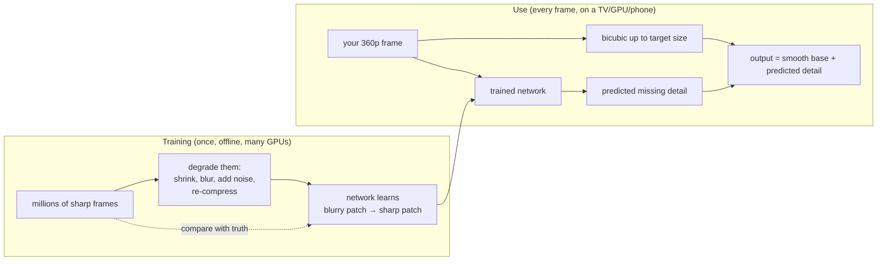
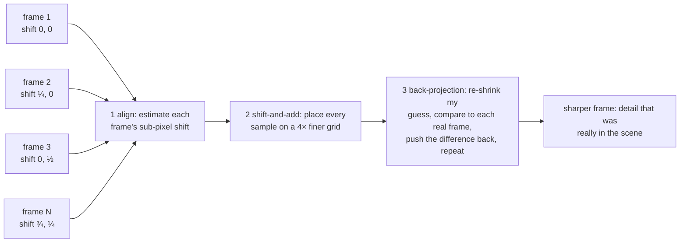

# Under the Hood: Can You Really Turn a Blurry 360p Video into HD? (upscaling and super-resolution)

## 1. The hook

You find an old 2009 cricket highlight on YouTube, uploaded at 360p. Your 4K TV plays it full screen and it looks... surprisingly OK. Smart TVs, NVIDIA's browser feature and YouTube's "Super Resolution" all promise to make low-quality video look HD. Crime shows go further: "Zoom. Enhance." and a blurry CCTV face becomes a passport photo.

So: **is there a process that turns a poor video into a better one?** Yes, several. But the honest answer has two halves:

1. **Detail that was thrown away is gone.** A 640×360 frame has 230,400 pixels; a 1920×1080 frame has 2,073,600. Upscaling has to invent **9 out of every 10 pixels** (2,073,600 ÷ 230,400 = 9). No algorithm can recover them *exactly* from one frame.
2. What tools *can* do: **interpolate** smoothly (old, cheap, exact-but-blurry), **guess plausible detail** learned from millions of examples (neural networks, sharp but sometimes wrong), or **recover real detail from other frames** when the camera moved slightly between them (the only case where true detail comes back).

💡 **Resolution:** how many pixels a frame has, written width×height (1920×1080) or by height ("1080p"; the p means *progressive*, every line drawn in each frame). **Upscaling:** making a frame bigger in pixels. **Super-resolution (SR):** upscaling that tries to add detail rather than just stretch.

---

## 2. Life before it

### Why videos are poor in the first place
Low quality comes from two places: the **camera** (small sensor, low resolution, noise in the dark, shake) and the **encoder**. A video encoder throws away detail your eye is unlikely to miss so a file fits a bitrate budget; push it too hard and you get **blocks**, smeared texture and "mosquito" fuzz around edges. The sibling page [video compression](video-compression.md) explains how that throwing-away works (I/P/B frames, the DCT, quantisation).

💡 **Bitrate:** bits per second of video, the "budget" for quality (e.g. 1080p at ~5 Mbps). **Encoder / codec:** the software that compresses video (H.264, HEVC, AV1).

### The classic toolbox: interpolation (1970s–1980s)
Before learning-based methods, every TV, photo editor and video scaler used **interpolation**: compute each new pixel as a weighted average of nearby known pixels. The famous recipes are **nearest-neighbour**, **bilinear**, **bicubic** (R. Keys, *Cubic convolution interpolation*, 1981) and **Lanczos** (a windowed-sinc filter; C. Duchon described it for this use in 1979). They are exact in one sense: they never invent texture. They also never add any.

### Multi-frame super-resolution (1984 →)
R. Tsai and T. Huang (1984) noticed that several slightly shifted low-res pictures of the same scene (satellite passes, in their case) together contain more information than any one of them. M. Irani and S. Peleg (1991) gave the practical **iterative back-projection** method this page's demo uses.

### Learning-based super-resolution (2014 →)
- **SRCNN** (C. Dong et al., ECCV **2014**): a 3-layer convolutional neural network trained on pairs of (downscaled image, original), beating bicubic in PSNR (§4).
- **ESRGAN** (X. Wang et al., ECCV workshops **2018**): trained with a second "critic" network that punishes outputs that *look* fake, so it paints convincing texture (hair, grass, brick) instead of blur.
- **Real-ESRGAN** (X. Wang et al., ICCV workshops **2021**): trained on synthetically *degraded* images (blur + noise + JPEG/compression artefacts, applied repeatedly) so it copes with real-world junk video, not just clean downscales.

💡 **Neural network (here):** a big function with millions of tunable numbers; "training" adjusts them so that, given a small blurry patch, it outputs what the sharp patch usually looked like in the training examples. **Convolutional:** it slides the same small filter over every part of the image, like a sliding window over a log stream.

---

## 3. The clever idea

**Classic upscaling only spreads the pixels you have. Super-resolution adds information from somewhere else: either from *other frames* of the same scene (real detail, if the camera moved by fractions of a pixel) or from *a model of what the world usually looks like* (learned, plausible, but guessed).**

---

## 4. Step by step

### 4.1 Interpolation on one row of pixels
A low-res row `0 0 200 200` (dark, dark, bright, bright) upscaled 2× to 8 pixels (computed with the same formulas as the demo):

```text
nearest :   0    0    0    0  200  200  200  200     copy the closest pixel → hard steps, "blocky"
bilinear:   0    0    0   50  150  200  200  200     straight line between neighbours → soft ramp, "blurry"
bicubic :   0   -5  -14   41  159  214  205  200     curve through 4 neighbours → steeper ramp with
                                                     undershoot/overshoot (clamped to 0..255 in practice)
```

Bicubic and Lanczos look "sharper" because of that small overshoot: a dark halo on one side of an edge, a bright one on the other. The eye reads that contrast as crispness. None of them creates a detail that wasn't in the 4 input numbers.

💡 **Kernel / filter:** the weighting recipe (which neighbours, how much each counts). Bilinear uses 2×2 neighbours, bicubic 4×4, Lanczos-3 6×6.

### 4.2 How we score "better": PSNR
💡 **PSNR (peak signal-to-noise ratio):** compare the result with the true original pixel by pixel, take the average squared error (MSE), then `PSNR = 10 · log10(255² / MSE)` in decibels. Higher is better; +3 dB ≈ half the error; ~30–40 dB is typical for decent video. It only works when you *have* the original, which is why research tests start from a sharp image and shrink it.

PSNR rewards "safe" blurry answers. A neural network that paints believable grass may score *lower* PSNR than bicubic while looking far better, which is why video teams also use perceptual metrics such as Netflix's **VMAF** (2016) and human panels.

### 4.3 Learned super-resolution: guessing from experience



The network has seen thousands of blurry eyes, letters and leaves next to their sharp originals. Given a new blurry eye, it draws the *typical* sharp eye that matches. If the real person had a scar there, the scar is gone; if the blur was a smudge, it may become an eye. That's **hallucination** (§6).

### 4.4 Multi-frame: the only way real detail comes back
A hand-held phone never sits still: between two frames it drifts by fractions of a pixel. Each frame therefore samples the scene at slightly **different positions**, like four people measuring a field with rulers that start at 0, 0.25, 0.5 and 0.75 m.



Numbers from the demo (§7): one 16×16 frame has 256 measurements for a 64×64 = 4,096-pixel answer. 16 frames, each shifted by a different quarter-pixel, give 16 × 256 = 4,096 measurements: in principle enough. Result: PSNR rises from **15.07 dB** (bicubic) to **21.28 dB**, about 4× less squared error (6.2 dB ≈ 10^0.62 ≈ 4.2). The control experiment matters most: **16 frames from a tripod (all identical)** score exactly the same as one frame. No new information, no new detail.

💡 **Sub-pixel shift:** the image moved by less than one pixel (e.g. 0.25 px), so each sensor pixel now averages a slightly different patch of the scene. **Registration / alignment:** estimating those shifts from the frames themselves; in real video it is the hard part (moving objects, rolling shutter). The demo cheats by knowing the shifts.

### 4.5 The rest of "make it better"
Real restoration tools chain several steps; super-resolution is only one.

| Step | What it fixes | Classic method | Learned method |
|---|---|---|---|
| **Denoising** | grain/speckle from dark scenes | average neighbouring pixels and frames (ffmpeg `hqdn3d`, `nlmeans`) | networks trained on noisy/clean pairs |
| **Deblocking / de-artefacting** | 8×8 or 16×16 blocks and edge fuzz from heavy compression | smooth across block borders (`deblock`; H.264 even has a deblocking filter *inside* the decoder) | Real-ESRGAN-style models |
| **Sharpening** | soft edges | unsharp mask: add back (image − blurred image) | part of SR models |
| **Frame interpolation** | judder; 24/30 fps → 60 fps | motion-compensated in-between frames (`minterpolate`, TV "motion smoothing") | flow-based networks |
| **Colour / contrast** | faded film, wrong white balance | curves, histogram equalisation | colourisation networks for black-and-white |
| **Stabilisation** | shaky hand-held footage | track motion, shift/crop to cancel it (`deshake`, `vidstab`) | learned motion models |

💡 **Unsharp mask:** a darkroom trick: blur a copy, subtract it from the original to get "edges only", add a bit of that back. It boosts existing edges; it cannot create new ones. **fps:** frames per second.

---

## 5. Where you've already used it

| You used | What happens |
|---|---|
| **Any 4K TV** playing a 1080p channel or a DVD | the TV's chip upscales every frame in real time; current Samsung/LG/Sony sets advertise "AI upscaling" (🟡 vendors don't publish the models) |
| **Phone zoom and Night mode** | Google's **Super Res Zoom** (Pixel 3, **2018**; paper by B. Wronski et al., SIGGRAPH **2019**) merges a burst of hand-held frames and uses the natural hand tremor as the sub-pixel shifts of §4.4. Night modes average many frames to cut noise. 🟡 Other vendors use similar bursts but publish less |
| **Chrome / Edge on an NVIDIA RTX PC** | **RTX Video Super Resolution** (announced CES Jan **2023**, shipped late Feb 2023 with Chrome 110+ and a driver update; RTX 30/40 GPUs, off by default) upscales web video on your GPU |
| **YouTube on a TV** | **"Super Resolution"** for videos uploaded below 1080p, announced **Oct 2025**, TV app first; creators keep the original and can opt out, viewers can switch back. 🟡 Rollout details and defaults vary across reports. Earlier (**Aug 2025**) YouTube confirmed it had been applying "unblur/denoise" ML enhancement to some Shorts without asking creators, which caused a backlash 🟡 |
| **PC games** | **NVIDIA DLSS** (1.0 in **2018–2019**, the much better 2.0 in **2020**) renders at e.g. 1440p and upscales to 4K using the *previous frames and motion vectors* from the game engine (multi-frame + learned). **AMD FSR** 1.0 (**2021**) was a hand-tuned spatial upscaler; FSR 2 (**2022**) added temporal (multi-frame) data |
| **Restored old films** | Peter Jackson's ***They Shall Not Grow Old*** (**2018**): WWI footage cleaned, re-timed from irregular hand-cranked speeds to 24 fps with generated in-between frames, colourised. 🟡 Exact tools are described only in interviews |
| **Video calls** | apps upscale a low-res incoming stream when your bandwidth drops 🟡 (some vendors advertise it, few document it) |

---

## 6. Limits and trade-offs

- **Hallucinated detail.** A learned model outputs what is *typical*, not what was *there*. Faces get a generic look, small text becomes confident-looking wrong letters, licence plates get plausible wrong digits. In 2020 the **PULSE** face upscaler (Menon et al., CVPR 2020) famously turned a pixelated photo of Barack Obama into a white man's face, because of what its training data was full of. The same failure class without any neural network: Xerox scanners' JBIG2 compression (found by David Kriesel, **2013**) swapped similar-looking digits in scanned documents. **Rule:** never use AI-upscaled footage as evidence (CCTV, number plates, medical); forensic labs work on the original.
- **Cost.** Arithmetic for one 10-minute 1080p30 video → 4K, assuming a neural model at 0.1 s per frame on one data-center GPU (🟡 an illustrative number; real speed varies by 10× across models and GPUs):

  ```text
  frames      = 10 min × 60 s × 30 fps          = 18,000 frames
  GPU time    = 18,000 × 0.1 s                  = 1,800 s = 30 GPU-minutes
  money       = 0.5 GPU-hour × ~$2/hour         ≈ $1 (≈ ₹85) per 10-minute video
  ratio       = 30 GPU-min / 10 video-min       = 3 GPU-minutes per minute of video
  ```

  At the often-quoted "500 hours uploaded to YouTube every minute" (🟡 a 2019-era figure) that is 30,000 video-minutes per minute × 3 = **~90,000 GPUs busy around the clock** just to keep up. Compare that with downscaling (end of this section), which a CPU does faster than real time.
- **Storage.** A 4K encode is roughly 3× the bytes of 1080p (~15 vs ~5 Mbps): 10 minutes = 15,000,000 × 600 ÷ 8 ≈ 1.1 GB vs ≈ 375 MB. Storing upscaled copies of every old video multiplies storage for frames that contain no real new information.
- **So platforms upscale on the client, or on demand.** The viewer's TV or GPU already has idle compute, the original stays the source of truth, a better model next year needs no re-processing, and the user can turn it off. It's the "do the work at the edge" choice you'd make for any CPU-heavy, per-viewer feature.
- **Temporal flicker.** Run an image model on each frame independently and the invented texture changes every frame: grass "boils", faces shimmer. Video models (and DLSS/FSR 2) feed in previous frames and motion vectors so guesses stay consistent, at extra cost and with "ghosting" trails when the motion estimate is wrong.
- **Garbage in.** Heavy blocking, motion blur and noise confuse every method. Order matters: denoise/deblock before upscaling, or the upscaler sharpens the artefacts.
- **Multi-frame needs motion you can measure.** Static camera + static scene = no new samples (the demo's tripod row). Fast, non-rigid motion = alignment fails and you get ghosts.

### Servers mostly go the other way: downscaling
A [transcoding pipeline](../HLD/concepts/video-transcoding-pipeline.md) takes one upload and produces a ladder of *smaller* renditions (1080p, 720p, 480p, 360p...). Downscaling is cheap and well-defined: average pixels you actually have, nothing to guess. Pipelines almost never create renditions **above** the source resolution; a 720p upload gets no 1080p rung. Upscaling, when it happens, happens at the very end, on the screen.

---

## 7. Try it

**Run the demo** in [`code/UpscaleDemo.java`](code/UpscaleDemo.java) (~155 lines, no dependencies). It draws a sharp 64×64 scene (a square, a thin diagonal line and the text "HI!"), shrinks it 4× by averaging 4×4 blocks (a 16×16 "low-quality source"), upscales back with nearest, bilinear and bicubic, then repeats with several "shaken" low-res frames combined by shift-and-add and iterative back-projection.

```sh
cd under-the-hood/code
java UpscaleDemo.java
```

Real output (Java 21, Linux), ASCII crops of the "HI!" area (darker → brighter: ` .:-=+*#%@`; rows trimmed, bilinear/bicubic crop pair left out):

```text
== Part 1: one 16x16 frame -> 64x64 (256 pixels known, 4096 to fill) ==
nearest  PSNR 14.43 dB
bilinear PSNR 14.84 dB
bicubic  PSNR 15.07 dB

original (truth)                      nearest (blocky)
..@@@...@@@...@@@@@@@@@...@@@.......  ======----::::++++++++::::====......
@.@@@...@@@...@@@@@@@@@...@@@.......  ++####++++----++++****::::####......
@@@@@...@@@......@@@......@@@.......  ++####++++----++++****::::####......
.@@@@@@@@@@......@@@......@@@.......  ::@@@@%%%%--------++++....****......
..@@@@@@@@@......@@@......@@@.......  ::@@@@%%%%--------++++....****......
..@@@...@@@......@@@................  ::@@@@%%%%--------++++....****......
..@@@...@@@......@@@................  ..%%%%++++----****####::::====......
..@@@@..@@@...@@@@@@@@@...@@@.......  ..%%%%++++----****####::::====......

== Part 2: several 16x16 frames of the same scene ==
 1 shaken frames: shift-and-add 14.84 dB, + back-projection 15.13 dB
 2 shaken frames: shift-and-add 15.18 dB, + back-projection 16.94 dB
 4 shaken frames: shift-and-add 15.29 dB, + back-projection 18.70 dB
 8 shaken frames: shift-and-add 15.33 dB, + back-projection 20.79 dB
16 shaken frames: shift-and-add 15.29 dB, + back-projection 21.28 dB
16 frames, tripod (no shift): shift-and-add 14.84 dB, + back-projection 15.13 dB

bicubic from 1 frame                  16 shaken frames + back-projection
++++====--:::-=+****+=-::-=+==:.....  --*%#-.:#@*:.:#@@@#@@@*:.-*%#-...:..
******++==----=++****=-::-+**+-:....  *+@@%- :%@@-.:*@@@@@@@*:.-%@@- ..:..
**###**++=----=++****=-::-+##+-:....  ##@@%: :@@@-. :=+@@@+=: .-@@@- ..:..
=+#%@@%%#*+=----==+++=:..-+**+-:....  =%@@@%#@@@%::  .-%@%-.  .-@@@-  .:..
-+#%@@@%%*+=-----=+++=:..-=**+-:....  -#@@@@@@@@%::..-=@@@=-..:-%@@=. .:..
:=*%@@%#*+=--==+**##*+-::-=++=:.....   :%@#: :%@%:.  .:#%%:   :...........
:-*#%#*++=---=+**####+=::--==-:.....  .:@@@#.:@@%-.:*@@@@@@%*::-*%#-...:..
.-+*##*++=----=+*****+-:::-=--:.....  .:%@@@=-@@%-.:#@@@%@@@#:.-%@@-...:..
```

What to notice:
- **Part 1:** all three classic methods land within 0.7 dB of each other. Nearest is blocky, bilinear/bicubic are a smear: "HI!" is unreadable in all of them, because the 3-pixel-wide strokes were averaged away by the 4×4 shrink.
- **Part 2:** shift-and-add *alone* barely helps (it's still a blur); the gain comes from back-projection using the frames' different offsets. With 16 shaken frames "HI!" is readable again and PSNR is +6.2 dB over bicubic.
- **The tripod row is the lesson:** 16 identical frames = 1 frame. Real detail comes back only when other frames carry information this one lacks.
- Things to try: add random noise (±10) to each captured frame and watch how many frames you need; give the algorithm slightly *wrong* shifts (alignment error) and see ghost edges; replace the scene with a smooth gradient and see all methods score similarly.

**If you have ffmpeg** (ran here: ffmpeg 6.1.1). Make a 720p test clip, shrink it to 320×180, upscale it back 4× with three filters, and score each against the original with ffmpeg's own `psnr` filter:

```sh
ffmpeg -f lavfi -i testsrc2=size=1280x720:rate=30:duration=5 -pix_fmt yuv420p hd.mp4
ffmpeg -i hd.mp4 -vf scale=320:180 small.mp4
ffmpeg -i small.mp4 -vf scale=iw*4:ih*4:flags=lanczos up_lanczos.mp4      # also flags=neighbor, bicubic
ffmpeg -i up_lanczos.mp4 -i hd.mp4 -lavfi psnr -f null -
```

```text
neighbor: average:28.957467
bicubic:  average:29.683494
lanczos:  average:29.765987
```

Same pattern as the demo: the classic filters differ by under 1 dB. Frame interpolation is one line too: `ffmpeg -i small.mp4 -vf minterpolate=fps=60:mi_mode=mci small60.mp4` turned the 150-frame 30 fps clip into a 297-frame 60 fps clip in ~2 s here. ffmpeg also ships `hqdn3d`/`nlmeans` (denoise), `deblock`, `unsharp`, `deshake`, and a `sr` filter that runs a neural SR model you supply (not tried here).

---

## 8. Where it shows up in this repo

- [Video Streaming interview](../HLD/interviews/video-streaming/README.md): "should we pre-render 4K for old uploads?" is a good cost curveball; the answer is §6 (client-side, keep the original).
- [Video transcoding pipeline](../HLD/concepts/video-transcoding-pipeline.md): the server's job is the *downscaling* ladder; no rung above source resolution.
- [Case study: video upload, transcode and storage](../case-studies/video-upload-transcode-and-storage.md): how YouTube, Netflix and Meta process uploads, and where per-title encoding spends compute instead.
- [The ABR player](adaptive-bitrate-player.md): when the player drops to 360p, the screen upscales it back to full size, which is exactly §4.1 happening on your phone.
- Sibling page: [video compression](video-compression.md), how quality is thrown away in the first place.

## 9. Sources

- R. Keys, *Cubic Convolution Interpolation for Digital Image Processing*, IEEE Trans. ASSP (1981) (the bicubic kernel with a = −0.5 used in the demo).
- C. Duchon, *Lanczos Filtering in One and Two Dimensions*, Journal of Applied Meteorology (1979).
- R. Tsai, T. Huang, *Multiframe image restoration and registration*, Advances in Computer Vision and Image Processing (1984).
- M. Irani, S. Peleg, *Improving resolution by image registration*, CVGIP: Graphical Models and Image Processing (1991) (iterative back-projection).
- C. Dong, C. C. Loy, K. He, X. Tang, *Learning a Deep Convolutional Network for Image Super-Resolution* (SRCNN), ECCV 2014.
- X. Wang et al., *ESRGAN: Enhanced Super-Resolution Generative Adversarial Networks*, ECCV Workshops 2018; X. Wang, L. Xie, C. Dong, Y. Shan, *Real-ESRGAN: Training Real-World Blind Super-Resolution with Pure Synthetic Data*, ICCV Workshops 2021.
- B. Wronski et al., *Handheld Multi-Frame Super-Resolution*, ACM Transactions on Graphics (SIGGRAPH 2019); Google AI Blog, *See Better and Further with Super Res Zoom on the Pixel 3* (2018).
- S. Menon et al., *PULSE: Self-Supervised Photo Upsampling via Latent Space Exploration of Generative Models*, CVPR 2020, and the public discussion of its biased outputs (June 2020).
- D. Kriesel, *Xerox scanners/photocopiers randomly alter numbers in scanned documents* (blog, 2013).
- Netflix Tech Blog, *Toward a Practical Perceptual Video Quality Metric* (VMAF, 2016).
- NVIDIA, RTX Video Super Resolution announcement (CES, Jan 2023) and launch coverage (TechRadar, PCWorld, Feb–Mar 2023: Chrome 110, RTX 30/40, enabled in the control panel).
- 9to5Google, *YouTube adds AI-upscaled "Super Resolution" for low-quality videos* (29 Oct 2025), and other coverage of YouTube's blog post; 🟡 rollout scope differs between reports. 🟡 Shorts enhancement statement (Aug 2025) from press coverage, not checked against a primary source here.
- NVIDIA DLSS (launched with RTX 20-series, 2018–2019; DLSS 2.0 March 2020); AMD FidelityFX Super Resolution 1.0 (June 2021), FSR 2 (2022). From vendor announcements as remembered; 🟡 not re-checked here.
- *They Shall Not Grow Old* (dir. Peter Jackson, 2018), restoration described in press interviews; 🟡 tool details unverified.
- ffmpeg 6.1 filter documentation (`scale` flags, `psnr`, `minterpolate`, `hqdn3d`, `nlmeans`, `deblock`, `unsharp`, `deshake`, `sr`).
- Demo and ffmpeg output were produced by running them in this environment (Java 21, ffmpeg 6.1.1).

⬅️ [Under the Hood index](README.md) · 🏠 [Home](../README.md)
