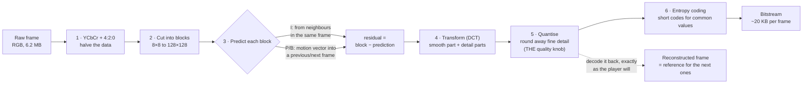
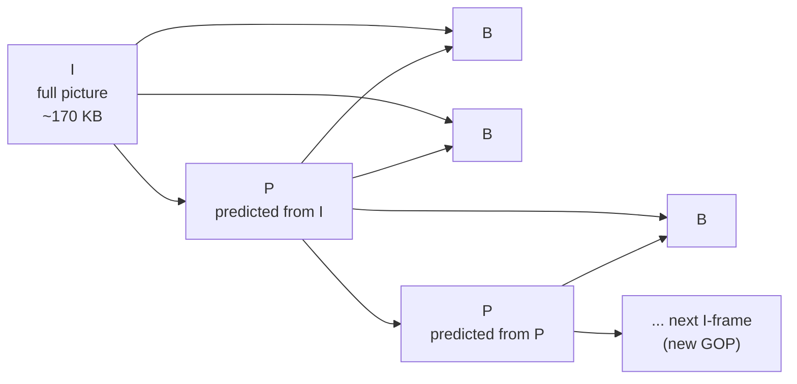

# Under the Hood: How Is a 1080p Video Only 5 Mbps When Raw It Would Be 1.5 Gbps? (I/P/B frames and motion vectors)

## 1. The hook

You asked: *"Do people upload different qualities, or does the server downgrade the video and store different files? How?"* The short answer: **you upload one file, and the server makes every other quality from it.** It decodes your video, shrinks the pictures, and compresses them again at lower bitrates. That pipeline (queues, chunks, workers, a ladder of 240p…4K files) is covered in the [video transcoding pipeline](../HLD/concepts/video-transcoding-pipeline.md) and the [video upload case study](../case-studies/video-upload-transcode-and-storage.md).

This page opens the box marked "encode" in those diagrams. One number explains why it's needed:

```text
1920 × 1080 pixels            = 2,073,600 pixels per frame
× 3 bytes (red, green, blue)  = 6,220,800 bytes per frame
× 30 frames per second        = 186,624,000 bytes/s ≈ 187 MB/s
× 8 bits per byte             ≈ 1,493,000,000 bit/s ≈ 1.5 Gbps

a typical 1080p stream        ≈ 5 Mbps (5,000,000 bit/s)
1,493,000,000 ÷ 5,000,000     ≈ 300× smaller
```

One hour of raw 1080p is `187 MB × 3,600 ≈ 672 GB`; at 5 Mbps it's `5,000,000 × 3,600 ÷ 8 = 2.25 GB`. Your home internet couldn't carry the raw version, and no phone could store it. Every video you have ever watched online went through the tricks below.

💡 **Pixel:** one dot of the picture. **fps (frames per second):** how many still pictures per second make the motion (24–60 typical). **Bitrate:** how many bits one second of video takes, in **kbps / Mbps** (thousands / millions of bits per second). **Codec** (coder-decoder): the compression algorithm (H.264, HEVC, AV1). **Encoder / decoder:** the program that compresses / decompresses.

---

## 2. Life before it

- **Analog TV (1940s–2000s)** sent the picture as a continuous signal, about 6–8 MHz of radio spectrum per channel. Nothing was "compressed" because nothing was digital.
- **Still images first.** In **1974** Nasir Ahmed, T. Natarajan and K. R. Rao published the **discrete cosine transform (DCT)**, a way to describe a block of pixels as "smooth part + detail parts". The **JPEG** standard (ITU-T T.81, **1992**) built photo compression on it: about 10× smaller with little visible loss.
- **Video = many JPEGs?** That exists ("Motion JPEG", used by old webcams and some cameras) but it ignores the biggest fact about video: **frame 2 looks almost exactly like frame 1**.
- **H.261 (ITU-T, 1988–1990)** for video calls over ISDN phone lines combined DCT with **motion compensation**: send how blocks *moved* instead of resending them. **MPEG-1 (1993, Video CD)** added **B-frames**, **MPEG-2 (1995, DVDs and digital TV)** scaled it to TV, and **H.264/AVC (2003)** became the codec of the web. Every modern codec (HEVC, VP9, AV1) is still this same recipe, with smarter details. 🟡 Exact approval years vary by source (draft vs final standard).

💡 **ISDN:** an old digital phone line at 64 kbps per channel. Fitting video into 2 × 64 kbps is what forced the invention.

---

## 3. The clever idea

**Throw away what eyes don't notice (colour detail, fine texture), and never send the same thing twice: most of each frame is described as "that block from the previous frame, moved 3 pixels right", plus a small correction.** The first trick gets roughly 10×; the second gets another 10–50×.

---

## 4. Step by step



### 4.1 Brightness matters more than colour: YCbCr and 4:2:0
Your eyes see fine detail in **brightness** much better than fine detail in **colour** (a blurry colour layer on a sharp black-and-white picture still looks sharp). So the encoder converts RGB into **Y** (luma: brightness) and **Cb, Cr** (chroma: "how blue", "how red"), then stores chroma at **half width and half height**. That's called **4:2:0 chroma subsampling**.

```text
Y:  1920 × 1080           = 2,073,600 bytes
Cb: 960 × 540             =   518,400 bytes
Cr: 960 × 540             =   518,400 bytes
total                     = 3,110,400 bytes per frame = 1.5 bytes/pixel (was 3)
× 30 fps × 8 bits         ≈ 746 Mbps: half the data, and almost nobody can see the difference
```

### 4.2 Blocks
The frame is cut into blocks and each block is coded on its own. JPEG and MPEG-2 used 8×8 pixel blocks grouped into 16×16 **macroblocks**. Newer codecs pick sizes to fit the picture: HEVC uses "coding tree units" up to 64×64, AV1 "superblocks" up to 128×128, split recursively into smaller blocks where there is detail. A blue sky becomes a few big blocks; a face becomes many small ones.

### 4.3 Transform: the DCT
Take an 8×8 block (64 brightness numbers). The DCT rewrites it as 64 different numbers (**coefficients**): the first one is the block's **average brightness**, and each of the others says "how much of this particular stripe pattern" is in the block, from gentle waves to fine checkerboards. Nothing is lost yet; the inverse DCT gives back the exact 64 pixels.

Why bother? For natural images the energy lands in a **few low-frequency coefficients**. A smooth gradient block becomes "average = 140, a little left-to-right slope, everything else ≈ 0". Same information, but now most numbers are near zero, which is what the next step exploits.

💡 **Frequency** here means how quickly brightness changes across the block: low = smooth, high = fine detail and sharp edges. Like an equaliser on a music player, but for picture detail. Modern codecs use integer approximations of the DCT (exactly repeatable on every chip) and several sizes, from 4×4 up to 64×64.

### 4.4 Quantise: what "lower quality" actually means
Divide each coefficient by a **step size** and round to a whole number. Big step → most coefficients round to **0** → fine detail is gone for good. Detail coefficients get bigger steps than the average, because eyes notice them less. This is the **only lossy step** (apart from chroma subsampling) and it's the main knob: H.264 calls it the **QP** (quantisation parameter, 0–51; roughly every +6 doubles the step size).

```text
coefficient  = 37.4     step 10 → round(3.74) = 4   → decoder gets 40   (error 2.6)
coefficient  = 37.4     step 50 → round(0.75) = 1   → decoder gets 50   (error 12.6)
coefficient  =  4.1     step 10 → round(0.41) = 0   → that detail is gone
```

So "the server makes a lower-quality copy" mostly means: **fewer pixels (scale down) and bigger quantisation steps (more zeros)**.

### 4.5 Entropy coding: zeros are almost free
The quantised block is read in a zigzag (low frequency first), so the zeros bunch at the end: `52, -3, 2, 0, 1, 0, 0, 0, ... 0`. Then a lossless coder gives short codes to common things ("end of block", small numbers) and long codes to rare ones, the same idea as **Huffman coding** (1952) in ZIP files. H.264's **CABAC** (arithmetic coding that adapts its probabilities as it goes) saves about 10–15% more than simpler schemes (🟡 figure commonly quoted, varies by content). That's why the demo below counts **non-zero coefficients** as a stand-in for bytes.

### 4.6 I, P and B frames: don't send what you already sent

Arrows point from a reference frame to the frames predicted from it:



- **I-frame (intra):** coded only from itself, like a JPEG (modern codecs also predict a block from the already-decoded pixels just above and left of it). A decoder can start here. Biggest.
- **P-frame (predicted):** for each block, the encoder searches the **previous decoded frame** for the best-matching block nearby. It sends a **motion vector** ("take the block 3 px left and 1 px up of here") plus the **residual** (the small difference), transformed and quantised as above. If the block didn't change, it sends a "skip" flag: almost zero bits.
- **B-frame (bi-directional):** may predict from a frame **before and after** it, or average both. Great for **uncovered background**: when a car drives past, the wall behind it isn't in the previous frame but is in the next one. To make that possible, frames are sent **out of order**: display order `I B B P`, decode order `I P B B`. That's why B-frames add a few frames of delay, and why video-call encoders often skip them.

💡 **Residual:** what's left after prediction, "actual block − predicted block". Good prediction → residual near zero → quantises to almost nothing. **Motion search:** trying many candidate offsets and keeping the cheapest; it's most of an encoder's CPU time. Real encoders use **sub-pixel** vectors (H.264: quarter-pixel, by interpolating between pixels) and charge each vector for the bits it costs.

Real numbers from `ffprobe` on a 10 s 1080p panning clip encoded with x264 at its defaults (§7): **I-frames ≈ 170 KB, P ≈ 4.1 KB, B ≈ 5.2 KB**. One I-frame costs as much as ~35–40 predicted frames.

### 4.7 GOP and keyframe interval: why seeking and segments start on I-frames
A **GOP** (group of pictures) is one I-frame plus the frames that depend on it. A decoder can only *start* at an I-frame, so:
- **Seeking** to 12:34 really jumps to the I-frame before it and decodes forward (that's the small pause, or the jump landing a little early).
- **ABR segments** (2–6 s files the player switches between) must each start with an I-frame, at the same moments in every rendition, or the player couldn't switch from 720p to 480p mid-stream. Streaming encodes therefore force a fixed keyframe interval, e.g. `-g 48` at 24 fps = one per 2 s ([ABR concept](../HLD/concepts/adaptive-bitrate-streaming.md), [the ABR player](adaptive-bitrate-player.md)).
- **The cost:** more I-frames = bigger files. Measured in §7: forcing an I-frame every 60 frames instead of x264's default (up to 250) made the same clip **36% bigger**. Shorter segments react faster but compress worse.
- Encoders also insert an extra I-frame at a **scene cut**, where nothing in the previous frame helps.

### 4.8 Rate control: who picks the quantiser?

| Mode | What you ask for | Good for | Catch |
|---|---|---|---|
| **CBR** (constant bitrate) | "exactly 3 Mbps every second" | live broadcast, fixed pipes | wastes bits on easy scenes, starves hard ones |
| **VBR** (variable, often 2-pass) | "average 3 Mbps" | VOD (video on demand) files | 2-pass = analyse the whole video first, then encode: 2× the time |
| **CRF** (constant rate factor, x264/x265) | "constant *quality* level 23", bitrate floats | archives, uploads, per-title ladders | file size unknown until done |
| **Capped CRF** (CRF + `-maxrate`/`-bufsize`) | quality target with a ceiling | streaming ladders | the usual production compromise |

x264's CRF default is 23 (lower = better and bigger; about ±6 roughly halves/doubles the size). Measured on the test clip: CRF 18 → 2,717 kbps, 23 → 1,446, 28 → 582, 35 → 338.

### 4.9 How the server makes the 480p copy
```text
uploaded 1080p file → DECODE to raw frames → SCALE to 854×480 (resampling filter)
                    → ENCODE again with 480p settings (bigger QP / lower target bitrate)
```
- **Scaling** computes each new pixel as a weighted average of nearby old ones (**bilinear**, **bicubic** — ffmpeg's default — or **Lanczos**, sharper). Going down is easy because information is thrown away; going up can't recover it (see the sibling page on [upscaling and super-resolution](upscaling-and-super-resolution.md): making a low-quality video look better).
- Every rendition is encoded **from the original upload**, never from another rendition, because each re-encode adds new errors (§6).
- **Per-title and per-shot encoding.** Netflix's 2015 *Per-Title Encode Optimization* post (December 2015) replaced one fixed ladder (1080p always at 5,800 kbps) with a ladder per title found by trial encodes: simple animation needs far fewer bits than a grainy war film. The 2018 **Dynamic Optimizer** goes further and picks resolution and QP **per shot** to maximise VMAF (a Netflix perceptual-quality score trained on human ratings) for a bitrate budget. 🟡 Details and savings in the [case study](../case-studies/video-upload-transcode-and-storage.md#3-turning-one-file-into-many-qualities).
- **Codec generations**, roughly "same quality for about half the bits" each generation (🟡 approximate; real gains depend on content, resolution and encoder settings):

| Codec | Year | vs H.264 at similar quality | Encoding cost |
|---|---|---|---|
| H.264 / AVC | 2003 | baseline | 1× |
| H.265 / HEVC | 2013 | ~40–50% fewer bits | several × |
| VP9 (Google) | 2013 | similar to HEVC | several × |
| AV1 (AOMedia) | 2018 | ~30% fewer than HEVC/VP9 | much slower in software |

---

## 5. Where you've already used it

| You used | What's going on |
|---|---|
| YouTube → right-click → **Stats for nerds** | `avc1` = H.264, `vp09` = VP9, `av01` = AV1; popular videos get the slower, better codecs |
| Netflix, Prime Video, JioHotstar | per-title / per-shot ladders; cartoons look sharp at bitrates where sport looks blocky |
| **WhatsApp / Telegram / Instagram** sending a video | the app re-encodes it on your phone to a lower resolution and bitrate before upload (🟡 exact settings not published). **Forwarded** videos get re-encoded again, and again: generation loss, which is why a video forwarded ten times looks smeared |
| Zoom / Meet / Teams calls | usually no B-frames (they add delay), constant small bitrate; when you move fast the picture turns blocky, when you sit still it sharpens |
| Screen recordings (OBS, Loom) | a static screen is almost all "skip" blocks, so an hour of slides is tiny; scrolling a page suddenly costs a lot |
| CCTV / dashcams | a fixed camera over an empty car park = near-zero P-frames for hours; vendors' "smart" codec modes stretch the keyframe interval much longer (🟡 vendor-specific) |
| `.mp4` files on your laptop | the container; the H.264 or HEVC stream inside is what this page describes |

---

## 6. Limits and trade-offs

- **Low bitrate artefacts.** Large quantisation steps make **blockiness** (8×8 edges visible), **banding** (a smooth sky turns into stripes of flat colour) and **ringing** (halos next to sharp edges). Since H.264, an in-loop **deblocking filter** smooths block edges before the frame is used as a reference.
- **Hard content blows the budget.** Confetti, rain, water, crowd shots, film grain and camera noise have no good match in the previous frame, and every scene cut forces an expensive I-frame. Live sports needs far more bits than a talk show at the same "quality". In the demo, adding a little random noise (σ = 2 grey levels) made high-quality I-frames **76% bigger** and P-frames **~2× bigger**.
- **Encoding is much more expensive than decoding.** The encoder runs the motion search; the decoder just follows the vectors. AV1 squeezes harder but took **3× longer** than x264 in §7. Platforms spend that only on videos that will be watched a lot ([Video Streaming L5 §3.5](../HLD/interviews/video-streaming/L5-senior.md#35-codecs-pay-once-to-encode-save-on-every-view)), or use hardware encoders (ASICs: chips built for one job, like YouTube's Argos and Meta's MSVP).
- **Generation loss.** Each decode → re-encode adds fresh quantisation errors on top of old ones. Download a YouTube video, upload it to Instagram, forward it on WhatsApp: three generations, visibly worse each time.
- **Errors spread.** A lost packet corrupts one block of a P-frame, and every later frame that references it inherits the damage ("smearing" green blocks) until the next I-frame. Video calls ask for a fresh keyframe when that happens.
- **Latency vs efficiency.** B-frames, 2-pass VBR and long lookahead save bits but add delay: fine for Netflix, wrong for a video call or live auction.

---

## 7. Try it

**The demo** [`code/VideoCompressionDemo.java`](code/VideoCompressionDemo.java) (~175 lines, no dependencies) builds a tiny grayscale "video": 128×72 pixels, 30 frames, a smooth gradient background and a textured 24×24 square moving **3 px right and 1 px down** per frame. It codes it (2) as I-frames only with an 8×8 DCT and the JPEG quantisation table scaled ×0.25 / ×1 / ×8, then (3) as one I-frame plus 29 P-frames with a ±7 px motion search, then (4) draws one frame in ASCII.

💡 **PSNR** (peak signal-to-noise ratio) compares the decoded frame with the original pixel by pixel and reports the error on a log scale, in **dB**. Higher is better; above ~40 dB the difference is hard to see, below ~30 dB artefacts are obvious (rough rule of thumb; it ignores how eyes work, which is why Netflix built VMAF).

```sh
cd under-the-hood/code
java VideoCompressionDemo.java
```

Real output (Java 21, Linux), ASCII art shortened to 8 of its 24 rows:

```text
video: 128x72 grayscale, 30 frames, 1 byte per pixel
raw size: 128 x 72 x 30 = 276,480 bytes (9,216 values per frame)

(2) I-frames only: every frame coded on its own (8x8 DCT + quantise)
  high   (table x 0.25):  26,674 non-zero coefficients =   9.6% of raw values | PSNR 45.9 dB
  medium (table x 1.00):  20,141 non-zero coefficients =   7.3% of raw values | PSNR 38.2 dB
  low    (table x 8.00):   5,507 non-zero coefficients =   2.0% of raw values | PSNR 29.4 dB

(3) I + P frames, medium quality: frame 0 is an I-frame, frames 1-29 predict from the previous one
  frame 15 (square's true motion is +3,+1, so it came from (-3,-1)); vectors of blocks near it:
    row 3: ( 0, 1) (-3,-1) (-3,-1) (-3,-1) (-3,-1) ( 0, 0) ( 0, 0) 
    row 4: ( 0, 0) (-3,-1) (-3,-1) (-3,-1) (-3,-1) ( 0, 0) ( 0, 0) 
    row 5: (-4, 6) (-3,-1) (-3,-1) (-3,-1) (-3,-1) ( 0, 0) ( 0, 0) 
    row 6: (-1, 2) (-3,-1) (-3,-1) (-3,-1) (-3,-1) ( 0, 0) ( 0, 0) 
    row 7: ( 0, 0) ( 0, 0) ( 0, 0) ( 0, 0) ( 0, 0) ( 0, 0) ( 0, 0) 
  I-frame: 610 non-zero coefficients
  P-frame: 43 non-zero coefficients on average + 20 blocks with a motion vector (124 blocks with a zero vector)
  => a P-frame needs 7.1% of the coefficients of an I-frame | whole clip PSNR 42.5 dB
  whole clip: 1,863 coefficients (I+P) vs 18,300 (all I-frames) for the same quality setting
  most common non-zero vectors over all P-frames (dx,dy) x count: (-3,-1) x420 (-1,0) x28 (1,0) x26 (0,-1) x19 (0,1) x19

(4) frame 15, a 48x24 crop around the square: high quality (left) vs low quality (right)
  :---:----**#%%%#*%%##%%####**++++=-----=========   ----::--=+**############**++++++==----------====
  :-------:*###%%##%%########**++*+-==--==========   ----::--=+*#@@@@@@@@##%%##*++***+=----------====
  -----:---++++@@##%##***%%##**%%##=--============   ----::--=+*#%%%%%%%%******++**##*+-:--------====
  ---------++++@@####**++%%#***%%##--=============   ----:::--=+*########++*******####+-:--------====
  ---------**++**++%%++**%%%%%@**@%-=-============   -----:::-==+########**##%%%#*#%%#+-:--------====
  -------:-**++#*++%%+***%%%%@@*#@%=-=============   ----:--:=#%******###***##%%%#**%#=-=============
  ---------++++##****%%%%#*#*%@++%@=-=============   ----:--:=#%*****#######%%%%%#**%#=-=============
  ---------**++*#****%%%%##**@@**%%=-=============   ----:--:=#%****#####@%%%%%%%#**%#=-=============
```

What to notice:
- **The quality knob in (2):** going from table ×0.25 to ×8 keeps 5× fewer coefficients and PSNR falls from 45.9 to 29.4 dB. That is "lower quality" in one line.
- **Prediction beats everything in (3):** at the *same* quantiser, a P-frame needs **7%** of an I-frame's coefficients; the whole clip needs 1,863 instead of ~18,300 (610 × 30). All 16 blocks the square overlaps found **(-3,-1)**, exactly the true motion, and 124 of 144 blocks are "didn't move".
- **Column 0 of the vector grid** (background the square crossed a few frames ago) gets odd vectors like (-4,6): that wall was hidden, then had to be redrawn from residuals, so no neat "same block, moved" match exists and the search grabs whatever looks closest. Uncovered background is exactly the case **B-frames** fix (they can copy it from a *later* frame).
- **The ASCII art:** the left square keeps its 2×2-pixel texture; on the right it has melted into blobs that repeat row after row inside each 8×8 block, and the edges grew halos (`=+*`): blocking and ringing.
- Things to try: set `NOISE = 2.0` (camera noise). Measured: high-quality I-frames grow from 26,674 to 46,867 coefficients, P-frames from 43 to 83, and background blocks start "chasing noise" with random small vectors (81 per frame instead of 20). Set `MV_COST = 0` and flat gradient areas pick meaningless vectors; that's why real encoders charge for vector bits.

**With ffmpeg** (ffmpeg 6.1.1 is installed here; these ran on a synthetic 10 s 1080p30 clip: a detailed Mandelbrot image panned 5 px per frame, first saved losslessly as `ref.mkv`, 4 vCPUs). Synthetic, noise-free content compresses better than real camera footage, so read the ratios as an illustration, not a benchmark.

```sh
ffmpeg -i ref.mkv -c:v libx264 -crf 23 c23.mp4                 # 1,808,043 bytes = 1,446 kbps
ffprobe -v error -select_streams v:0 -show_entries frame=pict_type,pkt_size -of csv=p=0 c23.mp4
ffmpeg -i c23.mp4 -vf scale=-2:480 -c:v libx264 -crf 28 out480.mp4   # the "server makes 480p" step
```

```text
raw 4:2:0:  1920 × 1080 × 1.5 bytes × 300 frames = 933,120,000 bytes → CRF 23 file 1,808,043 bytes (516× smaller)
frame types (first 70): IBPPBBPBBPPPPBBPBBPBBBPBBBPBPBBPBBBPBBBPBBBPBBBPBBBPBBBPBBBPBBBPBBBPBB
  I: 2 frames, avg 170,347 bytes | P: 81 frames, avg 4,144 bytes | B: 217 frames, avg 5,194 bytes
same clip, -g 60 (I-frame every 2 s):  2,465,638 bytes (+36%, 5 I-frames)
same clip, -g 1 (every frame an I):   32,715,864 bytes (18× bigger)
same clip, -bf 0 (no B-frames):        1,803,648 bytes (no gain from B here: a pure pan has no uncovered background)
out480.mp4: 854×480, 353,438 bytes = 279 kbps
```

Codecs on the same clip (PSNR measured against `ref.mkv` with ffmpeg's `psnr` filter):

```text
x264    -preset medium -crf 30   594,185 bytes  PSNR 41.7 dB   7.0 s
x265    -preset medium -crf 33   510,411 bytes  PSNR 41.2 dB   8.4 s
SVT-AV1 -preset 6 -crf 55        300,275 bytes  PSNR 44.6 dB  19.3 s
```

AV1 used **half the bytes of x264 and still scored higher**, at about **3× the encode time**. HEVC gained only ~14% here at similar PSNR, less than the usual "40–50%": gains vary with content and resolution, and PSNR isn't a perceptual metric.

---

## 8. Where it shows up in this repo

- [Video Streaming interview](../HLD/interviews/video-streaming/README.md): [L4 §5.2](../HLD/interviews/video-streaming/L4-mid.md#52-transcoding-into-a-bitrate-ladder) (the ladder), [L5 §3.5](../HLD/interviews/video-streaming/L5-senior.md#35-codecs-pay-once-to-encode-save-on-every-view) (pay once to encode, save on every view), [L5 §3.6](../HLD/interviews/video-streaming/L5-senior.md#36-seeking-previews-and-captions) (seeking).
- [Video transcoding pipeline](../HLD/concepts/video-transcoding-pipeline.md): the DAG around the encoder, codec vs container, splitting chunks on keyframes.
- [Adaptive bitrate streaming](../HLD/concepts/adaptive-bitrate-streaming.md) and [the ABR player](adaptive-bitrate-player.md): why segments start on keyframes and how the player picks a rung.
- [Case study: video upload, transcode and storage](../case-studies/video-upload-transcode-and-storage.md): per-title/per-shot ladders, AV1 rollouts, encoding chips.
- [Case study: Netflix Open Connect](../case-studies/netflix-open-connect-and-chaos-engineering.md): every bit the encoder saves is a bit the ISP caches don't have to serve.
- [Upscaling and super-resolution](upscaling-and-super-resolution.md): the other direction, making a low-quality video look better.
- Same "send the difference" idea elsewhere: [rsync's rolling hash](rsync-rolling-hash.md), [Git's delta packfiles](git-object-store.md), [time-series compression](../HLD/concepts/time-series-compression-and-downsampling.md) (delta-of-delta encoding).

## 9. Sources

- N. Ahmed, T. Natarajan, K. R. Rao, *Discrete Cosine Transform*, IEEE Transactions on Computers (January 1974).
- D. A. Huffman, *A Method for the Construction of Minimum-Redundancy Codes*, Proceedings of the IRE (1952).
- ITU-T T.81 / ISO/IEC 10918-1, *JPEG* (1992): 8×8 DCT, the luminance quantisation table (Annex K) used in the demo.
- ITU-T H.261 (1988–1990), ISO/IEC 11172 MPEG-1 (1993), ISO/IEC 13818 MPEG-2 (1995). 🟡 Years are the commonly cited approval dates.
- ITU-T H.264 / ISO/IEC 14496-10, *Advanced Video Coding* (2003); T. Wiegand, G. Sullivan, G. Bjøntegaard, A. Luthra, *Overview of the H.264/AVC Video Coding Standard*, IEEE TCSVT (2003).
- ITU-T H.265, *HEVC* (2013); J.-R. Ohm et al., *Comparison of the Coding Efficiency of Video Coding Standards*, IEEE TCSVT (2012): ~50% bitrate saving vs H.264 in subjective tests. 🟡 Figure from the paper's summary, not re-checked.
- VP9 bitstream finalised by Google (2013); AV1 bitstream 1.0 by the Alliance for Open Media (March 2018). 🟡 "~30% better than VP9/HEVC" is the commonly quoted figure and varies by test.
- Netflix TechBlog, *Per-Title Encode Optimization* (14 December 2015) and *Dynamic optimizer — a perceptual video encoding optimization framework* (6 March 2018): dates confirmed via secondary sources ([Streaming Media](https://www.streamingmedia.com/Articles/Editorial/Featured-Articles/One-Title-at-a-Time-Comparing-Per-Title-Video-Encoding-Options-121493.aspx), [The Register, 2015](https://www.theregister.com/2015/12/16/netflix_per_title_encode_optimization/), [arXiv 1808.03898](https://arxiv.org/pdf/1808.03898)); the original posts were not re-read for this page 🟡.
- x264 / FFmpeg documentation (CRF 0–51, default 23; `-g`, `-bf`, `scale`), ffmpeg 6.1.1.
- WhatsApp re-encoding sent videos: widely observed behaviour; exact settings are not published 🟡.
- The demo and ffmpeg outputs were produced by running them in this environment (Java 21, ffmpeg 6.1.1, 4 vCPUs).

⬅️ [Under the Hood index](README.md) · 🏠 [Home](../README.md)
