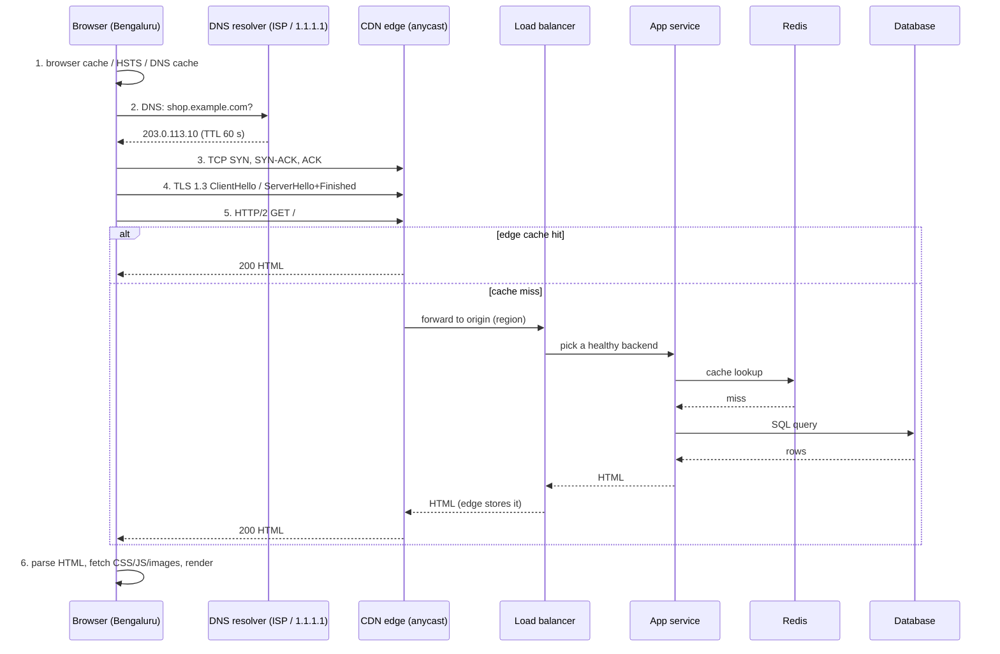

# Under the Hood: What Happens Between Pressing Enter and Seeing the Page? (the capstone)

## 1. The hook

You type `shop.example.com` in Chrome in Bengaluru and press Enter. About 300 ms later pixels appear. In that time your request crossed a resolver hierarchy, two or three handshakes, a CDN, a load balancer, a service, a cache, a database, and back. This page is a **map**: one timeline, with a latency budget, and a link to the deep dive for every step. Read it first, then pick a stop.

💡 **ms (millisecond):** 1/1,000 of a second. **RTT (round-trip time):** how long a message takes to go there and come back. Bengaluru to Mumbai is roughly 20-30 ms RTT; Bengaluru to Virginia (us-east) roughly 200-250 ms (🟡 typical values; they vary by ISP and route).
💡 **Latency budget:** a table that says how many ms each step is allowed to cost, like a performance budget for a service call chain.

---

## 2. Life before it

In the early web (1990s) one URL meant one machine: one DNS lookup, one TCP connection, one HTML file, done. Everything below was added to fix a pain: DNS because `/etc/hosts` files did not scale, TCP because the internet drops packets, TLS because Wi-Fi is public, CDNs because Virginia is far from Bengaluru, load balancers because one server was not enough.

---

## 3. The clever idea

Every layer **avoids the trip** to the next layer if it can: browser cache before DNS, DNS cache before the root servers, CDN cache before the origin, Redis before the database. The best request never leaves your laptop.

---

## 4. Step by step

### 4.1 The whole timeline



### 4.2 Step by step with the stop where you can dive deeper

| # | Step | What happens (plain words) | Deep dive |
|---|---|---|---|
| 1 | Browser caches | Browser checks its HTTP cache, a saved DNS answer, and the HSTS list (sites it must always open over HTTPS). A hit skips steps 2-5. | [caching-strategies](../HLD/concepts/caching-strategies.md) |
| 2 | DNS | The **stub resolver** (tiny client in your OS) asks the **recursive resolver** (your ISP's or 1.1.1.1), which, on a miss, walks root, then `.com` TLD, then the site's **authoritative** server. Every answer carries a **TTL** (seconds it may be cached). | [dns](../HLD/technologies/dns.md) |
| 2b | Which resolver answers? | Public resolvers use one IP in many cities. | [anycast](anycast.md) |
| 3 | TCP handshake | SYN, SYN-ACK, ACK: both sides agree on sequence numbers. Costs **1 RTT**. | [tcp](tcp.md) |
| 4 | TLS 1.3 | Agree on keys and check the server's certificate. Costs **1 RTT** (0 on resumption with 0-RTT, with caveats). | [tls-1-3-handshake](tls-1-3-handshake.md) |
| 5 | HTTP request | One HTTP/2 stream over the connection (HTTP/3 uses QUIC and merges steps 3 and 4 into 1 RTT). | [http-1-2-3](http-1-2-3.md) |
| 6 | CDN edge | The edge answers from cache (**hit**) or fetches from the origin (**miss**). | [cdn](../HLD/technologies/cdn.md) |
| 7 | Load balancer | Picks one healthy backend; at huge scale uses consistent-style lookup tables. | [load-balancer](../HLD/technologies/load-balancer.md), [maglev-hashing](maglev-hashing.md) |
| 8 | Mesh / app | Sidecar proxies add retries, mTLS and metrics; the app runs business logic. One thread can serve thousands of sockets thanks to the kernel's readiness API. | [service-mesh-and-envoy](../HLD/technologies/service-mesh-and-envoy.md), [epoll](epoll.md) |
| 9 | Cache then DB | App asks Redis first; on a miss, the database. | [caching-strategies](../HLD/concepts/caching-strategies.md) |
| 10 | Render | Browser parses HTML, discovers CSS/JS/images, builds the page. | see 4.4 |

Also relevant: your home router and your cloud NAT gateway rewrite addresses on the way ([nat-and-conntrack](nat-and-conntrack.md)), and inside the cluster packets hop through pod networking ([kubernetes-networking](kubernetes-networking.md)).

### 4.3 Latency budget: Bengaluru user, two hosting choices

Illustrative numbers for a **cold** visit (nothing cached, no CDN HTML hit), RTT to origin 25 ms (Mumbai) vs 230 ms (us-east). These are assumptions, not measurements.

| Step | Round trips | Mumbai origin | us-east origin, no CDN | Same site behind a CDN edge in Bengaluru, cache hit |
|---|---|---|---|---|
| DNS (resolver cache miss: root/TLD/auth) | resolver does 2-3 lookups | ~40 ms | ~40 ms | ~40 ms |
| DNS (resolver cache hit) | 1 to resolver | ~5 ms | ~5 ms | ~5 ms |
| TCP handshake | 1 RTT | 25 | 230 | 10 |
| TLS 1.3 | 1 RTT | 25 | 230 | 10 |
| HTTP request to first byte (network) | 1 RTT | 25 | 230 | 10 |
| Server work (LB + app + Redis/DB) | n/a | ~30 | ~30 | 0 (edge hit) |
| Download HTML (~50 KB) | ~1 RTT | ~25 | ~230 | ~10 |
| **Total to HTML, DNS cache miss** | | **~170 ms** | **~990 ms** | **~80 ms** |

Arithmetic: Mumbai = 40 + 25 + 25 + 25 + 30 + 25 = 170 ms. us-east = 40 + 230 x 3 (TCP, TLS, request) + 30 + 230 (download) = 40 + 690 + 30 + 230 = 990 ms. CDN hit = 40 + 10 x 3 + 0 + 10 = 80 ms. If you assume different RTTs, the totals change, but the shape stays: **every handshake costs one RTT, so distance is multiplied by 4.**

Take-aways:
- Moving the server 200 ms further away does not add 200 ms, it adds about **800 ms** (990 - 170 = 820), because DNS-free steps still need ~4 sequential round trips.
- Hence: CDNs (terminate TCP and TLS near the user), HTTP/3 (fewer handshakes), connection reuse, and keep-alive.

### 4.4 After the HTML arrives: the critical path

1. Browser parses HTML top to bottom. A `<link rel="stylesheet">` blocks **rendering** until the CSS arrives (otherwise you would see unstyled flashes). A plain `<script>` blocks **parsing** until downloaded and run; `defer`/`async` avoids that.
2. It discovers 30-100 more resources. Over HTTP/2 these share one connection, so no new handshakes for the same host.
3. It builds the DOM (page tree) and CSSOM (style tree), computes layout, paints. The first paint is "First Contentful Paint"; the biggest element showing is "Largest Contentful Paint" (Google's guidance: aim for under 2.5 s, 🟡 verify current threshold).
4. JavaScript apps (React etc.) may fetch JSON via APIs after load, repeating steps 2-9 for each API call, except DNS/TCP/TLS are reused.

---

## 5. Where you have used it without knowing

Every "the site feels slow" ticket. The five numbers below in DevTools are this table, measured.

## 6. Limits and trade-offs

- Real pages vary wildly: a cache hit at any level removes whole rows.
- Mobile networks add 50-100 ms RTT and loss (🟡).
- Security steps (TLS, mTLS in the mesh) cost handshakes; connection pooling hides it.
- The numbers above are **illustrative**; always measure.

## 7. Try it

Run in the sandbox where this page was written, through an HTTPS proxy (so the numbers are **not** a normal browser's; the proxy answers DNS for us, hence `dns` is ~0, and `connect` is to the local proxy, not GitHub):

```
$ curl -s -o /dev/null -w 'dns=%{time_namelookup} connect=%{time_connect} tls=%{time_appconnect} ttfb=%{time_starttransfer} total=%{time_total}\n' https://github.com
dns=0.000034 connect=0.001312 tls=0.176295 ttfb=0.238143 total=0.238207
```

A previous run gave `tls=0.249335 ttfb=0.307278`. Reading: `tls` is a cumulative timestamp (about 176 ms after start, which includes the proxy's tunnel to GitHub plus the handshake); `ttfb` (time to first byte) minus `tls` is about 62 ms of request plus server time. On your own machine, without a proxy, you will see all four stages filled in.

In a browser: DevTools, Network tab, click a request, **Timing** tab. You will see "DNS Lookup", "Initial connection", "SSL", "Waiting for server response (TTFB)", "Content Download". Try again with a hard reload (cache off), then with "Disable cache" unchecked, then with throttling set to "Slow 3G".

## 8. Where it shows up

[CDN](../HLD/technologies/cdn.md), [load balancer](../HLD/technologies/load-balancer.md), [DNS](../HLD/technologies/dns.md), [caching strategies](../HLD/concepts/caching-strategies.md), [service mesh](../HLD/technologies/service-mesh-and-envoy.md) and almost every HLD interview ("walk me through a request"). See also [anycast](anycast.md), [tcp](tcp.md), [tls-1-3-handshake](tls-1-3-handshake.md), [http-1-2-3](http-1-2-3.md), [epoll](epoll.md), [maglev-hashing](maglev-hashing.md), [nat-and-conntrack](nat-and-conntrack.md), [kubernetes-networking](kubernetes-networking.md).

## 9. Sources

- Chrome DevTools documentation, "Network features reference / Timing breakdown" (2024) (🟡 from memory).
- web.dev, "Largest Contentful Paint" (2020-2024) (🟡 thresholds).
- RFC 8446 (TLS 1.3, 2018), RFC 9000 (QUIC, 2021), RFC 9114 (HTTP/3, 2022), RFC 9113 (HTTP/2, 2022), RFC 1035 (DNS, 1987).
- RTT figures are typical values from memory, not measurements (🟡).
